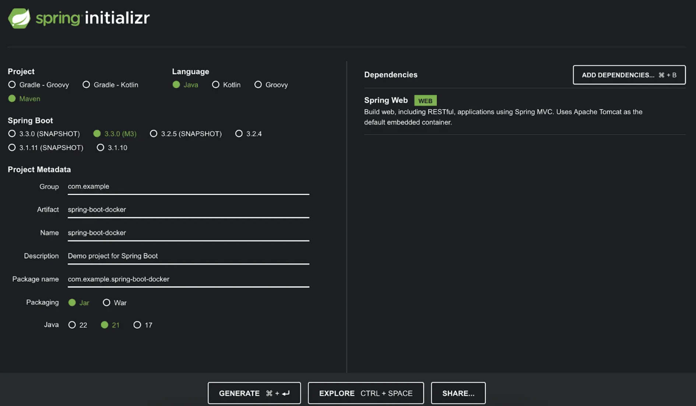

+++
title = "多阶段构建"
date = 2024-10-23T14:54:35+08:00
weight = 40
type = "docs"
description = ""
isCJKLanguage = true
draft = false

+++

> 原文：[https://docs.docker.com/get-started/docker-concepts/building-images/multi-stage-builds/](https://docs.docker.com/get-started/docker-concepts/building-images/multi-stage-builds/)
>
> 收录该文档的时间：`2024-10-23T14:54:35+08:00`

# Multi-stage builds - 多阶段构建



## 说明 Explanation

In a traditional build, all build instructions are executed in sequence, and in a single build container: downloading dependencies, compiling code, and packaging the application. All those layers end up in your final image. This approach works, but it leads to bulky images carrying unnecessary weight and increasing your security risks. This is where multi-stage builds come in.

​	在传统的构建过程中，所有构建指令都在单一的构建容器中按顺序执行：下载依赖项、编译代码和打包应用程序。所有这些层都最终会进入您的最终镜像。这种方法虽然可行，但会导致镜像体积庞大，携带不必要的文件，从而增加安全风险。这就是多阶段构建的作用所在。

Multi-stage builds introduce multiple stages in your Dockerfile, each with a specific purpose. Think of it like the ability to run different parts of a build in multiple different environments, concurrently. By separating the build environment from the final runtime environment, you can significantly reduce the image size and attack surface. This is especially beneficial for applications with large build dependencies.

​	多阶段构建在 Dockerfile 中引入了多个具有特定用途的阶段。可以将其看作是在多个不同环境中并行运行构建的不同部分。通过将构建环境与最终运行环境分离，您可以显著减小镜像大小并减少攻击面。这对于具有大量构建依赖项的应用程序尤其有利。

Multi-stage builds are recommended for all types of applications.

​	建议所有类型的应用程序都使用多阶段构建。

- For interpreted languages, like JavaScript or Ruby or Python, you can build and minify your code in one stage, and copy the production-ready files to a smaller runtime image. This optimizes your image for deployment.
- 对于解释型语言（如 JavaScript、Ruby 或 Python），您可以在一个阶段构建并压缩代码，然后将生产就绪的文件复制到较小的运行时镜像中。这将优化您的镜像以进行部署。

- For compiled languages, like C or Go or Rust, multi-stage builds let you compile in one stage and copy the compiled binaries into a final runtime image. No need to bundle the entire compiler in your final image.
- 对于编译型语言（如 C、Go 或 Rust），多阶段构建允许您在一个阶段进行编译，然后将编译后的二进制文件复制到最终运行时镜像中，无需将整个编译器打包到最终镜像中。

Here's a simplified example of a multi-stage build structure using pseudo-code. Notice there are multiple `FROM` statements and a new `AS <stage-name>`. In addition, the `COPY` statement in the second stage is copying `--from` the previous stage.

​	以下是使用伪代码的多阶段构建结构的简化示例。请注意这里有多个 `FROM` 语句和一个新的 `AS <stage-name>`。此外，第二阶段的 `COPY` 语句使用 `--from` 从前一个阶段复制文件。

```dockerfile
# Stage 1: Build Environment
FROM builder-image AS build-stage 
# Install build tools (e.g., Maven, Gradle)
# Copy source code
# Build commands (e.g., compile, package)

# Stage 2: Runtime environment
FROM runtime-image AS final-stage  
#  Copy application artifacts from the build stage (e.g., JAR file)
COPY --from=build-stage /path/in/build/stage /path/to/place/in/final/stage
# Define runtime configuration (e.g., CMD, ENTRYPOINT) 

# 阶段 1：构建环境
FROM builder-image AS build-stage 
# 安装构建工具（例如 Maven、Gradle）
# 复制源代码
# 构建命令（例如编译、打包）

# 阶段 2：运行环境
FROM runtime-image AS final-stage  
# 从构建阶段复制应用程序文件（例如 JAR 文件）
COPY --from=build-stage /path/in/build/stage /path/to/place/in/final/stage
# 定义运行时配置（例如 CMD、ENTRYPOINT） 
```

This Dockerfile uses two stages:

​	此 Dockerfile 使用了两个阶段：

- The build stage uses a base image containing build tools needed to compile your application. It includes commands to install build tools, copy source code, and execute build commands. 构建阶段使用包含构建工具的基础镜像来编译应用程序，包含安装构建工具、复制源代码和执行构建命令的指令。

- The final stage uses a smaller base image suitable for running your application. It copies the compiled artifacts (a JAR file, for example) from the build stage. Finally, it defines the runtime configuration (using `CMD` or `ENTRYPOINT`) for starting your application. 
- 最终阶段使用适合运行应用程序的较小基础镜像。它从构建阶段复制编译后的文件（例如 JAR 文件）。最后，定义运行时配置（使用 `CMD` 或 `ENTRYPOINT`）以启动应用程序。

## 试试看 Try it out

In this hands-on guide, you'll unlock the power of multi-stage builds to create lean and efficient Docker images for a sample Java application. You'll use a simple “Hello World” Spring Boot-based application built with Maven as your example.

​	在本次动手指南中，您将利用多阶段构建的强大功能为示例 Java 应用程序创建精简高效的 Docker 镜像。您将使用一个简单的基于 Spring Boot 的 "Hello World" 应用，使用 Maven 构建。

1. [Download and install](https://www.docker.com/products/docker-desktop/) Docker Desktop. [下载并安装](https://www.docker.com/products/docker-desktop/) Docker Desktop。

2. Open this pre-initialized project (https://start.spring.io/#!type=maven-project&language=java&platformVersion=3.3.0-M3&packaging=jar&jvmVersion=21&groupId=com.example&artifactId=spring-boot-docker&name=spring-boot-docker&description=Demo project for Spring Boot&packageName=com.example.spring-boot-docker&dependencies=web) to generate a ZIP file. Here’s how that looks: 打开预初始化项目 (https://start.spring.io/#!type=maven-project&language=java&platformVersion=3.3.0-M3&packaging=jar&jvmVersion=21&groupId=com.example&artifactId=spring-boot-docker&name=spring-boot-docker&description=Demo project for Spring Boot&packageName=com.example.spring-boot-docker&dependencies=web) 生成一个 ZIP 文件，界面如下：

   

   [Spring Initializr](https://start.spring.io/) is a quickstart generator for Spring projects. It provides an extensible API to generate JVM-based projects with implementations for several common concepts — like basic language generation for Java, Kotlin, and Groovy.

   [Spring Initializr](https://start.spring.io/) 是一个用于 Spring 项目的快速生成器，提供了可扩展的 API 来生成基于 JVM 的项目。

   Select **Generate** to create and download the zip file for this project.

   ​	选择 **Generate** 创建并下载该项目的 zip 文件。

   For this demonstration, you’ve paired Maven build automation with Java, a Spring Web dependency, and Java 21 for your metadata.

   ​	在本示例中，您将 Maven 构建自动化与 Java 结合，添加了 Spring Web 依赖项，并选择 Java 21 作为元数据。

3. Navigate the project directory. Once you unzip the file, you'll see the following project directory structure: 进入项目目录。解压文件后，您将看到以下项目目录结构：

   

   ```plaintext
   spring-boot-docker
   ├── HELP.md
   ├── mvnw
   ├── mvnw.cmd
   ├── pom.xml
   └── src
       ├── main
       │   ├── java
       │   │   └── com
       │   │       └── example
       │   │           └── spring_boot_docker
       │   │               └── SpringBootDockerApplication.java
       │   └── resources
       │       ├── application.properties
       │       ├── static
       │       └── templates
       └── test
           └── java
               └── com
                   └── example
                       └── spring_boot_docker
                           └── SpringBootDockerApplicationTests.java
   
   15 directories, 7 files
   ```

   The `src/main/java` directory contains your project's source code, the `src/test/java` directory contains the test source, and the `pom.xml` file is your project’s Project Object Model (POM). 

   `src/main/java` 目录包含项目的源代码，`src/test/java` 目录包含测试源代码，而 `pom.xml` 文件是项目的项目对象模型 (POM)。

   The `pom.xml` file is the core of a Maven project's configuration. It's a single configuration file that contains most of the information needed to build a customized project. The POM is huge and can seem daunting. Thankfully, you don't yet need to understand every intricacy to use it effectively.

   `pom.xml` 文件是 Maven 项目配置的核心。它是一个单一的配置文件，包含了构建定制项目所需的大部分信息。POM 文件内容丰富，可能显得复杂。不过，幸运的是，您暂时不需要理解每个细节来有效使用它。

4. Create a RESTful web service that displays "Hello World!". 创建一个显示“Hello World!”的 RESTful 网络服务。

   Under the `src/main/java/com/example/spring_boot_docker/` directory, you can modify your `SpringBootDockerApplication.java` file with the following content:
   
   在 `src/main/java/com/example/spring_boot_docker/` 目录下，可以将 `SpringBootDockerApplication.java` 文件修改为以下内容：
   
   ```java
   package com.example.spring_boot_docker;
   
   import org.springframework.boot.SpringApplication;
   import org.springframework.boot.autoconfigure.SpringBootApplication;
   import org.springframework.web.bind.annotation.RequestMapping;
   import org.springframework.web.bind.annotation.RestController;
   
   
   @RestController
   @SpringBootApplication
   public class SpringBootDockerApplication {
   
       @RequestMapping("/")
           public String home() {
           return "Hello World";
       }
   
   	public static void main(String[] args) {
   		SpringApplication.run(SpringBootDockerApplication.class, args);
   	}
   
   }
   ```
   
   The `SpringbootDockerApplication.java` file starts by declaring your `com.example.spring_boot_docker` package and importing necessary Spring frameworks. This Java file creates a simple Spring Boot web application that responds with "Hello World" when a user visits its homepage.
   
   ​	`SpringbootDockerApplication.java` 文件首先声明了 `com.example.spring_boot_docker` 包，并导入了必要的 Spring 框架。这个 Java 文件创建了一个简单的 Spring Boot 网络应用，当用户访问其主页时会返回“Hello World”。

### 创建 Dockerfile - Create the Dockerfile

Now that you have the project, you’re ready to create the `Dockerfile`.

​	现在您已经有了项目，可以创建 `Dockerfile` 了。

1. Create a file named `Dockerfile` in the same folder that contains all the other folders and files (like src, pom.xml, etc.). 在包含所有其他文件夹和文件（如 src，pom.xml 等）的文件夹中创建一个名为 `Dockerfile` 的文件。

2. In the `Dockerfile`, define your base image by adding the following line: 在 `Dockerfile` 中，通过添加以下行定义基础镜像：

   

   ```dockerfile
   FROM eclipse-temurin:21.0.2_13-jdk-jammy
   ```

3. Now, define the working directory by using the `WORKDIR` instruction. This will specify where future commands will run and the directory files will be copied inside the container image. 使用 `WORKDIR` 指令定义工作目录。这将指定未来命令执行的目录，并将文件复制到容器镜像中的目录内。

   

   ```dockerfile
   WORKDIR /app
   ```

4. Copy both the Maven wrapper script and your project's `pom.xml` file into the current working directory `/app` within the Docker container. 将 Maven 包装脚本和项目的 `pom.xml` 文件复制到 Docker 容器中的 `/app` 工作目录。

   

   ```dockerfile
   COPY .mvn/ .mvn
   COPY mvnw pom.xml ./
   ```

5. Execute a command within the container. It runs the `./mvnw dependency:go-offline` command, which uses the Maven wrapper (`./mvnw`) to download all dependencies for your project without building the final JAR file (useful for faster builds). 在容器内执行命令。它运行 `./mvnw dependency:go-offline` 命令，使用 Maven 包装器 (`./mvnw`) 下载项目的所有依赖项，而不构建最终的 JAR 文件（有助于更快地构建）。

   

   ```dockerfile
   RUN ./mvnw dependency:go-offline
   ```

6. Copy the `src` directory from your project on the host machine to the `/app` directory within the container. 将项目中的 `src` 目录从主机复制到容器中的 `/app` 目录。

   

   ```dockerfile
   COPY src ./src
   ```

7. Set the default command to be executed when the container starts. This command instructs the container to run the Maven wrapper (`./mvnw`) with the `spring-boot:run` goal, which will build and execute your Spring Boot application. 设置容器启动时执行的默认命令。该命令指示容器运行 Maven 包装器 (`./mvnw`) 并使用 `spring-boot:run` 目标来构建并执行 Spring Boot 应用程序。

   

   ```dockerfile
   CMD ["./mvnw", "spring-boot:run"]
   ```

   And with that, you should have the following Dockerfile:

   完整的 Dockerfile 如下所示：

   ```dockerfile
   FROM eclipse-temurin:21.0.2_13-jdk-jammy
   WORKDIR /app
   COPY .mvn/ .mvn
   COPY mvnw pom.xml ./
   RUN ./mvnw dependency:go-offline
   COPY src ./src
   CMD ["./mvnw", "spring-boot:run"]
   ```

### 构建容器镜像 Build the container image

1. Execute the following command to build the Docker image: 执行以下命令来构建 Docker 镜像：

   

   ```console
   $ docker build -t spring-helloworld .
   ```

2. Check the size of the Docker image by using the `docker images` command: 使用 `docker images` 命令检查 Docker 镜像的大小：

   

   ```console
   $ docker images
   ```

   Doing so will produce output like the following:

   输出结果可能如下所示：

   ```console
   REPOSITORY          TAG       IMAGE ID       CREATED          SIZE
   spring-helloworld   latest    ff708d5ee194   3 minutes ago    880MB
   ```

   This output shows that your image is 880MB in size. It contains the full JDK, Maven toolchain, and more. In production, you don’t need that in your final image.
   
   ​	该输出显示镜像大小为 880MB，包含完整的 JDK、Maven 工具链等内容。在生产环境中，您不需要在最终镜像中包含这些内容。

### 运行 Spring Boot 应用程序 Run the Spring Boot application

1. Now that you have an image built, it's time to run the container. 现在您已经构建了镜像，可以运行容器了。

   

   ```console
   $ docker run -d -p 8080:8080 spring-helloworld
   ```

   You'll then see output similar to the following in the container log:

   容器日志中将显示类似以下内容的输出：

   ```plaintext
   [INFO] --- spring-boot:3.3.4:run (default-cli) @ spring-boot-docker ---
   [INFO] Attaching agents: []
   
        .   ____          _            __ _ _
       /\\ / ___'_ __ _ _(_)_ __  __ _ \ \ \ \
      ( ( )\___ | '_ | '_| | '_ \/ _` | \ \ \ \
       \\/  ___)| |_)| | | | | || (_| |  ) ) ) )
        '  |____| .__|_| |_|_| |_\__, | / / / /
       =========|_|==============|___/=/_/_/_/
   
       :: Spring Boot ::                (v3.3.4)
   
   2024-09-29T23:54:07.157Z  INFO 159 --- [spring-boot-docker] [           main]
   c.e.s.SpringBootDockerApplication        : Starting SpringBootDockerApplication using Java
   21.0.2 with PID 159 (/app/target/classes started by root in /app)
    ….
   ```

2. Access your “Hello World” page through your web browser at [http://localhost:8080](http://localhost:8080/), or via this curl command: 通过访问 [http://localhost:8080](http://localhost:8080/) 或使用以下 curl 命令访问您的“Hello World”页面：

   

   ```console
   $ curl localhost:8080
   Hello World
   ```

### 使用多阶段构建 Use multi-stage builds

1. Consider the following Dockerfile: 查看以下 Dockerfile：

   

   ```dockerfile
   FROM eclipse-temurin:21.0.2_13-jdk-jammy AS builder
   WORKDIR /opt/app
   COPY .mvn/ .mvn
   COPY mvnw pom.xml ./
   RUN ./mvnw dependency:go-offline
   COPY ./src ./src
   RUN ./mvnw clean install
   
   FROM eclipse-temurin:21.0.2_13-jre-jammy AS final
   WORKDIR /opt/app
   EXPOSE 8080
   COPY --from=builder /opt/app/target/*.jar /opt/app/*.jar
   ENTRYPOINT ["java", "-jar", "/opt/app/*.jar"]
   ```

   Notice that this Dockerfile has been split into two stages. 

   注意，这个 Dockerfile 被分为两个阶段。

   - The first stage remains the same as the previous Dockerfile, providing a Java Development Kit (JDK) environment for building the application. This stage is given the name of builder. 第一个阶段与之前的 Dockerfile 相同，提供用于构建应用程序的 Java 开发工具包 (JDK) 环境。该阶段命名为 `builder`。
   - The second stage is a new stage named `final`. It uses a slimmer `eclipse-temurin:21.0.2_13-jre-jammy` image, containing just the Java Runtime Environment (JRE) needed to run the application. This image provides a Java Runtime Environment (JRE) which is enough for running the compiled application (JAR file). 第二个阶段是一个新的阶段，命名为 `final`。它使用了一个更精简的 `eclipse-temurin:21.0.2_13-jre-jammy` 镜像，只包含运行应用程序所需的 Java 运行环境 (JRE)。该镜像仅提供了运行编译后应用程序（JAR 文件）所需的 Java 运行环境 (JRE)。

   > For production use, it's highly recommended that you produce a custom JRE-like runtime using jlink. JRE images are available for all versions of Eclipse Temurin, but `jlink` allows you to create a minimal runtime containing only the necessary Java modules for your application. This can significantly reduce the size and improve the security of your final image. [Refer to this page](https://hub.docker.com/_/eclipse-temurin) for more information.
   >
   > 对于生产环境，强烈建议使用 `jlink` 生成一个自定义的类似 JRE 的运行时。所有版本的 Eclipse Temurin 都提供了 JRE 镜像，但 `jlink` 可以让你创建一个仅包含应用程序所需 Java 模块的最小运行时。这可以显著减少镜像大小并提升最终镜像的安全性。有关更多信息，请参阅[此页面](https://hub.docker.com/_/eclipse-temurin)。

   With multi-stage builds, a Docker build uses one base image for compilation, packaging, and unit tests and then a separate image for the application runtime. As a result, the final image is smaller in size since it doesn’t contain any development or debugging tools. By separating the build environment from the final runtime environment, you can significantly reduce the image size and increase the security of your final images.

   ​	通过多阶段构建，Docker 构建使用一个基础镜像进行编译、打包和单元测试，然后使用一个单独的镜像作为应用程序的运行时。最终镜像的体积更小，因为它不包含任何开发或调试工具。通过将构建环境与最终运行时环境分开，您可以显著减少镜像的大小并提高最终镜像的安全性。

2. Now, rebuild your image and run your ready-to-use production build. 现在，重新构建您的镜像并运行已经准备好的生产构建。

   

   ```console
   $ docker build -t spring-helloworld-builder .
   ```

   This command builds a Docker image named `spring-helloworld-builder` using the final stage from your `Dockerfile` file located in the current directory.

   ​	该命令使用当前目录中的 `Dockerfile` 构建了一个名为 `spring-helloworld-builder` 的 Docker 镜像，基于 Dockerfile 中的最终阶段构建。

   > **Note**
   >
   > 
   >
   > In your multi-stage Dockerfile, the final stage (final) is the default target for building. This means that if you don't explicitly specify a target stage using the `--target` flag in the `docker build` command, Docker will automatically build the last stage by default. You could use `docker build -t spring-helloworld-builder --target builder .` to build only the builder stage with the JDK environment.
   >
   > ​	在多阶段 Dockerfile 中，默认情况下构建最后一个阶段 (`final`)。这意味着如果在 `docker build` 命令中没有显式指定目标阶段 (`--target` 标志)，Docker 会自动构建最后一个阶段。您可以使用 `docker build -t spring-helloworld-builder --target builder .` 仅构建包含 JDK 环境的 `builder` 阶段。

3. Look at the image size difference by using the `docker images` command: 使用 `docker images` 命令查看镜像大小的差异：

   

   ```console
   $ docker images
   ```

   You'll get output similar to the following:

   您将看到类似以下的输出：

   ```console
   spring-helloworld-builder latest    c5c76cb815c0   24 minutes ago      428MB
   spring-helloworld         latest    ff708d5ee194   About an hour ago   880MB
   ```

   Your final image is just 428 MB, compared to the original build size of 880 MB.

   ​	最终镜像只有 428 MB，相比原始构建的 880 MB 大小显著减少。
   
   By optimizing each stage and only including what's necessary, you were able to significantly reduce the overall image size while still achieving the same functionality. This not only improves performance but also makes your Docker images more lightweight, more secure, and easier to manage.
   
   ​	通过优化每个阶段并仅包含必要的内容，您大大减小了整体镜像的大小，同时仍然实现了相同的功能。这不仅提升了性能，还使您的 Docker 镜像更轻量、更安全、且更易于管理。

## 其他资源 Additional resources

- [Multi-stage builds]() [多阶段构建]()
- [Dockerfile best practices](https://docs.docker.com/develop/develop-images/dockerfile_best-practices/)
- [Base images]() [基础镜像]()
- [Spring Boot Docker](https://spring.io/guides/topicals/spring-boot-docker)
