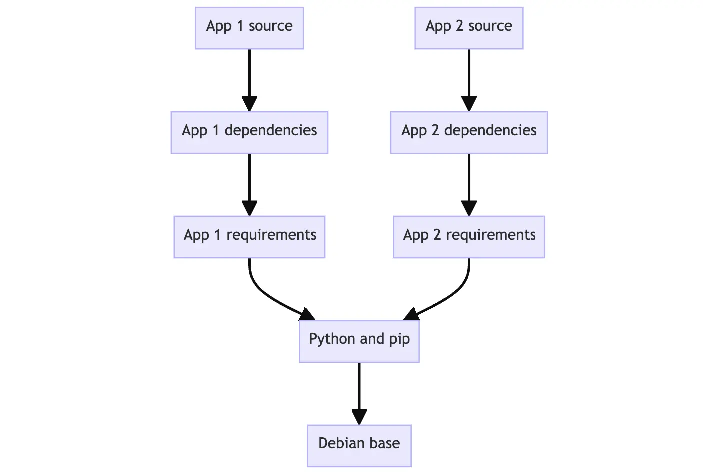

+++
title = "理解镜像层"
date = 2024-10-23T14:54:35+08:00
weight = 1
type = "docs"
description = ""
isCJKLanguage = true
draft = false

+++

> 原文：[https://docs.docker.com/get-started/docker-concepts/building-images/understanding-image-layers/](https://docs.docker.com/get-started/docker-concepts/building-images/understanding-image-layers/)
>
> 收录该文档的时间：`2024-10-23T14:54:35+08:00`

# Understanding the image layers - 理解镜像层



## 说明 Explanation

As you learned in [What is an image?](), container images are composed of layers. And each of these layers, once created, are immutable. But, what does that actually mean? And how are those layers used to create the filesystem a container can use?

​	正如你在 [什么是镜像?]() 中学到的，容器镜像由多个层组成，并且每一层一旦创建就不可变。那么，这到底是什么意思呢？这些层是如何用于创建容器可以使用的文件系统的？

### 镜像层 Image layers

Each layer in an image contains a set of filesystem changes - additions, deletions, or modifications. Let’s look at a theoretical image:

​	镜像中的每一层都包含一组文件系统的更改——添加、删除或修改。让我们来看一个理论上的镜像：

1. The first layer adds basic commands and a package manager, such as apt. 第一层添加了基本命令和包管理器，如 apt。
2. The second layer installs a Python runtime and pip for dependency management. 第二层安装了 Python 运行时和用于依赖管理的 pip。
3. The third layer copies in an application’s specific requirements.txt file. 第三层将应用程序的特定 `requirements.txt` 文件复制进去。
4. The fourth layer installs that application’s specific dependencies. 第四层安装该应用程序的特定依赖项。
5. The fifth layer copies in the actual source code of the application. 第五层将应用程序的源代码复制进去。

This example might look like:

​	这个示例可能看起来像这样：


This is beneficial because it allows layers to be reused between images. For example, imagine you wanted to create another Python application. Due to layering, you can leverage the same Python base. This will make builds faster and reduce the amount of storage and bandwidth required to distribute the images. The image layering might look similar to the following:

​	这种分层机制的好处在于，它允许镜像之间重用层。例如，假设你想创建另一个 Python 应用程序。由于有分层机制，你可以重用相同的 Python 基础层。这将加快构建速度，并减少分发镜像所需的存储和带宽。镜像分层可能看起来如下所示：



Layers let you extend images of others by reusing their base layers, allowing you to add only the data that your application needs.

​	分层允许你通过重用其他人的基础层来扩展镜像，仅添加你的应用程序所需的数据。

### 堆叠层 Stacking the layers

Layering is made possible by content-addressable storage and union filesystems. While this will get technical, here’s how it works:

​	分层通过内容可寻址存储和联合文件系统得以实现。虽然接下来会涉及一些技术细节，但其工作原理如下：

1. After each layer is downloaded, it is extracted into its own directory on the host filesystem. 每个层下载后，它会被解压到主机文件系统中的一个独立目录。
2. When you run a container from an image, a union filesystem is created where layers are stacked on top of each other, creating a new and unified view. 当你从镜像运行容器时，会创建一个联合文件系统，层被堆叠在一起，形成一个新的统一视图。
3. When the container starts, its root directory is set to the location of this unified directory, using `chroot`. 当容器启动时，它的根目录被设置为这个统一目录的位置，使用 `chroot`。

When the union filesystem is created, in addition to the image layers, a directory is created specifically for the running container. This allows the container to make filesystem changes while allowing the original image layers to remain untouched. This enables you to run multiple containers from the same underlying image.

​	当创建联合文件系统时，除了镜像层之外，还会为正在运行的容器创建一个目录。这允许容器进行文件系统更改，同时保持原始镜像层不受影响。这使得你可以从同一个基础镜像运行多个容器。

## 试试看 Try it out

In this hands-on guide, you will create new image layers manually using the [`docker container commit`]() command. Note that you’ll rarely create images this way, as you’ll normally [use a Dockerfile](). But, it makes it easier to understand how it’s all working.

​	在本实践指南中，你将使用 [`docker container commit`]() 命令手动创建新的镜像层。请注意，你通常不会这样创建镜像，通常会[使用 Dockerfile]()。但这样做有助于你更好地理解其工作原理。

### 创建基础镜像 Create a base image

In this first step, you will create your own base image that you will then use for the following steps.

​	在第一步中，你将创建自己的基础镜像，之后你可以在接下来的步骤中使用该镜像。

1. [Download and install](https://www.docker.com/products/docker-desktop/) Docker Desktop. [下载并安装](https://www.docker.com/products/docker-desktop/) Docker Desktop。

2. In a terminal, run the following command to start a new container: 在终端中运行以下命令以启动新容器：

   

   ```console
   $ docker run --name=base-container -ti ubuntu
   ```

   Once the image has been downloaded and the container has started, you should see a new shell prompt. This is running inside your container. It will look similar to the following (the container ID will vary):

   镜像下载并容器启动后，你会看到一个新的 shell 提示符。这是在容器内部运行的，类似于以下内容（容器 ID 会有所不同）：

   ```console
   root@d8c5ca119fcd:/#
   ```

3. Inside the container, run the following command to install Node.js: 在容器内部，运行以下命令安装 Node.js：

   

   ```console
   $ apt update && apt install -y nodejs
   ```

   When this command runs, it downloads and installs Node inside the container. In the context of the union filesystem, these filesystem changes occur within the directory unique to this container. 

   运行该命令后，Node 会在容器内部下载并安装。根据联合文件系统的上下文，这些文件系统更改发生在该容器唯一的目录中。

4. Validate if Node is installed by running the following command:

   通过运行以下命令验证是否安装了 Node：

   ```console
   $ node -e 'console.log("Hello world!")'
   ```

   You should then see a “Hello world!” appear in the console.

   然后你应该会在控制台中看到 "Hello world!"。

5. Now that you have Node installed, you’re ready to save the changes you’ve made as a new image layer, from which you can start new containers or build new images. To do so, you will use the [`docker container commit`]() command. Run the following command in a new terminal: 现在你已经安装了 Node，可以将你所做的更改保存为一个新的镜像层，从中可以启动新容器或构建新的镜像。为此，你将使用 [`docker container commit`]() 命令。在新终端中运行以下命令：

   

   ```console
   $ docker container commit -m "Add node" base-container node-base
   ```

6. View the layers of your image using the `docker image history` command: 使用 `docker image history` 命令查看你的镜像层：

   

   ```console
   $ docker image history node-base
   ```

   You will see output similar to the following:

   你会看到类似以下的输出：

   ```console
   IMAGE          CREATED          CREATED BY                                      SIZE      COMMENT
   d5c1fca2cdc4   10 seconds ago   /bin/bash                                       126MB     Add node
   2b7cc08dcdbb   5 weeks ago      /bin/sh -c #(nop)  CMD ["/bin/bash"]            0B
   <missing>      5 weeks ago      /bin/sh -c #(nop) ADD file:07cdbabf782942af0…   69.2MB
   <missing>      5 weeks ago      /bin/sh -c #(nop)  LABEL org.opencontainers.…   0B
   <missing>      5 weeks ago      /bin/sh -c #(nop)  LABEL org.opencontainers.…   0B
   <missing>      5 weeks ago      /bin/sh -c #(nop)  ARG LAUNCHPAD_BUILD_ARCH     0B
   <missing>      5 weeks ago      /bin/sh -c #(nop)  ARG RELEASE                  0B
   ```

   Note the “Add node” comment on the top line. This layer contains the Node.js install you just made.

   ​	注意顶部有 "Add node" 的注释。这一层包含你刚才安装的 Node.js。

7. To prove your image has Node installed, you can start a new container using this new image: 为证明你的镜像安装了 Node，可以使用该新镜像启动一个新容器：

   

   ```console
   $ docker run node-base node -e "console.log('Hello again')"
   ```

   With that, you should get a “Hello again” output in the terminal, showing Node was installed and working.

   ​	这样你应该会在终端中看到 "Hello again" 输出，表明 Node 已安装并正在工作。

8. Now that you’re done creating your base image, you can remove that container: 现在你完成了基础镜像的创建，可以删除该容器：

   

   ```console
   $ docker rm -f base-container
   ```

> **Base image definition 基础镜像定义**
>
> A base image is a foundation for building other images. It's possible to use any images as a base image. However, some images are intentionally created as building blocks, providing a foundation or starting point for an application.
>
> ​	基础镜像是构建其他镜像的基础。任何镜像都可以作为基础镜像。然而，有些镜像是专门创建作为构建块，为应用程序提供基础或起点。
>
> In this example, you probably won’t deploy this `node-base` image, as it doesn’t actually do anything yet. But it’s a base you can use for other builds.
>
> ​	在此示例中，你可能不会部署这个 `node-base` 镜像，因为它实际上什么都还没做。但它是你可以用于其他构建的基础。

### 构建应用镜像 Build an app image

Now that you have a base image, you can extend that image to build additional images.

​	现在你已经有了基础镜像，可以扩展该镜像以构建其他镜像。

1. Start a new container using the newly created node-base image: 使用新创建的 `node-base` 镜像启动一个新容器：

   

   ```console
   $ docker run --name=app-container -ti node-base
   ```

2. Inside of this container, run the following command to create a Node program: 在该容器内部，运行以下命令创建一个 Node 程序：

   

   ```console
   $ echo 'console.log("Hello from an app")' > app.js
   ```

   To run this Node program, you can use the following command and see the message printed on the screen:

   要运行此 Node 程序，你可以使用以下命令并在屏幕上看到消息：

   ```console
   $ node app.js
   ```

3. In another terminal, run the following command to save this container’s changes as a new image: 在另一个终端中运行以下命令，将此容器的更改保存为一个新的镜像：

   

   ```console
   $ docker container commit -c "CMD node app.js" -m "Add app" app-container sample-app
   ```

   This command not only creates a new image named `sample-app`, but also adds additional configuration to the image to set the default command when starting a container. In this case, you are setting it to automatically run `node app.js`.

   ​	该命令不仅创建了一个名为 `sample-app` 的新镜像，还为镜像添加了其他配置，设置了启动容器时的默认命令。在此示例中，你将其设置为自动运行 `node app.js`。

4. In a terminal outside of the container, run the following command to view the updated layers:  在容器外的终端中运行以下命令，查看更新的镜像层：

   

   ```console
   $ docker image history sample-app
   ```

   You’ll then see output that looks like the following. Note the top layer comment has “Add app” and the next layer has “Add node”:

   你将看到类似以下的输出。注意顶部一行的注释为 "Add app"，下一行的注释为 "Add node"：

   ```console
   IMAGE          CREATED              CREATED BY                                      SIZE      COMMENT
   c1502e2ec875   About a minute ago   /bin/bash                                       33B       Add app
   5310da79c50a   4 minutes ago        /bin/bash                                       126MB     Add node
   2b7cc08dcdbb   5 weeks ago          /bin/sh -c #(nop)  CMD ["/bin/bash"]            0B
   <missing>      5 weeks ago          /bin/sh -c #(nop) ADD file:07cdbabf782942af0…   69.2MB
   <missing>      5 weeks ago          /bin/sh -c #(nop)  LABEL org.opencontainers.…   0B
   <missing>      5 weeks ago          /bin/sh -c #(nop)  LABEL org.opencontainers.…   0B
   <missing>      5 weeks ago          /bin/sh -c #(nop)  ARG LAUNCHPAD_BUILD_ARCH     0B
   <missing>      5 weeks ago          /bin/sh -c #(nop)  ARG RELEASE                  0B
   ```

5. Finally, start a new container using the brand new image. Since you specified the default command, you can use the following command: 最后，使用新的镜像启动一个容器。由于你指定了默认命令，可以使用以下命令：

   

   ```console
   $ docker run sample-app
   ```

   You should see your greeting appear in the terminal, coming from your Node program.

   ​	你应该会在终端中看到来自你 Node 程序的问候消息。

6. Now that you’re done with your containers, you can remove them using the following command: 现在你已完成容器的使用，可以通过以下命令删除它们：

   

   ```console
   $ docker rm -f app-container
   ```

## 其他资源 Additional resources

If you’d like to dive deeper into the things you learned, check out the following resources:

​	如果你想更深入地了解所学内容，请查看以下资源：

- [`docker image history`]()
- [`docker container commit`]()

## 接下来 Next steps

As hinted earlier, most image builds don’t use `docker container commit`. Instead, you’ll use a Dockerfile which automates these steps for you.

​	如前所述，大多数镜像构建不会使用 `docker container commit`，你将使用 Dockerfile 自动化这些步骤。

[Writing a Dockerfile]() [编写 Dockerfile]()
