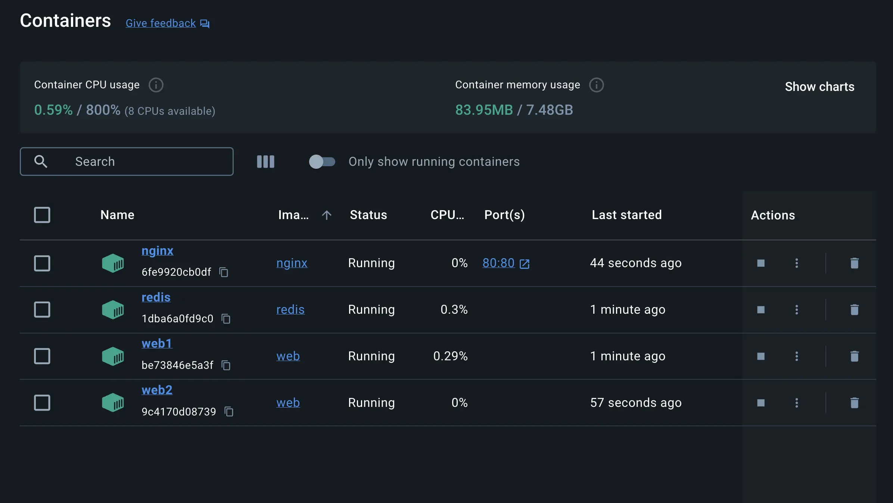
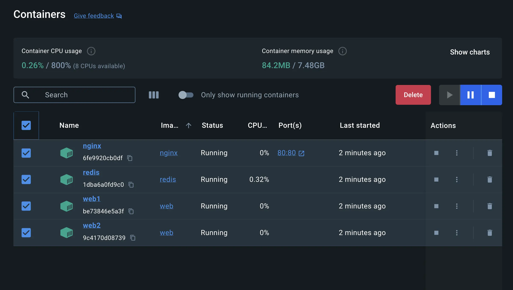
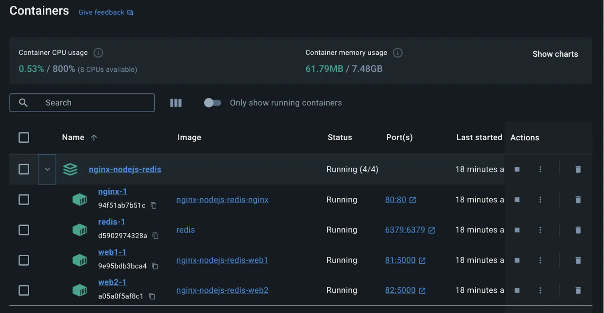
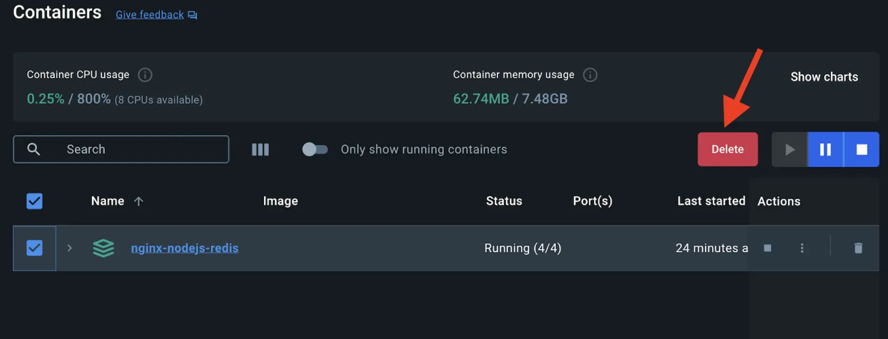

+++
title = "Multi-container applications"
date = 2024-10-23T14:54:35+08:00
weight = 40
type = "docs"
description = ""
isCJKLanguage = true
draft = false
+++

> 原文: [https://docs.docker.com/get-started/docker-concepts/running-containers/multi-container-applications/](https://docs.docker.com/get-started/docker-concepts/running-containers/multi-container-applications/)
>
> 收录该文档的时间：`2024-10-23T14:54:35+08:00`

# Multi-container applications

<iframe id="youtube-player-1jUwR6F9hvM" data-video-id="1jUwR6F9hvM" class="youtube-video aspect-video h-fit w-full py-2" frameborder="0" allowfullscreen="" allow="accelerometer; autoplay; clipboard-write; encrypted-media; gyroscope; picture-in-picture; web-share" referrerpolicy="strict-origin-when-cross-origin" title="Docker Concepts - Multi container applications" width="100%" height="100%" src="https://www.youtube.com/embed/1jUwR6F9hvM?rel=0&amp;iv_load_policy=3&amp;enablejsapi=1&amp;origin=https%3A%2F%2Fdocs.docker.com&amp;widgetid=1" data-gtm-yt-inspected-24="true" style="--tw-border-spacing-x: 0; --tw-border-spacing-y: 0; --tw-translate-x: 0; --tw-translate-y: 0; --tw-rotate: 0; --tw-skew-x: 0; --tw-skew-y: 0; --tw-scale-x: 1; --tw-scale-y: 1; --tw-pan-x: ; --tw-pan-y: ; --tw-pinch-zoom: ; --tw-scroll-snap-strictness: proximity; --tw-gradient-from-position: ; --tw-gradient-via-position: ; --tw-gradient-to-position: ; --tw-ordinal: ; --tw-slashed-zero: ; --tw-numeric-figure: ; --tw-numeric-spacing: ; --tw-numeric-fraction: ; --tw-ring-inset: ; --tw-ring-offset-width: 0px; --tw-ring-offset-color: #fff; --tw-ring-color: rgb(59 130 246 / 0.5); --tw-ring-offset-shadow: 0 0 #0000; --tw-ring-shadow: 0 0 #0000; --tw-shadow: 0 0 #0000; --tw-shadow-colored: 0 0 #0000; --tw-blur: ; --tw-brightness: ; --tw-contrast: ; --tw-grayscale: ; --tw-hue-rotate: ; --tw-invert: ; --tw-saturate: ; --tw-sepia: ; --tw-drop-shadow: ; --tw-backdrop-blur: ; --tw-backdrop-brightness: ; --tw-backdrop-contrast: ; --tw-backdrop-grayscale: ; --tw-backdrop-hue-rotate: ; --tw-backdrop-invert: ; --tw-backdrop-opacity: ; --tw-backdrop-saturate: ; --tw-backdrop-sepia: ; --tw-contain-size: ; --tw-contain-layout: ; --tw-contain-paint: ; --tw-contain-style: ; box-sizing: border-box; border-width: 0px; border-style: solid; border-color: initial; display: block; vertical-align: middle; aspect-ratio: 16 / 9; height: fit-content; width: 634.672px; padding-top: 0.5rem; padding-bottom: 0.5rem; color: rgb(0, 0, 0); font-family: &quot;Roboto Flex&quot;, system-ui, -apple-system, BlinkMacSystemFont, &quot;Segoe UI&quot;, Oxygen, Ubuntu, Cantarell, &quot;Open Sans&quot;, &quot;Helvetica Neue&quot;, sans-serif; font-size: 16px; font-style: normal; font-variant-ligatures: normal; font-variant-caps: normal; font-weight: 400; letter-spacing: normal; orphans: 2; text-align: start; text-indent: 0px; text-transform: none; widows: 2; word-spacing: 0px; -webkit-text-stroke-width: 0px; white-space: normal; background-color: rgb(255, 255, 255); text-decoration-thickness: initial; text-decoration-style: initial; text-decoration-color: initial;"></iframe>

## [Explanation](https://docs.docker.com/get-started/docker-concepts/running-containers/multi-container-applications/#explanation)

Starting up a single-container application is easy. For example, a Python script that performs a specific data processing task runs within a container with all its dependencies. Similarly, a Node.js application serving a static website with a small API endpoint can be effectively containerized with all its necessary libraries and dependencies. However, as applications grow in size, managing them as individual containers becomes more difficult.

Imagine the data processing Python script needs to connect to a database. Suddenly, you're now managing not just the script but also a database server within the same container. If the script requires user logins, you'll need an authentication mechanism, further bloating the container size.

One best practice for containers is that each container should do one thing and do it well. While there are exceptions to this rule, avoid the tendency to have one container do multiple things.

Now you might ask, "Do I need to run these containers separately? If I run them separately, how shall I connect them all together?"

While `docker run` is a convenient tool for launching containers, it becomes difficult to manage a growing application stack with it. Here's why:

- Imagine running several `docker run` commands (frontend, backend, and database) with different configurations for development, testing, and production environments. It's error-prone and time-consuming.
- Applications often rely on each other. Manually starting containers in a specific order and managing network connections become difficult as the stack expands.
- Each application needs its `docker run` command, making it difficult to scale individual services. Scaling the entire application means potentially wasting resources on components that don't need a boost.
- Persisting data for each application requires separate volume mounts or configurations within each `docker run` command. This creates a scattered data management approach.
- Setting environment variables for each application through separate `docker run` commands is tedious and error-prone.

That's where Docker Compose comes to the rescue.

Docker Compose defines your entire multi-container application in a single YAML file called `compose.yml`. This file specifies configurations for all your containers, their dependencies, environment variables, and even volumes and networks. With Docker Compose:

- You don't need to run multiple `docker run` commands. All you need to do is define your entire multi-container application in a single YAML file. This centralizes configuration and simplifies management.
- You can run containers in a specific order and manage network connections easily.
- You can simply scale individual services up or down within the multi-container setup. This allows for efficient allocation based on real-time needs.
- You can implement persistent volumes with ease.
- It's easy to set environment variables once in your Docker Compose file.

By leveraging Docker Compose for running multi-container setups, you can build complex applications with modularity, scalability, and consistency at their core.

## [Try it out](https://docs.docker.com/get-started/docker-concepts/running-containers/multi-container-applications/#try-it-out)

In this hands-on guide, you'll first see how to build and run a counter web application based on Node.js, an Nginx reverse proxy, and a Redis database using the `docker run` commands. You’ll also see how you can simplify the entire deployment process using Docker Compose.

### [Set up](https://docs.docker.com/get-started/docker-concepts/running-containers/multi-container-applications/#set-up)

1. Get the sample application. If you have Git, you can clone the repository for the sample application. Otherwise, you can download the sample application. Choose one of the following options.

   

   {}

   Use the following command in a terminal to clone the sample application repository.

   

   ```console
   $ git clone https://github.com/dockersamples/nginx-node-redis
   ```

   Navigate into the `nginx-node-redis` directory:

   

   ```console
   $ cd nginx-node-redis
   ```

   Inside this directory, you'll find two sub-directories - `nginx` and `web`.

   {}

   {}

   Download the source and extract it.

   [Download the source](https://github.com/dockersamples/nginx-node-redis/archive/refs/heads/main.zip)

   Navigate into the `nginx-node-redis-main` directory:

   

   ```console
   $ cd nginx-node-redis-main
   ```

   Inside this directory, you'll find two sub-directories - `nginx` and `web`.

   {}

   

   

2. [Download and install](https://docs.docker.com/get-started/get-docker/) Docker Desktop.

### [Build the images](https://docs.docker.com/get-started/docker-concepts/running-containers/multi-container-applications/#build-the-images)

1. Navigate into the `nginx` directory to build the image by running the following command:

   

   ```console
   $ docker build -t nginx .
   ```

2. Navigate into the `web` directory and run the following command to build the first web image:

   

   ```console
   $ docker build -t web .
   ```

### [Run the containers](https://docs.docker.com/get-started/docker-concepts/running-containers/multi-container-applications/#run-the-containers)

1. Before you can run a multi-container application, you need to create a network for them all to communicate through. You can do so using the `docker network create` command:

   

   ```console
   $ docker network create sample-app
   ```

2. Start the Redis container by running the following command, which will attach it to the previously created network and create a network alias (useful for DNS lookups):

   

   ```console
   $ docker run -d  --name redis --network sample-app --network-alias redis redis
   ```

3. Start the first web container by running the following command:

   

   ```console
   $ docker run -d --name web1 -h web1 --network sample-app --network-alias web1 web
   ```

4. Start the second web container by running the following:

   

   ```console
   $ docker run -d --name web2 -h web2 --network sample-app --network-alias web2 web
   ```

5. Start the Nginx container by running the following command:

   

   ```console
   $ docker run -d --name nginx --network sample-app  -p 80:80 nginx
   ```

   > **Note**
   >
   > 
   >
   > Nginx is typically used as a reverse proxy for web applications, routing traffic to backend servers. In this case, it routes to the Node.js backend containers (web1 or web2).

6. Verify the containers are up by running the following command:

   

   ```console
   $ docker ps
   ```

   You will see output like the following:

   

   ```text
   CONTAINER ID   IMAGE     COMMAND                  CREATED              STATUS              PORTS                NAMES
   2cf7c484c144   nginx     "/docker-entrypoint.…"   9 seconds ago        Up 8 seconds        0.0.0.0:80->80/tcp   nginx
   7a070c9ffeaa   web       "docker-entrypoint.s…"   19 seconds ago       Up 18 seconds                            web2
   6dc6d4e60aaf   web       "docker-entrypoint.s…"   34 seconds ago       Up 33 seconds                            web1
   008e0ecf4f36   redis     "docker-entrypoint.s…"   About a minute ago   Up About a minute   6379/tcp             redis
   ```

7. If you look at the Docker Dashboard, you can see the containers and dive deeper into their configuration.

   

8. With everything up and running, you can open [http://localhost](http://localhost/) in your browser to see the site. Refresh the page several times to see the host that’s handling the request and the total number of requests:

   

   ```console
   web2: Number of visits is: 9
   web1: Number of visits is: 10
   web2: Number of visits is: 11
   web1: Number of visits is: 12
   ```

   > **Note**
   >
   > 
   >
   > You might have noticed that Nginx, acting as a reverse proxy, likely distributes incoming requests in a round-robin fashion between the two backend containers. This means each request might be directed to a different container (web1 and web2) on a rotating basis. The output shows consecutive increments for both the web1 and web2 containers and the actual counter value stored in Redis is updated only after the response is sent back to the client.

9. You can use the Docker Dashboard to remove the containers by selecting the containers and selecting the **Delete** button.

   

## [Simplify the deployment using Docker Compose](https://docs.docker.com/get-started/docker-concepts/running-containers/multi-container-applications/#simplify-the-deployment-using-docker-compose)

Docker Compose provides a structured and streamlined approach for managing multi-container deployments. As stated earlier, with Docker Compose, you don’t need to run multiple `docker run` commands. All you need to do is define your entire multi-container application in a single YAML file called `compose.yml`. Let’s see how it works.

Navigate to the root of the project directory. Inside this directory, you'll find a file named `compose.yml`. This YAML file is where all the magic happens. It defines all the services that make up your application, along with their configurations. Each service specifies its image, ports, volumes, networks, and any other settings necessary for its functionality.

1. Use the `docker compose up` command to start the application:

   

   ```console
   $ docker compose up -d --build
   ```

   When you run this command, you should see output similar to the following:

   

   ```console
   Running 5/5
   ✔ Network nginx-nodejs-redis_default    Created                                                0.0s
   ✔ Container nginx-nodejs-redis-web1-1   Started                                                0.1s
   ✔ Container nginx-nodejs-redis-redis-1  Started                                                0.1s
   ✔ Container nginx-nodejs-redis-web2-1   Started                                                0.1s
   ✔ Container nginx-nodejs-redis-nginx-1  Started
   ```

2. If you look at the Docker Dashboard, you can see the containers and dive deeper into their configuration.

   

3. Alternatively, you can use the Docker Dashboard to remove the containers by selecting the application stack and selecting the **Delete** button.

   

In this guide, you learned how easy it is to use Docker Compose to start and stop a multi-container application compared to `docker run` which is error-prone and difficult to manage.

## [Additional resources](https://docs.docker.com/get-started/docker-concepts/running-containers/multi-container-applications/#additional-resources)

- [`docker container run` CLI reference](https://docs.docker.com/reference/cli/docker/container/run/)
- [What is Docker Compose](https://docs.docker.com/get-started/docker-concepts/the-basics/what-is-docker-compose/)
