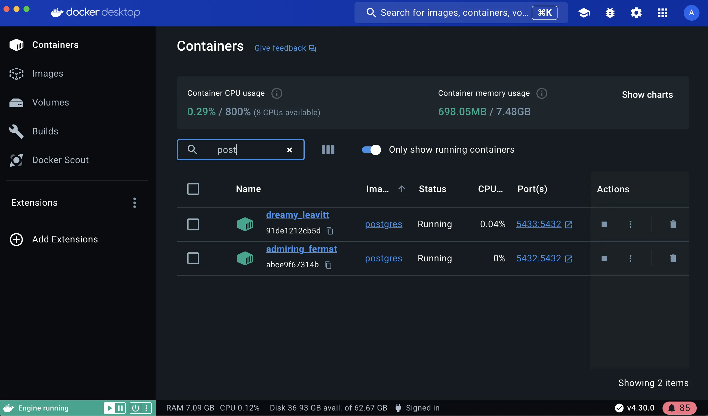
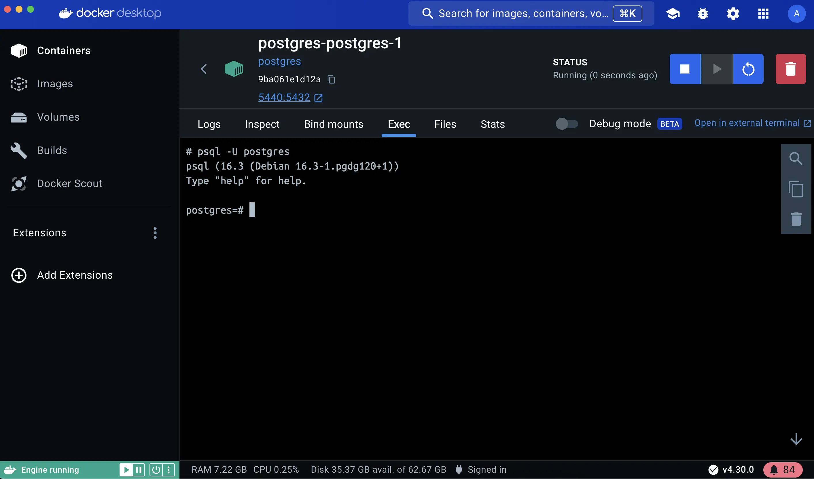

+++
title = "覆盖容器默认设置"
date = 2024-10-23T14:54:35+08:00
weight = 10
type = "docs"
description = ""
isCJKLanguage = true
draft = false

+++

> 原文：[https://docs.docker.com/get-started/docker-concepts/running-containers/overriding-container-defaults/](https://docs.docker.com/get-started/docker-concepts/running-containers/overriding-container-defaults/)
>
> 收录该文档的时间：`2024-10-23T14:54:35+08:00`

# Overriding container defaults - 覆盖容器默认设置



## 说明 Explanation

When a Docker container starts, it executes an application or command. The container gets this executable (script or file) from its image’s configuration. Containers come with default settings that usually work well, but you can change them if needed. These adjustments help the container's program run exactly how you want it to.

​	当 Docker 容器启动时，它会执行一个应用程序或命令。容器从其镜像的配置中获取这个可执行文件（脚本或文件）。容器自带的默认设置通常效果很好，但如果需要，您可以更改这些设置。通过这些调整，您可以让容器内的程序按照您的期望运行。

For example, if you have an existing database container that listens on the standard port and you want to run a new instance of the same database container, then you might want to change the port settings the new container listens on so that it doesn’t conflict with the existing container. Sometimes you might want to increase the memory available to the container if the program needs more resources to handle a heavy workload or set the environment variables to provide specific configuration details the program needs to function properly.

​	例如，如果您有一个现有的数据库容器监听标准端口，您想运行同一数据库容器的新实例，您可能希望更改新容器监听的端口设置，以免与现有容器发生冲突。有时，您可能需要增加容器可用的内存，以便程序能够处理更大的工作负载，或设置环境变量，以提供程序正常运行所需的特定配置。

The `docker run` command offers a powerful way to override these defaults and tailor the container's behavior to your liking. The command offers several flags that let you to customize container behavior on the fly.

​	`docker run` 命令提供了一种强大的方式来覆盖这些默认设置，并根据需要定制容器的行为。该命令提供了多个标志，让您能够即时自定义容器行为。

Here's a few ways you can achieve this.

​	以下是一些实现方式。

### 覆盖网络端口 Overriding the network ports

Sometimes you might want to use separate database instances for development and testing purposes. Running these database instances on the same port might conflict. You can use the `-p` option in `docker run` to map container ports to host ports, allowing you to run the multiple instances of the container without any conflict.

​	有时，您可能需要为开发和测试目的使用不同的数据库实例。如果这些实例运行在同一个端口上，可能会发生冲突。您可以使用 `docker run` 中的 `-p` 选项将容器端口映射到主机端口，这样可以同时运行多个容器实例而不会发生冲突。


```console
$ docker run -d -p HOST_PORT:CONTAINER_PORT postgres
```

### 设置环境变量 Setting environment variables

This option sets an environment variable `foo` inside the container with the value `bar`.

​	这个选项在容器中设置环境变量 `foo`，值为 `bar`。


```console
$ docker run -e foo=bar postgres env
```

You will see output like the following:

​	您将看到如下输出：


```console
HOSTNAME=2042f2e6ebe4
foo=bar
```

> **Tip**
>
> 
>
> The `.env` file acts as a convenient way to set environment variables for your Docker containers without cluttering your command line with numerous `-e` flags. To use a `.env` file, you can pass `--env-file` option with the `docker run` command.
>
> ​	`env` 文件是一种方便的方法，可以为 Docker 容器设置环境变量，而无需在命令行中添加多个 `-e` 标志。要使用 `.env` 文件，您可以在 `docker run` 命令中传递 `--env-file` 选项。
>
> ```console
> $ docker run --env-file .env postgres env
> ```

### 限制容器资源使用 Restricting the container to consume the resources

You can use the `--memory` and `--cpus` flags with the `docker run` command to restrict how much CPU and memory a container can use. For example, you can set a memory limit for the Python API container, preventing it from consuming excessive resources on your host. Here's the command:

​	您可以使用 `--memory` 和 `--cpus` 标志与 `docker run` 命令一起使用，以限制容器可以使用的 CPU 和内存。例如，您可以为 Python API 容器设置内存限制，防止它占用主机上的过多资源。以下是命令：

```console
$ docker run -e POSTGRES_PASSWORD=secret --memory="512m" --cpus="0.5" postgres
```

This command limits container memory usage to 512 MB and defines the CPU quota of 0.5 for half a core.

​	此命令将容器的内存使用限制为 512MB，并定义了 0.5 的 CPU 配额，表示半个 CPU 核心。

> **Monitor the real-time resource usage 监控实时资源使用**
>
> You can use the `docker stats` command to monitor the real-time resource usage of running containers. This helps you understand whether the allocated resources are sufficient or need adjustment.
>
> ​	您可以使用 `docker stats` 命令来监控正在运行的容器的实时资源使用情况。这有助于您了解分配的资源是否足够或需要调整。

By effectively using these `docker run` flags, you can tailor your containerized application's behavior to fit your specific requirements.

​	通过有效地使用这些 `docker run` 标志，您可以根据具体需求调整容器化应用程序的行为。

## 试试看 Try it out

In this hands-on guide, you'll see how to use the `docker run` command to override the container defaults.

​	在本手册中，您将看到如何使用 `docker run` 命令覆盖容器的默认设置。

1. [Download and install]() Docker Desktop. [下载并安装 Docker Desktop]()。

### 运行多个 Postgres 数据库实例 Run multiple instance of the Postgres database

1. Start a container using the [Postgres image](https://hub.docker.com/_/postgres) with the following command: 使用以下命令启动一个使用 [Postgres 镜像](https://hub.docker.com/_/postgres) 的容器：

   

   ```console
   $ docker run -d -e POSTGRES_PASSWORD=secret -p 5432:5432 postgres
   ```

   This will start the Postgres database in the background, listening on the standard container port `5432` and mapped to port `5432` on the host machine.

   ​	这将启动 Postgres 数据库，并在后台运行，监听标准容器端口 `5432`，并映射到主机上的 `5432` 端口。

2. Start a second Postgres container mapped to a different port. 启动另一个映射到不同端口的 Postgres 容器。

   

   ```console
   $ docker run -d -e POSTGRES_PASSWORD=secret -p 5433:5432 postgres
   ```

   This will start another Postgres container in the background, listening on the standard postgres port `5432` in the container, but mapped to port `5433` on the host machine. You override the host port just to ensure that this new container doesn't conflict with the existing running container.

   ​	这将启动另一个 Postgres 容器，在后台运行，监听容器中的标准端口 `5432`，但映射到主机上的端口 `5433`。您覆盖了主机端口，以确保新容器不会与现有的运行容器冲突。

3. Verify that both containers are running by going to the **Containers** view in the Docker Dashboard. 通过 Docker Dashboard 的 **Containers** 视图验证这两个容器正在运行。

   

### 在受控网络中运行 Postgres 容器 Run Postgres container in a controlled network

By default, containers automatically connect to a special network called a bridge network when you run them. This bridge network acts like a virtual bridge, allowing containers on the same host to communicate with each other while keeping them isolated from the outside world and other hosts. It's a convenient starting point for most container interactions. However, for specific scenarios, you might want more control over the network configuration.

​	默认情况下，当你运行容器时，它们会自动连接到一个特殊的网络，称为桥接网络。该桥接网络就像一个虚拟桥，允许同一主机上的容器相互通信，同时将它们与外部世界和其他主机隔离开来。对于大多数容器交互来说，这是一个方便的起点。然而，在某些特定场景下，你可能需要对网络配置有更多的控制。

Here's where the custom network comes in. You create a custom network by passing `--network` flag with the `docker run` command. All containers without a `--network` flag are attached to the default bridge network.

​	这时自定义网络就派上用场了。你可以通过在 `docker run` 命令中传递 `--network` 标志来创建一个自定义网络。所有未指定 `--network` 标志的容器都连接到默认的桥接网络。

Follow the steps to see how to connect a Postgres container to a custom network.

​	按照以下步骤，将 Postgres 容器连接到自定义网络。

1. Create a new custom network by using the following command: 使用以下命令创建一个新的自定义网络：

   

   ```console
   $ docker network create mynetwork
   ```

2. Verify the network by running the following command: 运行以下命令验证网络：

   

   ```console
   $ docker network ls
   ```

   This command lists all networks, including the newly created "mynetwork".

   ​	此命令会列出所有网络，包括新创建的 "mynetwork"。

3. Connect Postgres to the custom network by using the following command: 使用以下命令将 Postgres 连接到自定义网络：

   

   ```console
   $ docker run -d -e POSTGRES_PASSWORD=secret -p 5434:5432 --network mynetwork postgres
   ```

   This will start Postgres container in the background, mapped to the host port 5434 and attached to the `mynetwork` network. You passed the `--network` parameter to override the container default by connecting the container to custom Docker network for better isolation and communication with other containers. You can use `docker network inspect` command to see if the container is tied to this new bridge network.

   ​	该命令将在后台启动 Postgres 容器，映射到主机端口 5434，并连接到 `mynetwork` 网络。你传递了 `--network` 参数来覆盖容器默认设置，连接容器到自定义 Docker 网络，以便更好地隔离和与其他容器通信。你可以使用 `docker network inspect` 命令查看容器是否连接到该新桥接网络。
   
   > **Key difference between default bridge and custom networks 默认桥接网络与自定义网络的关键区别**
   >
   > 1. DNS resolution: By default, containers connected to the default bridge network can communicate with each other, but only by IP address. (unless you use `--link` option which is considered legacy). It is not recommended for production use due to the various [technical shortcomings](https://docs.docker.com/engine/network/drivers/bridge/#differences-between-user-defined-bridges-and-the-default-bridge). On a custom network, containers can resolve each other by name or alias. **DNS 解析**：默认情况下，连接到默认桥接网络的容器只能通过 IP 地址通信（除非你使用 `--link` 选项，虽然被视为过时功能）。由于各种[技术局限](https://docs.docker.com/engine/network/drivers/bridge/#differences-between-user-defined-bridges-and-the-default-bridge)，这在生产环境中不建议使用。在自定义网络中，容器可以通过名称或别名相互解析。
   > 2. Isolation: All containers without a `--network` specified are attached to the default bridge network, hence can be a risk, as unrelated containers are then able to communicate. Using a custom network provides a scoped network in which only containers attached to that network are able to communicate, hence providing better isolation. **隔离**：所有未指定 `--network` 的容器都连接到默认桥接网络，因此可能存在风险，因为不相关的容器可能会通信。使用自定义网络提供了一个范围限定的网络，只有连接到该网络的容器能够相互通信，从而提供更好的隔离。

### 管理资源 Manage the resources

By default, containers are not limited in their resource usage. However, on shared systems, it's crucial to manage resources effectively. It's important not to let a running container consume too much of the host machine's memory.

​	默认情况下，容器的资源使用不受限制。然而，在共享系统上，有效管理资源至关重要。不能让一个正在运行的容器消耗太多主机的内存。

This is where the `docker run` command shines again. It offers flags like `--memory` and `--cpus` to restrict how much CPU and memory a container can use.

​	这就是 `docker run` 命令的优势所在。它提供了 `--memory` 和 `--cpus` 标志，用于限制容器使用的 CPU 和内存。

```console
$ docker run -d -e POSTGRES_PASSWORD=secret --memory="512m" --cpus=".5" postgres
```

The `--cpus` flag specifies the CPU quota for the container. Here, it's set to half a CPU core (0.5) whereas the `--memory` flag specifies the memory limit for the container. In this case, it's set to 512 MB.

​	`--cpus` 标志指定容器的 CPU 配额。在这里，它设置为半个 CPU 核心（0.5），而 `--memory` 标志指定容器的内存限制。在本例中，它设置为 512 MB。

### 在 Docker Compose 中覆盖默认的 CMD 和 ENTRYPOINT - Override the default CMD and ENTRYPOINT in Docker Compose

Sometimes, you might need to override the default commands (`CMD`) or entry points (`ENTRYPOINT`) defined in a Docker image, especially when using Docker Compose.

​	有时，当使用 Docker Compose 时，你可能需要覆盖 Docker 镜像中定义的默认命令（`CMD`）或入口点（`ENTRYPOINT`）。

1. Create a `compose.yml` file with the following content: 创建一个 `compose.yml` 文件，内容如下：

   

   ```yaml
   services:
     postgres:
       image: postgres
       entrypoint: ["docker-entrypoint.sh", "postgres"]
       command: ["-h", "localhost", "-p", "5432"]
       environment:
         POSTGRES_PASSWORD: secret 
   ```

   The Compose file defines a service named `postgres` that uses the official Postgres image, sets an entrypoint script, and starts the container with password authentication.

   ​	该 Compose 文件定义了一个名为 `postgres` 的服务，使用官方 Postgres 镜像，设置了入口点脚本，并通过密码认证启动容器。

2. Bring up the service by running the following command: 使用以下命令启动该服务：

   

   ```console
   $ docker compose up -d
   ```

   This command starts the Postgres service defined in the Docker Compose file.

   ​	该命令会启动 Docker Compose 文件中定义的 Postgres 服务。

3. Verify the authentication with Docker Dashboard. 使用 Docker Dashboard 验证身份验证。

   Open the Docker Dashboard, select the **Postgres** container and select **Exec** to enter into the container shell. You can type the following command to connect to the Postgres database:

   ​	打开 Docker Dashboard，选择 **Postgres** 容器并选择 **Exec** 进入容器 Shell。你可以键入以下命令连接到 Postgres 数据库：

   
   
   ```console
   # psql -U postgres
   ```

   
   
   > **Note**
   >
   > 
   >
   > The PostgreSQL image sets up trust authentication locally so you may notice a password isn't required when connecting from localhost (inside the same container). However, a password will be required if connecting from a different host/container.
   >
   > ​	PostgreSQL 镜像本地设置了信任认证，因此你可能会注意到从本地（同一容器内）连接时不需要密码。但是，从不同的主机/容器连接时则需要密码。

### 使用 `docker run` 覆盖默认 CMD 和 ENTRYPOINT - Override the default CMD and ENTRYPOINT with `docker run`

You can also override defaults directly using the `docker run` command with the following command:

​	你还可以直接使用以下命令，通过 `docker run` 覆盖默认设置：

```console
$ docker run -e POSTGRES_PASSWORD=secret postgres docker-entrypoint.sh -h localhost -p 5432
```

This command runs a Postgres container, sets an environment variable for password authentication, overrides the default startup commands and configures hostname and port mapping.

​	此命令运行一个 Postgres 容器，设置用于密码认证的环境变量，覆盖默认的启动命令并配置主机名和端口映射。

## 其他资源 Additional resources

- [Ways to set environment variables with Compose]() - [使用 Compose 设置环境变量的方法]()
- [What is a container]() - [什么是容器]()

## 接下来 Next steps

Now that you have learned about overriding container defaults, it's time to learn how to persist container data.

​	现在你已经了解了如何覆盖容器默认设置，是时候学习如何持久化容器数据了。

[Persisting container data]() - [持久化容器数据]()
