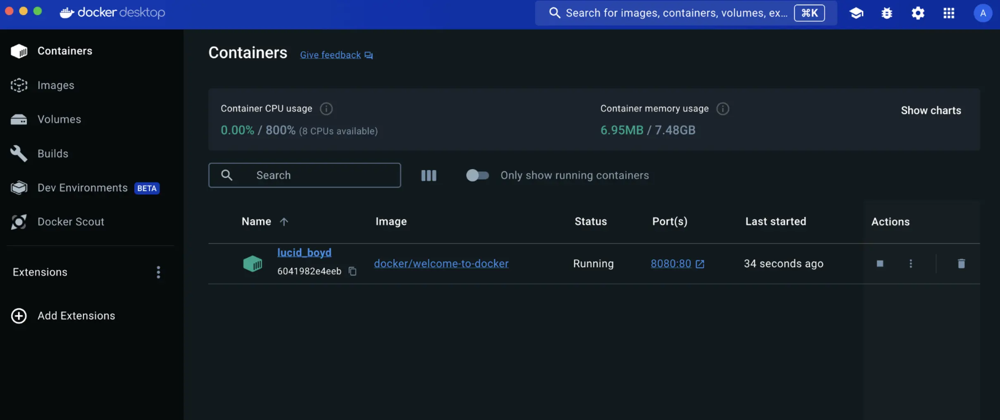

+++
title = "发布和暴露端口"
date = 2024-10-23T14:54:35+08:00
weight = 1
type = "docs"
description = ""
isCJKLanguage = true
draft = false

+++

> 原文：[https://docs.docker.com/get-started/docker-concepts/running-containers/publishing-ports/](https://docs.docker.com/get-started/docker-concepts/running-containers/publishing-ports/)
>
> 收录该文档的时间：`2024-10-23T14:54:35+08:00`

# Publishing and exposing ports - 发布和暴露端口



## 说明 Explanation

If you've been following the guides so far, you understand that containers provide isolated processes for each component of your application. Each component - a React frontend, a Python API, and a Postgres database - runs in its own sandbox environment, completely isolated from everything else on your host machine. This isolation is great for security and managing dependencies, but it also means you can’t access them directly. For example, you can’t access the web app in your browser.

​	如果你一直在跟随这些指南，你已经了解了容器为应用程序的每个组件提供了隔离的进程。每个组件——例如 React 前端、Python API 和 Postgres 数据库——都在其独立的沙盒环境中运行，与主机系统完全隔离。这种隔离对于安全性和依赖管理非常有利，但也意味着你无法直接访问这些容器。比如，你无法在浏览器中访问 Web 应用程序。

That’s where port publishing comes in.

​	这就是端口发布的作用所在。

### 发布端口 Publishing ports

Publishing a port provides the ability to break through a little bit of networking isolation by setting up a forwarding rule. As an example, you can indicate that requests on your host’s port `8080` should be forwarded to the container’s port `80`. Publishing ports happens during container creation using the `-p` (or `--publish`) flag with `docker run`. The syntax is:

​	发布端口能够打破部分网络隔离，通过设置转发规则让主机访问容器。例如，你可以指示主机的端口 `8080` 转发到容器的端口 `80`。发布端口是在容器创建过程中使用 `docker run` 命令中的 `-p`（或 `--publish`）标志完成的，语法如下：


```console
$ docker run -d -p HOST_PORT:CONTAINER_PORT nginx
```

- `HOST_PORT`: The port number on your host machine where you want to receive traffic `HOST_PORT`：主机上接收流量的端口号
- `CONTAINER_PORT`: The port number within the container that's listening for connections `CONTAINER_PORT`：容器内正在监听连接的端口号

For example, to publish the container's port `80` to host port `8080`:

​	例如，将容器的端口 `80` 发布到主机的端口 `8080`：


```console
$ docker run -d -p 8080:80 nginx
```

Now, any traffic sent to port `8080` on your host machine will be forwarded to port `80` within the container.

​	现在，任何发送到主机端口 `8080` 的流量都会被转发到容器内的端口 `80`。

> **Important**
>
> 
>
> When a port is published, it's published to all network interfaces by default. This means any traffic that reaches your machine can access the published application. Be mindful of publishing databases or any sensitive information. [Learn more about published ports here](https://docs.docker.com/engine/network/#published-ports).
>
> ​	发布的端口默认会暴露在所有网络接口上。这意味着任何到达你机器的流量都能访问已发布的应用程序。发布数据库或其他敏感信息时需要谨慎。[在此了解更多关于发布端口的信息](https://docs.docker.com/engine/network/#published-ports)。

### 发布到临时端口 Publishing to ephemeral ports

At times, you may want to simply publish the port but don’t care which host port is used. In these cases, you can let Docker pick the port for you. To do so, simply omit the `HOST_PORT` configuration.

​	有时你可能希望发布端口但不在意使用哪个主机端口。在这种情况下，你可以让 Docker 自动为你选择端口。为此，只需省略 `HOST_PORT` 配置即可。

For example, the following command will publish the container’s port `80` onto an ephemeral port on the host:

​	例如，以下命令会将容器的端口 `80` 发布到主机上的一个临时端口：


```console
$ docker run -p 80 nginx
```

Once the container is running, using `docker ps` will show you the port that was chosen:

​	一旦容器启动，使用 `docker ps` 查看选定的端口：


```console
docker ps
CONTAINER ID   IMAGE         COMMAND                  CREATED          STATUS          PORTS                    NAMES
a527355c9c53   nginx         "/docker-entrypoint.…"   4 seconds ago    Up 3 seconds    0.0.0.0:54772->80/tcp    romantic_williamson
```

In this example, the app is exposed on the host at port `54772`.

​	在这个例子中，应用程序在主机的端口 `54772` 上暴露。

### 发布所有端口 Publishing all ports

When creating a container image, the `EXPOSE` instruction is used to indicate the packaged application will use the specified port. These ports aren't published by default.

​	创建容器镜像时，`EXPOSE` 指令用于指示打包的应用程序将使用指定的端口。这些端口默认不会被发布。

With the `-P` or `--publish-all` flag, you can automatically publish all exposed ports to ephemeral ports. This is quite useful when you’re trying to avoid port conflicts in development or testing environments.

​	使用 `-P` 或 `--publish-all` 标志可以自动将所有暴露的端口发布到临时端口。当你想避免开发或测试环境中的端口冲突时，这非常有用。

For example, the following command will publish all of the exposed ports configured by the image:

​	例如，以下命令会发布镜像中配置的所有暴露端口：


```console
$ docker run -P nginx
```

## 试试看 Try it out

In this hands-on guide, you'll learn how to publish container ports using both the CLI and Docker Compose for deploying a web application.

​	在本实践指南中，你将学习如何使用 CLI 和 Docker Compose 来发布容器端口，并部署 Web 应用程序。

### 使用 Docker CLI - Use the Docker CLI

In this step, you will run a container and publish its port using the Docker CLI.

​	在这一步中，你将使用 Docker CLI 运行一个容器并发布其端口。

1. [Download and install]() Docker Desktop. [下载并安装 Docker Desktop](https://www.docker.com/products/docker-desktop)。

2. In a terminal, run the following command to start a new container: 在终端中运行以下命令，启动一个新的容器：

   

   ```console
   $ docker run -d -p 8080:80 docker/welcome-to-docker
   ```

   The first `8080` refers to the host port. This is the port on your local machine that will be used to access the application running inside the container. The second `80` refers to the container port. This is the port that the application inside the container listens on for incoming connections. Hence, the command binds to port `8080` of the host to port `80` on the container system.

   ​	第一个 `8080` 是主机端口，即你本地机器将用于访问容器内运行的应用程序的端口。第二个 `80` 是容器端口，即容器内应用程序监听的端口。因此，该命令将主机的端口 `8080` 绑定到容器系统的端口 `80`。

3. Verify the published port by going to the **Containers** view of the Docker Dashboard. 通过 Docker Dashboard 的 **Containers** 视图验证已发布的端口。

   

4. Open the website by either selecting the link in the **Port(s)** column of your container or visiting [http://localhost:8080](http://localhost:8080/) in your browser. 通过选择容器 **Port(s)** 列中的链接，或在浏览器中访问 [http://localhost:8080](http://localhost:8080/) 打开网站。

   

### 使用 Docker Compose - Use Docker Compose

This example will launch the same application using Docker Compose:

​	此示例将使用 Docker Compose 启动相同的应用程序：

1. Create a new directory and inside that directory, create a `compose.yaml` file with the following contents: 创建一个新目录，并在该目录中创建一个名为 `compose.yaml` 的文件，内容如下：

   

   ```yaml
   services:
     app:
       image: docker/welcome-to-docker
       ports:
         - 8080:80
   ```

   The `ports` configuration accepts a few different forms of syntax for the port definition. In this case, you’re using the same `HOST_PORT:CONTAINER_PORT` used in the `docker run` command.

   ​	`ports` 配置接受几种不同的端口定义语法。在此示例中，你使用了与 `docker run` 命令相同的 `HOST_PORT:CONTAINER_PORT` 形式。

2. Open a terminal and navigate to the directory you created in the previous step. 打开终端并导航到你在上一步中创建的目录。

3. Use the `docker compose up` command to start the application. 使用 `docker compose up` 命令启动应用程序。

4. Open your browser to [http://localhost:8080](http://localhost:8080/). 打开浏览器，访问 [http://localhost:8080](http://localhost:8080/)

## 其他资源 Additional resources

If you’d like to dive in deeper on this topic, be sure to check out the following resources:

​	如果你想深入了解这个话题，请查看以下资源：

- [`docker container port` CLI reference]()

- [Published ports](https://docs.docker.com/engine/network/#published-ports)

## 接下来 Next steps

Now that you understand how to publish and expose ports, you're ready to learn how to override the container defaults using the `docker run` command.

​	现在你已经了解了如何发布和暴露端口，接下来你可以学习如何通过 `docker run` 命令覆盖容器的默认设置。

[Overriding container defaults 覆盖容器默认设置]()
