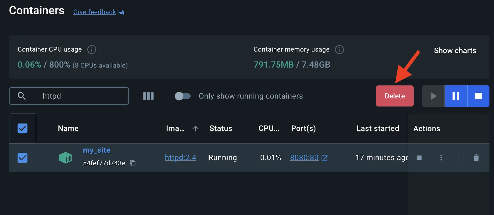
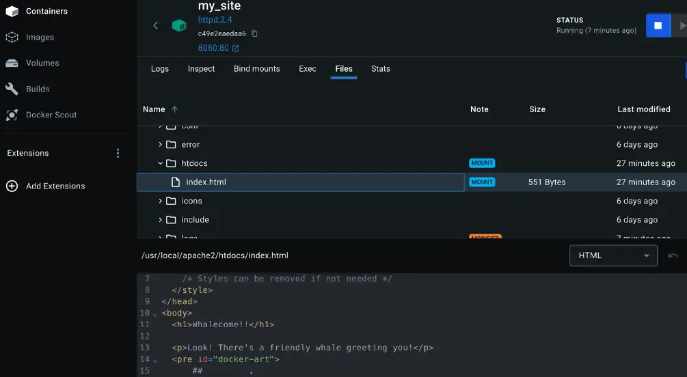
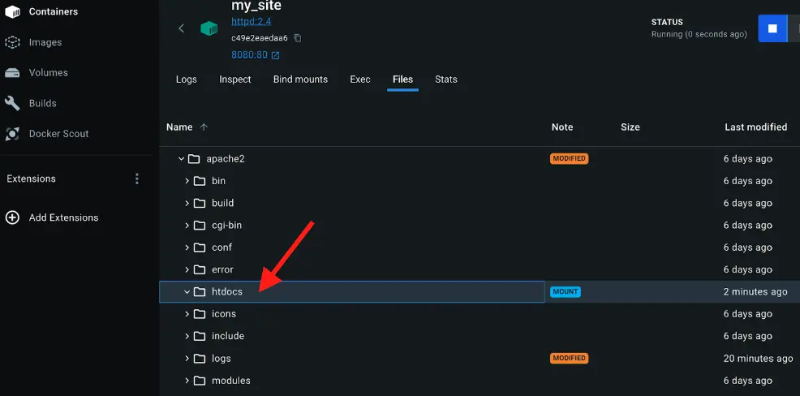
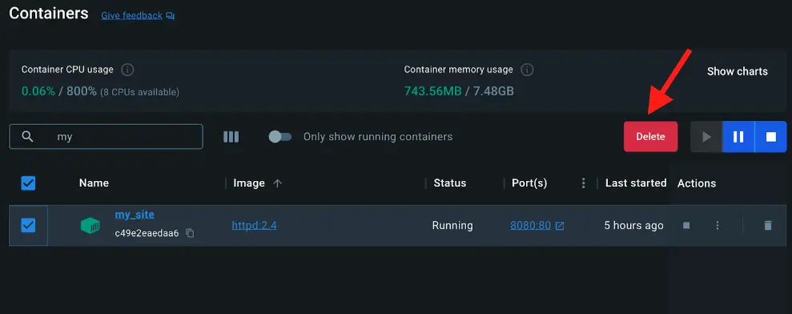

+++
title = "与容器共享本地文件"
date = 2024-10-23T14:54:35+08:00
weight = 30
type = "docs"
description = ""
isCJKLanguage = true
draft = false

+++

> 原文：[https://docs.docker.com/get-started/docker-concepts/running-containers/sharing-local-files/](https://docs.docker.com/get-started/docker-concepts/running-containers/sharing-local-files/)
>
> 收录该文档的时间：`2024-10-23T14:54:35+08:00`

# Sharing local files with containers - 与容器共享本地文件



## 说明 Explanation

Each container has everything it needs to function with no reliance on any pre-installed dependencies on the host machine. Since containers run in isolation, they have minimal influence on the host and other containers. This isolation has a major benefit: containers minimize conflicts with the host system and other containers. However, this isolation also means containers can't directly access data on the host machine by default.

​	每个容器都拥有运行所需的一切，且不依赖于主机上的任何预先安装的依赖项。由于容器是隔离运行的，它们对主机和其他容器的影响极小。这种隔离带来了重要的好处：容器能够最大程度地减少与主机系统和其他容器的冲突。然而，这种隔离也意味着默认情况下，容器无法直接访问主机上的数据。

Consider a scenario where you have a web application container that requires access to configuration settings stored in a file on your host system. This file may contain sensitive data such as database credentials or API keys. Storing such sensitive information directly within the container image poses security risks, especially during image sharing. To address this challenge, Docker offers storage options that bridge the gap between container isolation and your host machine's data.

​	假设您有一个需要访问主机系统上文件中配置设置的 web 应用容器。该文件可能包含数据库凭据或 API 密钥等敏感数据。将此类敏感信息直接存储在容器镜像中会带来安全风险，特别是在共享镜像时。为了解决这个问题，Docker 提供了在容器隔离和主机数据之间架起桥梁的存储选项。

Docker offers two primary storage options for persisting data and sharing files between the host machine and containers: volumes and bind mounts.

​	Docker 提供了两种主要的存储选项来持久化数据并在主机和容器之间共享文件：卷（volumes）和绑定挂载（bind mounts）。

### 卷和绑定挂载的区别 Volume versus bind mounts

If you want to ensure that data generated or modified inside the container persists even after the container stops running, you would opt for a volume. See [Persisting container data]() to learn more about volumes and their use cases.

​	如果您希望容器内部生成或修改的数据在容器停止后仍然保留，请选择使用卷。查看 [持久化容器数据]() 以了解卷及其使用场景。

If you have specific files or directories on your host system that you want to directly share with your container, like configuration files or development code, then you would use a bind mount. It's like opening a direct portal between your host and container for sharing. Bind mounts are ideal for development environments where real-time file access and sharing between the host and container are crucial.

​	如果您有特定的主机系统文件或目录需要直接与容器共享，例如配置文件或开发代码，则可以使用绑定挂载。这就像在主机和容器之间打开了一个直接的共享门户。绑定挂载非常适合需要主机和容器之间实时文件访问和共享的开发环境。

### 在主机和容器之间共享文件 Sharing files between a host and container

Both `-v` (or `--volume`) and `--mount` flags used with the `docker run` command let you share files or directories between your local machine (host) and a Docker container. However, there are some key differences in their behavior and usage.

​	在 `docker run` 命令中使用 `-v`（或 `--volume`）和 `--mount` 标志可以在本地计算机（主机）与 Docker 容器之间共享文件或目录。然而，它们在行为和用法上存在一些关键差异。

The `-v` flag is simpler and more convenient for basic volume or bind mount operations. If the host location doesn’t exist when using `-v` or `--volume`, a directory will be automatically created.

​	`-v` 标志操作更为简单，适合基本的卷或绑定挂载操作。如果使用 `-v` 或 `--volume` 时主机路径不存在，将自动创建一个目录。

Imagine you're a developer working on a project. You have a source directory on your development machine where your code resides. When you compile or build your code, the generated artifacts (compiled code, executables, images, etc.) are saved in a separate subdirectory within your source directory. In the following examples, this subdirectory is `/HOST/PATH`. Now you want these build artifacts to be accessible within a Docker container running your application. Additionally, you want the container to automatically access the latest build artifacts whenever you rebuild your code.

​	想象您是一名开发人员，在开发机器上有一个源代码目录。在编译或构建代码时，生成的构建成果（如编译后的代码、可执行文件、镜像等）会保存在源代码目录下的一个子目录中。在以下示例中，此子目录为 `/HOST/PATH`。现在您希望这些构建成果在运行应用程序的 Docker 容器中也能访问。此外，您希望容器在每次重新构建代码后都能自动访问最新的构建成果。

Here's a way to use `docker run` to start a container using a bind mount and map it to the container file location.

​	以下是使用 `docker run` 命令绑定挂载的方法，将其映射到容器的文件位置。

```console
$ docker run -v /HOST/PATH:/CONTAINER/PATH -it nginx
```

The `--mount` flag offers more advanced features and granular control, making it suitable for complex mount scenarios or production deployments. If you use `--mount` to bind-mount a file or directory that doesn't yet exist on the Docker host, the `docker run` command doesn't automatically create it for you but generates an error.

​	`--mount` 标志提供了更高级的功能和精细控制，适合复杂的挂载场景或生产环境部署。如果使用 `--mount` 来绑定挂载 Docker 主机上不存在的文件或目录，`docker run` 命令不会自动创建它，而是会生成错误。

```console
$ docker run --mount type=bind,source=/HOST/PATH,target=/CONTAINER/PATH,readonly nginx
```

> **Note**
>
> 
>
> Docker recommends using the `--mount` syntax instead of `-v`. It provides better control over the mounting process and avoids potential issues with missing directories.
>
> ​	Docker 推荐使用 `--mount` 语法，而不是 `-v`。它提供了更好的挂载过程控制，避免了因目录缺失而引发的问题。

### Docker 访问主机文件的文件权限 File permissions for Docker access to host files

When using bind mounts, it's crucial to ensure that Docker has the necessary permissions to access the host directory. To grant read/write access, you can use the `:ro` flag (read-only) or `:rw` (read-write) with the `-v` or `--mount` flag during container creation. For example, the following command grants read-write access permission.

​	在使用绑定挂载时，确保 Docker 具有访问主机目录的必要权限非常重要。您可以在创建容器时使用 `-v` 或 `--mount` 标志添加 `:ro`（只读）或 `:rw`（读写）标志来授予读写权限。例如，以下命令授予读写权限：

```console
$ docker run -v HOST-DIRECTORY:/CONTAINER-DIRECTORY:rw nginx
```

Read-only bind mounts let the container access the mounted files on the host for reading, but it can't change or delete the files. With read-write bind mounts, containers can modify or delete mounted files, and these changes or deletions will also be reflected on the host system. Read-only bind mounts ensures that files on the host can't be accidentally modified or deleted by a container.

​	只读绑定挂载允许容器访问主机上的挂载文件，但不能更改或删除文件。读写绑定挂载允许容器修改或删除挂载文件，这些更改或删除也会反映在主机系统中。只读绑定挂载可确保容器不会意外修改或删除主机上的文件。

> **Synchronised File Share 同步文件共享**
>
> As your codebase grows larger, traditional methods of file sharing like bind mounts may become inefficient or slow, especially in development environments where frequent access to files is necessary. [Synchronized file shares]() improve bind mount performance by leveraging synchronized filesystem caches. This optimization ensures that file access between the host and virtual machine (VM) is fast and efficient.
>
> ​	随着代码库的增长，传统的绑定挂载文件共享方法可能会变得低效或缓慢，尤其是在需要频繁访问文件的开发环境中。[同步文件共享]() 通过同步文件系统缓存来提升绑定挂载性能。这种优化确保主机和虚拟机（VM）之间的文件访问快速高效。

## 试试看 Try it out

In this hands-on guide, you’ll practice how to create and use a bind mount to share files between a host and a container.

​	在本操作指南中，您将练习如何创建和使用绑定挂载在主机和容器之间共享文件。

### 运行一个容器 Run a container

1. [Download and install]() Docker Desktop. [下载并安装]() Docker Desktop。

2. Start a container using the [httpd](https://hub.docker.com/_/httpd) image with the following command: 使用以下命令启动一个 [httpd](https://hub.docker.com/_/httpd) 镜像容器：

   

   ```console
   $ docker run -d -p 8080:80 --name my_site httpd:2.4
   ```

   This will start the `httpd` service in the background, and publish the webpage to port `8080` on the host.

   ​	这将在后台启动 `httpd` 服务，并将网页发布到主机的 `8080` 端口。

3. Open the browser and access [http://localhost:8080](http://localhost:8080/) or use the curl command to verify if it's working fine or not. 打开浏览器访问 [http://localhost:8080](http://localhost:8080/) 或使用 curl 命令验证是否正常运行：

   

   ```console
   $ curl localhost:8080
   ```

### 使用绑定挂载 Use a bind mount

Using a bind mount, you can map the configuration file on your host computer to a specific location within the container. In this example, you’ll see how to change the look and feel of the webpage by using bind mount:

​	使用绑定挂载，可以将主机计算机上的配置文件映射到容器中的特定位置。在此示例中，您将看到如何使用绑定挂载更改网页的外观和风格：

1. Delete the existing container by using the Docker Dashboard: 通过 Docker Dashboard 删除现有的容器：

   

2. Create a new directory called `public_html` on your host system. 在主机系统上创建一个名为 `public_html` 的新目录：

   

   ```console
   $ mkdir public_html
   ```

3. Change the directory to `public_html` and create a file called `index.html` with the following content. This is a basic HTML document that creates a simple webpage that welcomes you with a friendly whale. 将目录更改为 `public_html` 并创建一个名为 `index.html` 的文件，内容如下。这是一个基本的 HTML 文档，创建了一个简单的网页，欢迎您并展示一个友好的鲸鱼。

   

   ```html
   <!DOCTYPE html>
   <html lang="en">
   <head>
   <meta charset="UTF-8">
   <title> My Website with a Whale & Docker!</title>
   </head>
   <body>
   <h1>Whalecome!!</h1>
   <p>Look! There's a friendly whale greeting you!</p>
   <pre id="docker-art">
      ##         .
     ## ## ##        ==
    ## ## ## ## ##    ===
    /"""""""""""""""""\___/ ===
   {                       /  ===-
   \______ O           __/
   \    \         __/
    \____\_______/
   
   Hello from Docker!
   </pre>
   </body>
   </html>
   ```

4. It's time to run the container. The `--mount` and `-v` examples produce the same result. You can't run them both unless you remove the `my_site` container after running the first one. 现在启动容器。 `--mount` 和 `-v` 示例产生相同的结果。运行第一个示例后需要删除 `my_site` 容器后才能运行另一个示例。

   

   {}

   ```console
    docker run -d --name my_site -p 8080:80 -v .:/usr/local/apache2/htdocs/ httpd:2.4
   ```

   {}

   {}

   ```console
    docker run -d --name my_site -p 8080:80 --mount type=bind,source=./,target=/usr/local/apache2/htdocs/ httpd:2.4
   ```

   

   {}

   

   

   ------

   > **Tip**
   >
   > When using the `-v` or `--mount` flag in Windows PowerShell, you need to provide the absolute path to your directory instead of just `./`. This is because PowerShell handles relative paths differently from bash (commonly used in Mac and Linux environments).
   >
   > ​	在 Windows PowerShell 中使用 `-v` 或 `--mount` 标志时，需提供目录的绝对路径，而不是 `./`。这是因为 PowerShell 对相对路径的处理方式与 Mac 和 Linux 环境中的 bash 不同。
   
   With everything now up and running, you should be able to access the site via [http://localhost:8080](http://localhost:8080/) and find a new webpage that welcomes you with a friendly whale.
   
   ​	现在一切都已启动并运行，您可以通过 [http://localhost:8080](http://localhost:8080/) 访问该网站，看到一个欢迎您和友好鲸鱼的全新网页。

### 在 Docker Dashboard 上访问文件 Access the file on the Docker Dashboard

1. You can view the mounted files inside a container by selecting the container's **Files** tab and then selecting a file inside the `/usr/local/apache2/htdocs/` directory. Then, select **Open file editor**. 您可以通过选择容器的 **Files** 选项卡，然后选择 `/usr/local/apache2/htdocs/` 目录中的文件来查看容器内的挂载文件。接着，选择 **Open file editor**。

   

2. Delete the file on the host and verify the file is also deleted in the container. You will find that the files no longer exist under **Files** in the Docker Dashboard. 删除主机上的文件并验证容器中的文件也被删除。您会发现 Docker Dashboard 中 **Files** 选项卡下不再存在这些文件。

   

3. Recreate the HTML file on the host system and see that file re-appears under the **Files** tab under **Containers** on the Docker Dashboard. By now, you will be able to access the site too. 在主机系统上重新创建 HTML 文件，您会看到该文件重新出现在 Docker Dashboard 的 **Files** 选项卡下 **Containers** 中。此时，您也可以访问该网站。

### 停止容器 Stop your container

The container continues to run until you stop it.

​	容器会继续运行，直到您停止它。

1. Go to the **Containers** view in the Docker Dashboard. 在 Docker Dashboard 中转到 **Containers** 视图。
2. Locate the container you'd like to stop. 找到您要停止的容器。
3. Select the **Delete** action in the Actions column. 在操作列中选择 **Delete** 操作。



## 其他资源 Additional resources

The following resources will help you learn more about bind mounts:

​	以下资源将帮助您进一步了解绑定挂载：

- [Manage data in Docker 在 Docker 中管理数据](https://docs.docker.com/storage/)
- [Volumes 卷](https://docs.docker.com/storage/volumes/)
- [Bind mounts 绑定挂载](https://docs.docker.com/storage/bind-mounts/)
- [Running containers 运行容器](https://docs.docker.com/reference/run/)
- [Troubleshoot storage errors 存储错误排查](https://docs.docker.com/storage/troubleshooting_volume_errors/)
- [Persisting container data 持久化容器数据]()

## 接下来 Next steps

Now that you have learned about sharing local files with containers, it’s time to learn about multi-container applications.

​	现在您已经了解了如何与容器共享本地文件，接下来可以学习多容器应用程序。

[Multi-container applications  多容器应用程序]()
