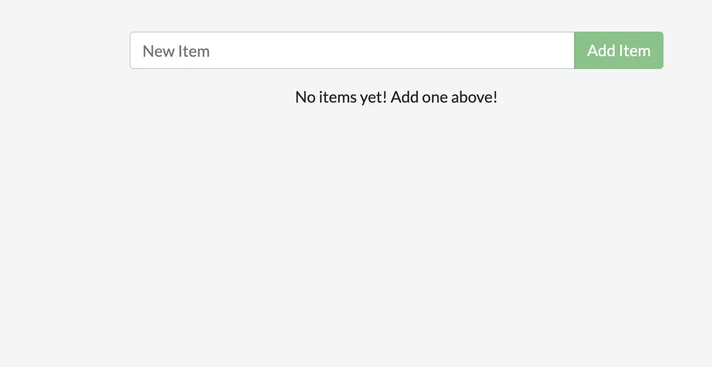
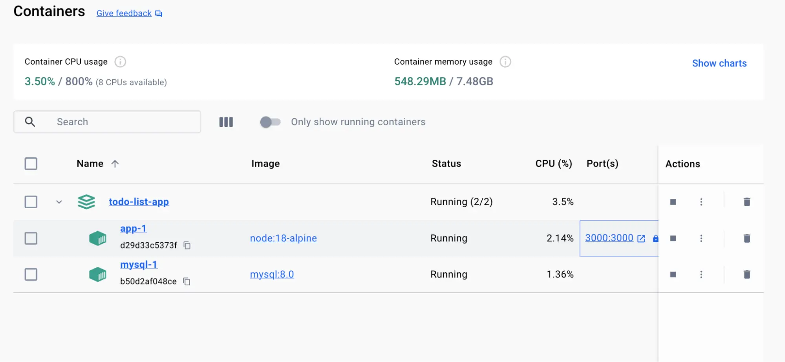
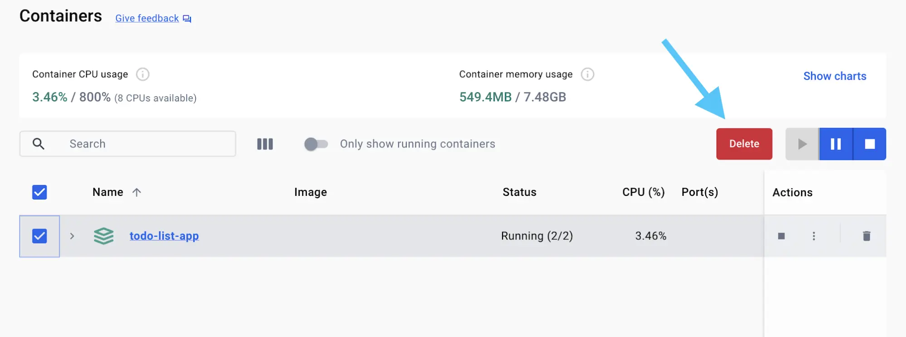

+++
title = "What is Docker Compose?"
date = 2024-10-23T14:54:35+08:00
weight = 30
type = "docs"
description = ""
isCJKLanguage = true
draft = false
+++

> 原文: [https://docs.docker.com/get-started/docker-concepts/the-basics/what-is-docker-compose/](https://docs.docker.com/get-started/docker-concepts/the-basics/what-is-docker-compose/)
>
> 收录该文档的时间：`2024-10-23T14:54:35+08:00`

# What is Docker Compose?

<iframe id="youtube-player-xhcUIK4fGtY" data-video-id="xhcUIK4fGtY" class="youtube-video aspect-video h-fit w-full py-2" frameborder="0" allowfullscreen="" allow="accelerometer; autoplay; clipboard-write; encrypted-media; gyroscope; picture-in-picture; web-share" referrerpolicy="strict-origin-when-cross-origin" title="Docker concepts - What is Docker Compose?" width="100%" height="100%" src="https://www.youtube.com/embed/xhcUIK4fGtY?rel=0&amp;iv_load_policy=3&amp;enablejsapi=1&amp;origin=https%3A%2F%2Fdocs.docker.com&amp;widgetid=1" data-gtm-yt-inspected-24="true" style="--tw-border-spacing-x: 0; --tw-border-spacing-y: 0; --tw-translate-x: 0; --tw-translate-y: 0; --tw-rotate: 0; --tw-skew-x: 0; --tw-skew-y: 0; --tw-scale-x: 1; --tw-scale-y: 1; --tw-pan-x: ; --tw-pan-y: ; --tw-pinch-zoom: ; --tw-scroll-snap-strictness: proximity; --tw-gradient-from-position: ; --tw-gradient-via-position: ; --tw-gradient-to-position: ; --tw-ordinal: ; --tw-slashed-zero: ; --tw-numeric-figure: ; --tw-numeric-spacing: ; --tw-numeric-fraction: ; --tw-ring-inset: ; --tw-ring-offset-width: 0px; --tw-ring-offset-color: #fff; --tw-ring-color: rgb(59 130 246 / 0.5); --tw-ring-offset-shadow: 0 0 #0000; --tw-ring-shadow: 0 0 #0000; --tw-shadow: 0 0 #0000; --tw-shadow-colored: 0 0 #0000; --tw-blur: ; --tw-brightness: ; --tw-contrast: ; --tw-grayscale: ; --tw-hue-rotate: ; --tw-invert: ; --tw-saturate: ; --tw-sepia: ; --tw-drop-shadow: ; --tw-backdrop-blur: ; --tw-backdrop-brightness: ; --tw-backdrop-contrast: ; --tw-backdrop-grayscale: ; --tw-backdrop-hue-rotate: ; --tw-backdrop-invert: ; --tw-backdrop-opacity: ; --tw-backdrop-saturate: ; --tw-backdrop-sepia: ; --tw-contain-size: ; --tw-contain-layout: ; --tw-contain-paint: ; --tw-contain-style: ; box-sizing: border-box; border-width: 0px; border-style: solid; border-color: initial; display: block; vertical-align: middle; aspect-ratio: 16 / 9; height: fit-content; width: 634.672px; padding-top: 0.5rem; padding-bottom: 0.5rem; color: rgb(0, 0, 0); font-family: &quot;Roboto Flex&quot;, system-ui, -apple-system, BlinkMacSystemFont, &quot;Segoe UI&quot;, Oxygen, Ubuntu, Cantarell, &quot;Open Sans&quot;, &quot;Helvetica Neue&quot;, sans-serif; font-size: 16px; font-style: normal; font-variant-ligatures: normal; font-variant-caps: normal; font-weight: 400; letter-spacing: normal; orphans: 2; text-align: start; text-indent: 0px; text-transform: none; widows: 2; word-spacing: 0px; -webkit-text-stroke-width: 0px; white-space: normal; background-color: rgb(255, 255, 255); text-decoration-thickness: initial; text-decoration-style: initial; text-decoration-color: initial;"></iframe>

## [Explanation](https://docs.docker.com/get-started/docker-concepts/the-basics/what-is-docker-compose/#explanation)

If you've been following the guides so far, you've been working with single container applications. But, now you're wanting to do something more complicated - run databases, message queues, caches, or a variety of other services. Do you install everything in a single container? Run multiple containers? If you run multiple, how do you connect them all together?

One best practice for containers is that each container should do one thing and do it well. While there are exceptions to this rule, avoid the tendency to have one container do multiple things.

You can use multiple `docker run` commands to start multiple containers. But, you'll soon realize you'll need to manage networks, all of the flags needed to connect containers to those networks, and more. And when you're done, cleanup is a little more complicated.

With Docker Compose, you can define all of your containers and their configurations in a single YAML file. If you include this file in your code repository, anyone that clones your repository can get up and running with a single command.

It's important to understand that Compose is a declarative tool - you simply define it and go. You don't always need to recreate everything from scratch. If you make a change, run `docker compose up` again and Compose will reconcile the changes in your file and apply them intelligently.

> **Dockerfile versus Compose file**
>
> A Dockerfile provides instructions to build a container image while a Compose file defines your running containers. Quite often, a Compose file references a Dockerfile to build an image to use for a particular service.

## [Try it out](https://docs.docker.com/get-started/docker-concepts/the-basics/what-is-docker-compose/#try-it-out)

In this hands-on, you will learn how to use a Docker Compose to run a multi-container application. You'll use a simple to-do list app built with Node.js and MySQL as a database server.

### [Start the application](https://docs.docker.com/get-started/docker-concepts/the-basics/what-is-docker-compose/#start-the-application)

Follow the instructions to run the to-do list app on your system.

1. [Download and install](https://www.docker.com/products/docker-desktop/) Docker Desktop.

2. Open a terminal and [clone this sample application](https://github.com/dockersamples/todo-list-app).

   

   ```console
   git clone https://github.com/dockersamples/todo-list-app 
   ```

3. Navigate into the `todo-list-app` directory:

   

   ```console
   cd todo-list-app
   ```

   Inside this directory, you'll find a file named `compose.yaml`. This YAML file is where all the magic happens! It defines all the services that make up your application, along with their configurations. Each service specifies its image, ports, volumes, networks, and any other settings necessary for its functionality. Take some time to explore the YAML file and familiarize yourself with its structure.

4. Use the [`docker compose up`](https://docs.docker.com/reference/cli/docker/compose/up/) command to start the application:

   

   ```console
   docker compose up -d --build
   ```

   When you run this command, you should see an output like this:

   

   ```console
   [+] Running 4/4
   ✔ app 3 layers [⣿⣿⣿]      0B/0B            Pulled           7.1s
     ✔ e6f4e57cc59e Download complete                          0.9s
     ✔ df998480d81d Download complete                          1.0s
     ✔ 31e174fedd23 Download complete                          2.5s
   [+] Running 2/4
     ⠸ Network todo-list-app_default           Created         0.3s
     ⠸ Volume "todo-list-app_todo-mysql-data"  Created         0.3s
     ✔ Container todo-list-app-app-1           Started         0.3s
     ✔ Container todo-list-app-mysql-1         Started         0.3s
   ```

   A lot happened here! A couple of things to call out:

   - Two container images were downloaded from Docker Hub - node and MySQL
   - A network was created for your application
   - A volume was created to persist the database files between container restarts
   - Two containers were started with all of their necessary config

   If this feels overwhelming, don't worry! You'll get there!

5. With everything now up and running, you can open [http://localhost:3000](http://localhost:3000/) in your browser to see the site. Feel free to add items to the list, check them off, and remove them.

   

6. If you look at the Docker Desktop GUI, you can see the containers and dive deeper into their configuration.

   

### [Tear it down](https://docs.docker.com/get-started/docker-concepts/the-basics/what-is-docker-compose/#tear-it-down)

Since this application was started using Docker Compose, it's easy to tear it all down when you're done.

1. In the CLI, use the [`docker compose down`](https://docs.docker.com/reference/cli/docker/compose/down/) command to remove everything:

   

   ```console
   docker compose down
   ```

   You'll see output similar to the following:

   

   ```console
   [+] Running 2/2
   ✔ Container todo-list-app-mysql-1  Removed        2.9s
   ✔ Container todo-list-app-app-1    Removed        0.1s
   ✔ Network todo-list-app_default    Removed        0.1s
   ```

   > **Volume persistence**
   >
   > By default, volumes *aren't* automatically removed when you tear down a Compose stack. The idea is that you might want the data back if you start the stack again.
   >
   > If you do want to remove the volumes, add the `--volumes` flag when running the `docker compose down` command:
   >
   > 
   >
   > ```console
   > docker compose down --volumes
   > ```

2. Alternatively, you can use the Docker Desktop GUI to remove the containers by selecting the application stack and selecting the **Delete** button.

   

   > **Using the GUI for Compose stacks**
   >
   > Note that if you remove the containers for a Compose app in the GUI, it's removing only the containers. You'll have to manually remove the network and volumes if you want to do so.

In this walkthrough, you learned how to use Docker Compose to start and stop a multi-container application.

## [Additional resources](https://docs.docker.com/get-started/docker-concepts/the-basics/what-is-docker-compose/#additional-resources)

This page was a brief introduction to Compose. In the following resources, you can dive deeper into Compose and how to write Compose files.

- [Overview of Docker Compose](https://docs.docker.com/compose/)
- [Overview of Docker Compose CLI](https://docs.docker.com/compose/reference/)
- [How Compose works](https://docs.docker.com/compose/intro/compose-application-model/)
