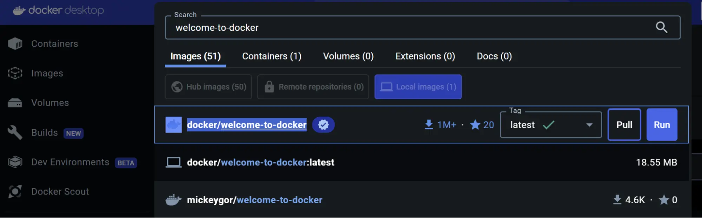
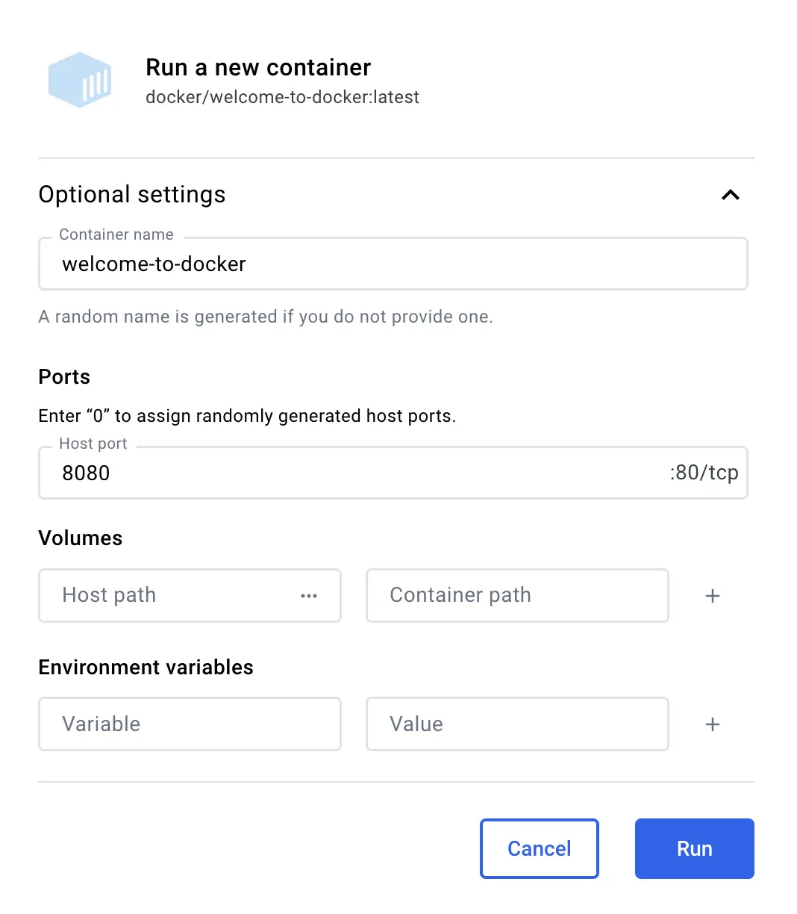
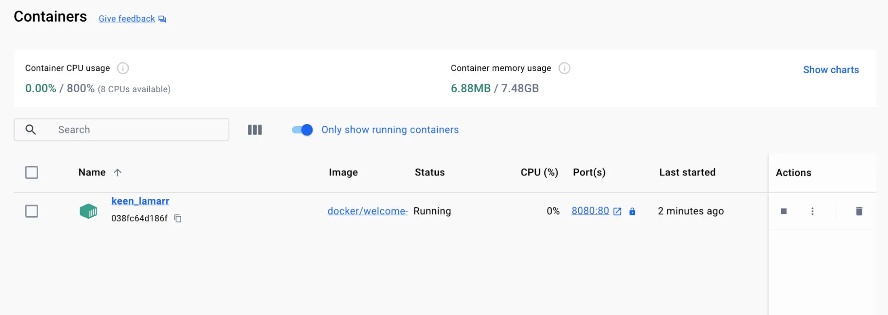
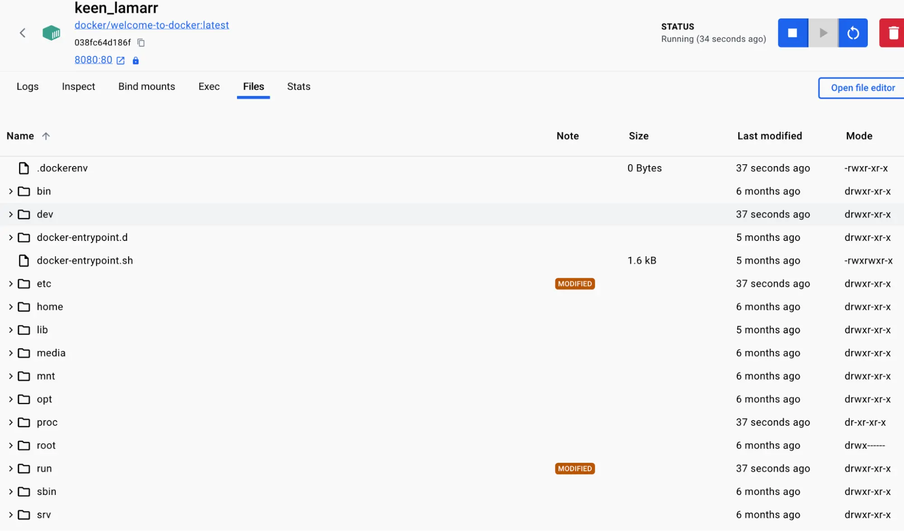
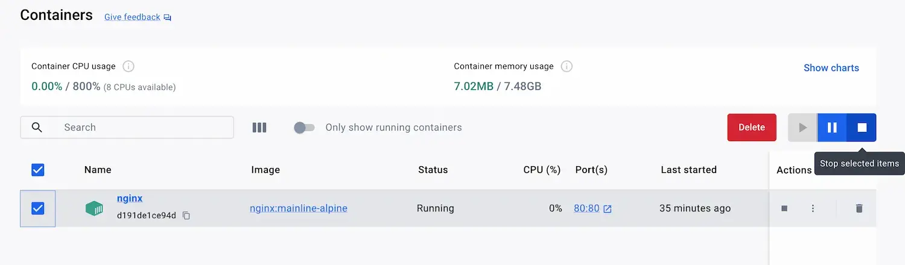

+++
title = "What is a container?"
date = 2024-10-23T14:54:35+08:00
weight = 1
type = "docs"
description = ""
isCJKLanguage = true
draft = false
+++

> 原文: [https://docs.docker.com/get-started/docker-concepts/the-basics/what-is-a-container/](https://docs.docker.com/get-started/docker-concepts/the-basics/what-is-a-container/)
>
> 收录该文档的时间：`2024-10-23T14:54:35+08:00`

# What is a container?

<iframe id="youtube-player-W1kWqFkiu7k" data-video-id="W1kWqFkiu7k" class="youtube-video aspect-video h-fit w-full py-2" frameborder="0" allowfullscreen="" allow="accelerometer; autoplay; clipboard-write; encrypted-media; gyroscope; picture-in-picture; web-share" referrerpolicy="strict-origin-when-cross-origin" title="Docker concepts - What is a container?" width="100%" height="100%" src="https://www.youtube.com/embed/W1kWqFkiu7k?rel=0&amp;iv_load_policy=3&amp;enablejsapi=1&amp;origin=https%3A%2F%2Fdocs.docker.com&amp;widgetid=1" data-gtm-yt-inspected-21="true" style="--tw-border-spacing-x: 0; --tw-border-spacing-y: 0; --tw-translate-x: 0; --tw-translate-y: 0; --tw-rotate: 0; --tw-skew-x: 0; --tw-skew-y: 0; --tw-scale-x: 1; --tw-scale-y: 1; --tw-pan-x: ; --tw-pan-y: ; --tw-pinch-zoom: ; --tw-scroll-snap-strictness: proximity; --tw-gradient-from-position: ; --tw-gradient-via-position: ; --tw-gradient-to-position: ; --tw-ordinal: ; --tw-slashed-zero: ; --tw-numeric-figure: ; --tw-numeric-spacing: ; --tw-numeric-fraction: ; --tw-ring-inset: ; --tw-ring-offset-width: 0px; --tw-ring-offset-color: #fff; --tw-ring-color: rgb(59 130 246 / 0.5); --tw-ring-offset-shadow: 0 0 #0000; --tw-ring-shadow: 0 0 #0000; --tw-shadow: 0 0 #0000; --tw-shadow-colored: 0 0 #0000; --tw-blur: ; --tw-brightness: ; --tw-contrast: ; --tw-grayscale: ; --tw-hue-rotate: ; --tw-invert: ; --tw-saturate: ; --tw-sepia: ; --tw-drop-shadow: ; --tw-backdrop-blur: ; --tw-backdrop-brightness: ; --tw-backdrop-contrast: ; --tw-backdrop-grayscale: ; --tw-backdrop-hue-rotate: ; --tw-backdrop-invert: ; --tw-backdrop-opacity: ; --tw-backdrop-saturate: ; --tw-backdrop-sepia: ; --tw-contain-size: ; --tw-contain-layout: ; --tw-contain-paint: ; --tw-contain-style: ; box-sizing: border-box; border-width: 0px; border-style: solid; border-color: initial; display: block; vertical-align: middle; aspect-ratio: 16 / 9; height: fit-content; width: 634.672px; padding-top: 0.5rem; padding-bottom: 0.5rem; color: rgb(0, 0, 0); font-family: &quot;Roboto Flex&quot;, system-ui, -apple-system, BlinkMacSystemFont, &quot;Segoe UI&quot;, Oxygen, Ubuntu, Cantarell, &quot;Open Sans&quot;, &quot;Helvetica Neue&quot;, sans-serif; font-size: 16px; font-style: normal; font-variant-ligatures: normal; font-variant-caps: normal; font-weight: 400; letter-spacing: normal; orphans: 2; text-align: start; text-indent: 0px; text-transform: none; widows: 2; word-spacing: 0px; -webkit-text-stroke-width: 0px; white-space: normal; background-color: rgb(255, 255, 255); text-decoration-thickness: initial; text-decoration-style: initial; text-decoration-color: initial;"></iframe>

## [Explanation](https://docs.docker.com/get-started/docker-concepts/the-basics/what-is-a-container/#explanation)

Imagine you're developing a killer web app that has three main components - a React frontend, a Python API, and a PostgreSQL database. If you wanted to work on this project, you'd have to install Node, Python, and PostgreSQL.

How do you make sure you have the same versions as the other developers on your team? Or your CI/CD system? Or what's used in production?

How do you ensure the version of Python (or Node or the database) your app needs isn't affected by what's already on your machine? How do you manage potential conflicts?

Enter containers!

What is a container? Simply put, containers are isolated processes for each of your app's components. Each component - the frontend React app, the Python API engine, and the database - runs in its own isolated environment, completely isolated from everything else on your machine.

Here's what makes them awesome. Containers are:

- Self-contained. Each container has everything it needs to function with no reliance on any pre-installed dependencies on the host machine.
- Isolated. Since containers are run in isolation, they have minimal influence on the host and other containers, increasing the security of your applications.
- Independent. Each container is independently managed. Deleting one container won't affect any others.
- Portable. Containers can run anywhere! The container that runs on your development machine will work the same way in a data center or anywhere in the cloud!

### [Containers versus virtual machines (VMs)](https://docs.docker.com/get-started/docker-concepts/the-basics/what-is-a-container/#containers-versus-virtual-machines-vms)

Without getting too deep, a VM is an entire operating system with its own kernel, hardware drivers, programs, and applications. Spinning up a VM only to isolate a single application is a lot of overhead.

A container is simply an isolated process with all of the files it needs to run. If you run multiple containers, they all share the same kernel, allowing you to run more applications on less infrastructure.

> **Using VMs and containers together**
>
> Quite often, you will see containers and VMs used together. As an example, in a cloud environment, the provisioned machines are typically VMs. However, instead of provisioning one machine to run one application, a VM with a container runtime can run multiple containerized applications, increasing resource utilization and reducing costs.

## [Try it out](https://docs.docker.com/get-started/docker-concepts/the-basics/what-is-a-container/#try-it-out)

In this hands-on, you will see how to run a Docker container using the Docker Desktop GUI.

Using the GUI Using the CLI

------

Use the following instructions to run a container.

1. Open Docker Desktop and select the **Search** field on the top navigation bar.

2. Specify `welcome-to-docker` in the search input and then select the **Pull** button.

   

3. Once the image is successfully pulled, select the **Run** button.

4. Expand the **Optional settings**.

5. In the **Container name**, specify `welcome-to-docker`.

6. In the **Host port**, specify `8080`.

   

7. Select **Run** to start your container.

Congratulations! You just ran your first container! 🎉

### [View your container](https://docs.docker.com/get-started/docker-concepts/the-basics/what-is-a-container/#view-your-container)

You can view all of your containers by going to the **Containers** view of the Docker Dashboard.

This container runs a web server that displays a simple website. When working with more complex projects, you'll run different parts in different containers. For example, you might run a different container for the frontend, backend, and database.

### [Access the frontend](https://docs.docker.com/get-started/docker-concepts/the-basics/what-is-a-container/#access-the-frontend)

When you launched the container, you exposed one of the container's ports onto your machine. Think of this as creating configuration to let you to connect through the isolated environment of the container.

For this container, the frontend is accessible on port `8080`. To open the website, select the link in the **Port(s)** column of your container or visit [http://localhost:8080](https://localhost:8080/) in your browser.

### [Explore your container](https://docs.docker.com/get-started/docker-concepts/the-basics/what-is-a-container/#explore-your-container)

Docker Desktop lets you explore and interact with different aspects of your container. Try it out yourself.

1. Go to the **Containers** view in the Docker Dashboard.

2. Select your container.

3. Select the **Files** tab to explore your container's isolated file system.

   

### [Stop your container](https://docs.docker.com/get-started/docker-concepts/the-basics/what-is-a-container/#stop-your-container)

The `docker/welcome-to-docker` container continues to run until you stop it.

1. Go to the **Containers** view in the Docker Dashboard.

2. Locate the container you'd like to stop.

3. Select the **Stop** action in the **Actions** column.

   

------

## [Additional resources](https://docs.docker.com/get-started/docker-concepts/the-basics/what-is-a-container/#additional-resources)

The following links provide additional guidance into containers:

- [Running a container](https://docs.docker.com/engine/containers/run/)
- [Overview of container](https://www.docker.com/resources/what-container/)
- [Why Docker?](https://www.docker.com/why-docker/)

## [Next steps](https://docs.docker.com/get-started/docker-concepts/the-basics/what-is-a-container/#next-steps)

Now that you have learned the basics of a Docker container, it's time to learn about Docker images.

[What is an image?](https://docs.docker.com/get-started/docker-concepts/the-basics/what-is-an-image/)
