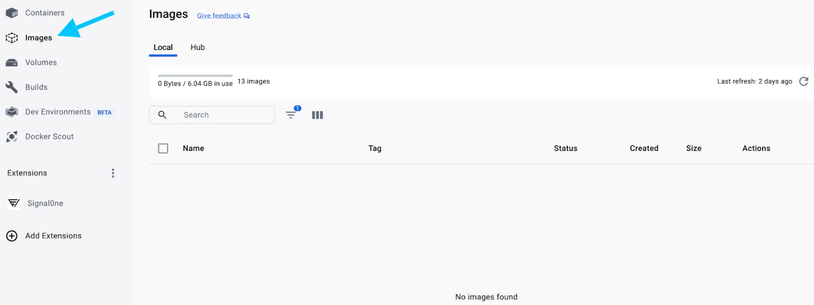
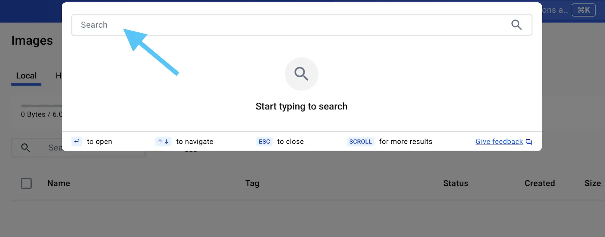
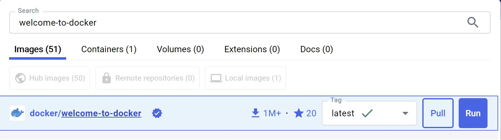
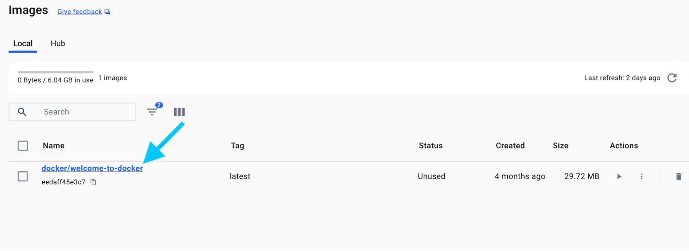
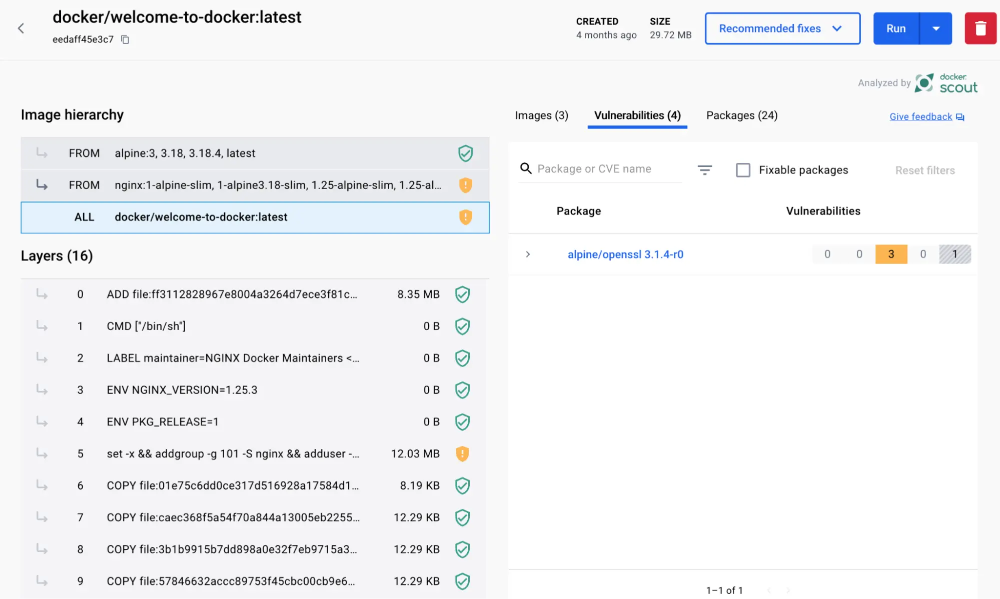

+++
title = "What is an image?"
date = 2024-10-23T14:54:35+08:00
weight = 10
type = "docs"
description = ""
isCJKLanguage = true
draft = false
+++

> 原文：[https://docs.docker.com/get-started/docker-concepts/the-basics/what-is-an-image/](https://docs.docker.com/get-started/docker-concepts/the-basics/what-is-an-image/)
>
> 收录该文档的时间：`2024-10-23T14:54:35+08:00`

# What is an image?

<iframe id="youtube-player-NyvT9REqLe4" data-video-id="NyvT9REqLe4" class="youtube-video aspect-video h-fit w-full py-2" frameborder="0" allowfullscreen="" allow="accelerometer; autoplay; clipboard-write; encrypted-media; gyroscope; picture-in-picture; web-share" referrerpolicy="strict-origin-when-cross-origin" title="Docker concepts - What is an image?" width="100%" height="100%" src="https://www.youtube.com/embed/NyvT9REqLe4?rel=0&amp;iv_load_policy=3&amp;enablejsapi=1&amp;origin=https%3A%2F%2Fdocs.docker.com&amp;widgetid=1" data-gtm-yt-inspected-24="true" style="--tw-border-spacing-x: 0; --tw-border-spacing-y: 0; --tw-translate-x: 0; --tw-translate-y: 0; --tw-rotate: 0; --tw-skew-x: 0; --tw-skew-y: 0; --tw-scale-x: 1; --tw-scale-y: 1; --tw-pan-x: ; --tw-pan-y: ; --tw-pinch-zoom: ; --tw-scroll-snap-strictness: proximity; --tw-gradient-from-position: ; --tw-gradient-via-position: ; --tw-gradient-to-position: ; --tw-ordinal: ; --tw-slashed-zero: ; --tw-numeric-figure: ; --tw-numeric-spacing: ; --tw-numeric-fraction: ; --tw-ring-inset: ; --tw-ring-offset-width: 0px; --tw-ring-offset-color: #fff; --tw-ring-color: rgb(59 130 246 / 0.5); --tw-ring-offset-shadow: 0 0 #0000; --tw-ring-shadow: 0 0 #0000; --tw-shadow: 0 0 #0000; --tw-shadow-colored: 0 0 #0000; --tw-blur: ; --tw-brightness: ; --tw-contrast: ; --tw-grayscale: ; --tw-hue-rotate: ; --tw-invert: ; --tw-saturate: ; --tw-sepia: ; --tw-drop-shadow: ; --tw-backdrop-blur: ; --tw-backdrop-brightness: ; --tw-backdrop-contrast: ; --tw-backdrop-grayscale: ; --tw-backdrop-hue-rotate: ; --tw-backdrop-invert: ; --tw-backdrop-opacity: ; --tw-backdrop-saturate: ; --tw-backdrop-sepia: ; --tw-contain-size: ; --tw-contain-layout: ; --tw-contain-paint: ; --tw-contain-style: ; box-sizing: border-box; border-width: 0px; border-style: solid; border-color: initial; display: block; vertical-align: middle; aspect-ratio: 16 / 9; height: fit-content; width: 634.672px; padding-top: 0.5rem; padding-bottom: 0.5rem; color: rgb(0, 0, 0); font-family: &quot;Roboto Flex&quot;, system-ui, -apple-system, BlinkMacSystemFont, &quot;Segoe UI&quot;, Oxygen, Ubuntu, Cantarell, &quot;Open Sans&quot;, &quot;Helvetica Neue&quot;, sans-serif; font-size: 16px; font-style: normal; font-variant-ligatures: normal; font-variant-caps: normal; font-weight: 400; letter-spacing: normal; orphans: 2; text-align: start; text-indent: 0px; text-transform: none; widows: 2; word-spacing: 0px; -webkit-text-stroke-width: 0px; white-space: normal; background-color: rgb(255, 255, 255); text-decoration-thickness: initial; text-decoration-style: initial; text-decoration-color: initial;"></iframe>

## Explanation

Seeing a [container]() is an isolated process, where does it get its files and configuration? How do you share those environments?

That's where container images come in!

A container image is a standardized package that includes all of the files, binaries, libraries, and configurations to run a container.

For a [PostgreSQL](https://hub.docker.com/_/postgres) image, that image will package the database binaries, config files, and other dependencies. For a Python web app, it'll include the Python runtime, your app code, and all of its dependencies.

There are two important principles of images:

1. Images are immutable. Once an image is created, it can't be modified. You can only make a new image or add changes on top of it.
2. Container images are composed of layers. Each layer represented a set of file system changes that add, remove, or modify files.

These two principles let you to extend or add to existing images. For example, if you are building a Python app, you can start from the [Python image](https://hub.docker.com/_/python) and add additional layers to install your app's dependencies and add your code. This lets you focus on your app, rather than Python itself.

### Finding images

[Docker Hub](https://hub.docker.com/) is the default global marketplace for storing and distributing images. It has over 100,000 images created by developers that you can run locally. You can search for Docker Hub images and run them directly from Docker Desktop.

Docker Hub provides a variety of Docker-supported and endorsed images known as Docker Trusted Content. These provide fully managed services or great starters for your own images. These include:

- [Docker Official Images](https://hub.docker.com/search?q=&type=image&image_filter=official) - a curated set of Docker repositories, serve as the starting point for the majority of users, and are some of the most secure on Docker Hub
- [Docker Verified Publishers](https://hub.docker.com/search?q=&image_filter=store) - high-quality images from commercial publishers verified by Docker
- [Docker-Sponsored Open Source](https://hub.docker.com/search?q=&image_filter=open_source) - images published and maintained by open-source projects sponsored by Docker through Docker's open source program

For example, [Redis](https://hub.docker.com/_/redis) and [Memcached](https://hub.docker.com/_/memcached) are a few popular ready-to-go Docker Official Images. You can download these images and have these services up and running in a matter of seconds. There are also base images, like the [Node.js](https://hub.docker.com/_/node) Docker image, that you can use as a starting point and add your own files and configurations.

## Try it out



{}

In this hands-on, you will learn how to search and pull a container image using the Docker Desktop GUI.

### Search for and download an image

1. Open the Docker Dashboard and select the **Images** view in the left-hand navigation menu.

   

2. Select the **Search images to run** button. If you don't see it, select the *global search bar* at the top of the screen.

   

3. In the **Search** field, enter "welcome-to-docker". Once the search has completed, select the `docker/welcome-to-docker` image.

   

4. Select **Pull** to download the image.

{}

{}

Follow the instructions to search and pull a Docker image using CLI to view its layers.

### Search for and download an image

1. Open a terminal and search for images using the [`docker search`]() command:

   

   ```console
   docker search docker/welcome-to-docker
   ```

   You will see output like the following:

   

   ```console
   NAME                       DESCRIPTION                                     STARS     OFFICIAL
   docker/welcome-to-docker   Docker image for new users getting started w…   20
   ```

   This output shows you information about relevant images available on Docker Hub.

2. Pull the image using the [`docker pull`]() command.

   

   ```console
   docker pull docker/welcome-to-docker
   ```

   You will see output like the following:

   

   ```console
   Using default tag: latest
   latest: Pulling from docker/welcome-to-docker
   579b34f0a95b: Download complete
   d11a451e6399: Download complete
   1c2214f9937c: Download complete
   b42a2f288f4d: Download complete
   54b19e12c655: Download complete
   1fb28e078240: Download complete
   94be7e780731: Download complete
   89578ce72c35: Download complete
   Digest: sha256:eedaff45e3c78538087bdd9dc7afafac7e110061bbdd836af4104b10f10ab693
   Status: Downloaded newer image for docker/welcome-to-docker:latest
   docker.io/docker/welcome-to-docker:latest
   ```

   Each of line represents a different downloaded layer of the image. Remember that each layer is a set of filesystem changes and provides functionality of the image.

{}



### Learn about the image

Once you have an image downloaded, you can learn quite a few details about the image either through the GUI or the CLI.

1. In the Docker Dashboard, select the **Images** view.

2. Select the **docker/welcome-to-docker** image to open details about the image.

   

3. The image details page presents you with information regarding the layers of the image, the packages and libraries installed in the image, and any discovered vulnerabilities.

   

------

In this walkthrough, you searched and pulled a Docker image. In addition to pulling a Docker image, you also learned about the layers of a Docker Image.

## Additional resources

The following resources will help you learn more about exploring, finding, and building images:

- Docker Trusted Content
  - [Docker Official Images docs]()
  - [Docker Verified Publisher docs]()
  - [Docker-Sponsored Open Source Program docs]()
- [Explore the Image view in Docker Desktop]()
- [Packaging your software](https://docs.docker.com/build/building/packaging/)
- [Docker Hub](https://hub.docker.com/)

## Next steps

Now that you have learned the basics of images, it's time to learn about distributing images through registries.

[What is a registry?]()
