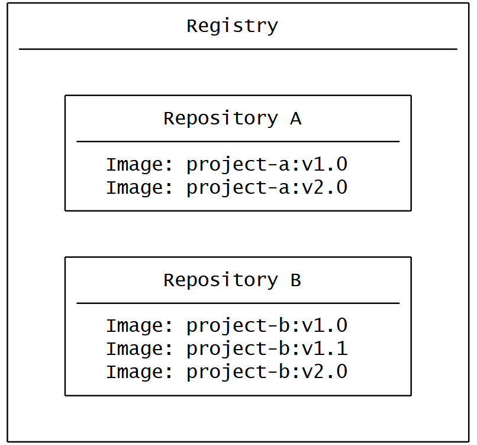

+++
title = "什么是注册表？"
date = 2024-10-23T14:54:35+08:00
weight = 20
type = "docs"
description = ""
isCJKLanguage = true
draft = false

+++

> 原文：[https://docs.docker.com/get-started/docker-concepts/the-basics/what-is-a-registry/](https://docs.docker.com/get-started/docker-concepts/the-basics/what-is-a-registry/)
>
> 收录该文档的时间：`2024-10-23T14:54:35+08:00`

# What is a registry? - 什么是注册表？



## 说明 Explanation

Now that you know what a container image is and how it works, you might wonder - where do you store these images?

​	现在您已经了解了什么是容器镜像及其工作原理，您可能会想——这些镜像存储在哪里呢？

Well, you can store your container images on your computer system, but what if you want to share them with your friends or use them on another machine? That's where the image registry comes in.

​	当然，您可以将容器镜像存储在本地计算机系统上，但如果您想与朋友分享它们，或者在另一台机器上使用它们呢？这就是镜像注册表的作用。

An image registry is a centralized location for storing and sharing your container images. It can be either public or private. [Docker Hub](https://hub.docker.com/) is a public registry that anyone can use and is the default registry.

​	镜像注册表是一个集中存储和共享容器镜像的位置。它可以是公共的或私有的。[Docker Hub](https://hub.docker.com/) 是一个公共注册表，任何人都可以使用，它也是默认的镜像注册表。

While Docker Hub is a popular option, there are many other available container registries available today, including [Amazon Elastic Container Registry(ECR)](https://aws.amazon.com/ecr/), [Azure Container Registry (ACR)](https://azure.microsoft.com/en-in/products/container-registry), and [Google Container Registry (GCR)](https://cloud.google.com/artifact-registry). You can even run your private registry on your local system or inside your organization. For example, Harbor, JFrog Artifactory, GitLab Container registry etc.

​	虽然 Docker Hub 是一个非常流行的选择，但现在还有许多其他可用的容器注册表，包括 [Amazon Elastic Container Registry (ECR)](https://aws.amazon.com/ecr/)、[Azure Container Registry (ACR)](https://azure.microsoft.com/en-in/products/container-registry) 和 [Google Container Registry (GCR)](https://cloud.google.com/artifact-registry)。您甚至可以在本地系统或组织内部运行私有注册表，例如 Harbor、JFrog Artifactory、GitLab 容器注册表等。

### 注册表与仓库 Registry vs. repository

While you're working with registries, you might hear the terms *registry* and *repository* as if they're interchangeable. Even though they're related, they're not quite the same thing.

​	当您使用注册表时，可能会听到 *注册表* 和 *仓库* 这两个术语，似乎可以互换使用。尽管它们相关，但它们并不完全相同。

A *registry* is a centralized location that stores and manages container images, whereas a *repository* is a collection of related container images within a registry. Think of it as a folder where you organize your images based on projects. Each repository contains one or more container images.

​	*注册表* 是一个集中存储和管理容器镜像的地方，而 *仓库* 是注册表中的相关容器镜像集合。可以将其视为用于根据项目组织镜像的文件夹。每个仓库包含一个或多个容器镜像。

The following diagram shows the relationship between a registry, repositories, and images.

​	下图显示了注册表、仓库和镜像之间的关系。



> **Note**
>
> You can create one private repository and unlimited public repositories using the free version of Docker Hub. For more information, visit the [Docker Hub subscription page](https://www.docker.com/pricing/).
>
> ​	使用 Docker Hub 免费版，您可以创建一个私有仓库和无限制的公共仓库。更多信息，请访问 [Docker Hub 订阅页面](https://www.docker.com/pricing/)。

## 试试看 Try it out

In this hands-on, you will learn how to build and push a Docker image to the Docker Hub repository.

​	在本次动手操作中，您将学习如何构建并将 Docker 镜像推送到 Docker Hub 仓库。

### 注册免费 Docker 账户 Sign up for a free Docker account

1. If you haven't created one yet, head over to the [Docker Hub](https://hub.docker.com/) page to sign up for a new Docker account. 如果您还没有创建 Docker 账户，请前往 [Docker Hub](https://hub.docker.com/) 页面注册一个新的 Docker 账户。

   

   You can use your Google or GitHub account to authenticate.
   
   您可以使用 Google 或 GitHub 账户进行身份验证。

### 创建您的第一个仓库 Create your first repository

1. Sign in to [Docker Hub](https://hub.docker.com/). 登录 [Docker Hub](https://hub.docker.com/)。

2. Select the **Create repository** button in the top-right corner. 在右上角选择 **创建仓库** 按钮。

3. Select your namespace (most likely your username) and enter `docker-quickstart` as the repository name. 选择您的命名空间（通常是您的用户名），并输入 `docker-quickstart` 作为仓库名称。

   

4. Set the visibility to **Public**. 将可见性设置为 **公开**。

5. Select the **Create** button to create the repository. 选择 **创建** 按钮来创建仓库。

That's it. You've successfully created your first repository. 🎉

​	完成了，您已经成功创建了您的第一个仓库。🎉

This repository is empty right now. You'll now fix this by pushing an image to it.

​	现在这个仓库是空的，接下来您将通过推送镜像来填充它。

### 使用 Docker Desktop 登录 Sign in with Docker Desktop

1. [Download and install](https://www.docker.com/products/docker-desktop/) Docker Desktop, if not already installed. 如果尚未安装，请[下载并安装](https://www.docker.com/products/docker-desktop/) Docker Desktop。
2. In the Docker Desktop GUI, select the **Sign in** button in the top-right corner 
3. 在 Docker Desktop 图形界面中，选择右上角的 **登录** 按钮。

### 克隆示例 Node.js 代码 Clone sample Node.js code

In order to create an image, you first need a project. To get you started quickly, you'll use a sample Node.js project found at [github.com/dockersamples/helloworld-demo-node](https://github.com/dockersamples/helloworld-demo-node). This repository contains a pre-built Dockerfile necessary for building a Docker image.

​	为了创建镜像，您首先需要一个项目。为方便快速入门，您将使用 [github.com/dockersamples/helloworld-demo-node](https://github.com/dockersamples/helloworld-demo-node) 中的示例 Node.js 项目。该仓库包含构建 Docker 镜像所需的预构建 Dockerfile。

Don't worry about the specifics of the Dockerfile, as you'll learn about that in later sections.

​	不用担心 Dockerfile 的具体内容，稍后您会学到更多。

1. Clone the GitHub repository using the following command: 使用以下命令克隆 GitHub 仓库：不用担心 Dockerfile 的具体内容，稍后您会学到更多。

   

   ```console
   git clone https://github.com/dockersamples/helloworld-demo-node
   ```

2. Navigate into the newly created directory. 进入新创建的目录。

   

   ```console
   cd helloworld-demo-node
   ```

3. Run the following command to build a Docker image, swapping out `YOUR_DOCKER_USERNAME` with your username. 运行以下命令构建 Docker 镜像，将 `YOUR_DOCKER_USERNAME` 替换为您的用户名。

   

   ```console
   docker build -t YOUR_DOCKER_USERNAME/docker-quickstart .
   ```

   > **Note**
   >
   > Make sure you include the dot (.) at the end of the `docker build` command. This tells Docker where to find the Dockerfile.
   >
   > ​	确保在 `docker build` 命令的末尾包含点（.），这告诉 Docker 在哪里查找 Dockerfile。

4. Run the following command to list the newly created Docker image: 运行以下命令列出新创建的 Docker 镜像：

   

   ```console
   docker images
   ```

   You will see output like the following: 您将看到类似以下的输出：

   

   ```console
   REPOSITORY                                 TAG       IMAGE ID       CREATED         SIZE
   YOUR_DOCKER_USERNAME/docker-quickstart   latest    476de364f70e   2 minutes ago   170MB
   ```

5. Start a container to test the image by running the following command (swap out the username with your own username): 运行以下命令启动容器以测试镜像（将用户名替换为您的用户名）：

   

   ```console
   docker run -d -p 8080:8080 YOUR_DOCKER_USERNAME/docker-quickstart 
   ```

   You can verify if the container is working by visiting [http://localhost:8080](http://localhost:8080/) with your browser. 您可以通过浏览器访问 [http://localhost:8080](http://localhost:8080/) 来验证容器是否正常运行。

6. Use the [`docker tag`]() command to tag the Docker image. Docker tags allow you to label and version your images.使用 [`docker tag`]() 命令为 Docker 镜像打标签。Docker 标签允许您对镜像进行标记和版本控制。

   

   ```console
   docker tag YOUR_DOCKER_USERNAME/docker-quickstart YOUR_DOCKER_USERNAME/docker-quickstart:1.0 
   ```

7. Finally, it's time to push the newly built image to your Docker Hub repository by using the [`docker push`]() command: 最后，使用 [`docker push`]() 命令将新构建的镜像推送到 Docker Hub 仓库：

   

   ```console
   docker push YOUR_DOCKER_USERNAME/docker-quickstart:1.0
   ```

8. Open [Docker Hub](https://hub.docker.com/) and navigate to your repository. Navigate to the **Tags** section and see your newly pushed image. 打开 [Docker Hub](https://hub.docker.com/) 并进入您的仓库。导航到 **标签** 部分，查看您刚刚推送的镜像。

   

In this walkthrough, you signed up for a Docker account, created your first Docker Hub repository, and built, tagged, and pushed a container image to your Docker Hub repository.

​	在本次操作中，您注册了一个 Docker 账户，创建了您的第一个 Docker Hub 仓库，并将容器镜像构建、打标签并推送到您的 Docker Hub 仓库。

## 其他资源 Additional resources

- [Docker Hub Quickstart]() [Docker Hub 快速入门]()
- [Manage Docker Hub Repositories]() [管理 Docker Hub 仓库]()

## 接下来 Next steps

Now that you understand the basics of containers and images, you're ready to learn about Docker Compose.

​	现在您已经了解了容器和镜像的基础知识，是时候学习 Docker Compose 了。

[What is Docker Compose?]()
