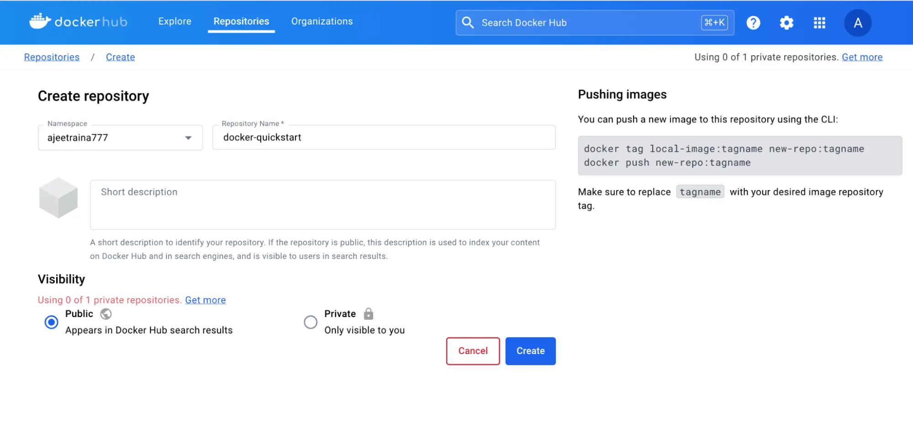
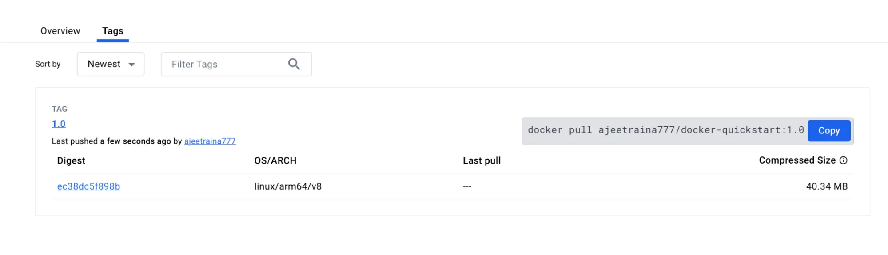

+++
title = "What is a registry?"
date = 2024-10-23T14:54:35+08:00
weight = 20
type = "docs"
description = ""
isCJKLanguage = true
draft = false
+++

> 原文：[https://docs.docker.com/get-started/docker-concepts/the-basics/what-is-a-registry/](https://docs.docker.com/get-started/docker-concepts/the-basics/what-is-a-registry/)
>
> 收录该文档的时间：`2024-10-23T14:54:35+08:00`

# What is a registry?

<iframe id="youtube-player-2WDl10Wv5rs" data-video-id="2WDl10Wv5rs" class="youtube-video aspect-video h-fit w-full py-2" frameborder="0" allowfullscreen="" allow="accelerometer; autoplay; clipboard-write; encrypted-media; gyroscope; picture-in-picture; web-share" referrerpolicy="strict-origin-when-cross-origin" title="Docker concepts - What is a registry?" width="100%" height="100%" src="https://www.youtube.com/embed/2WDl10Wv5rs?rel=0&amp;iv_load_policy=3&amp;enablejsapi=1&amp;origin=https%3A%2F%2Fdocs.docker.com&amp;widgetid=1" data-gtm-yt-inspected-28="true" style="--tw-border-spacing-x: 0; --tw-border-spacing-y: 0; --tw-translate-x: 0; --tw-translate-y: 0; --tw-rotate: 0; --tw-skew-x: 0; --tw-skew-y: 0; --tw-scale-x: 1; --tw-scale-y: 1; --tw-pan-x: ; --tw-pan-y: ; --tw-pinch-zoom: ; --tw-scroll-snap-strictness: proximity; --tw-gradient-from-position: ; --tw-gradient-via-position: ; --tw-gradient-to-position: ; --tw-ordinal: ; --tw-slashed-zero: ; --tw-numeric-figure: ; --tw-numeric-spacing: ; --tw-numeric-fraction: ; --tw-ring-inset: ; --tw-ring-offset-width: 0px; --tw-ring-offset-color: #fff; --tw-ring-color: rgb(59 130 246 / 0.5); --tw-ring-offset-shadow: 0 0 #0000; --tw-ring-shadow: 0 0 #0000; --tw-shadow: 0 0 #0000; --tw-shadow-colored: 0 0 #0000; --tw-blur: ; --tw-brightness: ; --tw-contrast: ; --tw-grayscale: ; --tw-hue-rotate: ; --tw-invert: ; --tw-saturate: ; --tw-sepia: ; --tw-drop-shadow: ; --tw-backdrop-blur: ; --tw-backdrop-brightness: ; --tw-backdrop-contrast: ; --tw-backdrop-grayscale: ; --tw-backdrop-hue-rotate: ; --tw-backdrop-invert: ; --tw-backdrop-opacity: ; --tw-backdrop-saturate: ; --tw-backdrop-sepia: ; --tw-contain-size: ; --tw-contain-layout: ; --tw-contain-paint: ; --tw-contain-style: ; box-sizing: border-box; border-width: 0px; border-style: solid; border-color: initial; display: block; vertical-align: middle; aspect-ratio: 16 / 9; height: fit-content; width: 634.672px; padding-top: 0.5rem; padding-bottom: 0.5rem; color: rgb(0, 0, 0); font-family: &quot;Roboto Flex&quot;, system-ui, -apple-system, BlinkMacSystemFont, &quot;Segoe UI&quot;, Oxygen, Ubuntu, Cantarell, &quot;Open Sans&quot;, &quot;Helvetica Neue&quot;, sans-serif; font-size: 16px; font-style: normal; font-variant-ligatures: normal; font-variant-caps: normal; font-weight: 400; letter-spacing: normal; orphans: 2; text-align: start; text-indent: 0px; text-transform: none; widows: 2; word-spacing: 0px; -webkit-text-stroke-width: 0px; white-space: normal; background-color: rgb(255, 255, 255); text-decoration-thickness: initial; text-decoration-style: initial; text-decoration-color: initial;"></iframe>

## Explanation

Now that you know what a container image is and how it works, you might wonder - where do you store these images?

Well, you can store your container images on your computer system, but what if you want to share them with your friends or use them on another machine? That's where the image registry comes in.

An image registry is a centralized location for storing and sharing your container images. It can be either public or private. [Docker Hub](https://hub.docker.com/) is a public registry that anyone can use and is the default registry.

While Docker Hub is a popular option, there are many other available container registries available today, including [Amazon Elastic Container Registry(ECR)](https://aws.amazon.com/ecr/), [Azure Container Registry (ACR)](https://azure.microsoft.com/en-in/products/container-registry), and [Google Container Registry (GCR)](https://cloud.google.com/artifact-registry). You can even run your private registry on your local system or inside your organization. For example, Harbor, JFrog Artifactory, GitLab Container registry etc.

### Registry vs. repository

While you're working with registries, you might hear the terms *registry* and *repository* as if they're interchangeable. Even though they're related, they're not quite the same thing.

A *registry* is a centralized location that stores and manages container images, whereas a *repository* is a collection of related container images within a registry. Think of it as a folder where you organize your images based on projects. Each repository contains one or more container images.

The following diagram shows the relationship between a registry, repositories, and images.

IIIIImmmmmaaaaagggggeeeeeR::R:::eeRpppppppeorrorrrgsoosoooiijjijjjsteeteeetoccocccrrttrtttyy--y---aabbbA::B:::vvvvv12112.....00010

> **Note**
>
> You can create one private repository and unlimited public repositories using the free version of Docker Hub. For more information, visit the [Docker Hub subscription page](https://www.docker.com/pricing/).

## Try it out

In this hands-on, you will learn how to build and push a Docker image to the Docker Hub repository.

### Sign up for a free Docker account

1. If you haven't created one yet, head over to the [Docker Hub](https://hub.docker.com/) page to sign up for a new Docker account.

   

   You can use your Google or GitHub account to authenticate.

### Create your first repository

1. Sign in to [Docker Hub](https://hub.docker.com/).

2. Select the **Create repository** button in the top-right corner.

3. Select your namespace (most likely your username) and enter `docker-quickstart` as the repository name.

   

4. Set the visibility to **Public**.

5. Select the **Create** button to create the repository.

That's it. You've successfully created your first repository. 🎉

This repository is empty right now. You'll now fix this by pushing an image to it.

### Sign in with Docker Desktop

1. [Download and install](https://www.docker.com/products/docker-desktop/) Docker Desktop, if not already installed.
2. In the Docker Desktop GUI, select the **Sign in** button in the top-right corner

### Clone sample Node.js code

In order to create an image, you first need a project. To get you started quickly, you'll use a sample Node.js project found at [github.com/dockersamples/helloworld-demo-node](https://github.com/dockersamples/helloworld-demo-node). This repository contains a pre-built Dockerfile necessary for building a Docker image.

Don't worry about the specifics of the Dockerfile, as you'll learn about that in later sections.

1. Clone the GitHub repository using the following command:

   

   ```console
   git clone https://github.com/dockersamples/helloworld-demo-node
   ```

2. Navigate into the newly created directory.

   

   ```console
   cd helloworld-demo-node
   ```

3. Run the following command to build a Docker image, swapping out `YOUR_DOCKER_USERNAME` with your username.

   

   ```console
   docker build -t YOUR_DOCKER_USERNAME/docker-quickstart .
   ```

   > **Note**
   >
   > Make sure you include the dot (.) at the end of the `docker build` command. This tells Docker where to find the Dockerfile.

4. Run the following command to list the newly created Docker image:

   

   ```console
   docker images
   ```

   You will see output like the following:

   

   ```console
   REPOSITORY                                 TAG       IMAGE ID       CREATED         SIZE
   YOUR_DOCKER_USERNAME/docker-quickstart   latest    476de364f70e   2 minutes ago   170MB
   ```

5. Start a container to test the image by running the following command (swap out the username with your own username):

   

   ```console
   docker run -d -p 8080:8080 YOUR_DOCKER_USERNAME/docker-quickstart 
   ```

   You can verify if the container is working by visiting [http://localhost:8080](http://localhost:8080/) with your browser.

6. Use the [`docker tag`]() command to tag the Docker image. Docker tags allow you to label and version your images.

   

   ```console
   docker tag YOUR_DOCKER_USERNAME/docker-quickstart YOUR_DOCKER_USERNAME/docker-quickstart:1.0 
   ```

7. Finally, it's time to push the newly built image to your Docker Hub repository by using the [`docker push`]() command:

   

   ```console
   docker push YOUR_DOCKER_USERNAME/docker-quickstart:1.0
   ```

8. Open [Docker Hub](https://hub.docker.com/) and navigate to your repository. Navigate to the **Tags** section and see your newly pushed image.

   

In this walkthrough, you signed up for a Docker account, created your first Docker Hub repository, and built, tagged, and pushed a container image to your Docker Hub repository.

## Additional resources

- [Docker Hub Quickstart]()
- [Manage Docker Hub Repositories]()

## Next steps

Now that you understand the basics of containers and images, you're ready to learn about Docker Compose.

[What is Docker Compose?]()
