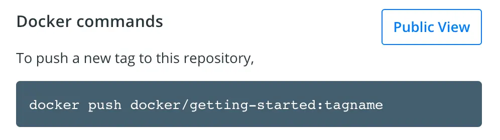
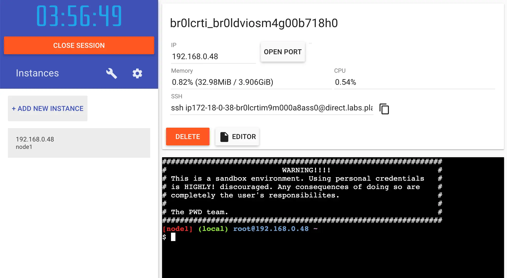

+++
title = "Part 3: 共享应用程序"
date = 2024-10-23T14:54:35+08:00
weight = 20
type = "docs"
description = ""
isCJKLanguage = true
draft = false

+++

> 原文：[https://docs.docker.com/get-started/workshop/04_sharing_app/](https://docs.docker.com/get-started/workshop/04_sharing_app/)
>
> 收录该文档的时间：`2024-10-23T14:54:35+08:00`

# Share the application - 共享应用程序

Now that you've built an image, you can share it. To share Docker images, you have to use a Docker registry. The default registry is Docker Hub and is where all of the images you've used have come from.

​	现在你已经构建了镜像，可以将其分享出去。要分享 Docker 镜像，你需要使用 Docker Registry。默认的注册表是 Docker Hub，也是你之前使用的所有镜像来源。

> **Docker ID**
>
> A Docker ID lets you access Docker Hub, which is the world's largest library and community for container images. Create a [Docker ID](https://hub.docker.com/signup) for free if you don't have one.
>
> ​	Docker ID 让你能够访问 Docker Hub，Docker Hub 是世界上最大的容器镜像库和社区。如果你还没有 Docker ID，可以免费创建一个 [Docker ID](https://hub.docker.com/signup)。

## 创建一个仓库 Create a repository

To push an image, you first need to create a repository on Docker Hub.

​	要推送镜像，首先需要在 Docker Hub 上创建一个仓库。

1. [Sign up](https://www.docker.com/pricing?utm_source=docker&utm_medium=webreferral&utm_campaign=docs_driven_upgrade) or Sign in to [Docker Hub](https://hub.docker.com/). [注册](https://www.docker.com/pricing?utm_source=docker&utm_medium=webreferral&utm_campaign=docs_driven_upgrade) 或登录 [Docker Hub](https://hub.docker.com/)。
2. Select the **Create Repository** button. 选择 **Create Repository** 按钮。
3. For the repository name, use `getting-started`. Make sure the **Visibility** is **Public**. 在仓库名称中使用 `getting-started`。确保 **Visibility（可见性）** 设置为 **Public（公开）**。
4. Select **Create**. 选择 **Create**。

In the following image, you can see an example Docker command from Docker Hub. This command will push to this repository.

​	下图展示了一个 Docker Hub 中的示例 Docker 命令，这个命令将把镜像推送到该仓库。



## 推送镜像 Push the image

1. In the command line, run the `docker push` command that you see on Docker Hub. Note that your command will have your Docker ID, not "docker". For example, `docker push YOUR-USER-NAME/getting-started`. 在命令行中运行 Docker Hub 中显示的 `docker push` 命令。注意，你的命令中将包含你的 Docker ID，而不是 "docker"。例如，`docker push YOUR-USER-NAME/getting-started`。

   

   ```console
   $ docker push docker/getting-started
   The push refers to repository [docker.io/docker/getting-started]
   An image does not exist locally with the tag: docker/getting-started
   ```

   Why did it fail? The push command was looking for an image named `docker/getting-started`, but didn't find one. If you run `docker image ls`, you won't see one either.

   ​	为什么会失败？`push` 命令正在寻找名为 `docker/getting-started` 的镜像，但没有找到。如果你运行 `docker image ls`，你也不会看到该镜像。

   To fix this, you need to tag your existing image you've built to give it another name.

   ​	为了解决这个问题，你需要对现有的镜像进行标记，给它一个新名称。

2. Sign in to Docker Hub using the command `docker login -u YOUR-USER-NAME`. 使用 `docker login -u YOUR-USER-NAME` 命令登录 Docker Hub。

3. Use the `docker tag` command to give the `getting-started` image a new name. Replace `YOUR-USER-NAME` with your Docker ID. 使用 `docker tag` 命令为 `getting-started` 镜像添加一个新名称。将 `YOUR-USER-NAME` 替换为你的 Docker ID。

   

   ```console
   $ docker tag getting-started YOUR-USER-NAME/getting-started
   ```

4. Now run the `docker push` command again. If you're copying the value from Docker Hub, you can drop the `tagname` part, as you didn't add a tag to the image name. If you don't specify a tag, Docker uses a tag called `latest`. 现在再次运行 `docker push` 命令。如果你从 Docker Hub 复制值，你可以省略 `tagname` 部分，因为你没有为镜像名称添加标签。如果不指定标签，Docker 会使用 `latest` 标签。

   

   ```console
   $ docker push YOUR-USER-NAME/getting-started
   ```

## 在新实例上运行镜像 Run the image on a new instance

Now that your image has been built and pushed into a registry, try running your app on a brand new instance that has never seen this container image. To do this, you will use Play with Docker.

​	现在你的镜像已经构建并推送到了注册表，可以在一个全新的实例上运行你的应用程序，该实例以前从未见过此容器镜像。为此，你将使用 Play with Docker。

> **Note**
>
> 
>
> Play with Docker uses the amd64 platform. If you are using an ARM based Mac with Apple silicon, you will need to rebuild the image to be compatible with Play with Docker and push the new image to your repository.
>
> ​	Play with Docker 使用 amd64 平台。如果你使用的是基于 ARM 的 Apple Silicon Mac，你需要重新构建镜像以兼容 Play with Docker，并将新镜像推送到你的仓库。
>
> To build an image for the amd64 platform, use the `--platform` flag.
>
> ​	要为 amd64 平台构建镜像，请使用 `--platform` 标志。
>
> ```console
> $ docker build --platform linux/amd64 -t YOUR-USER-NAME/getting-started .
> ```
>
> Docker buildx also supports building multi-platform images. To learn more, see [Multi-platform images]().
>
> ​	Docker buildx 还支持构建多平台镜像。要了解更多信息，请参阅 [多平台镜像]()。

1. Open your browser to [Play with Docker](https://labs.play-with-docker.com/). 打开浏览器，访问 [Play with Docker](https://labs.play-with-docker.com/)。

2. Select **Login** and then select **docker** from the drop-down list. 选择 **Login**，然后从下拉列表中选择 **docker**。

3. Sign in with your Docker Hub account and then select **Start**. 使用你的 Docker Hub 账户登录，然后选择 **Start**。

4. Select the **ADD NEW INSTANCE** option on the left side bar. If you don't see it, make your browser a little wider. After a few seconds, a terminal window opens in your browser. 在左侧边栏选择 **ADD NEW INSTANCE** 选项。如果你没有看到它，请将浏览器窗口稍微调宽。几秒钟后，一个终端窗口将在你的浏览器中打开。

   

5. In the terminal, start your freshly pushed app. 在终端中启动你刚刚推送的应用程序。

   

   ```console
   $ docker run -dp 0.0.0.0:3000:3000 YOUR-USER-NAME/getting-started
   ```

   You should see the image get pulled down and eventually start up.

   ​	你应该看到镜像被拉取下来，并最终启动。

   > **Tip**
   >
   > 
   >
   > You may have noticed that this command binds the port mapping to a different IP address. Previous `docker run` commands published ports to `127.0.0.1:3000` on the host. This time, you're using `0.0.0.0`.
   >
   > ​	你可能注意到这个命令将端口映射绑定到不同的 IP 地址。之前的 `docker run` 命令将端口发布到主机的 `127.0.0.1:3000`。这次你使用的是 `0.0.0.0`。
   >
   > Binding to `127.0.0.1` only exposes a container's ports to the loopback interface. Binding to `0.0.0.0`, however, exposes the container's port on all interfaces of the host, making it available to the outside world.
   >
   > ​	绑定到 `127.0.0.1` 只会将容器的端口暴露给环回接口。而绑定到 `0.0.0.0` 会将容器的端口暴露给主机的所有接口，使其可以被外界访问。
   >
   > For more information about how port mapping works, see [Networking](https://docs.docker.com/engine/network/#published-ports).
   >
   > ​	要了解更多关于端口映射的工作原理，请参阅 [网络](https://docs.docker.com/engine/network/#published-ports)。

6. Select the 3000 badge when it appears. 当 3000 端口徽章出现时，点击它。

   If the 3000 badge doesn't appear, you can select **Open Port** and specify `3000`.
   
   ​	如果 3000 端口徽章没有出现，你可以选择 **Open Port** 并指定 `3000`。

## 总结 Summary

In this section, you learned how to share your images by pushing them to a registry. You then went to a brand new instance and were able to run the freshly pushed image. This is quite common in CI pipelines, where the pipeline will create the image and push it to a registry and then the production environment can use the latest version of the image.

​	在本节中，你学习了如何通过将镜像推送到注册表来共享它们。然后，你在一个全新的实例上运行了刚刚推送的镜像。这在 CI 流水线中很常见，流水线会创建镜像并将其推送到注册表，生产环境随后可以使用最新版本的镜像。

Related information: 相关信息：

- [docker CLI reference]() - [docker CLI 参考]()
- [Multi-platform images]() - [多平台镜像]()
- [Docker Hub overview]() - [Docker Hub 概述]()

## 接下来 Next steps

In the next section, you'll learn how to persist data in your containerized application.

​	在下一节中，你将学习如何在容器化应用程序中持久化数据。

[Persist the DB]() - [持久化数据库]()
