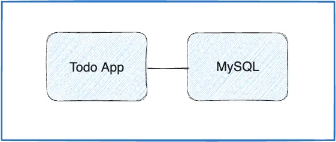

+++
title = "Part 6: 多容器应用"
date = 2024-10-23T14:54:35+08:00
weight = 50
type = "docs"
description = ""
isCJKLanguage = true
draft = false

+++

> 原文：[https://docs.docker.com/get-started/workshop/07_multi_container/](https://docs.docker.com/get-started/workshop/07_multi_container/)
>
> 收录该文档的时间：`2024-10-23T14:54:35+08:00`

# Multi container apps - 多容器应用

Up to this point, you've been working with single container apps. But, now you will add MySQL to the application stack. The following question often arises - "Where will MySQL run? Install it in the same container or run it separately?" In general, each container should do one thing and do it well. The following are a few reasons to run the container separately:

​	到目前为止，你一直在使用单容器应用程序。现在，你将向应用程序栈中添加 MySQL。经常会出现以下问题 - “MySQL 应该在哪里运行？安装在同一个容器中还是单独运行？”通常，每个容器应只执行一个特定任务并将其做好。以下是将容器分开运行的几个原因：

- There's a good chance you'd have to scale APIs and front-ends differently than databases. 前端和 API 可能需要与数据库不同的扩展方式。

- Separate containers let you version and update versions in isolation. 独立的容器让你可以单独更新和管理版本。
- While you may use a container for the database locally, you may want to use a managed service for the database in production. You don't want to ship your database engine with your app then. 本地开发可以使用容器化的数据库，而生产环境中可能希望使用托管服务，这样就不需要随应用一起打包数据库引擎。
- Running multiple processes will require a process manager (the container only starts one process), which adds complexity to container startup/shutdown. 运行多个进程需要一个进程管理器（容器通常只启动一个进程），这会增加容器启动和关闭的复杂性。

And there are more reasons. So, like the following diagram, it's best to run your app in multiple containers.

​	因此，如下图所示，将应用程序运行在多个容器中是最佳实践。



## 容器网络 Container networking

Remember that containers, by default, run in isolation and don't know anything about other processes or containers on the same machine. So, how do you allow one container to talk to another? The answer is networking. If you place the two containers on the same network, they can talk to each other.

​	记住，默认情况下，容器是独立运行的，彼此之间并不了解。所以，如何让一个容器与另一个容器通信呢？答案是网络。如果将两个容器放在同一个网络中，它们就可以相互通信。

## 启动 MySQL Start MySQL

There are two ways to put a container on a network:

​	将容器连接到网络有两种方法：

- Assign the network when starting the container. 在启动容器时指定网络。

- Connect an already running container to a network. 将已运行的容器连接到网络。

In the following steps, you'll create the network first and then attach the MySQL container at startup.

​	以下步骤中，你将先创建网络，然后在启动时将 MySQL 容器附加到该网络。

1. Create the network. 创建网络。

   

   ```console
   $ docker network create todo-app
   ```

2. Start a MySQL container and attach it to the network. You're also going to define a few environment variables that the database will use to initialize the database. To learn more about the MySQL environment variables, see the "Environment Variables" section in the [MySQL Docker Hub listing](https://hub.docker.com/_/mysql/). 启动 MySQL 容器并将其连接到网络。你还需要定义几个环境变量，数据库将使用这些变量初始化数据库。想了解更多关于 MySQL 环境变量的信息，请查看 [MySQL Docker Hub 页面](https://hub.docker.com/_/mysql/)的“环境变量”部分。

   

   {}

   ```console
    docker run -d \
       --network todo-app --network-alias mysql \
       -v todo-mysql-data:/var/lib/mysql \
       -e MYSQL_ROOT_PASSWORD=secret \
       -e MYSQL_DATABASE=todos \
       mysql:8.0
   ```

   {}

   {}

   ```powershell
   $ docker run -d `
       --network todo-app --network-alias mysql `
       -v todo-mysql-data:/var/lib/mysql `
       -e MYSQL_ROOT_PASSWORD=secret `
       -e MYSQL_DATABASE=todos `
       mysql:8.0
   ```

   {}

   {}

   ```console
    docker run -d ^
       --network todo-app --network-alias mysql ^
       -v todo-mysql-data:/var/lib/mysql ^
       -e MYSQL_ROOT_PASSWORD=secret ^
       -e MYSQL_DATABASE=todos ^
       mysql:8.0
   ```

   {}

   

   

   ------

   In the previous command, you can see the `--network-alias` flag. In a later section, you'll learn more about this flag.

   ​	在前面的命令中，你可以看到 `--network-alias` 标志。在后面的部分中，你将深入了解这个标志的作用。

   > **Tip**
   >
   > 
   >
   > You'll notice a volume named `todo-mysql-data` in the above command that is mounted at `/var/lib/mysql`, which is where MySQL stores its data. However, you never ran a `docker volume create` command. Docker recognizes you want to use a named volume and creates one automatically for you.
   >
   > ​	你会注意到上述命令中 `todo-mysql-data` 卷被挂载到 `/var/lib/mysql`，这是 MySQL 存储数据的位置。即使没有运行 `docker volume create` 命令，Docker 也会自动为你创建一个命名卷。

3. To confirm you have the database up and running, connect to the database and verify that it connects. 要确认数据库已启动并正在运行，可以连接到数据库并验证其连接性。

   

   ```console
   $ docker exec -it <mysql-container-id> mysql -u root -p
   ```

   When the password prompt comes up, type in `secret`. In the MySQL shell, list the databases and verify you see the `todos` database.

   ​	当出现密码提示时，输入 `secret`。在 MySQL shell 中，列出数据库并确认你可以看到 `todos` 数据库。

   

   ```console
   mysql> SHOW DATABASES;
   ```

   You should see output that looks like this:

   ​	你应该看到类似如下的输出：

   ```plaintext
   +--------------------+
   | Database           |
   +--------------------+
   | information_schema |
   | mysql              |
   | performance_schema |
   | sys                |
   | todos              |
   +--------------------+
   5 rows in set (0.00 sec)
   ```

4. Exit the MySQL shell to return to the shell on your machine. 退出 MySQL shell 以返回机器上的 shell。

   

   ```console
   mysql> exit
   ```

   You now have a `todos` database and it's ready for you to use.
   
   ​	现在，你已拥有一个 `todos` 数据库，可以开始使用它。

## 连接到 MySQL - Connect to MySQL

Now that you know MySQL is up and running, you can use it. But, how do you use it? If you run another container on the same network, how do you find the container? Remember that each container has its own IP address.

​	现在你知道 MySQL 已经在运行，可以开始使用它了。那么如何使用它？如果在同一网络上运行另一个容器，如何找到该容器？请记住，每个容器都有其自己的 IP 地址。

To answer the questions above and better understand container networking, you're going to make use of the [nicolaka/netshoot](https://github.com/nicolaka/netshoot) container, which ships with a lot of tools that are useful for troubleshooting or debugging networking issues.

​	为了回答以上问题并更好地理解容器网络，你将使用 [nicolaka/netshoot](https://github.com/nicolaka/netshoot) 容器，其中包含许多适用于故障排除或调试网络问题的工具。

1. Start a new container using the nicolaka/netshoot image. Make sure to connect it to the same network. 使用 nicolaka/netshoot 镜像启动新容器。确保将其连接到相同的网络。

   

   ```console
   $ docker run -it --network todo-app nicolaka/netshoot
   ```

2. Inside the container, you're going to use the `dig` command, which is a useful DNS tool. You're going to look up the IP address for the hostname `mysql`. 在容器内，你将使用 `dig` 命令，这是一个有用的 DNS 工具。你将查询主机名 `mysql` 的 IP 地址。

   

   ```console
   $ dig mysql
   ```

   You should get output like the following.

   你应该得到类似以下的输出。

   ```text
   ; <<>> DiG 9.18.8 <<>> mysql
   ;; global options: +cmd
   ;; Got answer:
   ;; ->>HEADER<<- opcode: QUERY, status: NOERROR, id: 32162
   ;; flags: qr rd ra; QUERY: 1, ANSWER: 1, AUTHORITY: 0, ADDITIONAL: 0
   
   ;; QUESTION SECTION:
   ;mysql.				IN	A
   
   ;; ANSWER SECTION:
   mysql.			600	IN	A	172.23.0.2
   
   ;; Query time: 0 msec
   ;; SERVER: 127.0.0.11#53(127.0.0.11)
   ;; WHEN: Tue Oct 01 23:47:24 UTC 2019
   ;; MSG SIZE  rcvd: 44
   ```

   In the "ANSWER SECTION", you will see an `A` record for `mysql` that resolves to `172.23.0.2` (your IP address will most likely have a different value). While `mysql` isn't normally a valid hostname, Docker was able to resolve it to the IP address of the container that had that network alias. Remember, you used the `--network-alias` earlier.

   ​	在 "ANSWER SECTION" 中，你会看到一个 `A` 记录将 `mysql` 解析为 `172.23.0.2`（你的 IP 地址可能不同）。虽然 `mysql` 不是通常的有效主机名，但 Docker 能够将其解析为具有网络别名的容器的 IP 地址。请记住，你之前使用了 `--network-alias`。
   
   What this means is that your app only simply needs to connect to a host named `mysql` and it'll talk to the database.
   
   ​	这意味着你的应用只需连接到名为 `mysql` 的主机即可访问数据库。

## 使用 MySQL 运行应用 Run your app with MySQL

The todo app supports the setting of a few environment variables to specify MySQL connection settings. They are:

​	todo 应用支持设置一些环境变量来指定 MySQL 连接设置。它们是：

- `MYSQL_HOST` - the hostname for the running MySQL server `MYSQL_HOST` - 运行 MySQL 服务器的主机名

- `MYSQL_USER` - the username to use for the connection `MYSQL_USER` - 用于连接的用户名
- `MYSQL_PASSWORD` - the password to use for the connection `MYSQL_PASSWORD` - 用于连接的密码
- `MYSQL_DB` - the database to use once connected 
- `MYSQL_DB` - 连接后使用的数据库

> 

> **Note**
>
> 
>
> While using env vars to set connection settings is generally accepted for development, it's highly discouraged when running applications in production. Diogo Monica, a former lead of security at Docker, [wrote a fantastic blog post](https://diogomonica.com/2017/03/27/why-you-shouldnt-use-env-variables-for-secret-data/) explaining why.
>
> ​	虽然使用环境变量来设置连接设置在开发中是可接受的，但在生产环境中运行应用时强烈不推荐这样做。Docker 前安全主管 Diogo Monica [写了一篇精彩的博文](https://diogomonica.com/2017/03/27/why-you-shouldnt-use-env-variables-for-secret-data/) 解释了原因。
>
> A more secure mechanism is to use the secret support provided by your container orchestration framework. In most cases, these secrets are mounted as files in the running container. You'll see many apps (including the MySQL image and the todo app) also support env vars with a `_FILE` suffix to point to a file containing the variable.
>
> ​	更安全的机制是使用你的容器编排框架提供的机密支持。在大多数情况下，这些机密以文件形式挂载在运行容器中。你会看到许多应用（包括 MySQL 镜像和 todo 应用）也支持带有 `_FILE` 后缀的环境变量以指向包含变量的文件。
>
> As an example, setting the `MYSQL_PASSWORD_FILE` var will cause the app to use the contents of the referenced file as the connection password. Docker doesn't do anything to support these env vars. Your app will need to know to look for the variable and get the file contents.
>
> ​	例如，设置 `MYSQL_PASSWORD_FILE` 变量将使应用使用引用文件的内容作为连接密码。Docker 不会对这些环境变量做任何支持。你的应用需要知道查找变量并获取文件内容。

You can now start your dev-ready container.

​	现在可以启动你的开发容器了。

1. Specify each of the previous environment variables, as well as connect the container to your app network. Make sure that you are in the `getting-started-app` directory when you run this command. 指定上述每个环境变量，并将容器连接到你的应用网络。运行此命令时，确保你在 `getting-started-app` 目录中。

   

   {}

   ```console
    docker run -dp 127.0.0.1:3000:3000 \
     -w /app -v "$(pwd):/app" \
     --network todo-app \
     -e MYSQL_HOST=mysql \
     -e MYSQL_USER=root \
     -e MYSQL_PASSWORD=secret \
     -e MYSQL_DB=todos \
     node:18-alpine \
     sh -c "yarn install && yarn run dev"
   ```

   > 以下我个人做了修改，防止构建过程失败：
   >
   > ​	即配置了国内镜像源，以及使用`zlongx/gs02`镜像。
   >
   > ```
   > docker run -dp 127.0.0.1:3000:3000 \
   >   -w /app -v "$(pwd):/app" \
   >   --network todo-app \
   >   -e MYSQL_HOST=mysql \
   >   -e MYSQL_USER=root \
   >   -e MYSQL_PASSWORD=secret \
   >   -e MYSQL_DB=todos \
   >   zlongx/gs02 \
   >   sh -c "yarn install && yarn run dev"
   > ```
   >

   

   {}

   {}

   In Windows, run this command in PowerShell.

   

   ```powershell
   $ docker run -dp 127.0.0.1:3000:3000 `
     -w /app -v "$(pwd):/app" `
     --network todo-app `
     -e MYSQL_HOST=mysql `
     -e MYSQL_USER=root `
     -e MYSQL_PASSWORD=secret `
     -e MYSQL_DB=todos `
     node:18-alpine `
     sh -c "yarn install && yarn run dev"
   ```

   {}

   {}

   In Windows, run this command in Command Prompt.

   

   ```console
   $ docker run -dp 127.0.0.1:3000:3000 ^
     -w /app -v "%cd%:/app" ^
     --network todo-app ^
     -e MYSQL_HOST=mysql ^
     -e MYSQL_USER=root ^
     -e MYSQL_PASSWORD=secret ^
     -e MYSQL_DB=todos ^
     node:18-alpine ^
     sh -c "yarn install && yarn run dev"
   ```

   {}

   {}

   ```console
   docker run -dp 127.0.0.1:3000:3000 \
     -w //app -v "/$(pwd):/app" \
     --network todo-app \
     -e MYSQL_HOST=mysql \
     -e MYSQL_USER=root \
     -e MYSQL_PASSWORD=secret \
     -e MYSQL_DB=todos \
     node:18-alpine \
     sh -c "yarn install && yarn run dev"
   ```

   {}

   

    

   ------

2. If you look at the logs for the container (`docker logs -f <container-id>`), you should see a message similar to the following, which indicates it's using the mysql database. 查看容器的日志 (`docker logs -f <container-id>`)，你应该看到类似以下的消息，表明它正在使用 mysql 数据库。

   

   ```console
   $ nodemon src/index.js
   [nodemon] 2.0.20
   [nodemon] to restart at any time, enter `rs`
   [nodemon] watching dir(s): *.*
   [nodemon] starting `node src/index.js`
   Connected to mysql db at host mysql
   Listening on port 3000
   ```

3. Open the app in your browser and add a few items to your todo list. 在浏览器中打开应用并向你的 todo 列表中添加几项。

4. Connect to the mysql database and prove that the items are being written to the database. Remember, the password is `secret`. 连接到 mysql 数据库并验证这些项已写入数据库。记住，密码是 `secret`。

   

   ```console
   $ docker exec -it <mysql-container-id> mysql -p todos
   ```

   And in the mysql shell, run the following:

   在 mysql shell 中，运行以下命令：

   ```console
   mysql> select * from todo_items;
   +--------------------------------------+--------------------+-----------+
   | id                                   | name               | completed |
   +--------------------------------------+--------------------+-----------+
   | c906ff08-60e6-44e6-8f49-ed56a0853e85 | Do amazing things! |         0 |
   | 2912a79e-8486-4bc3-a4c5-460793a575ab | Be awesome!        |         0 |
   +--------------------------------------+--------------------+-----------+
   ```

   Your table will look different because it has your items. But, you should see them stored there.
   
   ​	你的表可能会有所不同，因为它包含了你的项。但你应该能看到它们存储在这里。

## 总结 Summary

At this point, you have an application that now stores its data in an external database running in a separate container. You learned a little bit about container networking and service discovery using DNS.

​	此时，你已经拥有一个应用，它的数据存储在一个运行在单独容器中的外部数据库中。你了解了一些关于容器网络和使用 DNS 进行服务发现的知识。

Related information: 相关信息：

- [docker CLI reference]()
- [Networking overview]()

## 接下来 Next steps

There's a good chance you are starting to feel a little overwhelmed with everything you need to do to start up this application. You have to create a network, start containers, specify all of the environment variables, expose ports, and more. That's a lot to remember and it's certainly making things harder to pass along to someone else.

​	你可能会开始感到要启动这个应用程序所需的一切操作有些繁琐。你需要创建网络、启动容器、指定所有环境变量、暴露端口等等。这有很多事情需要记住，也让将这些操作传递给他人变得更加困难。

In the next section, you'll learn about Docker Compose. With Docker Compose, you can share your application stacks in a much easier way and let others spin them up with a single, simple command.

​	在下一节中，你将学习 Docker Compose。使用 Docker Compose，你可以更轻松地分享应用栈，让他人通过一个简单的命令启动它们。

[Use Docker Compose]()
