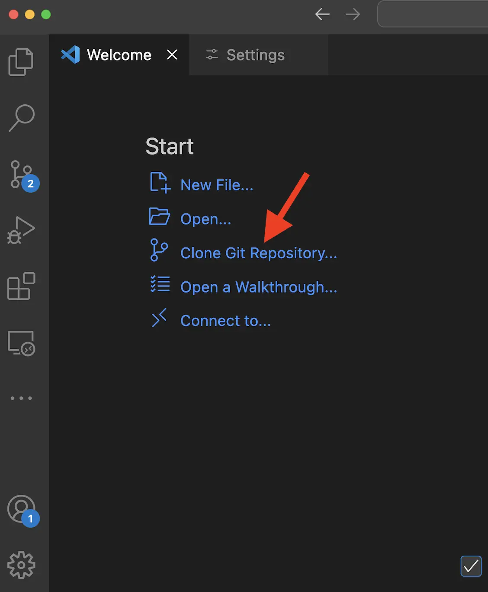
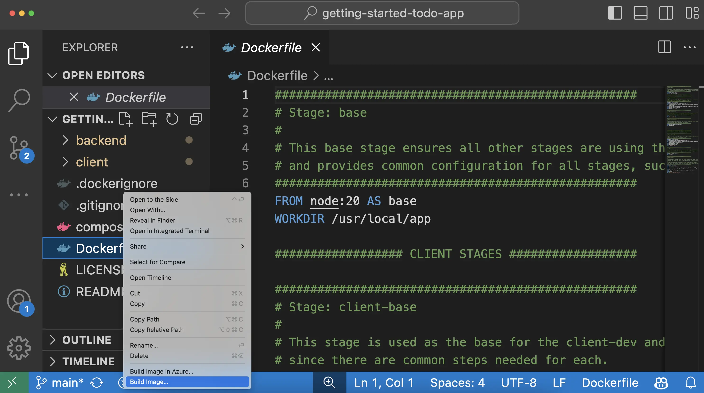

+++
title = "构建并推送您的第一个镜像"
date = 2024-10-23T14:54:35+08:00
weight = 20
type = "docs"
description = ""
isCJKLanguage = true
draft = false

+++

> 原文：[https://docs.docker.com/get-started/introduction/build-and-push-first-image/](https://docs.docker.com/get-started/introduction/build-and-push-first-image/)
>
> 收录该文档的时间：`2024-10-23T14:54:35+08:00`

# Build and push your first image - 构建并推送您的第一个镜像



## 说明 Explanation

Now that you've updated the [to-do list app](), you’re ready to create a container image for the application and share it on Docker Hub. To do so, you will need to do the following:

​	现在，您已经更新了[待办事项应用]()，您可以为应用程序创建一个容器镜像并将其分享至 Docker Hub。为此，您需要完成以下步骤：

1. Sign in with your Docker account 使用您的 Docker 账户登录
2. Create an image repository on Docker Hub 在 Docker Hub 上创建一个镜像仓库
3. Build the container image 构建容器镜像
4. Push the image to Docker Hub 将镜像推送至 Docker Hub

Before you dive into the hands-on guide, the following are a few core concepts that you should be aware of.

​	在进行动手操作之前，以下是您需要了解的一些核心概念。

### 容器镜像 Container images

If you’re new to container images, think of them as a standardized package that contains everything needed to run an application, including its files, configuration, and dependencies. These packages can then be distributed and shared with others.

​	如果您是容器镜像的新手，可以将其视为一个标准化的包，包含运行应用程序所需的一切内容，包括文件、配置和依赖项。然后，这些包可以分发并与他人共享。

### Docker Hub

To share your Docker images, you need a place to store them. This is where registries come in. While there are many registries, Docker Hub is the default and go-to registry for images. Docker Hub provides both a place for you to store your own images and to find images from others to either run or use as the bases for your own images.

​	要分享您的 Docker 镜像，您需要一个存储它们的地方，这就是注册表的作用。虽然有很多注册表，但 Docker Hub 是默认的镜像注册表。Docker Hub 提供了一个存储您自己镜像的地方，并且可以找到其他人创建的镜像，以便运行或作为您自己镜像的基础。

In [Develop with containers](), you used the following images that came from Docker Hub, each of which are [Docker Official Images]():

​	在[使用容器进行开发]()中，您使用了来自 Docker Hub 的以下镜像，它们都是[Docker 官方镜像]()：

- [node](https://hub.docker.com/_/node) - provides a Node environment and is used as the base of your development efforts. This image is also used as the base for the final application image.
- [node](https://hub.docker.com/_/node) - 提供 Node 环境，作为开发的基础镜像。此镜像也用于最终的应用镜像。

- [mysql](https://hub.docker.com/_/mysql) - provides a MySQL database to store the to-do list items
- [mysql](https://hub.docker.com/_/mysql) - 提供 MySQL 数据库以存储待办事项列表。
- [phpmyadmin](https://hub.docker.com/_/phpmyadmin) - provides phpMyAdmin, a web-based interface to the MySQL database
- [phpmyadmin](https://hub.docker.com/_/phpmyadmin) - 提供 phpMyAdmin，这是一个与 MySQL 数据库交互的基于 Web 的界面。
- [traefik](https://hub.docker.com/_/traefik) - provides Traefik, a modern HTTP reverse proxy and load balancer that routes requests to the appropriate container based on routing rules
- [traefik](https://hub.docker.com/_/traefik) - 提供 Traefik，这是一个现代 HTTP 反向代理和负载均衡器，根据路由规则将请求路由到合适的容器。

Explore the full catalog of [Docker Official Images](https://hub.docker.com/search?image_filter=official&q=), [Docker Verified Publishers](https://hub.docker.com/search?q=&image_filter=store), and [Docker Sponsored Open Source Software](https://hub.docker.com/search?q=&image_filter=open_source) images to see more of what there is to run and build on.

​	探索完整的 [Docker 官方镜像](https://hub.docker.com/search?image_filter=official&q=)、[Docker 认证发布者](https://hub.docker.com/search?q=&image_filter=store) 和 [Docker 赞助的开源软件](https://hub.docker.com/search?q=&image_filter=open_source)镜像目录，了解更多可运行和构建的内容。

## 试试吧 Try it out

In this hands-on guide, you'll learn how to sign in to Docker Hub and push images to Docker Hub repository.

​	在本动手指南中，您将学习如何登录 Docker Hub 并将镜像推送至 Docker Hub 仓库。

## 使用 Docker 账户登录 Sign in with your Docker account

To push images to Docker Hub, you will need to sign in with a Docker account.

​	要将镜像推送至 Docker Hub，您需要使用 Docker 账户登录。

1. Open the Docker Dashboard. 打开 Docker 仪表盘。
2. Select **Sign in** at the top-right corner. 选择右上角的 **登录**。
3. If needed, create an account and then complete the sign-in flow. 如有需要，创建一个账户，然后完成登录流程。

Once you're done, you should see the **Sign in** button turn into a profile picture.

​	完成后，您将看到 **登录** 按钮变为个人资料图片。

## 创建镜像仓库 Create an image repository

Now that you have an account, you can create an image repository. Just as a Git repository holds source code, an image repository stores container images.

​	现在您已经有了一个账户，您可以创建一个镜像仓库。就像 Git 仓库存储源代码一样，镜像仓库存储容器镜像。

1. Go to [Docker Hub](https://hub.docker.com/). 访问 [Docker Hub](https://hub.docker.com/)。
2. Select **Create repository**. 选择 **创建仓库**。
3. On the **Create repository** page, enter the following information: 在 **创建仓库** 页面上，输入以下信息：
   - **Repository name** - `getting-started-todo-app` **仓库名称** - `getting-started-todo-app`
   - **Short description** - feel free to enter a description if you'd like **简短描述** - 如果愿意，可以输入描述
   - **Visibility** - select **Public** to allow others to pull your customized to-do app **可见性** - 选择 **公开** 以允许他人拉取您自定义的待办事项应用
4. Select **Create** to create the repository.  选择 **创建** 以创建仓库。

## 构建并推送镜像 Build and push the image

Now that you have a repository, you are ready to build and push your image. An important note is that the image you are building extends the Node image, meaning you don't need to install or configure Node, yarn, etc. You can simply focus on what makes your application unique.

​	现在您有了仓库，可以开始构建并推送镜像了。一个重要的提示是，您构建的镜像是基于 Node 镜像的，这意味着您不需要安装或配置 Node、yarn 等。您只需专注于使您的应用独特的部分。

> **What is an image/Dockerfile?** 什么是镜像/Dockerfile？
>
> Without going too deep yet, think of a container image as a single package that contains everything needed to run a process. In this case, it will contain a Node environment, the backend code, and the compiled React code.
>
> ​	简单地说，容器镜像是一个包含运行进程所需的一切的单一包。在此情况下，它将包含 Node 环境、后端代码和编译后的 React 代码。
>
> Any machine that runs a container using the image, will then be able to run the application as it was built without needing anything else pre-installed on the machine.
>
> ​	任何使用该镜像运行容器的机器都能够运行该应用程序，而不需要预先安装其他任何东西。
>
> A `Dockerfile` is a text-based script that provides the instruction set on how to build the image. For this quick start, the repository already contains the Dockerfile.
>
> ​	`Dockerfile` 是一个基于文本的脚本，提供了构建镜像的指令集。对于本快速入门，仓库中已经包含了 Dockerfile。



{}

1. To get started, either clone or [download the project as a ZIP file](https://github.com/docker/getting-started-todo-app/archive/refs/heads/main.zip) to your local machine.

   首先，您可以克隆项目或[下载项目 ZIP 文件](https://github.com/docker/getting-started-todo-app/archive/refs/heads/main.zip)到本地机器。

   ```console
   $ git clone https://github.com/docker/getting-started-todo-app
   ```

   And after the project is cloned, navigate into the new directory created by the clone:

   项目克隆完成后，进入克隆创建的新目录：

   ```console
   $ cd getting-started-todo-app
   ```

2. Build the project by running the following command, swapping out `DOCKER_USERNAME` with your username.

   通过运行以下命令构建项目，并将 `DOCKER_USERNAME` 替换为您的用户名。

   ```console
   $ docker build -t DOCKER_USERNAME/getting-started-todo-app .
   ```

   For example, if your Docker username was `mobydock`, you would run the following:

   例如，如果您的 Docker 用户名是 `mobydock`，您将运行以下命令：

   ```console
   $ docker build -t mobydock/getting-started-todo-app .
   ```

3. To verify the image exists locally, you can use the `docker image ls` command:

   要验证镜像是否存在本地，您可以使用 `docker image ls` 命令：

   ```console
   $ docker image ls
   ```

   You will see output similar to the following:

   您将看到类似以下的输出：

   ```console
   REPOSITORY                          TAG       IMAGE ID       CREATED          SIZE
   mobydock/getting-started-todo-app   latest    1543656c9290   2 minutes ago    1.12GB
   ...
   ```

4. To push the image, use the `docker push` command. Be sure to replace `DOCKER_USERNAME` with your username:

   要推送镜像，请使用 `docker push` 命令。确保将 `DOCKER_USERNAME` 替换为您的用户名：

   ```console
   $ docker push DOCKER_USERNAME/getting-started-todo-app
   ```

   Depending on your upload speeds, this may take a moment to push.
   
   根据您的上传速度，这可能需要一些时间。

{}

{}

1. Open Visual Studio Code. In the **File** menu, select **Open Folder**. Choose **Clone Git Repository** and paste this URL: https://github.com/docker/getting-started-todo-app 打开 Visual Studio Code。在 **文件** 菜单中，选择 **打开文件夹**。选择 **克隆 Git 仓库** 并粘贴此 URL: https://github.com/docker/getting-started-todo-app

   

2. Right-click the `Dockerfile` and select the **Build Image...** menu item. 右键单击 `Dockerfile`，然后选择 **构建镜像...** 菜单项。

   

3. In the dialog that appears, enter a name of `DOCKER_USERNAME/getting-started-todo-app`, replacing `DOCKER_USERNAME` with your Docker username. 在出现的对话框中，输入 `DOCKER_USERNAME/getting-started-todo-app` 作为名称，将 `DOCKER_USERNAME` 替换为您的 Docker 用户名。

4. After pressing **Enter**, you'll see a terminal appear where the build will occur. Once it's completed, feel free to close the terminal. 按下 **Enter** 后，您将看到一个终端窗口，构建过程将在其中进行。完成后，您可以关闭终端。

5. Open the Docker Extension for VS Code by selecting the Docker logo in the left nav menu. 通过选择左侧导航菜单中的 Docker 图标，打开 VS Code 的 Docker 扩展。

6. Find the image you created. It'll have a name of `docker.io/DOCKER_USERNAME/getting-started-todo-app`.找到您创建的镜像。它的名称将是 `docker.io/DOCKER_USERNAME/getting-started-todo-app`。

7. Expand the image to view the tags (or different versions) of the image. You should see a tag named `latest`, which is the default tag given to an image. 展开该镜像以查看镜像的标签（或不同版本）。您应该会看到一个名为 `latest` 的标签，这是给镜像分配的默认标签。

8. Right-click on the **latest** item and select the **Push...** option. 右键单击 **latest** 项，然后选择 **推送...** 选项。

   

9. Press **Enter** to confirm and then watch as your image is pushed to Docker Hub. Depending on your upload speeds, it might take a moment to push the image.按 **Enter** 进行确认，然后观察您的镜像被推送到 Docker Hub。根据您的上传速度，推送镜像可能需要一些时间。

   Once the upload is finished, feel free to close the terminal. 
   
   上传完成后，您可以关闭终端。

{}



------

## 回顾 Recap

Before you move on, take a moment and reflect on what happened here. Within a few moments, you were able to build a container image that packages your application and push it to Docker Hub.

​	在继续之前，请花点时间回顾一下刚才发生的事情。在短短几分钟内，您已经能够构建一个包含应用程序的容器镜像并将其推送到 Docker Hub。

Going forward, you’ll want to remember that:

​	今后，您需要记住以下几点：

- Docker Hub is the go-to registry for finding trusted content. Docker provides a collection of trusted content, composed of Docker Official Images, Docker Verified Publishers, and Docker Sponsored Open Source Software, to use directly or as bases for your own images.
- Docker Hub 是寻找可信内容的首选注册表。Docker 提供了一系列可信内容，包括 Docker 官方镜像、Docker 认证发布者以及 Docker 赞助的开源软件，您可以直接使用或作为您自己镜像的基础。

- Docker Hub provides a marketplace to distribute your own applications. Anyone can create an account and distribute images. While you are publicly distributing the image you created, private repositories can ensure your images are accessible to only authorized users.
- Docker Hub 提供了一个分发您自己应用程序的市场。任何人都可以创建账户并分发镜像。虽然您是公开分发创建的镜像，但私有仓库可以确保您的镜像仅对授权用户可访问。

> **Usage of other registries** 使用其他注册表
>
> While Docker Hub is the default registry, registries are standardized and made interoperable through the [Open Container Initiative](https://opencontainers.org/). This allows companies and organizations to run their own private registries. Quite often, trusted content is mirrored (or copied) from Docker Hub into these private registries. 
>
> ​	虽然 Docker Hub 是默认注册表，但通过 [开放容器倡议](https://opencontainers.org/) 使注册表标准化并具有互操作性。这允许公司和组织运行自己的私有注册表。通常，可信内容会从 Docker Hub 镜像到这些私有注册表中。

## 接下来 Next steps

Now that you’ve built an image, it's time to discuss why you as a developer should learn more about Docker and how it will help you in your day-to-day tasks.

​	现在您已经构建了镜像，是时候讨论为什么作为开发者您应该进一步学习 Docker，以及它如何帮助您日常的工作。

[What's Next]() [接下来做什么]()
