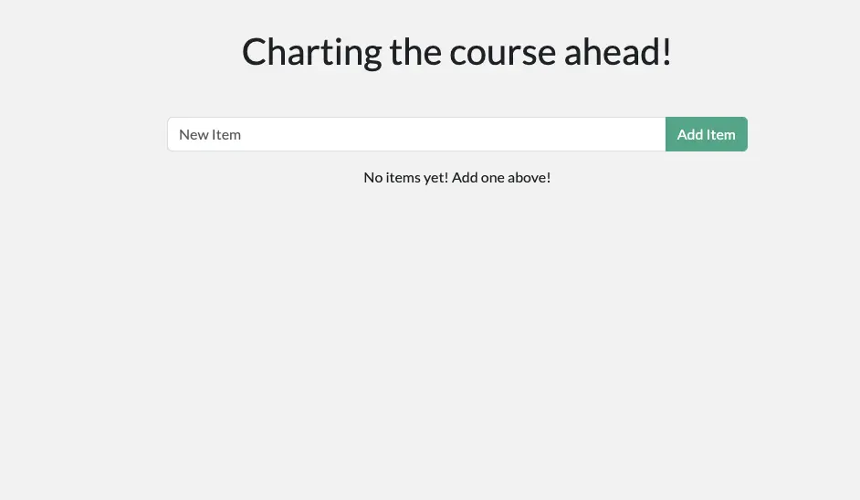
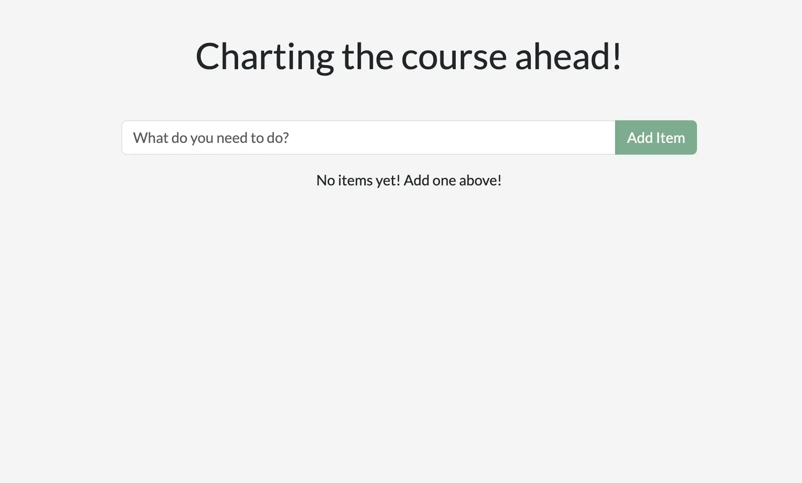
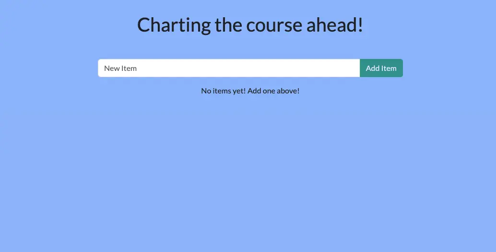

+++
title = "使用容器进行开发"
date = 2024-10-23T14:54:35+08:00
weight = 10
type = "docs"
description = ""
isCJKLanguage = true
draft = false
+++

> 原文：[https://docs.docker.com/get-started/introduction/develop-with-containers/](https://docs.docker.com/get-started/introduction/develop-with-containers/)
>
> 收录该文档的时间：`2024-10-23T14:54:35+08:00`

# Develop with containers - 使用容器进行开发



## 说明 Explanation

Now that you have Docker Desktop installed, you are ready to do some application development. Specifically, you will do the following:

​	现在您已经安装了 Docker Desktop，准备进行一些应用程序开发了。具体来说，您将完成以下步骤：

1. Clone and start a development project 克隆并启动一个开发项目
2. Make changes to the backend and frontend 修改后端和前端
3. See the changes immediately  立即查看更改效果

## 试试吧 Try it out

In this hands-on guide, you'll learn how to develop with containers.

​	在本动手指南中，您将学习如何使用容器进行开发。

## 启动项目 Start the project

1. To get started, either clone or [download the project as a ZIP file](https://github.com/docker/getting-started-todo-app/archive/refs/heads/main.zip) to your local machine. 首先，您可以克隆项目或[下载项目 ZIP 文件](https://github.com/docker/getting-started-todo-app/archive/refs/heads/main.zip)到本地机器。

   

   ```console
   $ git clone https://github.com/docker/getting-started-todo-app
   ```

   And after the project is cloned, navigate into the new directory created by the clone:

   项目克隆完成后，进入克隆创建的新目录：

   ```console
   $ cd getting-started-todo-app
   ```

2. Once you have the project, start the development environment using Docker Compose. 获得项目后，使用 Docker Compose 启动开发环境。

   To start the project using the CLI, run the following command: 

   要使用 CLI 启动项目，请运行以下命令：

   ```console
   $ docker compose watch
   ```

   You will see an output that shows container images being pulled down, containers starting, and more. Don't worry if you don't understand it all at this point. But, within a moment or two, things should stabilize and finish. 您将看到拉取容器镜像、启动容器等输出信息。如果目前还不完全理解，不必担心。几分钟后，一切应会稳定下来并完成。

3. Open your browser to [http://localhost](http://localhost/) to see the application up and running. It may take a few minutes for the app to run. The app is a simple to-do application, so feel free to add an item or two, mark some as done, or even delete an item. 打开浏览器，访问 [http://localhost](http://localhost/)，查看应用程序是否已启动运行。应用程序是一个简单的待办事项列表，您可以添加项、标记完成或者删除项。

   

### 环境中有什么？ What's in the environment?

Now that the environment is up and running, what's actually in it? At a high-level, there are several containers (or processes) that each serve a specific need for the application:

​	现在环境已经启动并运行，它实际包含什么呢？在高层次上，有几个容器（或进程）分别为应用程序提供特定功能：

- React frontend - a Node container that's running the React dev server, using [Vite](https://vitejs.dev/). React 前端 - 一个运行 React 开发服务器的 Node 容器，使用 [Vite](https://vitejs.dev/)。

- Node backend - the backend provides an API that provides the ability to retrieve, create, and delete to-do items. Node 后端 - 提供 API，能够检索、创建和删除待办事项。
- MySQL database - a database to store the list of the items. MySQL 数据库 - 用于存储待办事项列表的数据库。
- phpMyAdmin - a web-based interface to interact with the database that is accessible at [http://db.localhost](http://db.localhost/). phpMyAdmin - 一个基于 Web 的界面，用于与数据库交互，访问地址是 [http://db.localhost](http://db.localhost/)。
- Traefik proxy - [Traefik](https://traefik.io/traefik/) is an application proxy that routes requests to the right service. It sends all requests for `localhost/api/*` to the backend, requests for `localhost/*` to the frontend, and then requests for `db.localhost` to phpMyAdmin. This provides the ability to access all applications using port 80 (instead of different ports for each service). Traefik 代理 - [Traefik](https://traefik.io/traefik/) 是一个应用程序代理，它将请求路由到正确的服务。它将所有 `localhost/api/*` 的请求发送到后端，将 `localhost/*` 的请求发送到前端，将 `db.localhost` 的请求发送到 phpMyAdmin。这样，您可以使用端口 80 访问所有应用程序，而不是为每个服务使用不同的端口。

With this environment, you as the developer don’t need to install or configure any services, populate a database schema, configure database credentials, or anything. You only need Docker Desktop. The rest just works.

​	通过这个环境，您作为开发者不需要安装或配置任何服务，不需要填充数据库架构，配置数据库凭据等。您只需要 Docker Desktop，其他的都自动工作。

## 修改应用程序 Make changes to the app

With this environment up and running, you’re ready to make a few changes to the application and see how Docker helps provide a fast feedback loop.

​	现在环境已经运行，您可以对应用程序进行一些更改，并查看 Docker 如何帮助提供快速反馈循环。

### 修改问候语 Change the greeting

The greeting at the top of the page is populated by an API call at `/api/greeting`. Currently, it always returns "Hello world!". You’ll now modify it to return one of three randomized messages (that you'll get to choose).

​	页面顶部的问候语是通过 `/api/greeting` API 调用填充的。目前，它总是返回 "Hello world!"。现在，您将修改它以返回三个随机消息之一（您可以自己选择）。


1. Open the `backend/src/routes/getGreeting.js` file in a text editor. This file provides the handler for the API endpoint. 在文本编辑器中打开 `backend/src/routes/getGreeting.js` 文件。此文件提供 API 端点的处理程序。

2. Modify the variable at the top to an array of greetings. Feel free to use the following modifications or customize it to your own liking. Also, update the endpoint to send a random greeting from this list. 将顶部的变量修改为问候语数组。您可以使用以下修改或自定义自己的问候语。同时，更新端点以从该列表中发送一个随机问候语。

   ```js
   const GREETINGS = [
       "Whalecome!",
       "All hands on deck!",
       "Charting the course ahead!",
   ];
   
   module.exports = async (req, res) => {
       res.send({
           greeting: GREETINGS[ Math.floor( Math.random() * GREETINGS.length )],
       });
   };
   ```

   

3. If you haven't done so yet, save the file. If you refresh your browser, you should see a new greeting. If you keep refreshing, you should see all of the messages appear. 如果尚未保存文件，请保存文件。刷新浏览器，您应该会看到新的问候语。继续刷新，您应该会看到所有的消息。

   

### 修改占位符文本 Change the placeholder text

When you look at the app, you'll see the placeholder text is simply "New Item". You’ll now make that a little more descriptive and fun. You’ll also make a few changes to the styling of the app too.

​	查看应用程序时，您会看到占位符文本只是 "New Item"。现在，您将使它更具描述性和趣味性。您还将对应用程序的样式进行一些更改。

1. Open the `client/src/components/AddNewItemForm.jsx` file. This provides the component to add a new item to the to-do list. 打开 `client/src/components/AddNewItemForm.jsx` 文件。此文件提供了向待办事项列表添加新项目的组件。

2. Modify the `placeholder` attribute of the `Form.Control` element to whatever you'd like to display.  将 `Form.Control` 元素的 `placeholder` 属性修改为您想显示的内容。

   ```js
   <Form.Control
       value={newItem}
       onChange={(e) => setNewItem(e.target.value)}
       type="text"
       placeholder="What do you need to do?"
       aria-label="New item"
   />
   ```

   

3. Save the file and go back to your browser. You should see the change already hot-reloaded into your browser. If you don't like it, feel free to tweak it until it looks just right. 保存文件并返回浏览器。您应该会看到更改已经热更新到浏览器中。如果不喜欢，可以继续调整，直到看起来合适为止。



### 修改背景颜色 Change the background color

Before you consider the application finalized, you need to make the colors better.

​	在确定应用程序完成之前，您需要调整颜色使其更好看。

1. Open the `client/src/index.scss` file. 打开 `client/src/index.scss` 文件。

2. Adjust the `background-color` attribute to any color you'd like. The provided snippet is a soft blue to go along with Docker's nautical theme. 将 `background-color` 属性调整为您想要的任何颜色。提供的示例是一种柔和的蓝色，与 Docker 的海洋主题相符。

   If you're using an IDE, you can pick a color using the integrated color pickers. Otherwise, feel free to use an online [Color Picker](https://www.w3schools.com/colors/colors_picker.asp).

   如果您使用 IDE，可以使用集成的颜色选择器。否则，您可以使用在线 [颜色选择器](https://www.w3schools.com/colors/colors_picker.asp)。

   ```js
   body {
       background-color: #99bbff;
       margin-top: 50px;
       font-family: 'Lato';
   }
   ```
   
   Each save should let you see the change immediately in the browser. Keep adjusting it until it's the perfect setup for you.
   
   每次保存后，您应该立即在浏览器中看到更改。继续调整，直到达到您理想的设置。
   
   

And with that, you're done. Congrats on updating your website.

​	完成了！恭喜您更新了您的网站。

## 回顾 Recap

Before you move on, take a moment and reflect on what happened here. Within a few moments, you were able to:

​	在继续之前，请花点时间回顾一下刚才发生了什么。在短短几分钟内，您已经能够：

- Start a complete development project with zero installation effort. The containerized environment provided the development environment, ensuring you have everything you need. You didn't have to install Node, MySQL, or any of the other dependencies directly on your machine. All you needed was Docker Desktop and a code editor.
- 在零安装工作量的情况下启动一个完整的开发项目。容器化的环境提供了开发环境，确保您拥有所需的一切。您不必在机器上直接安装 Node、MySQL 或其他任何依赖项。您只需要 Docker Desktop 和一个代码编辑器。

- Make changes and see them immediately. This was made possible because 1) the processes running in each container are watching and responding to file changes and 2) the files are shared with the containerized environment.
- 立即进行更改并查看效果。这得益于 1）每个容器中运行的进程正在监视并响应文件更改，以及 2）文件与容器化环境共享。

Docker Desktop enables all of this and so much more. Once you start thinking with containers, you can create almost any environment and easily share it with your team.

​	Docker Desktop 实现了这一切，并且还能做更多。当您开始以容器的方式思考时，您几乎可以创建任何环境，并轻松与团队共享。

## 接下来 Next steps

Now that the application has been updated, you’re ready to learn about packaging it as a container image and pushing it to a registry, specifically Docker Hub.

​	现在应用程序已经更新，您可以开始学习如何将其打包为容器镜像并推送到注册表，特别是 Docker Hub。

[Build and push your first image]() [构建并推送您的第一个镜像]()
