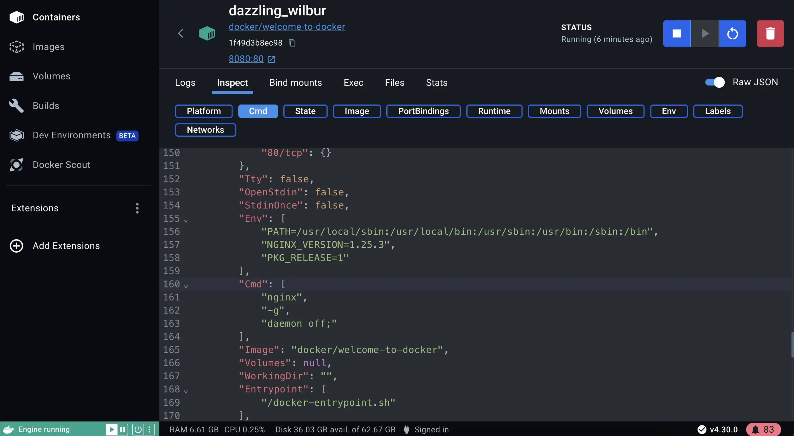

+++
title = "获取 Docker Desktop"
date = 2024-10-23T14:54:35+08:00
weight = 1
type = "docs"
description = ""
isCJKLanguage = true
draft = false

+++

> 原文：[https://docs.docker.com/get-started/introduction/get-docker-desktop/](https://docs.docker.com/get-started/introduction/get-docker-desktop/)
>
> 收录该文档的时间：`2024-10-23T14:54:35+08:00`

# 获取 Docker Desktop - Get Docker Desktop



## 说明 Explanation

Docker Desktop is the all-in-one package to build images, run containers, and so much more. This guide will walk you through the installation process, enabling you to experience Docker Desktop firsthand.

​	Docker Desktop 是一个集成的包，用于构建镜像、运行容器等更多功能。本指南将引导您完成安装过程，让您亲身体验 Docker Deskt

> **Docker Desktop terms**
>
> Commercial use of Docker Desktop in larger enterprises (more than 250 employees OR more than $10 million USD in annual revenue) requires a [paid subscription](https://www.docker.com/pricing/?_gl=1*1nyypal*_ga*MTYxMTUxMzkzOS4xNjgzNTM0MTcw*_ga_XJWPQMJYHQ*MTcxNjk4MzU4Mi4xMjE2LjEuMTcxNjk4MzkzNS4xNy4wLjA.).
>
> ​	**Docker Desktop 使用条款**
>
> 大型企业（超过 250 名员工或年收入超过 1000 万美元）中商业使用 Docker Desktop 需要[付费订阅](https://www.docker.com/pricing/?_gl=1*1nyypal*_ga*MTYxMTUxMzkzOS4xNjgzNTM0MTcw*_ga_XJWPQMJYHQ*MTcxNjk4MzU4Mi4xMjE2LjEuMTcxNjk4MzkzNS4xNy4wLjA.).


Docker Desktop for Mac - Mac 版 Docker Desktop

[Download (Apple Silicon)](https://desktop.docker.com/mac/main/arm64/Docker.dmg?utm_source=docker&utm_medium=webreferral&utm_campaign=docs-driven-download-mac-arm64) | [Download (Intel)](https://desktop.docker.com/mac/main/amd64/Docker.dmg?utm_source=docker&utm_medium=webreferral&utm_campaign=docs-driven-download-mac-amd64) | [Install instructions]()


Docker Desktop for Windows - Windows 版 Docker Desktop

[Download](https://desktop.docker.com/win/main/amd64/Docker Desktop Installer.exe?utm_source=docker&utm_medium=webreferral&utm_campaign=docs-driven-download-windows) | [Install instructions]()


Docker Desktop for Linux - Linux 版 Docker Desktop

[Install instructions]()

Once it's installed, complete the setup process and you're all set to run a Docker container.

​	安装完成后，完成设置过程，您就可以运行 Docker 容器了。

## 试试吧 Try it out

In this hands-on guide, you will see how to run a Docker container using Docker Desktop.

​	在本动手指南中，您将学习如何使用 Docker Desktop 运行一个 Docker 容器。

Follow the instructions to run a container using the CLI.

​	按照说明使用 CLI 运行容器。

## 运行您的第一个容器 Run your first container

Open your CLI terminal and start a container by running the `docker run` command:

​	打开您的 CLI 终端，并通过运行 `docker run` 命令启动一个容器：


```console
$ docker run -d -p 8080:80 docker/welcome-to-docker
```

## 访问前端 Access the frontend

For this container, the frontend is accessible on port `8080`. To open the website, visit [http://localhost:8080](http://localhost:8080/) in your browser.

​	对于此容器，前端可通过 `8080` 端口访问。要打开网站，请在浏览器中访问 [http://localhost:8080](http://localhost:8080/)。


## 使用 Docker Desktop 管理容器 Manage containers using Docker Desktop

1. Open Docker Desktop and select the **Containers** field on the left sidebar. 打开 Docker Desktop 并选择左侧边栏中的 **Containers** 字段。

2. You can view information about your container including logs, and files, and even access the shell by selecting the **Exec** tab. 您可以查看有关容器的信息，包括日志和文件，甚至可以通过选择 **Exec** 选项卡访问 shell。

    

3. Select the **Inspect** field to obtain detailed information about the container. You can perform various actions such as pause, resume, start or stop containers, or explore the **Logs**, **Bind mounts**, **Exec**, **Files**, and **Stats** tabs. 选择 **Inspect** 字段以获取有关容器的详细信息。您可以执行各种操作，例如暂停、恢复、启动或停止容器，或查看 **Logs**、**Bind mounts**、**Exec**、**Files** 和 **Stats** 选项卡。



Docker Desktop simplifies container management for developers by streamlining the setup, configuration, and compatibility of applications across different environments, thereby addressing the pain points of environment inconsistencies and deployment challenges.

​	Docker Desktop 通过简化设置、配置以及跨不同环境的应用程序兼容性，帮助开发人员轻松管理容器，从而解决了环境不一致和部署难题。

## 接下来呢？What's next?

Now that you have Docker Desktop installed and ran your first container, it's time to start developing with containers.

​	现在您已经安装了 Docker Desktop 并运行了第一个容器，是时候开始使用容器进行开发了。

[Develop with containers]() [使用容器进行开发]()
