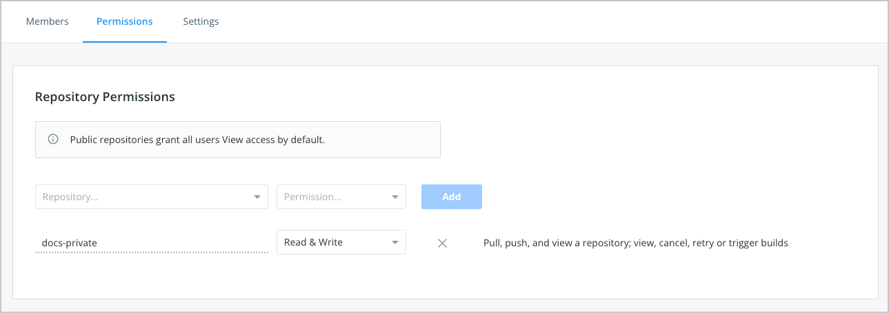

+++
title = "Create and manage a team"
date = 2024-10-23T14:54:40+08:00
weight = 30
type = "docs"
description = ""
isCJKLanguage = true
draft = false
+++

> 原文: [https://docs.docker.com/admin/organization/manage-a-team/](https://docs.docker.com/admin/organization/manage-a-team/)
>
> 收录该文档的时间：`2024-10-23T14:54:40+08:00`

# Create and manage a team

You can create teams for your organization in Docker Hub and the Docker Admin Console. You can [configure repository access for a team](https://docs.docker.com/admin/organization/manage-a-team/#configure-repository-permissions-for-a-team) in Docker Hub.

A team is a group of Docker users that belong to an organization. An organization can have multiple teams. An organization owner can then create new teams and add members to an existing team using their Docker ID or email address and by selecting a team the user should be part of. Members aren't required to be part of a team to be associated with an organization.

The organization owner can add additional organization owners to help them manage users, teams, and repositories in the organization by assigning them the owner role.

## [Organization owner](https://docs.docker.com/admin/organization/manage-a-team/#organization-owner)

An organization owner is an administrator who is responsible to manage repositories and add team members to the organization. They have full access to private repositories, all teams, billing information, and org settings. An org owner can also specify [permissions](https://docs.docker.com/admin/organization/manage-a-team/#permissions-reference) for each team in the organization. Only an org owner can enable [SSO](https://docs.docker.com/security/for-admins/single-sign-on/) for the organization. When SSO is enabled for your organization, the org owner can also manage users. Docker can auto-provision Docker IDs for new end-users or users who'd like to have a separate Docker ID for company use through SSO enforcement.

The org owner can also add additional org owners to help them manage users, teams, and repositories in the organization.

## [Create a team](https://docs.docker.com/admin/organization/manage-a-team/#create-a-team)



{}

1. Go to **Organizations** in Docker Hub, and select your organization.
2. Select the **Teams** tab and then select **Create Team**.
3. Fill out your team's information and select **Create**.
4. [Add members to your team](https://docs.docker.com/admin/organization/members/#add-a-member-to-a-team).

{}

{}

**Early Access**

The Docker Admin Console is an [early access](https://docs.docker.com/release-lifecycle#early-access-ea) product.

It's available to all company owners and organization owners. You can still manage organizations in Docker Hub, but the Admin Console includes company-level management and enhanced features for organization management.

1. In Admin Console, select your organization.
2. In the **User management** section, select **Teams**.
3. Select **Create team**.
4. Fill out your team's information and select **Create**.
5. [Add members to your team](https://docs.docker.com/admin/organization/members/#add-a-member-to-a-team).

{}



------

## [Configure repository permissions for a team](https://docs.docker.com/admin/organization/manage-a-team/#configure-repository-permissions-for-a-team)

Organization owners can configure repository permissions on a per-team basis. For example, you can specify that all teams within an organization have "Read and Write" access to repositories A and B, whereas only specific teams have "Admin" access. Note that org owners have full administrative access to all repositories within the organization.

To give a team access to a repository

1. Navigate to **Organizations** in Docker Hub, and select your organization.

2. Select the **Teams** tab and select the team that you'd like to configure repository access to.

3. Select the **Permissions** tab and select a repository from the **Repository** drop-down.

4. Choose a permission from the **Permissions** drop-down list and select **Add**.

   

Organization owners can also assign members the editor role to grant partial administrative access. See [Roles and permissions](https://docs.docker.com/security/for-admins/roles-and-permissions/) for more about the editor role.

### [Permissions reference](https://docs.docker.com/admin/organization/manage-a-team/#permissions-reference)

- `Read-only` access lets users view, search, and pull a private repository in the same way as they can a public repository.
- `Read & Write` access lets users pull, push, and view a repository. In addition, it lets users view, cancel, retry or trigger builds
- `Admin` access lets users pull, push, view, edit, and delete a repository. You can also edit build settings, and update the repositories description, collaborators rights, public/private visibility, and delete.

Permissions are cumulative. For example, if you have "Read & Write" permissions, you automatically have "Read-only" permissions:

|             Action              | Read-only | Read & Write | Admin |
| :-----------------------------: | :-------: | :----------: | :---: |
|        Pull a Repository        |     ✅     |      ✅       |   ✅   |
|        View a Repository        |     ✅     |      ✅       |   ✅   |
|        Push a Repository        |     ❌     |      ✅       |   ✅   |
|        Edit a Repository        |     ❌     |      ❌       |   ✅   |
|       Delete a Repository       |     ❌     |      ❌       |   ✅   |
| Update a Repository Description |     ❌     |      ❌       |   ✅   |
|           View Builds           |     ✅     |      ✅       |   ✅   |
|          Cancel Builds          |     ❌     |      ✅       |   ✅   |
|          Retry Builds           |     ❌     |      ✅       |   ✅   |
|         Trigger Builds          |     ❌     |      ✅       |   ✅   |
|       Edit Build Settings       |     ❌     |      ❌       |   ✅   |

> **Note**
>
> 
>
> A user who hasn't verified their email address only has `Read-only` access to the repository, regardless of the rights their team membership has given them.

## [View a team's permissions for all repositories](https://docs.docker.com/admin/organization/manage-a-team/#view-a-teams-permissions-for-all-repositories)

To view a team's permissions across all repositories:

1. Open **Organizations** > ***Your Organization\*** > **Teams** > ***Team Name\***.
2. Select the **Permissions** tab, where you can view the repositories this team can access.

## [Delete a team](https://docs.docker.com/admin/organization/manage-a-team/#delete-a-team)

Organization owners can delete a team in Docker Hub or Admin Console. When you remove a team from your organization, this action revokes the members' access to the team's permitted resources. It won't remove users from other teams that they belong to, nor will it delete any resources.



{}

1. Go to **Organizations** in Docker Hub, and select your organization.
2. Select the **Teams** tab.
3. Select the name of the team that you want to delete.
4. Select **Settings**.
5. Select **Delete Team**.
6. Review the confirmation message, then select **Delete**.

{}

{}

**Early Access**

The Docker Admin Console is an [early access](https://docs.docker.com/release-lifecycle#early-access-ea) product.

It's available to all company owners and organization owners. You can still manage organizations in Docker Hub, but the Admin Console includes company-level management and enhanced features for organization management.

1. In Admin Console, select your organization.
2. In the **User management** section, select **Teams**.
3. Select the **Actions** icon next to the name of the team you want to delete.
4. Select **Delete team**.
5. Review the confirmation message, then select **Delete**.

{}



------

## [More resources](https://docs.docker.com/admin/organization/manage-a-team/#more-resources)

- [Video: Docker teams](https://youtu.be/WKlT1O-4Du8?feature=shared&t=348)
- [Video: Roles, teams, and repositories](https://youtu.be/WKlT1O-4Du8?feature=shared&t=435)
