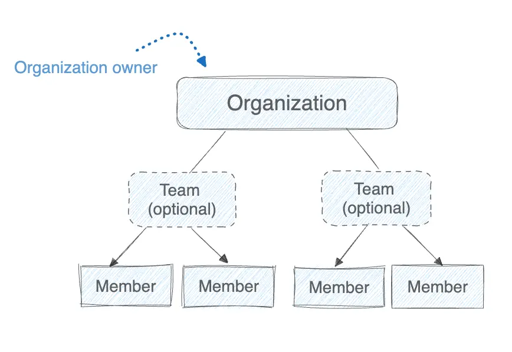

+++
title = "Organization administration"
date = 2024-10-23T14:54:40+08:00
weight = 1
type = "docs"
description = ""
isCJKLanguage = true
draft = false
+++

> 原文：[https://docs.docker.com/admin/organization/](https://docs.docker.com/admin/organization/)
>
> 收录该文档的时间：`2024-10-23T14:54:40+08:00`

# Organization administration overview

An organization in Docker is a collection of teams and repositories that can be managed together. A team is a group of Docker members that belong to an organization. An organization can have multiple teams. Members don't have to be added to a team to be part of an organization.

Docker users become members of an organization once they're associated with that organization by an organization owner. An organization owner is a user with administrative access to the organization.

Owners can invite users, assign them roles, create new teams, and add members to an existing team using their Docker ID or email address. An organization owner can also add additional owners to help them manage users, teams, and repositories in the organization.

The following diagram depicts the setup of an organization and how it relates to teams. Teams are an optional feature that owners can use to group members and assign permissions.

To create an organization, see [Create your organization]().

Learn how to administer an organization in the following sections.

Onboard your organization

Learn how to onboard and secure your organization.

Manage members

Explore how to manage members.

Activity logs

Learn how to audit the activities of your members.

Image Access Management

Control which types of images your developers can pull.

Registry Access Management

Define which registries your developers can access.

Organization settings

Configure information for your organization and manage settings.

SSO and SCIM

Set up [Single Sign-On]() and [SCIM]() for your organization.

Domain management

Add, verify, and audit your domains.

FAQs

Explore common organization FAQs.
