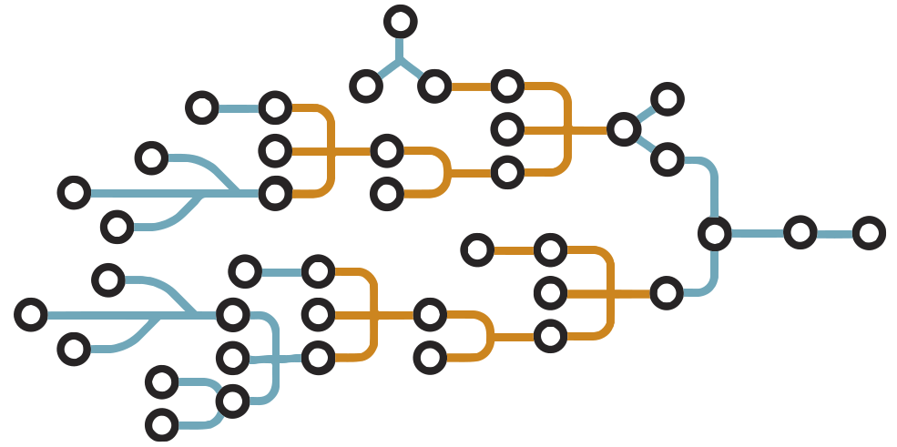

+++
title = "BuildKit"
date = 2024-10-23T14:54:40+08:00
weight = 90
type = "docs"
description = ""
isCJKLanguage = true
draft = false
+++

> 原文：[https://docs.docker.com/build/buildkit/](https://docs.docker.com/build/buildkit/)
>
> 收录该文档的时间：`2024-10-23T14:54:40+08:00`

# BuildKit

## Overview

[BuildKit](https://github.com/moby/buildkit) is an improved backend to replace the legacy builder. BuildKit is the default builder for users on Docker Desktop, and Docker Engine as of version 23.0.

​	[BuildKit](https://github.com/moby/buildkit) 是一种改进后的后端，用于替代传统的构建器。BuildKit 是 Docker Desktop 和 Docker Engine 23.0 及更高版本的默认构建器。

BuildKit provides new functionality and improves your builds' performance. It also introduces support for handling more complex scenarios:

​	BuildKit 提供了新功能，并提升了构建的性能。它还支持处理更复杂的场景：

- Detect and skip executing unused build stages
  - 检测并跳过未使用的构建阶段

- Parallelize building independent build stages
  - 并行构建独立的构建阶段

- Incrementally transfer only the changed files in your [build context]() between builds
  - 在多次构建之间增量传输 [构建上下文]() 中仅有的变更文件

- Detect and skip transferring unused files in your [build context]()
  - 检测并跳过传输未使用的文件

- Use [Dockerfile frontend]() implementations with many new features
  - 使用具有更多新特性的 [Dockerfile 前端]()

- Avoid side effects with rest of the API (intermediate images and containers)
  - 避免对其他 API（中间镜像和容器）产生副作用

- Prioritize your build cache for automatic pruning
  - 优先考虑自动清理的构建缓存


Apart from many new features, the main areas BuildKit improves on the current experience are performance, storage management, and extensibility. From the performance side, a significant update is a new fully concurrent build graph solver. It can run build steps in parallel when possible and optimize out commands that don't have an impact on the final result. We have also optimized the access to the local source files. By tracking only the updates made to these files between repeated build invocations, there is no need to wait for local files to be read or uploaded before the work can begin.

​	除了许多新特性外，BuildKit 改进的主要领域是性能、存储管理和可扩展性。在性能方面，重要的更新是新的完全并行构建图求解器。它可以在可能的情况下并行运行构建步骤，并优化出对最终结果无影响的命令。通过仅跟踪每次构建调用之间的文件更新，无需等待读取或上传本地文件，工作可以立即开始。

## LLB

At the core of BuildKit is a [Low-Level Build (LLB)](https://github.com/moby/buildkit#exploring-llb) definition format. LLB is an intermediate binary format that allows developers to extend BuildKit. LLB defines a content-addressable dependency graph that can be used to put together very complex build definitions. It also supports features not exposed in Dockerfiles, like direct data mounting and nested invocation.

​	BuildKit 的核心是 [低级构建 (LLB)](https://github.com/moby/buildkit#exploring-llb) 定义格式。LLB 是一种中间二进制格式，允许开发人员扩展 BuildKit。LLB 定义了一个内容可寻址的依赖图，用于创建非常复杂的构建定义。它还支持 Dockerfile 中未公开的特性，如直接数据挂载和嵌套调用。



Everything about execution and caching of your builds is defined in LLB. The caching model is entirely rewritten compared to the legacy builder. Rather than using heuristics to compare images, LLB directly tracks the checksums of build graphs and content mounted to specific operations. This makes it much faster, more precise, and portable. The build cache can even be exported to a registry, where it can be pulled on-demand by subsequent invocations on any host.

​	构建的执行和缓存都由 LLB 定义。与传统构建器相比，缓存模型完全重写，不再使用启发式方法来比较镜像。LLB 直接跟踪构建图和挂载到特定操作的内容的校验和，使其更加快速、精确和可移植。构建缓存甚至可以导出到注册表，以便后续在任何主机上按需调用。

LLB can be generated directly using a [golang client package](https://pkg.go.dev/github.com/moby/buildkit/client/llb) that allows defining the relationships between your build operations using Go language primitives. This gives you full power to run anything you can imagine, but will probably not be how most people will define their builds. Instead, most users would use a frontend component, or LLB nested invocation, to run a prepared set of build steps.

​	可以直接使用 [Golang 客户端包](https://pkg.go.dev/github.com/moby/buildkit/client/llb) 生成 LLB，该包允许使用 Go 语言定义构建操作之间的关系。这为运行您可以想象的任何操作提供了全部能力，但大多数人可能不会以这种方式定义构建。相反，大多数用户会使用前端组件或 LLB 嵌套调用来运行预定义的一组构建步骤。

## Frontend

A frontend is a component that takes a human-readable build format and converts it to LLB so BuildKit can execute it. Frontends can be distributed as images, and the user can target a specific version of a frontend that is guaranteed to work for the features used by their definition.

​	前端是将人类可读的构建格式转换为 LLB，以便 BuildKit 可以执行的组件。前端可以作为镜像分发，用户可以指定特定版本的前端，以确保其定义所用功能的兼容性。

For example, to build a [Dockerfile]() with BuildKit, you would [use an external Dockerfile frontend]().

​	例如，要使用 BuildKit 构建 [Dockerfile]()，您可以 [使用外部 Dockerfile 前端]()。

## Getting started

BuildKit is the default builder for users on Docker Desktop and Docker Engine v23.0 and later.

​	对于 Docker Desktop 和 Docker Engine v23.0 及更高版本，BuildKit 是默认构建器。

If you have installed Docker Desktop, you don't need to enable BuildKit. If you are running a version of Docker Engine version earlier than 23.0, you can enable BuildKit either by setting an environment variable, or by making BuildKit the default setting in the daemon configuration.

​	如果您已安装 Docker Desktop，无需启用 BuildKit。如果您运行的是 23.0 以下版本的 Docker Engine，可以通过设置环境变量或在守护进程配置中将 BuildKit 设为默认值来启用 BuildKit。

To set the BuildKit environment variable when running the `docker build` command, run:

​	在运行 `docker build` 命令时，设置 BuildKit 环境变量：


```console
$ DOCKER_BUILDKIT=1 docker build .
```

> **Note**
>
> 
>
> Buildx always uses BuildKit.
>
> ​	Buildx 总是使用 BuildKit。

To use Docker BuildKit by default, edit the Docker daemon configuration in `/etc/docker/daemon.json` as follows, and restart the daemon.

​	要默认使用 Docker BuildKit，请编辑 `/etc/docker/daemon.json` 中的 Docker 守护进程配置，并重启守护进程。

```json
{
  "features": {
    "buildkit": true
  }
}
```

If the `/etc/docker/daemon.json` file doesn't exist, create new file called `daemon.json` and then add the following to the file. And restart the Docker daemon.

​	如果文件 `/etc/docker/daemon.json` 不存在，创建一个名为 `daemon.json` 的新文件，并在文件中添加上述内容。然后重启 Docker 守护进程。

## BuildKit on Windows

> **Warning**
>
> 
>
> BuildKit only fully supports building Linux containers. Windows container support is experimental, and is tracked in [`moby/buildkit#616`](https://github.com/moby/buildkit/issues/616).
>
> ​	BuildKit 仅完全支持构建 Linux 容器。对 Windows 容器的支持为实验性特性，相关问题跟踪在 [`moby/buildkit#616`](https://github.com/moby/buildkit/issues/616)。

BuildKit has experimental support for Windows containers (WCOW) as of version 0.13. This section walks you through the steps for trying it out. We appreciate any feedback you submit by [opening an issue here](https://github.com/moby/buildkit/issues/new), especially `buildkitd.exe`.

​	BuildKit 自版本 0.13 起提供对 Windows 容器（WCOW）的实验性支持。以下步骤介绍了如何试用。欢迎您通过 [提交问题](https://github.com/moby/buildkit/issues/new) 提供反馈，特别是 `buildkitd.exe` 相关问题。

### Known limitations

- BuildKit on Windows currently only supports the `containerd` worker. Support for non-OCI workers is tracked in [moby/buildkit#4836](https://github.com/moby/buildkit/issues/4836).
  - Windows 上的 BuildKit 当前仅支持 `containerd` worker。对非 OCI worker 的支持请见 [moby/buildkit#4836](https://github.com/moby/buildkit/issues/4836)。


### Prerequisites

- Architecture: `amd64`, `arm64` (binaries available but not officially tested yet).
  - 架构：`amd64`、`arm64`（二进制文件可用，但尚未正式测试）。

- Supported OS: Windows Server 2019, Windows Server 2022, Windows 11.
  - 支持的操作系统：Windows Server 2019、Windows Server 2022、Windows 11。

- Base images: `ServerCore:ltsc2019`, `ServerCore:ltsc2022`, `NanoServer:ltsc2022`. See the [compatibility map here](https://learn.microsoft.com/en-us/virtualization/windowscontainers/deploy-containers/version-compatibility?tabs=windows-server-2019%2Cwindows-11#windows-server-host-os-compatibility).
  - 基础镜像：`ServerCore:ltsc2019`、`ServerCore:ltsc2022`、`NanoServer:ltsc2022`。请参见 [兼容性映射](https://learn.microsoft.com/en-us/virtualization/windowscontainers/deploy-containers/version-compatibility?tabs=windows-server-2019%2Cwindows-11#windows-server-host-os-compatibility)。

- Docker Desktop version 4.29 or later
  - Docker Desktop 版本 4.29 或更高版本


### Steps

> **Note**
>
> 
>
> The following commands require administrator (elevated) privileges in a PowerShell terminal.
>
> ​	以下命令需要在 PowerShell 终端中以管理员（提升权限）身份运行。

1. Enable the **Hyper-V** and **Containers** Windows features.

   启用 **Hyper-V** 和 **Containers** Windows 功能。

   ```console
   > Enable-WindowsOptionalFeature -Online -FeatureName Microsoft-Hyper-V, Containers -All
   ```

   If you see `RestartNeeded` as `True`, restart your machine and re-open a PowerShell terminal as an administrator. Otherwise, continue with the next step.

   ​	如果看到 `RestartNeeded` 为 `True`，请重启计算机并重新以管理员身份打开 PowerShell 终端。否则，继续下一步。

2. Switch to Windows containers in Docker Desktop. 在 Docker Desktop 中切换到 Windows 容器。

   Select the Docker icon in the taskbar, and then **Switch to Windows containers...**.

   ​	选择任务栏上的 Docker 图标，然后选择 **Switch to Windows containers...**。

3. Install containerd version 1.7.7 or later following the setup instructions [here](https://github.com/containerd/containerd/blob/main/docs/getting-started.md#installing-containerd-on-windows). 安装 containerd 版本 1.7.7 或更高版本，安装说明见 [此处](https://github.com/containerd/containerd/blob/main/docs/getting-started.md#installing-containerd-on-windows)。

4. Download and extract the latest BuildKit release.

   下载并解压最新的 BuildKit 版本。

   ```powershell
   $version = "v0.13.1" # specify the release version, v0.13+
   $arch = "amd64" # arm64 binary available too
   curl.exe -LO https://github.com/moby/buildkit/releases/download/$version/buildkit-$version.windows-$arch.tar.gz
   # there could be another `.\bin` directory from containerd instructions
   # you can move those
   # 如果按照 containerd 的说明存在另一个 `.\bin` 目录
   # 可将其移动
   mv bin bin2
   tar.exe xvf .\buildkit-$version.windows-$arch.tar.gz
   ## x bin/
   ## x bin/buildctl.exe
   ## x bin/buildkitd.exe
   ```

5. Install BuildKit binaries on `PATH`.

   将 BuildKit 二进制文件安装到 `PATH` 中。

   ```powershell
   # after the binaries are extracted in the bin directory
   # move them to an appropriate path in your $Env:PATH directories or:
   Copy-Item -Path ".\bin" -Destination "$Env:ProgramFiles\buildkit" -Recurse -Force
   # add `buildkitd.exe` and `buildctl.exe` binaries in the $Env:PATH
   $Path = [Environment]::GetEnvironmentVariable("PATH", "Machine") + `
       [IO.Path]::PathSeparator + "$Env:ProgramFiles\buildkit"
   [Environment]::SetEnvironmentVariable( "Path", $Path, "Machine")
   $Env:Path = [System.Environment]::GetEnvironmentVariable("Path","Machine") + ";" + `
       [System.Environment]::GetEnvironmentVariable("Path","User")
   ```

6. Start the BuildKit daemon.

   启动 BuildKit 守护进程。

   ```console
   > buildkitd.exe
   ```

7. In another terminal with administrator privileges, create a remote builder that uses the local BuildKit daemon.  在另一个具有管理员权限的终端中，创建一个使用本地 BuildKit 守护进程的远程构建器。

   > **Note**
   >
   > 
   >
   > This requires Docker Desktop version 4.29 or later.
   >
   > ​	这需要 Docker Desktop 版本 4.29 或更高版本。

   

   ```console
   > docker buildx create --name buildkit-exp --use --driver=remote npipe:////./pipe/buildkitd
   buildkit-exp
   ```

8. Verify the builder connection by running `docker buildx inspect`.

   通过运行 `docker buildx inspect` 验证构建器连接。

   ```console
   > docker buildx inspect
   ```

   The output should indicate that the builder platform is Windows, and that the endpoint of the builder is a named pipe.

   输出结果应显示构建器平台是 Windows，且构建器的端点是一个命名管道。

   ```text
   Name:          buildkit-exp
    Driver:        remote
    Last Activity: 2024-04-15 17:51:58 +0000 UTC
    Nodes:
    Name:             buildkit-exp0
    Endpoint:         npipe:////./pipe/buildkitd
    Status:           running
    BuildKit version: v0.13.1
    Platforms:        windows/amd64
   ...
   ```

9. Create a Dockerfile and build a `hello-buildkit` image.

   创建一个 Dockerfile 并构建一个 `hello-buildkit` 镜像。

   ```console
   > mkdir sample_dockerfile
   > cd sample_dockerfile
   > Set-Content Dockerfile @"
   FROM mcr.microsoft.com/windows/nanoserver:ltsc2022
   USER ContainerAdministrator
   COPY hello.txt C:/
   RUN echo "Goodbye!" >> hello.txt
   CMD ["cmd", "/C", "type C:\\hello.txt"]
   "@
   Set-Content hello.txt @"
   Hello from BuildKit!
   This message shows that your installation appears to be working correctly.
   "@
   ```

10. Build and push the image to a registry.

    构建镜像并推送到注册表。

    ```console
    > docker buildx build --push -t <username>/hello-buildkit .
    ```

11. After pushing to the registry, run the image with `docker run`.

    推送到注册表后，使用 `docker run` 运行该镜像。

    ```console
    > docker run <username>/hello-buildkit
    ```
