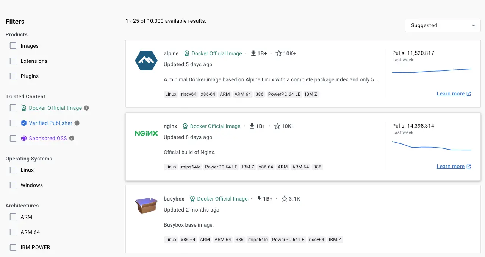

+++
title = "最佳实践"
date = 2024-10-23T14:54:40+08:00
weight = 50
type = "docs"
description = ""
isCJKLanguage = true
draft = false

+++

> 原文：[https://docs.docker.com/build/building/best-practices/](https://docs.docker.com/build/building/best-practices/)
>
> 收录该文档的时间：`2024-10-23T14:54:40+08:00`

# Building best practices - 构建最佳实践

## 使用多阶段构建 Use multi-stage builds

Multi-stage builds let you reduce the size of your final image, by creating a cleaner separation between the building of your image and the final output. Split your Dockerfile instructions into distinct stages to make sure that the resulting output only contains the files that are needed to run the application.

​	多阶段构建可以减少最终镜像的大小，通过在构建镜像和最终输出之间创建清晰的分离。将 Dockerfile 指令分成不同的阶段，确保最终输出仅包含运行应用程序所需的文件。

Using multiple stages can also let you build more efficiently by executing build steps in parallel.

​	使用多阶段构建还可以通过并行执行构建步骤来提高构建效率。

See [Multi-stage builds]() for more information.

​	有关详细信息，请参阅[多阶段构建]()。

### 创建可复用的阶段 Create reusable stages

If you have multiple images with a lot in common, consider creating a reusable stage that includes the shared components, and basing your unique stages on that. Docker only needs to build the common stage once. This means that your derivative images use memory on the Docker host more efficiently and load more quickly.

​	如果您有多个相似的镜像，可以创建一个包含共享组件的可复用阶段，并在此基础上构建各自独特的阶段。Docker 只需构建一次共享阶段，从而更有效地利用 Docker 主机上的内存并加快加载速度。

It's also easier to maintain a common base stage ("Don't repeat yourself"), than it is to have multiple different stages doing similar things.

​	维护一个通用的基础阶段比多个相似的不同阶段更易于管理（“不要重复自己”）。

## 选择合适的基础镜像 Choose the right base image

The first step towards achieving a secure image is to choose the right base image. When choosing an image, ensure it's built from a trusted source and keep it small.

​	实现安全镜像的第一步是选择合适的基础镜像。选择镜像时，确保它来自可信来源并保持较小。

- [Docker Official Images](https://hub.docker.com/search?image_filter=official) are some of the most secure and dependable images on Docker Hub. Typically, Docker Official images have few or no packages containing CVEs, and are thoroughly reviewed by Docker and project maintainers.
  - [Docker 官方镜像](https://hub.docker.com/search?image_filter=official)是 Docker Hub 上一些最安全可靠的镜像。官方镜像通常不包含或极少包含 CVE 漏洞，并由 Docker 和项目维护者彻底审核。

- [Verified Publisher](https://hub.docker.com/search?image_filter=store) images are high-quality images published and maintained by the organizations partnering with Docker, with Docker verifying the authenticity of the content in their repositories.
  - [验证的发布者镜像](https://hub.docker.com/search?image_filter=store)由与 Docker 合作的组织发布和维护，并由 Docker 验证其内容的真实性。

- [Docker-Sponsored Open Source](https://hub.docker.com/search?image_filter=open_source) are published and maintained by open source projects sponsored by Docker through an [open source program]().
  - [Docker 赞助的开源](https://hub.docker.com/search?image_filter=open_source)镜像由通过 Docker [开源项目计划]()赞助的开源项目发布和维护。


When you pick your base image, look out for the badges indicating that the image is part of these programs.

​	选择基础镜像时，注意这些项目的徽章标识。



When building your own image from a Dockerfile, ensure you choose a minimal base image that matches your requirements. A smaller base image not only offers portability and fast downloads, but also shrinks the size of your image and minimizes the number of vulnerabilities introduced through the dependencies.

​	从 Dockerfile 构建自己的镜像时，选择一个满足需求的最小基础镜像。较小的基础镜像不仅便于移植和快速下载，还能缩小镜像大小并减少依赖项引入的漏洞数量。

You should also consider using two types of base image: one for building and unit testing, and another (typically slimmer) image for production. In the later stages of development, your image may not require build tools such as compilers, build systems, and debugging tools. A small image with minimal dependencies can considerably lower the attack surface.

​	您还可以考虑使用两种类型的基础镜像：一种用于构建和单元测试，另一种（通常更小）用于生产。开发的后期阶段可能不需要构建工具，例如编译器、构建系统和调试工具。一个依赖性少的小型镜像可以显著降低攻击面。

## 经常重建镜像 Rebuild your images often

Docker images are immutable. Building an image is taking a snapshot of that image at that moment. That includes any base images, libraries, or other software you use in your build. To keep your images up-to-date and secure, make sure to rebuild your image often, with updated dependencies.

​	Docker 镜像是不可变的。构建镜像就相当于在当时对镜像进行快照，这包括任何基础镜像、库或构建中使用的其他软件。为保持镜像的最新和安全，务必经常重建镜像并更新依赖项。

To ensure that you're getting the latest versions of dependencies in your build, you can use the `--no-cache` option to avoid cache hits.

​	为确保构建中获取到最新版本的依赖项，可以使用 `--no-cache` 选项以避免缓存命中。


```console
$ docker build --no-cache -t my-image:my-tag .
```

The following Dockerfile uses the `24.04` tag of the `ubuntu` image. Over time, that tag may resolve to a different underlying version of the `ubuntu` image, as the publisher rebuilds the image with new security patches and updated libraries. Using the `--no-cache`, you can avoid cache hits and ensure a fresh download of base images and dependencies.

​	以下 Dockerfile 使用了 `ubuntu` 镜像的 `24.04` 标签。随着时间推移，当发布者用新的安全补丁和更新的库重建镜像时，该标签可能解析为不同的基础镜像版本。使用 `--no-cache` 可以避免缓存命中，确保基础镜像和依赖项的最新下载。


```dockerfile
# syntax=docker/dockerfile:1
FROM ubuntu:24.04
RUN apt-get -y update && apt-get install -y python
```

Also consider [pinning base image versions](https://docs.docker.com/build/building/best-practices/#pin-base-image-versions).

​	还可以考虑[锁定基础镜像版本](https://docs.docker.com/build/building/best-practices/#pin-base-image-versions)。

## 使用 .dockerignore 排除文件 Exclude with .dockerignore

To exclude files not relevant to the build, without restructuring your source repository, use a `.dockerignore` file. This file supports exclusion patterns similar to `.gitignore` files.

​	要排除与构建无关的文件而无需重新构建源代码库，可以使用 `.dockerignore` 文件。此文件支持类似于 `.gitignore` 文件的排除模式。

For example, to exclude all files with the `.md` extension:

​	例如，要排除所有 `.md` 扩展名的文件：


```plaintext
*.md
```

For information on creating one, see [Dockerignore file](https://docs.docker.com/build/concepts/context/#dockerignore-files).

​	有关创建 `.dockerignore` 文件的信息，请参阅[Dockerignore 文件](https://docs.docker.com/build/concepts/context/#dockerignore-files)。

## 创建临时容器 Create ephemeral containers

The image defined by your Dockerfile should generate containers that are as ephemeral as possible. Ephemeral means that the container can be stopped and destroyed, then rebuilt and replaced with an absolute minimum set up and configuration.

​	您的 Dockerfile 定义的镜像应尽可能生成短暂的容器。临时容器意味着可以停止并销毁该容器，然后通过最少的设置和配置重新构建和替换它。

Refer to [Processes](https://12factor.net/processes) under *The Twelve-factor App* methodology to get a feel for the motivations of running containers in such a stateless fashion.

​	参考 *十二要素应用* 中的 [进程](https://12factor.net/processes) 章节，以了解以无状态方式运行容器的动机。

## 不要安装不必要的软件包 Don't install unnecessary packages

Avoid installing extra or unnecessary packages just because they might be nice to have. For example, you don’t need to include a text editor in a database image.

​	避免仅因为觉得方便而安装额外的或不必要的软件包。例如，数据库镜像中不需要包含文本编辑器。

When you avoid installing extra or unnecessary packages, your images have reduced complexity, reduced dependencies, reduced file sizes, and reduced build times.

​	避免安装多余的软件包可以减少镜像的复杂性、依赖性、文件大小和构建时间。

## 解耦应用程序 Decouple applications

Each container should have only one concern. Decoupling applications into multiple containers makes it easier to scale horizontally and reuse containers. For instance, a web application stack might consist of three separate containers, each with its own unique image, to manage the web application, database, and an in-memory cache in a decoupled manner.

​	每个容器应该只关注一个职责。将应用程序解耦到多个容器中更容易水平扩展和复用容器。例如，一个 Web 应用栈可能包含三个独立的容器，每个容器都有其唯一的镜像，用于管理 Web 应用程序、数据库和内存缓存，以解耦的方式运行。

Limiting each container to one process is a good rule of thumb, but it's not a hard and fast rule. For example, not only can containers be [spawned with an init process](https://docs.docker.com/engine/containers/run/#specify-an-init-process), some programs might spawn additional processes of their own accord. For instance, [Celery](https://docs.celeryproject.org/) can spawn multiple worker processes, and [Apache](https://httpd.apache.org/) can create one process per request.

​	将每个容器限制为一个进程是一个好的规则，但不是硬性规定。例如，不仅可以[使用 init 进程启动容器](https://docs.docker.com/engine/containers/run/#specify-an-init-process)，某些程序还可能会自行生成多个进程。例如，[Celery](https://docs.celeryproject.org/) 可以生成多个工作进程，而 [Apache](https://httpd.apache.org/) 可以为每个请求创建一个进程。

Use your best judgment to keep containers as clean and modular as possible. If containers depend on each other, you can use [Docker container networks]() to ensure that these containers can communicate.

​	请根据实际情况判断，保持容器尽可能简洁和模块化。如果容器之间存在依赖关系，可以使用 [Docker 容器网络]()确保这些容器之间能够通信。

## 排序多行参数 Sort multi-line arguments

Whenever possible, sort multi-line arguments alphanumerically to make maintenance easier. This helps to avoid duplication of packages and make the list much easier to update. This also makes PRs a lot easier to read and review. Adding a space before a backslash (`\`) helps as well.

​	尽可能对多行参数进行字母数字顺序排序，以便于维护。这有助于避免包重复，并使列表更易于更新。添加反斜杠 (`\`) 前的空格也有助于阅读。

Here’s an example from the [buildpack-deps image](https://github.com/docker-library/buildpack-deps):

​	以下是 [buildpack-deps 镜像](https://github.com/docker-library/buildpack-deps)中的一个示例：


```dockerfile
RUN apt-get update && apt-get install -y \
  bzr \
  cvs \
  git \
  mercurial \
  subversion \
  && rm -rf /var/lib/apt/lists/*
```

## 利用构建缓存 Leverage build cache

When building an image, Docker steps through the instructions in your Dockerfile, executing each in the order specified. For each instruction, Docker checks whether it can reuse the instruction from the build cache.

​	在构建镜像时，Docker 会按指定顺序逐步执行 Dockerfile 中的指令。对于每个指令，Docker 会检查是否可以从构建缓存中重用该指令。

Understanding how the build cache works, and how cache invalidation occurs, is critical for ensuring faster builds. For more information about the Docker build cache and how to optimize your builds, see [Docker build cache]().

​	理解构建缓存的工作原理以及缓存失效的情况对于加速构建至关重要。有关 Docker 构建缓存以及如何优化构建的更多信息，请参阅 [Docker 构建缓存]()。

## 固定基础镜像版本 Pin base image versions

Image tags are mutable, meaning a publisher can update a tag to point to a new image. This is useful because it lets publishers update tags to point to newer versions of an image. And as an image consumer, it means you automatically get the new version when you re-build your image.

​	镜像标签是可变的，发布者可以更新标签以指向新镜像。这使得发布者能够将标签更新到镜像的新版本，而作为镜像使用者，这意味着您在重新构建镜像时自动获取新版本。

For example, if you specify `FROM alpine:3.19` in your Dockerfile, `3.19` resolves to the latest patch version for `3.19`.

​	例如，如果您在 Dockerfile 中指定 `FROM alpine:3.19`，则 `3.19` 会解析为 `3.19` 的最新修订版本。


```dockerfile
# syntax=docker/dockerfile:1
FROM alpine:3.19
```

At one point in time, the `3.19` tag might point to version 3.19.1 of the image. If you rebuild the image 3 months later, the same tag might point to a different version, such as 3.19.4. This publishing workflow is best practice, and most publishers use this tagging strategy, but it isn't enforced.

​	在某个时间点上，`3.19` 标签可能指向镜像的 3.19.1 版本。如果您在 3 个月后重建镜像，同一标签可能指向另一个版本，如 3.19.4。这种发布流程是最佳实践，大多数发布者都使用这种标签策略，但这并非强制执行的。

The downside with this is that you're not guaranteed to get the same for every build. This could result in breaking changes, and it means you also don't have an audit trail of the exact image versions that you're using.

​	缺点是每次构建时不保证获得完全相同的内容，这可能导致意外变化，同时您也没有确切的镜像版本的审计记录。

To fully secure your supply chain integrity, you can pin the image version to a specific digest. By pinning your images to a digest, you're guaranteed to always use the same image version, even if a publisher replaces the tag with a new image. For example, the following Dockerfile pins the Alpine image to the same tag as earlier, `3.19`, but this time with a digest reference as well.

​	为确保供应链的完整性，您可以将镜像版本固定到特定的摘要。通过将镜像固定到摘要，即使发布者替换了标签，您仍然可以确保使用相同的镜像版本。例如，以下 Dockerfile 将 Alpine 镜像固定到 `3.19` 标签，同时指定了摘要。


```dockerfile
# syntax=docker/dockerfile:1
FROM alpine:3.19@sha256:13b7e62e8df80264dbb747995705a986aa530415763a6c58f84a3ca8af9a5bcd
```

With this Dockerfile, even if the publisher updates the `3.19` tag, your builds would still use the pinned image version: `13b7e62e8df80264dbb747995705a986aa530415763a6c58f84a3ca8af9a5bcd`.

​	使用此 Dockerfile，即使发布者更新 `3.19` 标签，您的构建仍然会使用固定的镜像版本：`13b7e62e8df80264dbb747995705a986aa530415763a6c58f84a3ca8af9a5bcd`。

While this helps you avoid unexpected changes, it's also more tedious to have to look up and include the image digest for base image versions manually each time you want to update it. And you're opting out of automated security fixes, which is likely something you want to get.

​	虽然这样可以避免意外的更改，但也会增加手动查找和包含镜像摘要的负担，同时您也将失去自动安全修复的好处。

Docker Scout's default [**Up-to-Date Base Images** policy](https://docs.docker.com/scout/policy/#up-to-date-base-images) checks whether the base image version you're using is in fact the latest version. This policy also checks if pinned digests in your Dockerfile correspond to the correct version. If a publisher updates an image that you've pinned, the policy evaluation returns a non-compliant status, indicating that you should update your image.

​	Docker Scout 的默认[**最新基础镜像**策略](https://docs.docker.com/scout/policy/#up-to-date-base-images)检查您使用的基础镜像版本是否为最新版本，并检查 Dockerfile 中固定的摘要是否对应正确的版本。如果发布者更新了您固定的镜像，该策略评估会返回不合规状态，提示您更新镜像。

Docker Scout also supports an automated remediation workflow for keeping your base images up-to-date. When a new image digest is available, Docker Scout can automatically raise a pull request on your repository to update your Dockerfiles to use the latest version. This is better than using a tag that changes the version automatically, because you're in control and you have an audit trail of when and how the change occurred.

​	Docker Scout 还支持自动修复工作流来保持基础镜像的更新。当有新镜像摘要可用时，Docker Scout 可自动在您的仓库中发起拉取请求以更新 Dockerfile 使用最新版本。这比使用自动变更的标签更好，因为您可以控制变更并拥有变更记录。

For more information about automatically updating your base images with Docker Scout, see [Remediation]().

​	有关使用 Docker Scout 自动更新基础镜像的更多信息，请参阅 [修复]()。

## 在 CI 中构建并测试镜像 Build and test your images in CI

When you check in a change to source control or create a pull request, use [GitHub Actions]() or another CI/CD pipeline to automatically build and tag a Docker image and test it.

​	在提交代码变更到源码控制或创建拉取请求时，使用 [GitHub Actions]()或其他 CI/CD 管道来自动构建和标记 Docker 镜像并对其进行测试。

## Dockerfile 指令 Dockerfile instructions

Follow these recommendations on how to properly use the [Dockerfile instructions]() to create an efficient and maintainable Dockerfile.

​	遵循以下建议，正确使用 [Dockerfile 指令]()以创建高效且易于维护的 Dockerfile。

### FROM

Whenever possible, use current official images as the basis for your images. Docker recommends the [Alpine image](https://hub.docker.com/_/alpine/) as it is tightly controlled and small in size (currently under 6 MB), while still being a full Linux distribution.

​	尽可能使用当前的官方镜像作为基础镜像。Docker 推荐使用 [Alpine 镜像](https://hub.docker.com/_/alpine/)，它体积小（当前小于 6 MB），但仍然是一个完整的 Linux 发行版。

For more information about the `FROM` instruction, see [Dockerfile reference for the FROM instruction](https://docs.docker.com/reference/dockerfile/#from).

​	有关 `FROM` 指令的更多信息，请参阅 [Dockerfile 中的 FROM 指令参考](https://docs.docker.com/reference/dockerfile/#from)。

### LABEL

You can add labels to your image to help organize images by project, record licensing information, to aid in automation, or for other reasons. For each label, add a line beginning with `LABEL` with one or more key-value pairs. The following examples show the different acceptable formats. Explanatory comments are included inline.

​	您可以向镜像添加标签，以帮助按项目组织镜像、记录许可信息、帮助自动化或其他目的。每个标签可以使用以 `LABEL` 开头的行，包含一个或多个键值对。以下示例展示了不同的可接受格式，解释性注释包含在行内。

Strings with spaces must be quoted or the spaces must be escaped. Inner quote characters (`"`), must also be escaped. For example:

​	带有空格的字符串必须加引号或转义空格。内部的引号字符（`"`）也必须转义。例如：


```dockerfile
# Set one or more individual labels
# 设置一个或多个独立标签
LABEL com.example.version="0.0.1-beta"
LABEL vendor1="ACME Incorporated"
LABEL vendor2=ZENITH\ Incorporated
LABEL com.example.release-date="2015-02-12"
LABEL com.example.version.is-production=""
```

An image can have more than one label. Prior to Docker 1.10, it was recommended to combine all labels into a single `LABEL` instruction, to prevent extra layers from being created. This is no longer necessary, but combining labels is still supported. For example:

​	一个镜像可以有多个标签。在 Docker 1.10 之前，建议将所有标签合并到一个 `LABEL` 指令中，以防止创建额外层。现在不再需要这样做，但合并标签仍然被支持。例如：


```dockerfile
# Set multiple labels on one line
# 在一行上设置多个标签
LABEL com.example.version="0.0.1-beta" com.example.release-date="2015-02-12"
```

The above example can also be written as:

​	上面的示例也可以写成：


```dockerfile
# Set multiple labels at once, using line-continuation characters to break long lines
# 
LABEL vendor=ACME\ Incorporated \
      com.example.is-beta= \
      com.example.is-production="" \
      com.example.version="0.0.1-beta" \
      com.example.release-date="2015-02-12"
```

See [Understanding object labels]() for guidelines about acceptable label keys and values. For information about querying labels, refer to the items related to filtering in [Managing labels on objects](https://docs.docker.com/engine/manage-resources/labels/#manage-labels-on-objects). See also [LABEL](https://docs.docker.com/reference/dockerfile/#label) in the Dockerfile reference.

​	请参阅[理解对象标签]()以了解有关可接受标签键和值的准则。有关查询标签的信息，请参考[管理对象标签](https://docs.docker.com/engine/manage-resources/labels/#manage-labels-on-objects)中的相关内容。还可以参见 Dockerfile 参考中的 [LABEL](https://docs.docker.com/reference/dockerfile/#label)。

### RUN

Split long or complex `RUN` statements on multiple lines separated with backslashes to make your Dockerfile more readable, understandable, and maintainable.

​	将长或复杂的 `RUN` 语句分成多行，用反斜杠分隔，使您的 Dockerfile 更易读、易理解和易于维护。

For example, you can chain commands with the `&&` operator, and use use escape characters to break long commands into multiple lines.

​	例如，您可以使用 `&&` 运算符链接命令，并使用转义字符将长命令分成多行。


```dockerfile
RUN apt-get update && apt-get install -y \
    package-bar \
    package-baz \
    package-foo
```

By default, backslash escapes a newline character, but you can change it with the [`escape` directive](https://docs.docker.com/reference/dockerfile/#escape).

​	默认情况下，反斜杠转义换行符，但您可以使用 [`escape` 指令](https://docs.docker.com/reference/dockerfile/#escape)更改它。

You can also use here documents to run multiple commands without chaining them with a pipeline operator:

​	您还可以使用 Here 文档运行多个命令，而无需使用管道操作符将它们链接在一起：


```dockerfile
RUN <<EOF
apt-get update
apt-get install -y \
    package-bar \
    package-baz \
    package-foo
EOF
```

For more information about `RUN`, see [Dockerfile reference for the RUN instruction](https://docs.docker.com/reference/dockerfile/#run).

​	有关 `RUN` 的更多信息，请参阅 [Dockerfile 中的 RUN 指令参考](https://docs.docker.com/reference/dockerfile/#run)。

#### apt-get

One common use case for `RUN` instructions in Debian-based images is to install software using `apt-get`. Because `apt-get` installs packages, the `RUN apt-get` command has several counter-intuitive behaviors to look out for.

​	在基于 Debian 的镜像中，`RUN` 指令的一个常见用例是使用 `apt-get` 安装软件。由于 `apt-get` 安装包，`RUN apt-get` 命令有几个需要注意的点。

Always combine `RUN apt-get update` with `apt-get install` in the same `RUN` statement. For example:

​	始终将 `RUN apt-get update` 与 `apt-get install` 组合在同一条 `RUN` 语句中。例如：


```dockerfile
RUN apt-get update && apt-get install -y \
    package-bar \
    package-baz \
    package-foo
```

Using `apt-get update` alone in a `RUN` statement causes caching issues and subsequent `apt-get install` instructions to fail. For example, this issue will occur in the following Dockerfile:

​	在单独的 `RUN` 语句中使用 `apt-get update` 会导致缓存问题，并导致后续 `apt-get install` 指令失败。例如，以下 Dockerfile 中就会出现此问题：


```dockerfile
# syntax=docker/dockerfile:1

FROM ubuntu:22.04
RUN apt-get update
RUN apt-get install -y curl
```

After building the image, all layers are in the Docker cache. Suppose you later modify `apt-get install` by adding an extra package as shown in the following Dockerfile:

​	构建镜像后，所有层都存储在 Docker 缓存中。假设稍后修改 `apt-get install`，添加了一个额外的包，如下所示：

```dockerfile
# syntax=docker/dockerfile:1

FROM ubuntu:22.04
RUN apt-get update
RUN apt-get install -y curl nginx
```

Docker sees the initial and modified instructions as identical and reuses the cache from previous steps. As a result the `apt-get update` isn't executed because the build uses the cached version. Because the `apt-get update` isn't run, your build can potentially get an outdated version of the `curl` and `nginx` packages.

​	Docker 会将初始指令和修改后的指令视为相同，并从上一步重用缓存。因此，`apt-get update` 并不会执行，因为构建使用了缓存版本。由于没有执行 `apt-get update`，您的构建可能会获取到过期的 `curl` 和 `nginx` 包版本。

Using `RUN apt-get update && apt-get install -y` ensures your Dockerfile installs the latest package versions with no further coding or manual intervention. This technique is known as cache busting. You can also achieve cache busting by specifying a package version. This is known as version pinning. For example:

​	使用 `RUN apt-get update && apt-get install -y` 确保您的 Dockerfile 安装最新的包版本，无需额外编码或手动干预。这种技术称为缓存失效。您还可以通过指定包版本来实现缓存失效，这被称为版本固定。例如：


```dockerfile
RUN apt-get update && apt-get install -y \
    package-bar \
    package-baz \
    package-foo=1.3.*
```

Version pinning forces the build to retrieve a particular version regardless of what’s in the cache. This technique can also reduce failures due to unanticipated changes in required packages.

​	版本固定强制构建检索特定版本，而不管缓存中有什么内容。这种技术还可以减少由于包变更导致的失败。

Below is a well-formed `RUN` instruction that demonstrates all the `apt-get` recommendations.

​	以下是一个规范的 `RUN` 指令，展示了所有 `apt-get` 推荐的最佳实践。


```dockerfile
RUN apt-get update && apt-get install -y \
    aufs-tools \
    automake \
    build-essential \
    curl \
    dpkg-sig \
    libcap-dev \
    libsqlite3-dev \
    mercurial \
    reprepro \
    ruby1.9.1 \
    ruby1.9.1-dev \
    s3cmd=1.1.* \
    && rm -rf /var/lib/apt/lists/*
```

The `s3cmd` argument specifies a version `1.1.*`. If the image previously used an older version, specifying the new one causes a cache bust of `apt-get update` and ensures the installation of the new version. Listing packages on each line can also prevent mistakes in package duplication.

​	`s3cmd` 参数指定了版本 `1.1.*`。如果镜像先前使用了较旧版本，指定新版本会导致 `apt-get update` 缓存失效，并确保安装新版本。每行列出包也可以防止包重复错误。

In addition, when you clean up the apt cache by removing `/var/lib/apt/lists` it reduces the image size, since the apt cache isn't stored in a layer. Since the `RUN` statement starts with `apt-get update`, the package cache is always refreshed prior to `apt-get install`.

​	此外，通过删除 `/var/lib/apt/lists` 清理 apt 缓存可以减少镜像大小，因为 apt 缓存不会存储在层中。由于 `RUN` 语句以 `apt-get update` 开头，因此在 `apt-get install` 之前始终刷新包缓存。

Official Debian and Ubuntu images [automatically run `apt-get clean`](https://github.com/moby/moby/blob/03e2923e42446dbb830c654d0eec323a0b4ef02a/contrib/mkimage/debootstrap#L82-L105), so explicit invocation is not required.

​	官方的 Debian 和 Ubuntu 镜像会[自动运行 `apt-get clean`](https://github.com/moby/moby/blob/03e2923e42446dbb830c654d0eec323a0b4ef02a/contrib/mkimage/debootstrap#L82-L105)，因此不需要显式调用。

#### 使用管道 Using pipes

Some `RUN` commands depend on the ability to pipe the output of one command into another, using the pipe character (`|`), as in the following example:

​	一些 `RUN` 命令依赖于将一个命令的输出通过管道字符 (`|`) 传递给另一个命令，例如以下示例：


```dockerfile
RUN wget -O - https://some.site | wc -l > /number
```

Docker executes these commands using the `/bin/sh -c` interpreter, which only evaluates the exit code of the last operation in the pipe to determine success. In the example above, this build step succeeds and produces a new image so long as the `wc -l` command succeeds, even if the `wget` command fails.

​	Docker 使用 `/bin/sh -c` 解释器执行这些命令，它只会检查管道中最后一个操作的退出码来确定是否成功。在上例中，只要 `wc -l` 命令成功，构建步骤就会成功并生成新镜像，即使 `wget` 命令失败。

If you want the command to fail due to an error at any stage in the pipe, prepend `set -o pipefail &&` to ensure that an unexpected error prevents the build from inadvertently succeeding. For example:

​	如果希望管道中任何阶段出错时都导致失败，可以在命令前加上 `set -o pipefail &&`，确保在出现意外错误时构建不会错误地成功。例如：


```dockerfile
RUN set -o pipefail && wget -O - https://some.site | wc -l > /number
```

> **Note**
>
> 
>
> Not all shells support the `-o pipefail` option.
>
> ​	并非所有 shell 都支持 `-o pipefail` 选项。
>
> In cases such as the `dash` shell on Debian-based images, consider using the *exec* form of `RUN` to explicitly choose a shell that does support the `pipefail` option. For example:
>
> ​	 在某些情况下（如 Debian 系镜像中的 `dash` shell），请考虑使用 `RUN` 的 *exec* 形式来显式选择支持 `pipefail` 选项的 shell，例如：
>
> 
>
> ```dockerfile
> RUN ["/bin/bash", "-c", "set -o pipefail && wget -O - https://some.site | wc -l > /number"]
> ```

### CMD

The `CMD` instruction should be used to run the software contained in your image, along with any arguments. `CMD` should almost always be used in the form of `CMD ["executable", "param1", "param2"]`. Thus, if the image is for a service, such as Apache and Rails, you would run something like `CMD ["apache2","-DFOREGROUND"]`. Indeed, this form of the instruction is recommended for any service-based image.

​	`CMD` 指令用于运行镜像中的软件及其参数。`CMD` 应该几乎总是使用 `CMD ["可执行文件", "参数1", "参数2"]` 形式。例如，若镜像用于服务（如 Apache 或 Rails），可以运行类似 `CMD ["apache2", "-DFOREGROUND"]` 的命令。这种指令形式适用于任何服务型镜像。

In most other cases, `CMD` should be given an interactive shell, such as bash, python and perl. For example, `CMD ["perl", "-de0"]`, `CMD ["python"]`, or `CMD ["php", "-a"]`. Using this form means that when you execute something like `docker run -it python`, you’ll get dropped into a usable shell, ready to go. `CMD` should rarely be used in the manner of `CMD ["param", "param"]` in conjunction with [`ENTRYPOINT`](https://docs.docker.com/reference/dockerfile/#entrypoint), unless you and your expected users are already quite familiar with how `ENTRYPOINT` works.

​	在大多数其他情况下，`CMD` 应该提供一个交互式 shell，如 `bash`、`python` 和 `perl`。例如，`CMD ["perl", "-de0"]`、`CMD ["python"]` 或 `CMD ["php", "-a"]`。这样，执行类似 `docker run -it python` 的命令时，就会进入一个可用的 shell。除非您和用户熟悉 [`ENTRYPOINT`](https://docs.docker.com/reference/dockerfile/#entrypoint) 的工作方式，否则不应将 `CMD ["参数", "参数"]` 与 `ENTRYPOINT` 配合使用。

For more information about `CMD`, see [Dockerfile reference for the CMD instruction](https://docs.docker.com/reference/dockerfile/#cmd).

​	有关 `CMD` 的更多信息，请参见 [Dockerfile 中 CMD 指令参考](https://docs.docker.com/reference/dockerfile/#cmd)。

### EXPOSE

The `EXPOSE` instruction indicates the ports on which a container listens for connections. Consequently, you should use the common, traditional port for your application. For example, an image containing the Apache web server would use `EXPOSE 80`, while an image containing MongoDB would use `EXPOSE 27017` and so on.

​	`EXPOSE` 指令用于指示容器监听连接的端口。因此，应使用应用的常用端口。例如，包含 Apache 服务器的镜像使用 `EXPOSE 80`，包含 MongoDB 的镜像使用 `EXPOSE 27017`，依此类推。

For external access, your users can execute `docker run` with a flag indicating how to map the specified port to the port of their choice. For container linking, Docker provides environment variables for the path from the recipient container back to the source (for example, `MYSQL_PORT_3306_TCP`).

​	用户可以在执行 `docker run` 时通过标志指定如何将该端口映射到他们选择的端口。对于容器连接，Docker 提供了从接收容器返回到源的路径的环境变量（例如，`MYSQL_PORT_3306_TCP`）。

For more information about `EXPOSE`, see [Dockerfile reference for the EXPOSE instruction](https://docs.docker.com/reference/dockerfile/#expose).

​	有关 `EXPOSE` 的更多信息，请参见 [Dockerfile 中 EXPOSE 指令参考](https://docs.docker.com/reference/dockerfile/#expose)。

### ENV

To make new software easier to run, you can use `ENV` to update the `PATH` environment variable for the software your container installs. For example, `ENV PATH=/usr/local/nginx/bin:$PATH` ensures that `CMD ["nginx"]` just works.

​	为了更方便地运行新软件，可以使用 `ENV` 来更新容器安装软件的 `PATH` 环境变量。例如，`ENV PATH=/usr/local/nginx/bin:$PATH` 可确保 `CMD ["nginx"]` 能直接运行。

The `ENV` instruction is also useful for providing the required environment variables specific to services you want to containerize, such as Postgres’s `PGDATA`.

​	`ENV` 指令还用于设置特定服务所需的环境变量，如 Postgres 的 `PGDATA`。

Lastly, `ENV` can also be used to set commonly used version numbers so that version bumps are easier to maintain, as seen in the following example:

​	最后，`ENV` 也可用于设置常用的版本号，以便更轻松地维护版本更新，如下所示：


```dockerfile
ENV PG_MAJOR=9.3
ENV PG_VERSION=9.3.4
RUN curl -SL https://example.com/postgres-$PG_VERSION.tar.xz | tar -xJC /usr/src/postgres && …
ENV PATH=/usr/local/postgres-$PG_MAJOR/bin:$PATH
```

Similar to having constant variables in a program, as opposed to hard-coding values, this approach lets you change a single `ENV` instruction to automatically bump the version of the software in your container.

​	类似于程序中的常量变量，这种方法允许您更改一个 `ENV` 指令，即可自动更新容器中软件的版本。

Each `ENV` line creates a new intermediate layer, just like `RUN` commands. This means that even if you unset the environment variable in a future layer, it still persists in this layer and its value can be dumped. You can test this by creating a Dockerfile like the following, and then building it.

​	每个 `ENV` 行会创建一个新的中间层，就像 `RUN` 命令一样。这意味着即使在后续层中取消设置环境变量，该变量仍然在此层中存在并可以被读取。可以通过构建以下 Dockerfile 进行测试。


```dockerfile
# syntax=docker/dockerfile:1
FROM alpine
ENV ADMIN_USER="mark"
RUN echo $ADMIN_USER > ./mark
RUN unset ADMIN_USER
```


```console
$ docker run --rm test sh -c 'echo $ADMIN_USER'

mark
```

To prevent this, and really unset the environment variable, use a `RUN` command with shell commands, to set, use, and unset the variable all in a single layer. You can separate your commands with `;` or `&&`. If you use the second method, and one of the commands fails, the `docker build` also fails. This is usually a good idea. Using `\` as a line continuation character for Linux Dockerfiles improves readability. You could also put all of the commands into a shell script and have the `RUN` command just run that shell script.

​	为了真正取消设置环境变量，请在同一层中设置、使用和取消设置变量，使用 `RUN` 命令的 shell 命令，并用 `;` 或 `&&` 分隔命令。使用第二种方法时，如果有命令失败，`docker build` 也会失败。这通常是一个好主意。使用 `\` 作为 Linux Dockerfile 的换行符可以提高可读性。也可以将所有命令放入脚本中，用 `RUN` 命令运行该脚本。


```dockerfile
# syntax=docker/dockerfile:1
FROM alpine
RUN export ADMIN_USER="mark" \
    && echo $ADMIN_USER > ./mark \
    && unset ADMIN_USER
CMD sh
```


```console
$ docker run --rm test sh -c 'echo $ADMIN_USER'
```

For more information about `ENV`, see [Dockerfile reference for the ENV instruction](https://docs.docker.com/reference/dockerfile/#env).

​	有关 `ENV` 的更多信息，请参见 [Dockerfile 中 ENV 指令参考](https://docs.docker.com/reference/dockerfile/#env)。

### ADD or COPY

`ADD` and `COPY` are functionally similar. `COPY` supports basic copying of files into the container, from the [build context]() or from a stage in a [multi-stage build](). `ADD` supports features for fetching files from remote HTTPS and Git URLs, and extracting tar files automatically when adding files from the build context.

​	`ADD` 和 `COPY` 功能类似。`COPY` 支持从 [构建上下文]()或多阶段构建的阶段中将文件复制到容器中。`ADD` 支持从远程 HTTPS 和 Git URL 获取文件，并在从构建上下文添加文件时自动解压 tar 文件。

You'll mostly want to use `COPY` for copying files from one stage to another in a multi-stage build. If you need to add files from the build context to the container temporarily to execute a `RUN` instruction, you can often substitute the `COPY` instruction with a bind mount instead. For example, to temporarily add a `requirements.txt` file for a `RUN pip install` instruction:

​	在多阶段构建中，您大多数情况下会使用 `COPY` 来将文件从一个阶段复制到另一个阶段。如果您需要暂时将文件添加到容器中以执行 `RUN` 指令，可以用绑定挂载代替 `COPY` 指令。例如，临时添加 `requirements.txt` 文件以进行 `RUN pip install` 指令：


```dockerfile
RUN --mount=type=bind,source=requirements.txt,target=/tmp/requirements.txt \
    pip install --requirement /tmp/requirements.txt
```

Bind mounts are more efficient than `COPY` for including files from the build context in the container. Note that bind-mounted files are only added temporarily for a single `RUN` instruction, and don't persist in the final image. If you need to include files from the build context in the final image, use `COPY`.

​	绑定挂载比 `COPY` 更高效，绑定挂载的文件仅在单个 `RUN` 指令中暂时添加，并不会在最终镜像中保留。如果需要在最终镜像中包含来自构建上下文的文件，使用 `COPY`。

The `ADD` instruction is best for when you need to download a remote artifact as part of your build. `ADD` is better than manually adding files using something like `wget` and `tar`, because it ensures a more precise build cache. `ADD` also has built-in support for checksum validation of the remote resources, and a protocol for parsing branches, tags, and subdirectories from [Git URLs](https://docs.docker.com/reference/cli/docker/buildx/build/#git-repositories).

​	如果需要在构建过程中下载远程文件，`ADD` 是更好的选择。`ADD` 比手动使用 `wget` 和 `tar` 添加文件更精确，并提供了内置的远程资源校验和验证，还支持从 [Git URL](https://docs.docker.com/reference/cli/docker/buildx/build/#git-repositories) 解析分支、标签和子目录的协议。

The following example uses `ADD` to download a .NET installer. Combined with multi-stage builds, only the .NET runtime remains in the final stage, no intermediate files.

​	以下示例使用 `ADD` 下载 .NET 安装程序。结合多阶段构建，最终阶段只保留 .NET 运行时，没有中间文件。


```dockerfile
# syntax=docker/dockerfile:1

FROM scratch AS src
ARG DOTNET_VERSION=8.0.0-preview.6.23329.7
ADD --checksum=sha256:270d731bd08040c6a3228115de1f74b91cf441c584139ff8f8f6503447cebdbb \
    https://dotnetcli.azureedge.net/dotnet/Runtime/$DOTNET_VERSION/dotnet-runtime-$DOTNET_VERSION-linux-arm64.tar.gz /dotnet.tar.gz

FROM mcr.microsoft.com/dotnet/runtime-deps:8.0.0-preview.6-bookworm-slim-arm64v8 AS installer

# Retrieve .NET Runtime
# 获取 .NET 运行时
RUN --mount=from=src,target=/src <<EOF
mkdir -p /dotnet
tar -oxzf /src/dotnet.tar.gz -C /dotnet
EOF

FROM mcr.microsoft.com/dotnet/runtime-deps:8.0.0-preview.6-bookworm-slim-arm64v8

COPY --from=installer /dotnet /usr/share/dotnet
RUN ln -s /usr/share/dotnet/dotnet /usr/bin/dotnet
```

For more information about `ADD` or `COPY`, see the following:

​	有关 `ADD` 或 `COPY` 的更多信息，请参阅以下内容：

- [Dockerfile reference for the ADD instruction](https://docs.docker.com/reference/dockerfile/#add)
  - Dockerfile 中 ADD 指令参考

- [Dockerfile reference for the COPY instruction](https://docs.docker.com/reference/dockerfile/#copy)
  - Dockerfile 中 COPY 指令参考


### ENTRYPOINT

The best use for `ENTRYPOINT` is to set the image's main command, allowing that image to be run as though it was that command, and then use `CMD` as the default flags.

​	`ENTRYPOINT` 最适合用于设置镜像的主要命令，使得该镜像可以直接作为该命令运行，使用 `CMD` 作为默认参数。

The following is an example of an image for the command line tool `s3cmd`:

​	以下是命令行工具 `s3cmd` 的镜像示例：


```dockerfile
ENTRYPOINT ["s3cmd"]
CMD ["--help"]
```

You can use the following command to run the image and show the command's help:

​	您可以运行以下命令来显示帮助：


```console
$ docker run s3cmd
```

Or, you can use the right parameters to execute a command, like in the following example:

​	或者，可以使用正确的参数执行命令，如以下示例所示：


```console
$ docker run s3cmd ls s3://mybucket
```

This is useful because the image name can double as a reference to the binary as shown in the command above.

​	这很有用，因为镜像名称可以作为命令的引用，如上所示。

The `ENTRYPOINT` instruction can also be used in combination with a helper script, allowing it to function in a similar way to the command above, even when starting the tool may require more than one step.

​	`ENTRYPOINT` 也可以与辅助脚本结合使用，允许以类似的方式工作，即使启动工具可能需要多个步骤。

For example, the [Postgres Official Image](https://hub.docker.com/_/postgres/) uses the following script as its `ENTRYPOINT`:

​	例如， [Postgres 官方镜像](https://hub.docker.com/_/postgres/) 使用以下脚本作为其 `ENTRYPOINT`：


```bash
#!/bin/bash
set -e

if [ "$1" = 'postgres' ]; then
    chown -R postgres "$PGDATA"

    if [ -z "$(ls -A "$PGDATA")" ]; then
        gosu postgres initdb
    fi

    exec gosu postgres "$@"
fi

exec "$@"
```

This script uses [the `exec` Bash command](https://wiki.bash-hackers.org/commands/builtin/exec) so that the final running application becomes the container's PID 1. This allows the application to receive any Unix signals sent to the container. For more information, see the [`ENTRYPOINT` reference](https://docs.docker.com/reference/dockerfile/#entrypoint).

​	此脚本使用 [Bash 的 `exec` 命令](https://wiki.bash-hackers.org/commands/builtin/exec)，使最终运行的应用成为容器的 PID 1。这允许应用接收发送到容器的任何 Unix 信号。更多信息请参见 [`ENTRYPOINT` 参考](https://docs.docker.com/reference/dockerfile/#entrypoint)。

In the following example, a helper script is copied into the container and run via `ENTRYPOINT` on container start:

​	在以下示例中，辅助脚本被复制到容器中并在容器启动时通过 `ENTRYPOINT` 运行：


```dockerfile
COPY ./docker-entrypoint.sh /
ENTRYPOINT ["/docker-entrypoint.sh"]
CMD ["postgres"]
```

This script lets you interact with Postgres in several ways.

​	此脚本可以多种方式与 Postgres 交互：

It can simply start Postgres:

​	可以简单地启动 Postgres：

```console
$ docker run postgres
```

Or, you can use it to run Postgres and pass parameters to the server:

​	或者，可以使用它运行 Postgres 并向服务器传递参数：


```console
$ docker run postgres postgres --help
```

Lastly, you can use it to start a totally different tool, such as Bash:

​	最后，可以使用它启动完全不同的工具，如 Bash：


```console
$ docker run --rm -it postgres bash
```

For more information about `ENTRYPOINT`, see [Dockerfile reference for the ENTRYPOINT instruction](https://docs.docker.com/reference/dockerfile/#entrypoint).

​	有关 `ENTRYPOINT` 的更多信息，请参见 [Dockerfile 中 ENTRYPOINT 指令参考](https://docs.docker.com/reference/dockerfile/#entrypoint)。

### VOLUME

You should use the `VOLUME` instruction to expose any database storage area, configuration storage, or files and folders created by your Docker container. You are strongly encouraged to use `VOLUME` for any combination of mutable or user-serviceable parts of your image.

​	应使用 `VOLUME` 指令公开任何数据库存储区、配置存储或 Docker 容器创建的文件和文件夹。强烈建议对镜像中的任何可变或用户可服务的部分使用 `VOLUME`。

For more information about `VOLUME`, see [Dockerfile reference for the VOLUME instruction](https://docs.docker.com/reference/dockerfile/#volume).

​	有关 `VOLUME` 的更多信息，请参见 [Dockerfile 中 VOLUME 指令参考](https://docs.docker.com/reference/dockerfile/#volume)。

### USER

If a service can run without privileges, use `USER` to change to a non-root user. Start by creating the user and group in the Dockerfile with something like the following example:

​	如果服务可以在无权限的情况下运行，请使用 `USER` 切换到非 root 用户。首先在 Dockerfile 中创建用户和组，如以下示例所示：


```dockerfile
RUN groupadd -r postgres && useradd --no-log-init -r -g postgres postgres
```

> **Note**
>
> 
>
> Consider an explicit UID/GID.
>
> ​	考虑显式指定 UID/GID。
>
> Users and groups in an image are assigned a non-deterministic UID/GID in that the "next" UID/GID is assigned regardless of image rebuilds. So, if it’s critical, you should assign an explicit UID/GID.
>
> ​	镜像中的用户和组分配了非确定性的 UID/GID，因为每次重建镜像时都会分配“下一个” UID/GID。因此，如果重要，应指定显式 UID/GID。

> **Note**
>
> 
>
> Due to an [unresolved bug](https://github.com/golang/go/issues/13548) in the Go archive/tar package's handling of sparse files, attempting to create a user with a significantly large UID inside a Docker container can lead to disk exhaustion because `/var/log/faillog` in the container layer is filled with NULL (\0) characters. A workaround is to pass the `--no-log-init` flag to useradd. The Debian/Ubuntu `adduser` wrapper does not support this flag.
>
> ​	由于 Go 的 archive/tar 包处理稀疏文件的 [未解决 bug](https://github.com/golang/go/issues/13548)，在 Docker 容器中尝试创建一个具有显著大 UID 的用户可能会导致磁盘耗尽，因为容器层中的 `/var/log/faillog` 填充了 NULL (\0) 字符。解决方法是为 `useradd` 传递 `--no-log-init` 标志。Debian/Ubuntu 的 `adduser` 包装程序不支持此标志。

Avoid installing or using `sudo` as it has unpredictable TTY and signal-forwarding behavior that can cause problems. If you absolutely need functionality similar to `sudo`, such as initializing the daemon as `root` but running it as non-`root`, consider using [“gosu”](https://github.com/tianon/gosu).

​	避免安装或使用 `sudo`，因为它具有不可预测的 TTY 和信号转发行为，可能导致问题。如果确实需要类似 `sudo` 的功能，例如初始化为 `root` 后以非 `root` 运行，请考虑使用 ["gosu"](https://github.com/tianon/gosu)。

Lastly, to reduce layers and complexity, avoid switching `USER` back and forth frequently.

​	最后，为减少层和复杂性，避免频繁切换 `USER`。

For more information about `USER`, see [Dockerfile reference for the USER instruction](https://docs.docker.com/reference/dockerfile/#user).

​	有关 `USER` 的更多信息，请参见 [Dockerfile 中 USER 指令参考](https://docs.docker.com/reference/dockerfile/#user)。

### WORKDIR

For clarity and reliability, you should always use absolute paths for your `WORKDIR`. Also, you should use `WORKDIR` instead of proliferating instructions like `RUN cd … && do-something`, which are hard to read, troubleshoot, and maintain.

​	为了清晰和可靠，始终应使用 `WORKDIR` 的绝对路径。还应使用 `WORKDIR` 而非繁杂的指令，如 `RUN cd … && do-something`，这些指令难以阅读、排查和维护。

For more information about `WORKDIR`, see [Dockerfile reference for the WORKDIR instruction](https://docs.docker.com/reference/dockerfile/#workdir).

​	有关 `WORKDIR` 的更多信息，请参见 [Dockerfile 中 WORKDIR 指令参考](https://docs.docker.com/reference/dockerfile/#workdir)。

### ONBUILD

An `ONBUILD` command executes after the current Dockerfile build completes. `ONBUILD` executes in any child image derived `FROM` the current image. Think of the `ONBUILD` command as an instruction that the parent Dockerfile gives to the child Dockerfile.

​	`ONBUILD` 命令在当前 Dockerfile 构建完成后执行。`ONBUILD` 在任何从当前镜像派生的子镜像中执行。可以将 `ONBUILD` 视为父 Dockerfile 给子 Dockerfile 的指令。

A Docker build executes `ONBUILD` commands before any command in a child Dockerfile.

​	Docker 构建在子 Dockerfile 的任何命令之前执行 `ONBUILD` 命令。

`ONBUILD` is useful for images that are going to be built `FROM` a given image. For example, you would use `ONBUILD` for a language stack image that builds arbitrary user software written in that language within the Dockerfile, as you can see in [Ruby’s `ONBUILD` variants](https://github.com/docker-library/ruby/blob/c43fef8a60cea31eb9e7d960a076d633cb62ba8d/2.4/jessie/onbuild/Dockerfile).

​	`ONBUILD` 适用于将从某个镜像构建的镜像。例如，可以在语言栈镜像中使用 `ONBUILD`，该镜像在 Dockerfile 中构建用户编写的语言代码，如 [Ruby 的 `ONBUILD` 变体](https://github.com/docker-library/ruby/blob/c43fef8a60cea31eb9e7d960a076d633cb62ba8d/2.4/jessie/onbuild/Dockerfile)。

Images built with `ONBUILD` should get a separate tag. For example, `ruby:1.9-onbuild` or `ruby:2.0-onbuild`.

​	使用 `ONBUILD` 构建的镜像应具有单独的标签。例如，`ruby:1.9-onbuild` 或 `ruby:2.0-onbuild`。

Be careful when putting `ADD` or `COPY` in `ONBUILD`. The onbuild image fails catastrophically if the new build's context is missing the resource being added. Adding a separate tag, as recommended above, helps mitigate this by allowing the Dockerfile author to make a choice.

​	将 `ADD` 或 `COPY` 放入 `ONBUILD` 时要小心。如果新构建的上下文缺少要添加的资源，onbuild 镜像会发生灾难性失败。使用单独的标签可以帮助缓解这个问题，让 Dockerfile 作者可以做出选择。

For more information about `ONBUILD`, see [Dockerfile reference for the ONBUILD instruction](https://docs.docker.com/reference/dockerfile/#onbuild).

​	有关 `ONBUILD` 的更多信息，请参见 [Dockerfile 中 ONBUILD 指令参考](https://docs.docker.com/reference/dockerfile/#onbuild)。
