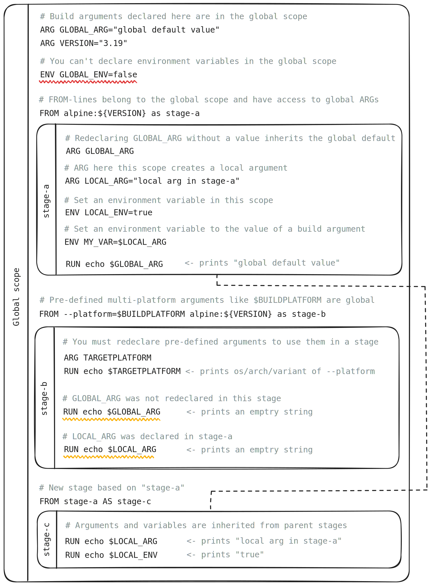

+++
title = "变量"
date = 2024-10-23T14:54:40+08:00
weight = 10
type = "docs"
description = ""
isCJKLanguage = true
draft = false

+++

> 原文：[https://docs.docker.com/build/building/variables/](https://docs.docker.com/build/building/variables/)
>
> 收录该文档的时间：`2024-10-23T14:54:40+08:00`

# Build variables - 构建变量

In Docker Build, build arguments (`ARG`) and environment variables (`ENV`) both serve as a means to pass information into the build process. You can use them to parameterize the build, allowing for more flexible and configurable builds.

​	在 Docker 构建中，构建参数（`ARG`）和环境变量（`ENV`）都可以用来将信息传递到构建过程。您可以使用它们来参数化构建，从而实现更灵活和可配置的构建。

> **Warning**
>
> 
>
> Build arguments and environment variables are inappropriate for passing secrets to your build, because they're exposed in the final image. Instead, use secret mounts or SSH mounts, which expose secrets to your builds securely.
>
> ​	构建参数和环境变量不适合用于将密钥传递给构建，因为它们会暴露在最终镜像中。相反，请使用密钥挂载或 SSH 挂载，以安全的方式将密钥暴露给构建。
>
> See [Build secrets]() for more information.
>
> ​	详见 [构建密钥]()。

## 相似性与差异 Similarities and differences

Build arguments and environment variables are similar. They're both declared in the Dockerfile and can be set using flags for the `docker build` command. Both can be used to parameterize the build. But they each serve a distinct purpose.

​	构建参数和环境变量具有相似之处，它们都在 Dockerfile 中声明，并且可以通过 `docker build` 命令的标志来设置，且都可用于参数化构建。但是，它们各自有不同的用途。

### 构建参数 Build arguments

Build arguments are variables for the Dockerfile itself. Use them to parameterize values of Dockerfile instructions. For example, you might use a build argument to specify the version of a dependency to install.

​	构建参数是 Dockerfile 自身的变量，用于参数化 Dockerfile 指令的值。例如，您可以使用构建参数指定要安装的依赖项的版本。

Build arguments have no effect on the build unless it's used in an instruction. They're not accessible or present in containers instantiated from the image unless explicitly passed through from the Dockerfile into the image filesystem or configuration. They may persist in the image metadata, as provenance attestations and in the image history, which is why they're not suitable for holding secrets.

​	构建参数对构建没有影响，除非在指令中使用。除非在 Dockerfile 中显式传递到镜像文件系统或配置中，否则它们在从镜像实例化的容器中不可访问或存在。它们可能会持久保存到镜像的元数据中，因此不适合用于保存密钥。

They make Dockerfiles more flexible, and easier to maintain.

​	构建参数使 Dockerfile 更加灵活并易于维护。

For an example on how you can use build arguments, see [`ARG` usage example](https://docs.docker.com/build/building/variables/#arg-usage-example).

​	关于如何使用构建参数的示例，请参阅 [`ARG` 使用示例](#arg-使用示例-arg-usage-example)。

### 环境变量 Environment variables

Environment variables are passed through to the build execution environment, and persist in containers instantiated from the image.

​	环境变量会传递到构建执行环境中，并会在从镜像实例化的容器中持久存在。

Environment variables are primarily used to:

​	环境变量主要用于：

- Configure the execution environment for builds
  - 配置构建的执行环境

- Set default environment variables for containers
  - 为容器设置默认的环境变量


Environment variables, if set, can directly influence the execution of your build, and the behavior or configuration of the application.

​	环境变量一旦设置，可以直接影响构建的执行以及应用程序的行为或配置。

You can't override or set an environment variable at build-time. Values for environment variables must be declared in the Dockerfile. You can combine environment variables and build arguments to allow environment variables to be configured at build-time.

​	您不能在构建时覆盖或设置环境变量，必须在 Dockerfile 中声明。可以组合环境变量和构建参数，以允许在构建时配置环境变量。

For an example on how to use environment variables for configuring builds, see [`ENV` usage example](https://docs.docker.com/build/building/variables/#env-usage-example).

​	关于如何使用环境变量配置构建的示例，请参阅 [`ENV` 使用示例](#env-使用示例-env-usage-example)。

## `ARG` 使用示例 `ARG` usage example

Build arguments are commonly used to specify versions of components, such as image variants or package versions, used in a build.

​	构建参数通常用于指定在构建中使用的组件版本，例如镜像版本或包版本。

Specifying versions as build arguments lets build with different versions without having to manually update the Dockerfile. It also makes it easier to maintain the Dockerfile, since it lets you declare versions at the top of the file.

​	将版本指定为构建参数可以在不手动更新 Dockerfile 的情况下使用不同版本进行构建。这也使得 Dockerfile 更易于维护，因为它允许在文件顶部声明版本。

Build arguments can also be a way to reuse a value in multiple places. For example, if you use multiple flavors of `alpine` in your build, you can ensure you're using the same version of `alpine` everywhere:

​	构建参数还可以用来在多个位置重用一个值。例如，如果在构建中使用多个 `alpine` 版本，可以确保在所有地方使用相同的 `alpine` 版本：

- `golang:1.22-alpine${ALPINE_VERSION}`
- `python:3.12-alpine${ALPINE_VERSION}`
- `nginx:1-alpine${ALPINE_VERSION}`

The following example defines the version of `node` and `alpine` using build arguments.

​	以下示例使用构建参数定义了 `node` 和 `alpine` 的版本。

```dockerfile
# syntax=docker/dockerfile:1

ARG NODE_VERSION="20"
ARG ALPINE_VERSION="3.20"

FROM node:${NODE_VERSION}-alpine${ALPINE_VERSION} AS base
WORKDIR /src

FROM base AS build
COPY package*.json ./
RUN npm ci
RUN npm run build

FROM base AS production
COPY package*.json ./
RUN npm ci --omit=dev && npm cache clean --force
COPY --from=build /src/dist/ .
CMD ["node", "app.js"]
```

In this case, the build arguments have default values. Specifying their values when you invoke a build is optional. To override the defaults, you would use the `--build-arg` CLI flag:

​	在此情况下，构建参数具有默认值。构建时指定它们的值是可选的。要覆盖默认值，可以使用 `--build-arg` CLI 标志：

```console
$ docker build --build-arg NODE_VERSION=current .
```

For more information on how to use build arguments, refer to:

​	有关如何使用构建参数的更多信息，请参考：

- [`ARG` Dockerfile reference]()
  - `ARG` Dockerfile 参考

- [`docker build --build-arg` reference]()
  - `docker build --build-arg` 参考


## `ENV` 使用示例 `ENV` usage example

Declaring an environment variable with `ENV` makes the variable available to all subsequent instructions in the build stage. The following example shows an example setting `NODE_ENV` to `production` before installing JavaScript dependencies with `npm`. Setting the variable makes `npm` omits packages needed only for local development.

​	使用 `ENV` 声明环境变量会使该变量在构建阶段的所有后续指令中可用。以下示例展示了在使用 `npm` 安装 JavaScript 依赖项之前，将 `NODE_ENV` 设置为 `production`。设置该变量使 `npm` 省略仅用于本地开发的包。

```dockerfile
# syntax=docker/dockerfile:1

FROM node:20
WORKDIR /app
COPY package*.json ./
ENV NODE_ENV=production
RUN npm ci && npm cache clean --force
COPY . .
CMD ["node", "app.js"]
```

Environment variables aren't configurable at build-time by default. If you want to change the value of an `ENV` at build-time, you can combine environment variables and build arguments:

​	默认情况下，环境变量在构建时不可配置。要在构建时更改 `ENV` 的值，可以组合使用环境变量和构建参数：

```dockerfile
# syntax=docker/dockerfile:1

FROM node:20
ARG NODE_ENV=production
ENV NODE_ENV=$NODE_ENV
WORKDIR /app
COPY package*.json ./
RUN npm ci && npm cache clean --force
COPY . .
CMD ["node", "app.js"]
```

With this Dockerfile, you can use `--build-arg` to override the default value of `ENV`:

​	使用此 Dockerfile，可以使用 `--build-arg` 覆盖 `ENV` 的默认值：

```console
$ docker build --build-arg NODE_ENV=development .
```

Note that, because the environment variables you set persist in containers, using them can lead to unintended side-effects for the application's runtime.

​	请注意，由于您设置的环境变量会在容器中持久存在，使用它们可能会导致应用程序在运行时产生意外的副作用。

For more information on how to use environment variables in builds, refer to:

​	有关如何在构建中使用环境变量的更多信息，请参考：

- [`ENV` Dockerfile reference]()
  - `ENV` Dockerfile 参考


## 作用域 Scoping

Build arguments declared in the global scope of a Dockerfile aren't automatically inherited into the build stages. They're only accessible in the global scope.

​	在 Dockerfile 全局作用域中声明的构建参数不会自动继承到构建阶段。它们只在全局作用域中可访问。


```dockerfile
# syntax=docker/dockerfile:1

# The following build argument is declared in the global scope:
# 以下构建参数在全局作用域中声明：
ARG NAME="joe"

FROM alpine
# The following instruction doesn't have access to the $NAME build argument
# because the argument was defined in the global scope, not for this stage.
# 因为参数在全局作用域中定义，不属于此阶段，所以下面的指令无法访问 $NAME 构建参数
RUN echo "hello ${NAME}!"
```

The `echo` command in this example evaluates to `hello !` because the value of the `NAME` build argument is out of scope. To inherit global build arguments into a stage, you must consume them:

​	在此示例中，`echo` 命令的结果为 `hello !`，因为 `NAME` 构建参数的值超出了作用域。要在阶段中继承全局构建参数，必须在阶段中使用它们：

```dockerfile
# syntax=docker/dockerfile:1

# Declare the build argument in the global scope
# 在全局作用域中声明构建参数
ARG NAME="joe"

FROM alpine
# Consume the build argument in the build stage
# 在构建阶段中使用构建参数
ARG NAME
RUN echo $NAME
```

Once a build argument is declared or consumed in a stage, it's automatically inherited by child stages.

​	一旦在阶段中声明或使用构建参数，它会自动被子阶段继承。

```dockerfile
# syntax=docker/dockerfile:1
FROM alpine AS base
# Declare the build argument in the build stage
# 在构建阶段中声明构建参数
ARG NAME="joe"

# Create a new stage based on "base"
# 基于 "base" 创建新阶段
FROM base AS build
# The NAME build argument is available here
# since it's declared in a parent stage
# 因为在父阶段中声明了 NAME 构建参数，此处可以使用
RUN echo "hello $NAME!"
```

The following diagram further exemplifies how build argument and environment variable inheritance works for multi-stage builds.

​	以下图表进一步展示了构建参数和环境变量在多阶段构建中的继承方式。



## 预定义构建参数 Pre-defined build arguments

This section describes pre-defined build arguments available to all builds by default.

​	本节描述了默认情况下所有构建都可以使用的预定义构建参数。

### 多平台构建参数 Multi-platform build arguments

Multi-platform build arguments describe the build and target platforms for the build.

​	多平台构建参数描述了构建平台和目标平台。

The build platform is the operating system, architecture, and platform variant of the host system where the builder (the BuildKit daemon) is running.

​	构建平台是运行构建器（BuildKit 守护进程）所在的主机系统的操作系统、架构和平台变体。

- `BUILDPLATFORM`
- `BUILDOS`
- `BUILDARCH`
- `BUILDVARIANT`

The target platform arguments hold the same values for the target platforms for the build, specified using the `--platform` flag for the `docker build` command.

​	目标平台参数包含构建目标平台的相同值，可通过 `docker build` 命令的 `--platform` 标志指定。

- `TARGETPLATFORM`
- `TARGETOS`
- `TARGETARCH`
- `TARGETVARIANT`

These arguments are useful for doing cross-compilation in multi-platform builds. They're available in the global scope of the Dockerfile, but they aren't automatically inherited by build stages. To use them inside stage, you must declare them:

​	这些参数在多平台构建中执行交叉编译时非常有用。它们在 Dockerfile 的全局作用域中可用，但不会自动继承到构建阶段中。要在阶段中使用它们，您必须在阶段中声明：

```dockerfile
# syntax=docker/dockerfile:1

# Pre-defined build arguments are available in the global scope
# 预定义构建参数在全局作用域中可用
FROM --platform=$BUILDPLATFORM golang
# To inherit them to a stage, declare them with ARG
# 要继承到阶段中，请使用 ARG 声明
ARG TARGETOS
RUN GOOS=$TARGETOS go build -o ./exe .
```

For more information about multi-platform build arguments, refer to [Multi-platform arguments](https://docs.docker.com/reference/dockerfile/#automatic-platform-args-in-the-global-scope)

​	有关多平台构建参数的更多信息，请参考 [多平台参数]()。

### 代理参数 Proxy arguments

Proxy build arguments let you specify proxies to use for your build. You don't need to declare or reference these arguments in the Dockerfile. Specifying a proxy with `--build-arg` is enough to make your build use the proxy.

​	代理构建参数允许您为构建指定要使用的代理。无需在 Dockerfile 中声明或引用这些参数。使用 `--build-arg` 指定代理即可使构建使用该代理。

Proxy arguments are automatically excluded from the build cache and the output of `docker history` by default. If you do reference the arguments in your Dockerfile, the proxy configuration ends up in the build cache.

​	代理参数默认情况下自动排除在构建缓存和 `docker history` 输出之外。如果在 Dockerfile 中引用了这些参数，代理配置将进入构建缓存。

The builder respects the following proxy build arguments. The variables are case insensitive.

​	构建器支持以下代理构建参数，这些变量对大小写不敏感。

- `HTTP_PROXY`
- `HTTPS_PROXY`
- `FTP_PROXY`
- `NO_PROXY`
- `ALL_PROXY`

To configure a proxy for your build:

​	配置构建代理示例：

```console
$ docker build --build-arg HTTP_PROXY=https://my-proxy.example.com .
```

For more information about proxy build arguments, refer to [Proxy arguments](https://docs.docker.com/reference/dockerfile/#predefined-args).

​	有关代理构建参数的更多信息，请参考 [代理参数]()。

## 构建工具配置变量 Build tool configuration variables

The following environment variables enable, disable, or change the behavior of Buildx and BuildKit. Note that these variables aren't used to configure the build container; they aren't available inside the build and they have no relation to the `ENV` instruction. They're used to configure the Buildx client, or the BuildKit daemon.

​	以下环境变量用于启用、禁用或更改 Buildx 和 BuildKit 的行为。请注意，这些变量不会用于配置构建容器；它们在构建内部不可用，与 `ENV` 指令无关。它们用于配置 Buildx 客户端或 BuildKit 守护进程。

| Variable                                                     | Type              | Description                                                  |
| ------------------------------------------------------------ | ----------------- | ------------------------------------------------------------ |
| [BUILDKIT_COLORS](https://docs.docker.com/build/building/variables/#buildkit_colors) | String            | 配置终端输出的文本颜色。 Configure text color for the terminal output. |
| [BUILDKIT_HOST](https://docs.docker.com/build/building/variables/#buildkit_host) | String            | 指定远程构建器的主机地址。 Specify host to use for remote builders. |
| [BUILDKIT_PROGRESS](https://docs.docker.com/build/building/variables/#buildkit_progress) | String            | 配置进度输出类型。 Configure type of progress output.        |
| [BUILDKIT_TTY_LOG_LINES](https://docs.docker.com/build/building/variables/#buildkit_tty_log_lines) | String            | TTY 模式下活动步骤的日志行数。 Number of log lines (for active steps in TTY mode). |
| [BUILDX_BAKE_GIT_AUTH_HEADER](https://docs.docker.com/build/building/variables/#buildx_bake_git_auth_header) | String            | 远程 Bake 文件的 HTTP 认证方案。 HTTP authentication scheme for remote Bake files. |
| [BUILDX_BAKE_GIT_AUTH_TOKEN](https://docs.docker.com/build/building/variables/#buildx_bake_git_auth_token) | String            | 远程 Bake 文件的 HTTP 认证令牌。 HTTP authentication token for remote Bake files. |
| [BUILDX_BAKE_GIT_SSH](https://docs.docker.com/build/building/variables/#buildx_bake_git_ssh) | String            | 远程 Bake 文件的 SSH 认证。 SSH authentication for remote Bake files. |
| [BUILDX_BUILDER](https://docs.docker.com/build/building/variables/#buildx_builder) | String            | 指定要使用的构建器实例。 Specify the builder instance to use. |
| [BUILDX_CONFIG](https://docs.docker.com/build/building/variables/#buildx_config) | String            | 指定配置、状态和日志的存储位置。 Specify location for configuration, state, and logs. |
| [BUILDX_EXPERIMENTAL](https://docs.docker.com/build/building/variables/#buildx_experimental) | Boolean           | 启用实验性功能。 Turn on experimental features.              |
| [BUILDX_GIT_CHECK_DIRTY](https://docs.docker.com/build/building/variables/#buildx_git_check_dirty) | Boolean           | 启用 Git 脏检查。 Enable dirty Git checkout detection.       |
| [BUILDX_GIT_INFO](https://docs.docker.com/build/building/variables/#buildx_git_info) | Boolean           | 删除溯源认证中的 Git 信息。 Remove Git information in provenance attestations. |
| [BUILDX_GIT_LABELS](https://docs.docker.com/build/building/variables/#buildx_git_labels) | String \| Boolean | 将 Git 溯源标签添加到镜像中。 Add Git provenance labels to images. |
| [BUILDX_NO_DEFAULT_ATTESTATIONS](https://docs.docker.com/build/building/variables/#buildx_no_default_attestations) | Boolean           | 关闭默认溯源认证。 Turn off default provenance attestations. |
| [BUILDX_NO_DEFAULT_LOAD](https://docs.docker.com/build/building/variables/#buildx_no_default_load) | Boolean           | 关闭默认将镜像加载到镜像存储。 Turn off loading images to image store by default. |
| [EXPERIMENTAL_BUILDKIT_SOURCE_POLICY](https://docs.docker.com/build/building/variables/#experimental_buildkit_source_policy) | String            | 指定 BuildKit 源策略文件。 Specify a BuildKit source policy file. |

BuildKit also supports a few additional configuration parameters. Refer to [BuildKit built-in build args](https://docs.docker.com/reference/dockerfile/#buildkit-built-in-build-args).

​	BuildKit 还支持一些其他配置参数。请参考 [BuildKit 内置构建参数]()。

You can express Boolean values for environment variables in different ways. For example, `true`, `1`, and `T` all evaluate to true. Evaluation is done using the `strconv.ParseBool` function in the Go standard library. See the [reference documentation](https://pkg.go.dev/strconv#ParseBool) for details.

​	可以用多种方式表达布尔值环境变量，例如 `true`、`1` 和 `T` 均解析为真。解析是通过 Go 标准库中的 `strconv.ParseBool` 函数进行的。详细信息请参阅 [参考文档](https://pkg.go.dev/strconv#ParseBool)。

### BUILDKIT_COLORS

Changes the colors of the terminal output. Set `BUILDKIT_COLORS` to a CSV string in the following format:

​	更改终端输出的颜色。将 `BUILDKIT_COLORS` 设置为以下格式的 CSV 字符串：


```console
$ export BUILDKIT_COLORS="run=123,20,245:error=yellow:cancel=blue:warning=white"
```

Color values can be any valid RGB hex code, or one of the [BuildKit predefined colors](https://github.com/moby/buildkit/blob/master/util/progress/progressui/colors.go).

​	颜色值可以是任何有效的 RGB 十六进制代码，或 [BuildKit 预定义颜色](https://github.com/moby/buildkit/blob/master/util/progress/progressui/colors.go) 之一。

Setting `NO_COLOR` to anything turns off colorized output, as recommended by [no-color.org](https://no-color.org/).

​	设置 `NO_COLOR` 将关闭彩色输出，参考 [no-color.org](https://no-color.org/) 的建议。

### BUILDKIT_HOST

You use the `BUILDKIT_HOST` to specify the address of a BuildKit daemon to use as a remote builder. This is the same as specifying the address as a positional argument to `docker buildx create`.

​	使用 `BUILDKIT_HOST` 指定要作为远程构建器的 BuildKit 守护进程的地址。这与将地址作为位置参数传递给 `docker buildx create` 相同。

Usage:


```console
$ export BUILDKIT_HOST=tcp://localhost:1234
$ docker buildx create --name=remote --driver=remote
```

If you specify both the `BUILDKIT_HOST` environment variable and a positional argument, the argument takes priority.

​	如果同时指定了 `BUILDKIT_HOST` 环境变量和位置参数，位置参数优先。

### BUILDKIT_PROGRESS

Sets the type of the BuildKit progress output. Valid values are:

​	设置 BuildKit 进度输出的类型。有效值包括：

- `auto` (default)
- `plain`
- `tty`
- `rawjson`

Usage:


```console
$ export BUILDKIT_PROGRESS=plain
```

### BUILDKIT_TTY_LOG_LINES

You can change how many log lines are visible for active steps in TTY mode by setting `BUILDKIT_TTY_LOG_LINES` to a number (default to `6`).

​	通过将 `BUILDKIT_TTY_LOG_LINES` 设置为一个数字（默认为 `6`）更改 TTY 模式下显示的日志行数。

```console
$ export BUILDKIT_TTY_LOG_LINES=8
```

### EXPERIMENTAL_BUILDKIT_SOURCE_POLICY

Lets you specify a [BuildKit source policy](https://github.com/moby/buildkit/blob/master/docs/build-repro.md#reproducing-the-pinned-dependencies) file for creating reproducible builds with pinned dependencies.

​	允许指定 [BuildKit 源策略](https://github.com/moby/buildkit/blob/master/docs/build-repro.md#reproducing-the-pinned-dependencies) 文件，以使用固定依赖项创建可复现的构建。

```console
$ export EXPERIMENTAL_BUILDKIT_SOURCE_POLICY=./policy.json
```

Example:


```json
{
  "rules": [
    {
      "action": "CONVERT",
      "selector": {
        "identifier": "docker-image://docker.io/library/alpine:latest"
      },
      "updates": {
        "identifier": "docker-image://docker.io/library/alpine:latest@sha256:4edbd2beb5f78b1014028f4fbb99f3237d9561100b6881aabbf5acce2c4f9454"
      }
    },
    {
      "action": "CONVERT",
      "selector": {
        "identifier": "https://raw.githubusercontent.com/moby/buildkit/v0.10.1/README.md"
      },
      "updates": {
        "attrs": {"http.checksum": "sha256:6e4b94fc270e708e1068be28bd3551dc6917a4fc5a61293d51bb36e6b75c4b53"}
      }
    },
    {
      "action": "DENY",
      "selector": {
        "identifier": "docker-image://docker.io/library/golang*"
      }
    }
  ]
}
```

### BUILDX_BAKE_GIT_AUTH_HEADER

Introduced in Buildx version 0.14.0

​	引入于 Buildx 版本 0.14.0

Sets the HTTP authentication scheme when using a remote Bake definition in a private Git repository. This is equivalent to the [`GIT_AUTH_HEADER` secret](https://docs.docker.com/build/building/secrets/#http-authentication-scheme), but facilitates the pre-flight authentication in Bake when loading the remote Bake file. Supported values are `bearer` (default) and `basic`.

​	在使用私有 Git 仓库中的远程 Bake 定义时，设置 HTTP 认证方案。这相当于 [`GIT_AUTH_HEADER` 密钥](https://docs.docker.com/build/building/secrets/#http-authentication-scheme)，在加载远程 Bake 文件时便于进行预认证。支持的值为 `bearer`（默认）和 `basic`。

Usage:


```console
$ export BUILDX_BAKE_GIT_AUTH_HEADER=basic
```

### BUILDX_BAKE_GIT_AUTH_TOKEN

Introduced in Buildx version 0.14.0

​	引入于 Buildx 版本 0.14.0

Sets the HTTP authentication token when using a remote Bake definition in a private Git repository. This is equivalent to the [`GIT_AUTH_TOKEN` secret](https://docs.docker.com/build/building/secrets/#git-authentication-for-remote-contexts), but facilitates the pre-flight authentication in Bake when loading the remote Bake file.

​	在使用私有 Git 仓库中的远程 Bake 定义时，设置 HTTP 认证令牌。这相当于 [`GIT_AUTH_TOKEN` 密钥]()，在加载远程 Bake 文件时便于进行预认证。

Usage:


```console
$ export BUILDX_BAKE_GIT_AUTH_TOKEN=$(cat git-token.txt)
```

### BUILDX_BAKE_GIT_SSH

Introduced in Buildx version 0.14.0

​	引入于 Buildx 版本 0.14.0

Lets you specify a list of SSH agent socket filepaths to forward to Bake for authenticating to a Git server when using a remote Bake definition in a private repository. This is similar to SSH mounts for builds, but facilitates the pre-flight authentication in Bake when resolving the build definition.

​	允许指定一组 SSH 代理 socket 文件路径，以便在使用私有仓库中的远程 Bake 定义时转发到 Bake 进行 Git 服务器认证。这类似于构建的 SSH 挂载，但在解析构建定义时便于进行预认证。

Setting this environment is typically not necessary, because Bake will use the `SSH_AUTH_SOCK` agent socket by default. You only need to specify this variable if you want to use a socket with a different filepath. This variable can take multiple paths using a comma-separated string.

​	通常不需要设置此环境变量，因为 Bake 会默认使用 `SSH_AUTH_SOCK` 代理 socket。仅当您希望使用其他文件路径的 socket 时才需指定。此变量可以使用逗号分隔的字符串指定多个路径。

Usage:


```console
$ export BUILDX_BAKE_GIT_SSH=/run/foo/listener.sock,~/.creds/ssh.sock
```

### BUILDX_BUILDER

Overrides the configured builder instance. Same as the `docker buildx --builder` CLI flag.

​	覆盖配置的构建器实例，与 `docker buildx --builder` CLI 标志相同。

Usage:


```console
$ export BUILDX_BUILDER=my-builder
```

### BUILDX_CONFIG

You can use `BUILDX_CONFIG` to specify the directory to use for build configuration, state, and logs. The lookup order for this directory is as follows:

​	您可以使用 `BUILDX_CONFIG` 指定用于构建配置、状态和日志的目录。此目录的查找顺序如下：

- `$BUILDX_CONFIG`
- `$DOCKER_CONFIG/buildx`
- `~/.docker/buildx` (default)

Usage:


```console
$ export BUILDX_CONFIG=/usr/local/etc
```

### BUILDX_EXPERIMENTAL

Enables experimental build features.

​	启用实验性构建功能。

Usage:


```console
$ export BUILDX_EXPERIMENTAL=1
```

### BUILDX_GIT_CHECK_DIRTY

Introduced in Buildx version [0.10.4](https://docs.docker.com/build/release-notes/#0104)

​	引入于 Buildx 版本 [0.10.4](https://docs.docker.com/build/release-notes/#0104)

When set to true, checks for dirty state in source control information for [provenance attestations]().

​	启用时，将检查源代码控制信息的脏状态以用于 [溯源认证]()。

Usage:


```console
$ export BUILDX_GIT_CHECK_DIRTY=1
```

### BUILDX_GIT_INFO

Introduced in Buildx version [0.10.0](https://docs.docker.com/build/release-notes/#0100)

​	引入于 Buildx 版本 [0.10.0](https://docs.docker.com/build/release-notes/#0100)

When set to false, removes source control information from [provenance attestations]().

​	设置为 `false` 时，从 [溯源认证]() 中删除源代码控制信息。

Usage:


```console
$ export BUILDX_GIT_INFO=0
```

### BUILDX_GIT_LABELS

Introduced in Buildx version [0.10.0](https://docs.docker.com/build/release-notes/#0100)

​	引入于 Buildx 版本 [0.10.0](https://docs.docker.com/build/release-notes/#0100)

Adds provenance labels, based on Git information, to images that you build. The labels are:

​	基于 Git 信息为您构建的镜像添加溯源标签。标签包括：

- `com.docker.image.source.entrypoint`: Location of the Dockerfile relative to the project root  Dockerfile 在项目根目录中的位置
- `org.opencontainers.image.revision`: Git commit revision  Git 提交修订
- `org.opencontainers.image.source`: SSH or HTTPS address of the repository  仓库的 SSH 或 HTTPS 地址

Example:


```json
  "Labels": {
    "com.docker.image.source.entrypoint": "Dockerfile",
    "org.opencontainers.image.revision": "5734329c6af43c2ae295010778cd308866b95d9b",
    "org.opencontainers.image.source": "git@github.com:foo/bar.git"
  }
```

Usage:

- Set `BUILDX_GIT_LABELS=1` to include the `entrypoint` and `revision` labels.
  - 设置 `BUILDX_GIT_LABELS=1` 以包含 `entrypoint` 和 `revision` 标签。

- Set `BUILDX_GIT_LABELS=full` to include all labels.
  - 设置 `BUILDX_GIT_LABELS=full` 以包含所有标签。


If the repository is in a dirty state, the `revision` gets a `-dirty` suffix.

​	如果仓库处于脏状态，`revision` 将带有 `-dirty` 后缀。

### BUILDX_NO_DEFAULT_ATTESTATIONS

Introduced in Buildx version [0.10.4](https://docs.docker.com/build/release-notes/#0104)

​	引入于 Buildx 版本 [0.10.4](https://docs.docker.com/build/release-notes/#0104)

By default, BuildKit v0.11 and later adds [provenance attestations]() to images you build. Set `BUILDX_NO_DEFAULT_ATTESTATIONS=1` to disable the default provenance attestations.

​	默认情况下，BuildKit v0.11 及更高版本会将 [溯源认证]() 添加到您构建的镜像中。设置 `BUILDX_NO_DEFAULT_ATTESTATIONS=1` 以禁用默认的溯源认证。

Usage:


```console
$ export BUILDX_NO_DEFAULT_ATTESTATIONS=1
```

### BUILDX_NO_DEFAULT_LOAD

When you build an image using the `docker` driver, the image is automatically loaded to the image store when the build finishes. Set `BUILDX_NO_DEFAULT_LOAD` to disable automatic loading of images to the local container store.

​	当您使用 `docker` 驱动构建镜像时，构建完成后镜像会自动加载到镜像存储中。设置 `BUILDX_NO_DEFAULT_LOAD` 可以禁用将镜像自动加载到本地容器存储。

Usage:


```console
$ export BUILDX_NO_DEFAULT_LOAD=1
```
