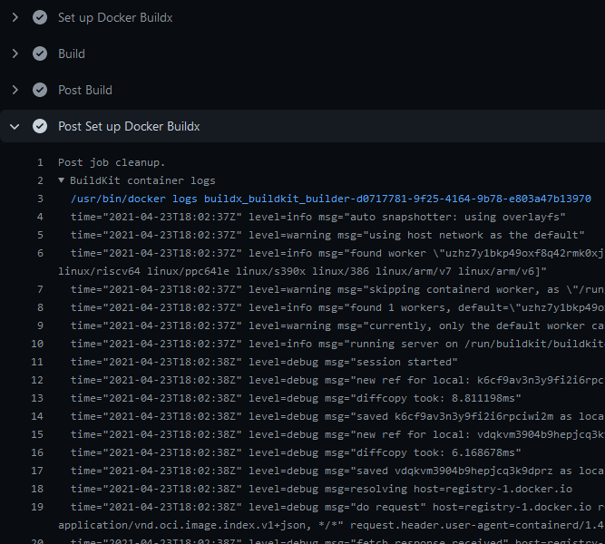

+++
title = "BuildKit 配置"
date = 2024-10-23T14:54:40+08:00
weight = 40
type = "docs"
description = ""
isCJKLanguage = true
draft = false

+++

> 原文：[https://docs.docker.com/build/ci/github-actions/configure-builder/](https://docs.docker.com/build/ci/github-actions/configure-builder/)
>
> 收录该文档的时间：`2024-10-23T14:54:40+08:00`

# Configuring your GitHub Actions builder - 配置您的 GitHub Actions 构建器

This page contains instructions on configuring your BuildKit instances when using our [Setup Buildx Action](https://github.com/docker/setup-buildx-action).

​	本页包含在使用 [Setup Buildx Action](https://github.com/docker/setup-buildx-action) 时配置 BuildKit 实例的说明。

## 版本固定 Version pinning

By default, the action will attempt to use the latest version of [Buildx](https://github.com/docker/buildx) available on the GitHub Runner (the build client) and the latest release of [BuildKit](https://github.com/moby/buildkit) (the build server).

​	默认情况下，该操作将尝试使用 GitHub Runner（构建客户端）上可用的最新版本 [Buildx](https://github.com/docker/buildx) 和最新版本的 [BuildKit](https://github.com/moby/buildkit)（构建服务器）。

To pin to a specific version of Buildx, use the `version` input. For example, to pin to Buildx v0.10.0:

​	要将 Buildx 固定到特定版本，可以使用 `version` 输入。例如，要固定到 Buildx v0.10.0：


```yaml
- name: Set up Docker Buildx
  uses: docker/setup-buildx-action@v3
  with:
    version: v0.10.0
```

To pin to a specific version of BuildKit, use the `image` option in the `driver-opts` input. For example, to pin to BuildKit v0.11.0:

​	要将 BuildKit 固定到特定版本，可以在 `driver-opts` 输入中使用 `image` 选项。例如，将 BuildKit 固定到 v0.11.0：


```yaml
- name: Set up Docker Buildx
  uses: docker/setup-buildx-action@v3
  with:
    driver-opts: image=moby/buildkit:v0.11.0
```

## BuildKit 容器日志 BuildKit container logs

To display BuildKit container logs when using the `docker-container` driver, you must either [enable step debug logging](https://docs.github.com/en/actions/monitoring-and-troubleshooting-workflows/enabling-debug-logging#enabling-step-debug-logging), or set the `--debug` buildkitd flag in the [Docker Setup Buildx](https://github.com/marketplace/actions/docker-setup-buildx) action:

​	要在使用 `docker-container` 驱动时显示 BuildKit 容器日志，您需要 [启用步骤调试日志](https://docs.github.com/en/actions/monitoring-and-troubleshooting-workflows/enabling-debug-logging#enabling-step-debug-logging)，或在 [Docker Setup Buildx](https://github.com/marketplace/actions/docker-setup-buildx) 操作中设置 `--debug` buildkitd 标志：


```yaml
name: ci

on:
  push:

jobs:
  buildx:
    runs-on: ubuntu-latest
    steps:
      - name: Set up Docker Buildx
        uses: docker/setup-buildx-action@v3
        with:
          buildkitd-flags: --debug
      
      - name: Build
        uses: docker/build-push-action@v6
```

Logs will be available at the end of a job:

​	日志将在任务结束时可用：



## BuildKit 守护进程配置 BuildKit Daemon configuration

You can provide a [BuildKit configuration]() to your builder if you're using the [`docker-container` driver]() (default) with the `config` or `buildkitd-config-inline` inputs:

​	如果使用 [`docker-container` 驱动]()（默认），可以通过 `config` 或 `buildkitd-config-inline` 输入为您的构建器提供 [BuildKit 配置]()。

### 注册表镜像 Registry mirror

You can configure a registry mirror using an inline block directly in your workflow with the `buildkitd-config-inline` input:

​	可以在工作流中直接使用 `buildkitd-config-inline` 输入配置注册表镜像：


```yaml
name: ci

on:
  push:

jobs:
  buildx:
    runs-on: ubuntu-latest
    steps:
      - name: Set up Docker Buildx
        uses: docker/setup-buildx-action@v3
        with:
          buildkitd-config-inline: |
            [registry."docker.io"]
              mirrors = ["mirror.gcr.io"]            
```

For more information about using a registry mirror, see [Registry mirror](https://docs.docker.com/build/buildkit/configure/#registry-mirror).

​	有关使用注册表镜像的更多信息，请参见 [注册表镜像](https://docs.docker.com/build/buildkit/configure/#registry-mirror)。

### 最大并行度 Max parallelism

You can limit the parallelism of the BuildKit solver which is particularly useful for low-powered machines.

​	可以限制 BuildKit 求解器的并行度，这对低功耗机器尤其有用。

You can use the `buildkitd-config-inline` input like the previous example, or you can use a dedicated BuildKit config file from your repository if you want with the `config` input:

​	可以使用类似前面示例的 `buildkitd-config-inline` 输入，也可以在仓库中使用专用的 BuildKit 配置文件并通过 `config` 输入来配置：


```toml
# .github/buildkitd.toml
[worker.oci]
  max-parallelism = 4
```


```yaml
name: ci

on:
  push:

jobs:
  buildx:
    runs-on: ubuntu-latest
    steps:
      - name: Set up Docker Buildx
        uses: docker/setup-buildx-action@v3
        with:
          config: .github/buildkitd.toml
```

## 附加额外节点到构建器 Append additional nodes to the builder

Buildx supports running builds on multiple machines. This is useful for building [multi-platform images]() on native nodes for more complicated cases that aren't handled by QEMU. Building on native nodes generally has better performance, and allows you to distribute the build across multiple machines.

​	Buildx 支持在多台机器上运行构建。这对于在本地节点上构建 [多平台镜像]()非常有用，适用于 QEMU 无法处理的更复杂情况。本地节点构建通常具有更好的性能，并允许将构建分配到多台机器。

You can append nodes to the builder you're creating using the `append` option. It takes input in the form of a YAML string document to remove limitations intrinsically linked to GitHub Actions: you can only use strings in the input fields:

​	可以使用 `append` 选项为创建的构建器附加节点。它以 YAML 字符串文档的形式输入，以解决 GitHub Actions 本质上的限制：输入字段只能使用字符串。

| Name              | Type   | Description                                                  |
| ----------------- | ------ | ------------------------------------------------------------ |
| `name`            | String | [节点名称](https://docs.docker.com/reference/cli/docker/buildx/create/#node)。如果为空，则为构建器的名称加上索引编号。 [Name of the node](https://docs.docker.com/reference/cli/docker/buildx/create/#node). If empty, it's the name of the builder it belongs to, with an index number suffix. This is useful to set it if you want to modify/remove a node in an underlying step of you workflow. |
| `endpoint`        | String | 节点的 [Docker 上下文或端点](https://docs.docker.com/reference/cli/docker/buildx/create/#description) [Docker context or endpoint](https://docs.docker.com/reference/cli/docker/buildx/create/#description) of the node to add to the builder |
| `driver-opts`     | List   | 额外的 [驱动特定选项](https://docs.docker.com/reference/cli/docker/buildx/create/#driver-opt) 列表 List of additional [driver-specific options](https://docs.docker.com/reference/cli/docker/buildx/create/#driver-opt) |
| `buildkitd-flags` | String | [Flags for buildkitd](https://docs.docker.com/reference/cli/docker/buildx/create/#buildkitd-flags) daemon |
| `platforms`       | String | 节点的固定 [平台](https://docs.docker.com/reference/cli/docker/buildx/create/#platform)。如果不为空，则此值优先于检测到的值。 Fixed [platforms](https://docs.docker.com/reference/cli/docker/buildx/create/#platform) for the node. If not empty, values take priority over the detected ones. |

Here is an example using remote nodes with the [`remote` driver]() and [TLS authentication](https://docs.docker.com/build/ci/github-actions/configure-builder/#tls-authentication):

​	以下示例使用具有 [远程驱动](https://docs.docker.com/build/ci/github-actions/configure-builder/#tls-authentication) 和 [TLS 认证](https://docs.docker.com/build/ci/github-actions/configure-builder/#tls-authentication) 的远程节点：


```yaml
name: ci

on:
  push:

jobs:
  buildx:
    runs-on: ubuntu-latest
    steps:
      - name: Set up Docker Buildx
        uses: docker/setup-buildx-action@v3
        with:
          driver: remote
          endpoint: tcp://oneprovider:1234
          append: |
            - endpoint: tcp://graviton2:1234
              platforms: linux/arm64
            - endpoint: tcp://linuxone:1234
              platforms: linux/s390x            
        env:
          BUILDER_NODE_0_AUTH_TLS_CACERT: ${{ secrets.ONEPROVIDER_CA }}
          BUILDER_NODE_0_AUTH_TLS_CERT: ${{ secrets.ONEPROVIDER_CERT }}
          BUILDER_NODE_0_AUTH_TLS_KEY: ${{ secrets.ONEPROVIDER_KEY }}
          BUILDER_NODE_1_AUTH_TLS_CACERT: ${{ secrets.GRAVITON2_CA }}
          BUILDER_NODE_1_AUTH_TLS_CERT: ${{ secrets.GRAVITON2_CERT }}
          BUILDER_NODE_1_AUTH_TLS_KEY: ${{ secrets.GRAVITON2_KEY }}
          BUILDER_NODE_2_AUTH_TLS_CACERT: ${{ secrets.LINUXONE_CA }}
          BUILDER_NODE_2_AUTH_TLS_CERT: ${{ secrets.LINUXONE_CERT }}
          BUILDER_NODE_2_AUTH_TLS_KEY: ${{ secrets.LINUXONE_KEY }}
```

## 远程构建器认证 Authentication for remote builders

The following examples show how to handle authentication for remote builders, using SSH or TLS.

​	以下示例展示了如何使用 SSH 或 TLS 处理远程构建器的认证。

### SSH 认证 SSH authentication

To be able to connect to an SSH endpoint using the [`docker-container` driver](), you have to set up the SSH private key and configuration on the GitHub Runner:

​	要使用 [`docker-container` 驱动](https://docs.docker.com/build/ci/github-actions/configure-builder/#tls-authentication)连接到 SSH 端点，需要在 GitHub Runner 上设置 SSH 私钥和配置：

```yaml
name: ci

on:
  push:

jobs:
  buildx:
    runs-on: ubuntu-latest
    steps:
      - name: Set up SSH
        uses: MrSquaare/ssh-setup-action@2d028b70b5e397cf8314c6eaea229a6c3e34977a # v3.1.0
        with:
          host: graviton2
          private-key: ${{ secrets.SSH_PRIVATE_KEY }}
          private-key-name: aws_graviton2
      
      - name: Set up Docker Buildx
        uses: docker/setup-buildx-action@v3
        with:
          endpoint: ssh://me@graviton2
```

### TLS 认证 TLS authentication

You can also [set up a remote BuildKit instance](https://docs.docker.com/build/builders/drivers/remote/#example-remote-buildkit-in-docker-container) using the remote driver. To ease the integration in your workflow, you can use an environment variables that sets up authentication using the BuildKit client certificates for the `tcp://`:

​	您还可以使用远程驱动设置远程 BuildKit 实例。要简化工作流集成，可以使用环境变量设置通过 BuildKit 客户端证书的 `tcp://` 认证：

- `BUILDER_NODE_<idx>_AUTH_TLS_CACERT`
- `BUILDER_NODE_<idx>_AUTH_TLS_CERT`
- `BUILDER_NODE_<idx>_AUTH_TLS_KEY`

The `<idx>` placeholder is the position of the node in the list of nodes.

​	`idx>` 是节点在列表中的位置。

```yaml
name: ci

on:
  push:

jobs:
  buildx:
    runs-on: ubuntu-latest
    steps:
      - name: Set up Docker Buildx
        uses: docker/setup-buildx-action@v3
        with:
          driver: remote
          endpoint: tcp://graviton2:1234
        env:
          BUILDER_NODE_0_AUTH_TLS_CACERT: ${{ secrets.GRAVITON2_CA }}
          BUILDER_NODE_0_AUTH_TLS_CERT: ${{ secrets.GRAVITON2_CERT }}
          BUILDER_NODE_0_AUTH_TLS_KEY: ${{ secrets.GRAVITON2_KEY }}
```

## 独立模式 Standalone mode

If you don't have the Docker CLI installed on the GitHub Runner, the Buildx binary gets invoked directly, instead of calling it as a Docker CLI plugin. This can be useful if you want to use the `kubernetes` driver in your self-hosted runner:

​	如果 GitHub Runner 上未安装 Docker CLI，Buildx 二进制文件将直接调用，而不是作为 Docker CLI 插件调用。如果您希望在自托管的 runner 中使用 `kubernetes` 驱动，这种方式会很有用：


```yaml
name: ci

on:
  push:

jobs:
  buildx:
    runs-on: ubuntu-latest
    steps:
      - name: Checkout
        uses: actions/checkout@v4
      
      - name: Set up Docker Buildx
        uses: docker/setup-buildx-action@v3
        with:
          driver: kubernetes
      
      - name: Build
        run: |
          buildx build .          
```

## 独立构建器 Isolated builders

The following example shows how you can select different builders for different jobs.

​	以下示例展示了如何为不同的任务选择不同的构建器。

An example scenario where this might be useful is when you are using a monorepo, and you want to pinpoint different packages to specific builders. For example, some packages may be particularly resource-intensive to build and require more compute. Or they require a builder equipped with a particular capability or hardware.

​	一个可能适用的场景是，当您使用一个单仓库（monorepo）时，希望将不同的包分配给特定的构建器。例如，一些包的构建可能非常耗费资源，需要更多计算能力。或者它们可能需要具有特定功能或硬件的构建器。

For more information about remote builder, see [`remote` driver]() and the [append builder nodes example](https://docs.docker.com/build/ci/github-actions/configure-builder/#append-additional-nodes-to-the-builder).

​	有关远程构建器的更多信息，请参阅 [`remote` 驱动]() 和 [添加构建器节点示例](https://docs.docker.com/build/ci/github-actions/configure-builder/#append-additional-nodes-to-the-builder)。


```yaml
name: ci

on:
  push:

jobs:
  docker:
    runs-on: ubuntu-latest
    steps:
      - name: Set up builder1
        uses: docker/setup-buildx-action@v3
        id: builder1
      
      - name: Set up builder2
        uses: docker/setup-buildx-action@v3
        id: builder2
      
      - name: Build against builder1
        uses: docker/build-push-action@v6
        with:
          builder: ${{ steps.builder1.outputs.name }}
          target: mytarget1
      
      - name: Build against builder2
        uses: docker/build-push-action@v6
        with:
          builder: ${{ steps.builder2.outputs.name }}
          target: mytarget2
```
