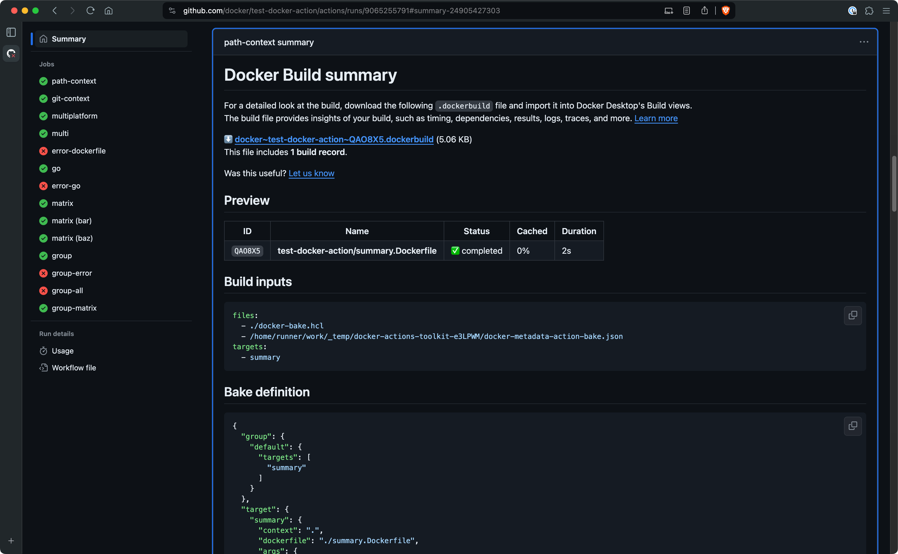
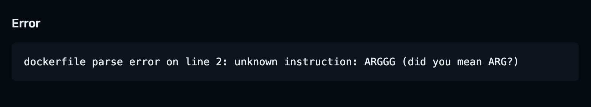

+++
title = "构建摘要"
date = 2024-10-23T14:54:40+08:00
weight = 30
type = "docs"
description = ""
isCJKLanguage = true
draft = false

+++

> 原文：[https://docs.docker.com/build/ci/github-actions/build-summary/](https://docs.docker.com/build/ci/github-actions/build-summary/)
>
> 收录该文档的时间：`2024-10-23T14:54:40+08:00`

# GitHub Actions build summary - GitHub Actions 构建摘要

Docker's GitHub Actions for building and pushing images generate a job summary for your build that outlines the execution and materials used:

​	Docker 提供的用于构建和推送镜像的 GitHub Actions 会生成一个构建任务摘要，概述构建过程及其使用的材料：

- A summary showing the Dockerfile used, the build duration, and cache utilization
  - 显示所用 Dockerfile、构建时长以及缓存利用率的摘要

- Inputs for the build, such as build arguments, tags, labels, and build contexts
  - 构建输入信息，例如构建参数、标签、标签和构建上下文

- For builds with [Bake](), the full bake definition for the build
  - 如果使用 [Bake]() 构建，还会显示完整的 bake 定义




Job summaries for Docker builds appear automatically if you use the following versions of the [Build and push Docker images](https://github.com/marketplace/actions/build-and-push-docker-images) or [Docker Buildx Bake](https://github.com/marketplace/actions/docker-buildx-bake) GitHub Actions:

​	当您使用以下版本的 [构建和推送 Docker 镜像](https://github.com/marketplace/actions/build-and-push-docker-images) 或 [Docker Buildx Bake](https://github.com/marketplace/actions/docker-buildx-bake) GitHub Actions 时，Docker 构建的任务摘要会自动显示：

- `docker/build-push-action@v6`

- `docker/bake-action@v5`

To view the job summary, open the details page for the job in GitHub after the job has finished. The summary is available for both failed and successful builds. In the case of a failed build, the summary also displays the error message that caused the build to fail:

​	要查看任务摘要，请在 GitHub 中的任务完成后打开该任务的详情页面。对于失败和成功的构建，摘要均可用。在构建失败的情况下，摘要还会显示导致构建失败的错误信息：



## 将构建记录导入到 Docker Desktop - Import build records to Docker Desktop

Introduced in Docker Desktop version 4.31

​	此功能在 Docker Desktop 版本 4.31 中引入

 **测试版功能 Beta feature**

Import builds is currently in [Beta](https://docs.docker.com/release-lifecycle/#Beta).

​	导入构建目前处于[测试版](https://docs.docker.com/release-lifecycle/#Beta)。

The job summary includes a link for downloading a build record archive for the run. The build record archive is a ZIP file containing the details about a build (or builds, if you use `docker/bake-action` to build multiple targets). You can import this build record archive into Docker Desktop, which gives you a powerful, graphical interface for further analyzing the build's performance via the [Docker Desktop **Builds** view]().

​	任务摘要包括一个下载构建记录存档的链接。构建记录存档是一个 ZIP 文件，包含关于构建的详细信息（如果使用 `docker/bake-action` 构建多个目标，则包含多个构建的详细信息）。您可以将此构建记录存档导入 Docker Desktop，这将为您提供强大的图形界面，通过 [Docker Desktop 的 **Builds** 视图]()进一步分析构建的性能。

To import the build record archive into Docker Desktop:

​	将构建记录存档导入到 Docker Desktop：

1. Download and install [Docker Desktop](). 下载并安装 [Docker Desktop]()。
2. Download the build record archive from the job summary in GitHub Actions. 从 GitHub Actions 的任务摘要中下载构建记录存档。
3. Open the **Builds** view in Docker Desktop. 打开 Docker Desktop 中的 **Builds** 视图。
4. Select the **Import build** button, and then browse for the `.zip` archive job summary that you downloaded. Alternatively, you can drag-and-drop the build record archive ZIP file onto the Docker Desktop window after opening the import build dialog. 选择 **Import build** 按钮，然后浏览并选择您下载的 `.zip` 存档任务摘要。或者，您可以在打开导入构建对话框后将构建记录存档 ZIP 文件拖放到 Docker Desktop 窗口中。
5. Select **Import** to add the build records. 选择 **Import** 以添加构建记录。

After a few seconds, the builds from the GitHub Actions run appear under the **Completed builds** tab in the Builds view. To inspect a build and see a detailed view of all the inputs, results, build steps, and cache utilization, select the item in the list.

​	几秒钟后，GitHub Actions 运行的构建会出现在 **Completed builds** 标签页下的 Builds 视图中。选择列表中的项可查看构建的详细信息，包括所有输入、结果、构建步骤和缓存利用率。

## 禁用任务摘要 Disable job summary

To disable job summaries, set the `DOCKER_BUILD_SUMMARY` environment variable in the YAML configuration for your build step:

​	要禁用任务摘要，请在构建步骤的 YAML 配置中设置 `DOCKER_BUILD_SUMMARY` 环境变量：

```yaml
      -
        name: Build
        uses: docker/docker-build-push-action@v6
        env:
          DOCKER_BUILD_SUMMARY: false
        with:
          tags: ${{ steps.meta.outputs.tags }}
          labels: ${{ steps.meta.outputs.labels }}
```

## 禁用构建记录上传 Disable build record upload

To disable the upload of the build record archive to GitHub, set the `DOCKER_BUILD_RECORD_UPLOAD` environment variable in the YAML configuration for your build step:

​	要禁用将构建记录存档上传到 GitHub，请在构建步骤的 YAML 配置中设置 `DOCKER_BUILD_RECORD_UPLOAD` 环境变量：

```yaml
      -
        name: Build
        uses: docker/docker-build-push-action@v6
        env:
          DOCKER_BUILD_RECORD_UPLOAD: false
        with:
          tags: ${{ steps.meta.outputs.tags }}
          labels: ${{ steps.meta.outputs.labels }}
```

With this configuration, the build summary is still generated, but does not contain a link to download the build record archive.

​	使用此配置时，仍会生成构建摘要，但不会包含下载构建记录存档的链接。

## Limitations

限制 Build summaries are currently not supported for:

​	当前不支持以下情况的构建摘要：

- Builds using [Docker Build Cloud](). Support for Docker Build Cloud is planned for a future release. 
  - 使用 [Docker Build Cloud]() 的构建。对 Docker Build Cloud 的支持计划在未来发布。

- Repositories hosted on GitHub Enterprise Servers. Summaries can only be viewed for repositories hosted on GitHub.com.
  - 托管在 GitHub Enterprise 服务器上的仓库。摘要仅能查看托管在 GitHub.com 上的仓库。


