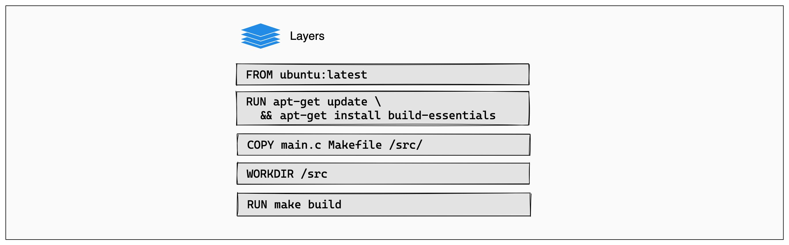

+++
title = "Cache"
date = 2024-10-23T14:54:40+08:00
weight = 50
type = "docs"
description = ""
isCJKLanguage = true
draft = false
+++

> 原文：[https://docs.docker.com/build/cache/](https://docs.docker.com/build/cache/)
>
> 收录该文档的时间：`2024-10-23T14:54:40+08:00`

# Docker build cache

When you build the same Docker image multiple times, knowing how to optimize the build cache is a great tool for making sure the builds run fast.

## How the build cache works

Understanding Docker's build cache helps you write better Dockerfiles that result in faster builds.

The following example shows a small Dockerfile for a program written in C.


```dockerfile
# syntax=docker/dockerfile:1
FROM ubuntu:latest

RUN apt-get update && apt-get install -y build-essentials
COPY main.c Makefile /src/
WORKDIR /src/
RUN make build
```

Each instruction in this Dockerfile translates to a layer in your final image. You can think of image layers as a stack, with each layer adding more content on top of the layers that came before it:



Whenever a layer changes, that layer will need to be re-built. For example, suppose you make a change to your program in the `main.c` file. After this change, the `COPY` command will have to run again in order for those changes to appear in the image. In other words, Docker will invalidate the cache for this layer.

If a layer changes, all other layers that come after it are also affected. When the layer with the `COPY` command gets invalidated, all layers that follow will need to run again, too:


And that's the Docker build cache in a nutshell. Once a layer changes, then all downstream layers need to be rebuilt as well. Even if they wouldn't build anything differently, they still need to re-run.

## Other resources

For more information on using cache to do efficient builds, see:

- [Cache invalidation]()
- [Optimize build cache]()
- [Garbage collection]()
- [Cache storage backends]()
