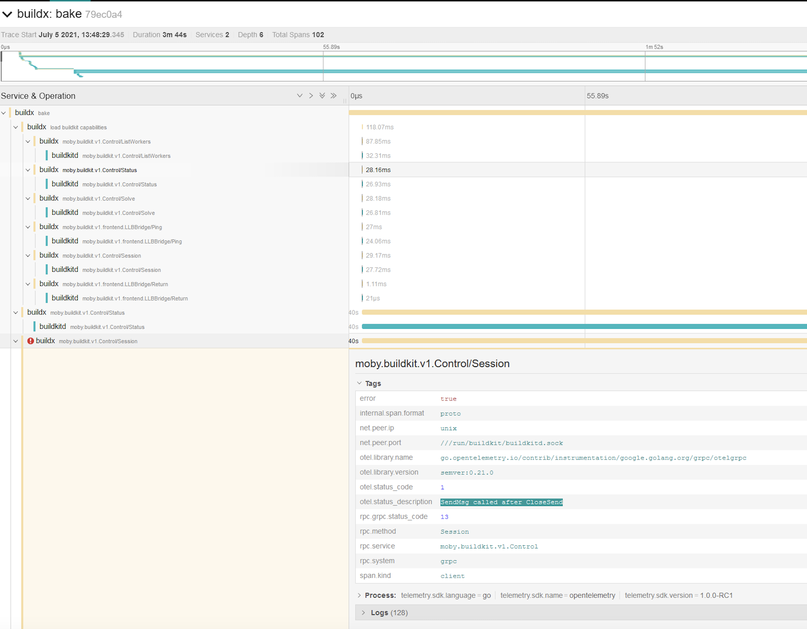

+++
title = "OpenTelemetry support"
date = 2024-10-23T14:54:40+08:00
weight = 1
type = "docs"
description = ""
isCJKLanguage = true
draft = false
+++

> 原文：[https://docs.docker.com/build/debug/opentelemetry/](https://docs.docker.com/build/debug/opentelemetry/)
>
> 收录该文档的时间：`2024-10-23T14:54:40+08:00`

# OpenTelemetry support

Both Buildx and BuildKit support [OpenTelemetry](https://opentelemetry.io/).

To capture the trace to [Jaeger](https://github.com/jaegertracing/jaeger), set `JAEGER_TRACE` environment variable to the collection address using a `driver-opt`.

First create a Jaeger container:


```console
$ docker run -d --name jaeger -p "6831:6831/udp" -p "16686:16686" --restart unless-stopped jaegertracing/all-in-one
```

Then [create a `docker-container` builder]() that will use the Jaeger instance via the `JAEGER_TRACE` environment variable:


```console
$ docker buildx create --use \
  --name mybuilder \
  --driver docker-container \
  --driver-opt "network=host" \
  --driver-opt "env.JAEGER_TRACE=localhost:6831"
```

Boot and [inspect `mybuilder`]():


```console
$ docker buildx inspect --bootstrap
```

Buildx commands should be traced at `http://127.0.0.1:16686/`:


