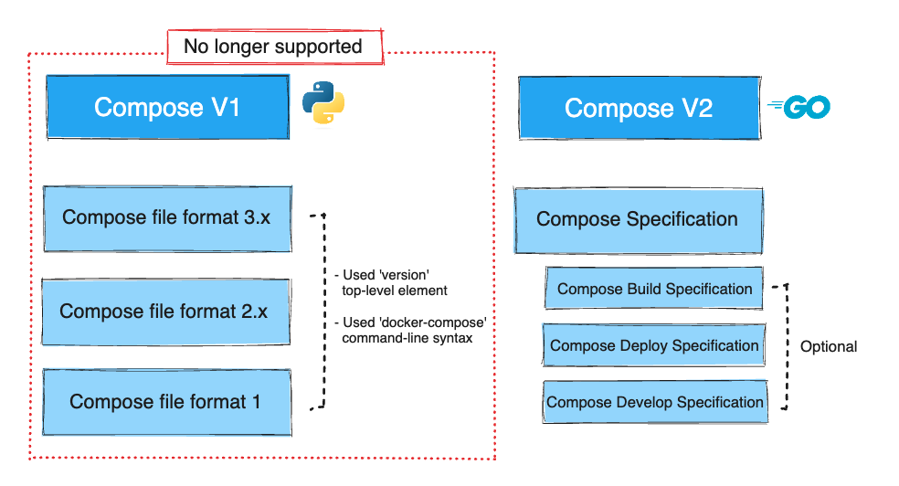

+++
title = "历史与发展"
date = 2024-10-23T14:54:40+08:00
weight = 20
type = "docs"
description = ""
isCJKLanguage = true
draft = false

+++

> 原文：[https://docs.docker.com/compose/intro/history/](https://docs.docker.com/compose/intro/history/)
>
> 收录该文档的时间：`2024-10-23T14:54:40+08:00`

# History and development of Docker Compose - Docker Compose 的历史与发展

This page provides:

​	此页面提供：

- A brief history of the development of the Docker Compose CLI
  - Docker Compose CLI 开发简史

- A clear explanation of the major versions and file formats that make up Compose V1 and Compose V2

  - 组成 Compose V1 和 Compose V2 的主要版本和文件格式的详细说明

- The main differences between Compose V1 and Compose V2

  - Compose V1 和 Compose V2 的主要区别

  

## 简介Introduction

The image above shows that the currently supported version of the Docker Compose CLI is Compose V2 which is defined by the [Compose Specification]().

​	上图展示了 Docker Compose CLI 当前支持的版本为 Compose V2，并由 [Compose 规范]() 定义。

It also provides a quick snapshot of the differences in file formats, command-line syntax, and top-level elements. This is covered in more detail in the following sections.

​	该图还提供了文件格式、命令行语法和顶级元素之间差异的快速概览。以下章节将对此进行更详细的说明。

### Docker Compose CLI 版本控制 Docker Compose CLI versioning

Version one of the Docker Compose command-line binary was first released in 2014. It was written in Python, and is invoked with `docker-compose`. Typically, Compose V1 projects include a top-level `version` element in the `compose.yml` file, with values ranging from `2.0` to `3.8`, which refer to the specific [file formats](https://docs.docker.com/compose/intro/history/#compose-file-format-versioning).

​	Docker Compose 命令行二进制文件的第一个版本发布于 2014 年，使用 Python 编写，使用 `docker-compose` 命令调用。通常，Compose V1 项目在 `compose.yml` 文件中包含顶级 `version` 元素，取值范围从 `2.0` 到 `3.8`，这些值对应于特定的[文件格式](https://docs.docker.com/compose/intro/history/#compose-file-format-versioning)。

Version two of the Docker Compose command-line binary was announced in 2020, is written in Go, and is invoked with `docker compose`. Compose V2 ignores the `version` top-level element in the `compose.yml` file.

​	Docker Compose 命令行二进制文件的第二个版本于 2020 年发布，使用 Go 编写，使用 `docker compose` 命令调用。Compose V2 忽略 `compose.yml` 文件中的顶级 `version` 元素。

### Compose 文件格式版本控制 Compose file format versioning

The Docker Compose CLIs are defined by specific file formats.

​	Docker Compose CLI 由特定的文件格式定义。

Three major versions of the Compose file format for Compose V1 were released:

​	Compose V1 发布了三个主要版本的文件格式：

- Compose file format 1 with Compose 1.0.0 in 2014
  - 2014 年随 Compose 1.0.0 发布的 Compose 文件格式 1

- Compose file format 2.x with Compose 1.6.0 in 2016
  - 2016 年随 Compose 1.6.0 发布的 Compose 文件格式 2.x

- Compose file format 3.x with Compose 1.10.0 in 2017
  - 2017 年随 Compose 1.10.0 发布的 Compose 文件格式 3.x

Compose file format 1 is substantially different to all the following formats as it lacks a top-level `services` key. Its usage is historical and files written in this format don't run with Compose V2.

​	Compose 文件格式 1 与后续所有格式存在显著差异，因为它缺少顶级 `services` 键。此格式的用法是历史遗留的，使用此格式编写的文件不能在 Compose V2 中运行。

Compose file format 2.x and 3.x are very similar to each other, but the latter introduced many new options targeted at Swarm deployments.

​	Compose 文件格式 2.x 和 3.x 彼此非常相似，但后者引入了许多面向 Swarm 部署的新选项。

To address confusion around Compose CLI versioning, Compose file format versioning, and feature parity depending on whether Swarm mode was in use, file format 2.x and 3.x were merged into the [Compose Specification]().

​	为了解决 Compose CLI 版本控制、Compose 文件格式版本控制以及 Swarm 模式的使用是否影响功能一致性等问题，文件格式 2.x 和 3.x 被合并到 [Compose 规范]() 中。

Compose V2 uses the Compose Specification for project definition. Unlike the prior file formats, the Compose Specification is rolling and makes the `version` top-level element optional. Compose V2 also makes use of optional specifications - [Deploy](), [Develop]() and [Build]().

​	Compose V2 使用 Compose 规范进行项目定义。与之前的文件格式不同，Compose 规范是滚动更新的，并且使顶级 `version` 元素变为可选。Compose V2 还支持可选规范——[部署]()、[开发]()和[构建]()。

To make [migration]() easier, Compose V2 has backwards compatibility for certain elements that have been deprecated or changed between Compose file format 2.x/3.x and the Compose Specification.

​	为了便于[迁移]()，Compose V2 对于在文件格式 2.x/3.x 和 Compose 规范之间已弃用或更改的某些元素提供向后兼容性。
