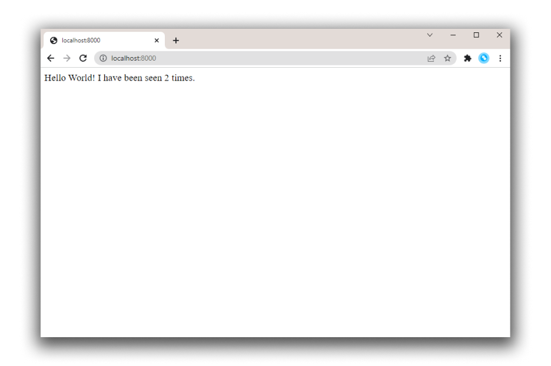
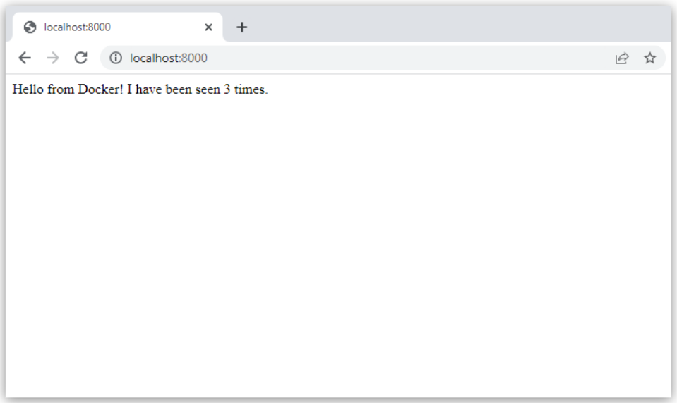

+++
title = "快速入门"
date = 2024-10-23T14:54:40+08:00
weight = 20
type = "docs"
description = ""
isCJKLanguage = true
draft = false

+++

> 原文：[https://docs.docker.com/compose/gettingstarted/](https://docs.docker.com/compose/gettingstarted/)
>
> 收录该文档的时间：`2024-10-23T14:54:40+08:00`GG

# Docker Compose Quickstart - Docker Compose 快速入门

This tutorial aims to introduce fundamental concepts of Docker Compose by guiding you through the development of a basic Python web application.

​	本教程旨在通过开发一个基础的 Python Web 应用，引导您了解 Docker Compose 的基本概念。

Using the Flask framework, the application features a hit counter in Redis, providing a practical example of how Docker Compose can be applied in web development scenarios.

​	使用 Flask 框架，该应用包含一个 Redis 计数器，提供了一个 Docker Compose 在 Web 开发场景中的实际应用示例。

The concepts demonstrated here should be understandable even if you're not familiar with Python.

​	即使您不熟悉 Python，教程中的概念也应易于理解。

This is a non-normative example that just highlights the key things you can do with Compose.

​	这是一个非规范示例，主要突出 Compose 的核心功能。

## 前置条件 Prerequisites

Make sure you have:

​	确保您已完成以下操作：

- Installed the latest version of Docker Compose

  - 安装了最新版本的 Docker Compose

- A basic understanding of Docker concepts and how Docker works

  - 具备基本的 Docker 概念和工作原理知识

  

## 第一步：设置 Step 1: Set up

1. Create a directory for the project:

   创建一个项目目录：

   ```console
   $ mkdir composetest
   $ cd composetest
   ```

2. Create a file called `app.py` in your project directory and paste the following code in:

   在项目目录中创建一个名为 `app.py` 的文件，并粘贴以下代码：

   ```python
   import time
   
   import redis
   from flask import Flask
   
   app = Flask(__name__)
   cache = redis.Redis(host='redis', port=6379)
   
   def get_hit_count():
       retries = 5
       while True:
           try:
               return cache.incr('hits')
           except redis.exceptions.ConnectionError as exc:
               if retries == 0:
                   raise exc
               retries -= 1
               time.sleep(0.5)
   
   @app.route('/')
   def hello():
       count = get_hit_count()
       return 'Hello World! I have been seen {} times.\n'.format(count)
   ```

   In this example, `redis` is the hostname of the redis container on the application's network and the default port, `6379` is used.

   ​	在此示例中，`redis` 是应用网络中 Redis 容器的主机名，默认端口为 `6379`。

   > **Note**
   >
   > 
   >
   > Note the way the `get_hit_count` function is written. This basic retry loop attempts the request multiple times if the Redis service is not available. This is useful at startup while the application comes online, but also makes the application more resilient if the Redis service needs to be restarted anytime during the app's lifetime. In a cluster, this also helps handling momentary connection drops between nodes.
   >
   > ​	`get_hit_count` 函数的写法使用了一个基本的重试循环，当 Redis 服务不可用时，它会多次尝试请求。这在应用启动时很有用，并且在 Redis 服务需要在应用生命周期内重新启动时也增加了应用的弹性。在集群中，这也有助于处理节点间的瞬时连接丢失。

3. Create another file called `requirements.txt` in your project directory and paste the following code in:

   在项目目录中创建另一个名为 `requirements.txt` 的文件，并粘贴以下内容：

   ```text
   flask
   redis
   ```

4. Create a `Dockerfile` and paste the following code in:

   创建一个 `Dockerfile` 并粘贴以下代码：

   ```dockerfile
   # syntax=docker/dockerfile:1
   FROM python:3.10-alpine
   WORKDIR /code
   ENV FLASK_APP=app.py
   ENV FLASK_RUN_HOST=0.0.0.0
   RUN apk add --no-cache gcc musl-dev linux-headers
   COPY requirements.txt requirements.txt
   RUN pip install -r requirements.txt
   EXPOSE 5000
   COPY . .
   CMD ["flask", "run", "--debug"]
   ```

   > **Important**
   >
   > 
   >
   > Check that the `Dockerfile` has no file extension like `.txt`. Some editors may append this file extension automatically which results in an error when you run the application.
   >
   > ​	确保 `Dockerfile` 没有 `.txt` 等文件扩展名。一些编辑器可能会自动添加文件扩展名，导致运行应用时出现错误。
   
   For more information on how to write Dockerfiles, see the [Dockerfile reference](https://docs.docker.com/reference/dockerfile/).
   
   ​	有关如何编写 Dockerfile 的更多信息，请参见 [Dockerfile 参考](https://docs.docker.com/reference/dockerfile/)。

## 第二步：在 Compose 文件中定义服务 Step 2: Define services in a Compose file

Compose simplifies the control of your entire application stack, making it easy to manage services, networks, and volumes in a single, comprehensible YAML configuration file.

​	Compose 简化了对整个应用堆栈的控制，可以通过一个 YAML 配置文件轻松管理服务、网络和数据卷。

Create a file called `compose.yaml` in your project directory and paste the following:

​	在项目目录中创建一个名为 `compose.yaml` 的文件，并粘贴以下内容：

```yaml
services:
  web:
    build: .
    ports:
      - "8000:5000"
  redis:
    image: "redis:alpine"
```

This Compose file defines two services: `web` and `redis`.

​	该 Compose 文件定义了两个服务：`web` 和 `redis`。

The `web` service uses an image that's built from the `Dockerfile` in the current directory. It then binds the container and the host machine to the exposed port, `8000`. This example service uses the default port for the Flask web server, `5000`.

​	`web` 服务使用当前目录中 `Dockerfile` 构建的镜像，并将容器与主机机器绑定到暴露的端口 `8000`。此示例服务使用 Flask Web 服务器的默认端口 `5000`。

The `redis` service uses a public [Redis](https://registry.hub.docker.com/_/redis/) image pulled from the Docker Hub registry.

​	`redis` 服务使用从 Docker Hub 注册表拉取的公共 [Redis](https://registry.hub.docker.com/_/redis/) 镜像。

For more information on the `compose.yaml` file, see [How Compose works](https://docs.docker.com/compose/intro/compose-application-model/).

​	有关 `compose.yaml` 文件的更多信息，请参见 [Compose 工作原理](https://docs.docker.com/compose/intro/compose-application-model/)。

## 第三步：使用 Compose 构建并运行应用 Step 3: Build and run your app with Compose

With a single command, you create and start all the services from your configuration file.

​	只需一个命令，您即可从配置文件中创建并启动所有服务。

1. From your project directory, start up your application by running `docker compose up`.

   从项目目录启动应用，运行 `docker compose up`。

   ```console
   $ docker compose up
   
   Creating network "composetest_default" with the default driver
   Creating composetest_web_1 ...
   Creating composetest_redis_1 ...
   Creating composetest_web_1
   Creating composetest_redis_1 ... done
   Attaching to composetest_web_1, composetest_redis_1
   web_1    |  * Running on http://0.0.0.0:5000/ (Press CTRL+C to quit)
   redis_1  | 1:C 17 Aug 22:11:10.480 # oO0OoO0OoO0Oo Redis is starting oO0OoO0OoO0Oo
   redis_1  | 1:C 17 Aug 22:11:10.480 # Redis version=4.0.1, bits=64, commit=00000000, modified=0, pid=1, just started
   redis_1  | 1:C 17 Aug 22:11:10.480 # Warning: no config file specified, using the default config. In order to specify a config file use redis-server /path/to/redis.conf
   web_1    |  * Restarting with stat
   redis_1  | 1:M 17 Aug 22:11:10.483 * Running mode=standalone, port=6379.
   redis_1  | 1:M 17 Aug 22:11:10.483 # WARNING: The TCP backlog setting of 511 cannot be enforced because /proc/sys/net/core/somaxconn is set to the lower value of 128.
   web_1    |  * Debugger is active!
   redis_1  | 1:M 17 Aug 22:11:10.483 # Server initialized
   redis_1  | 1:M 17 Aug 22:11:10.483 # WARNING you have Transparent Huge Pages (THP) support enabled in your kernel. This will create latency and memory usage issues with Redis. To fix this issue run the command 'echo never > /sys/kernel/mm/transparent_hugepage/enabled' as root, and add it to your /etc/rc.local in order to retain the setting after a reboot. Redis must be restarted after THP is disabled.
   web_1    |  * Debugger PIN: 330-787-903
   redis_1  | 1:M 17 Aug 22:11:10.483 * Ready to accept connections
   ```

   Compose pulls a Redis image, builds an image for your code, and starts the services you defined. In this case, the code is statically copied into the image at build time.

   ​	Compose 会拉取 Redis 镜像、为您的代码构建镜像，并启动您定义的服务。在此示例中，代码在构建时被静态复制到镜像中。

2. Enter `http://localhost:8000/` in a browser to see the application running. 在浏览器中输入 `http://localhost:8000/` 以查看应用运行情况。

   If this doesn't resolve, you can also try `http://127.0.0.1:8000`.

   ​	如果该地址不可用，您也可以尝试 `http://127.0.0.1:8000`。

   You should see a message in your browser saying:

   ​	您应在浏览器中看到一条消息：

   ```text
   Hello World! I have been seen 1 times.
   ```

   

3. Refresh the page. 刷新页面。

   The number should increment.

   ​	数字应会递增。

   ```text
   Hello World! I have been seen 2 times.
   ```

   

4. Switch to another terminal window, and type `docker image ls` to list local images. 切换到另一个终端窗口，输入 `docker image ls` 列出本地镜像。

   Listing images at this point should return `redis` and `web`.

   ​	列出镜像应显示 `redis` 和 `web`。

   ```console
   $ docker image ls
   
   REPOSITORY        TAG           IMAGE ID      CREATED        SIZE
   composetest_web   latest        e2c21aa48cc1  4 minutes ago  93.8MB
   python            3.4-alpine    84e6077c7ab6  7 days ago     82.5MB
   redis             alpine        9d8fa9aa0e5b  3 weeks ago    27.5MB
   ```

   You can inspect images with `docker inspect <tag or id>`.

   ​	您可以使用 `docker inspect <tag 或 id>` 检查镜像。

5. Stop the application, either by running `docker compose down` from within your project directory in the second terminal, or by hitting `CTRL+C` in the original terminal where you started the app. 停止应用，可以在第二个终端窗口中的项目目录运行 `docker compose down`，或者在启动应用的原始终端中按下 `CTRL+C`。

## 第四步：编辑 Compose 文件以使用 Compose Watch - Step 4: Edit the Compose file to use Compose Watch

Edit the `compose.yaml` file in your project directory to use `watch` so you can preview your running Compose services which are automatically updated as you edit and save your code:

​	在项目目录中编辑 `compose.yaml` 文件以使用 `watch`，这样可以预览正在运行的 Compose 服务，并在编辑和保存代码时自动更新：

```yaml
services:
  web:
    build: .
    ports:
      - "8000:5000"
    develop:
      watch:
        - action: sync
          path: .
          target: /code
  redis:
    image: "redis:alpine"
```

Whenever a file is changed, Compose syncs the file to the corresponding location under `/code` inside the container. Once copied, the bundler updates the running application without a restart.

​	每当文件发生更改时，Compose 会将文件同步到容器内 `/code` 下的相应位置。复制完成后，bundler 会在不重启的情况下更新正在运行的应用。

For more information on how Compose Watch works, see [Use Compose Watch](https://docs.docker.com/compose/how-tos/file-watch/). Alternatively, see [Manage data in containers](https://docs.docker.com/engine/storage/volumes/) for other options.

​	有关 Compose Watch 工作原理的更多信息，请参见 [使用 Compose Watch](https://docs.docker.com/compose/how-tos/file-watch/)。有关其他选项，请参见 [在容器中管理数据](https://docs.docker.com/engine/storage/volumes/)。

> **Note**
>
> 
>
> For this example to work, the `--debug` option is added to the `Dockerfile`. The `--debug` option in Flask enables automatic code reload, making it possible to work on the backend API without the need to restart or rebuild the container. After changing the `.py` file, subsequent API calls will use the new code, but the browser UI will not automatically refresh in this small example. Most frontend development servers include native live reload support that works with Compose.
>
> ​	本示例中已在 `Dockerfile` 中添加了 `--debug` 选项。Flask 中的 `--debug` 选项启用了自动代码重新加载，使您无需重启或重建容器即可处理后端 API。在修改 `.py` 文件后，后续 API 调用将使用新代码，但在此示例中，浏览器 UI 不会自动刷新。大多数前端开发服务器都包含原生的实时重载支持，可与 Compose 一起使用。

## 第五步：使用 Compose 重新构建并运行应用 Step 5: Re-build and run the app with Compose

From your project directory, type `docker compose watch` or `docker compose up --watch` to build and launch the app and start the file watch mode.

​	在项目目录中输入 `docker compose watch` 或 `docker compose up --watch` 来构建和启动应用并启用文件监视模式。

```console
$ docker compose watch
[+] Running 2/2
 ✔ Container docs-redis-1 Created                                                                                                                                                                                                        0.0s
 ✔ Container docs-web-1    Recreated                                                                                                                                                                                                      0.1s
Attaching to redis-1, web-1
         ⦿ watch enabled
...
```

Check the `Hello World` message in a web browser again, and refresh to see the count increment.

​	再次在浏览器中检查 `Hello World` 消息，并刷新页面以查看计数递增。

## 第六步：更新应用 Step 6: Update the application

To see Compose Watch in action:

​	要查看 Compose Watch 的实际效果：

1. Change the greeting in `app.py` and save it. For example, change the `Hello World!` message to `Hello from Docker!`:

   修改 `app.py` 中的问候语并保存。例如，将 `Hello World!` 消息更改为 `Hello from Docker!`：

   ```python
   return 'Hello from Docker! I have been seen {} times.\n'.format(count)
   ```

2. Refresh the app in your browser. The greeting should be updated, and the counter should still be incrementing. 刷新浏览器中的应用。问候语应更新，计数器继续递增。

   

3. Once you're done, run `docker compose down`. 完成后，运行 `docker compose down`。

## 第七步：分离服务 Step 7: Split up your services

Using multiple Compose files lets you customize a Compose application for different environments or workflows. This is useful for large applications that may use dozens of containers, with ownership distributed across multiple teams.

​	使用多个 Compose 文件可以针对不同的环境或工作流自定义 Compose 应用。对于包含多个容器的复杂应用，这非常有用。

1. In your project folder, create a new Compose file called `infra.yaml`. 在项目文件夹中创建一个名为 `infra.yaml` 的新 Compose 文件。

2. Cut the Redis service from your `compose.yaml` file and paste it into your new `infra.yaml` file. Make sure you add the `services` top-level attribute at the top of your file. Your `infra.yaml` file should now look like this: 将 Redis 服务从 `compose.yaml` 文件中剪切并粘贴到新的 `infra.yaml` 文件中，并添加 `services` 顶级属性：

   

   ```yaml
   services:
     redis:
       image: "redis:alpine"
   ```

3. In your `compose.yaml` file, add the `include` top-level attribute along with the path to the `infra.yaml` file. 在 `compose.yaml` 文件中添加 `include` 顶级属性以及 `infra.yaml` 文件的路径。

   

   ```yaml
   include:
      - infra.yaml
   services:
     web:
       build: .
       ports:
         - "8000:5000"
       develop:
         watch:
           - action: sync
             path: .
             target: /code
   ```

4. Run `docker compose up` to build the app with the updated Compose files, and run it. You should see the `Hello world` message in your browser. 运行 `docker compose up` 构建并运行带有更新后的 Compose 文件的应用。您应在浏览器中看到 `Hello World` 消息。

This is a simplified example, but it demonstrates the basic principle of `include` and how it can make it easier to modularize complex applications into sub-Compose files. For more information on `include` and working with multiple Compose files, see [Working with multiple Compose files](https://docs.docker.com/compose/how-tos/multiple-compose-files/).

​	这是一个简化示例，但它展示了 `include` 的基本原理以及如何将复杂的应用模块化为子 Compose 文件。有关 `include` 和使用多个 Compose 文件的更多信息，请参见 [使用多个 Compose 文件](https://docs.docker.com/compose/how-tos/multiple-compose-files/)。

## 第八步：尝试其他命令 Step 8: Experiment with some other commands

- If you want to run your services in the background, you can pass the `-d` flag (for "detached" mode) to `docker compose up` and use `docker compose ps` to see what is currently running:

  如果要在后台运行服务，可以将 `-d` 标志传递给 `docker compose up`，并使用 `docker compose ps` 查看当前运行的内容：

  ```console
  $ docker compose up -d
  
  Starting composetest_redis_1...
  Starting composetest_web_1...
  
  $ docker compose ps
  
         Name                      Command               State           Ports         
  -------------------------------------------------------------------------------------
  composetest_redis_1   docker-entrypoint.sh redis ...   Up      6379/tcp              
  composetest_web_1     flask run                        Up      0.0.0.0:8000->5000/tcp
  ```

- Run `docker compose --help` to see other available commands. 运行 `docker compose --help` 查看其他可用命令。

- If you started Compose with `docker compose up -d`, stop your services once you've finished with them:

  如果使用 `docker compose up -d` 启动 Compose，完成后可以停止服务：

  ```console
  $ docker compose stop
  ```

- You can bring everything down, removing the containers entirely, with the `docker compose down` command. 可以使用 `docker compose down` 命令完全移除容器。

## Where to go next

- Try the [Sample apps with Compose](https://github.com/docker/awesome-compose)
  - 尝试 [使用 Compose 的示例应用](https://github.com/docker/awesome-compose)
- [Explore the full list of Compose commands](https://docs.docker.com/reference/cli/docker/compose/)
  - 查看完整的 Compose 命令列表
- [Explore the Compose file reference](https://docs.docker.com/reference/compose-file/)
  - 浏览 Compose 文件参考
- [Check out the Learning Docker Compose video on LinkedIn Learning](https://www.linkedin.com/learning/learning-docker-compose/)
  - 查看 LinkedIn Learning 上的 Learning Docker Compose 视频
