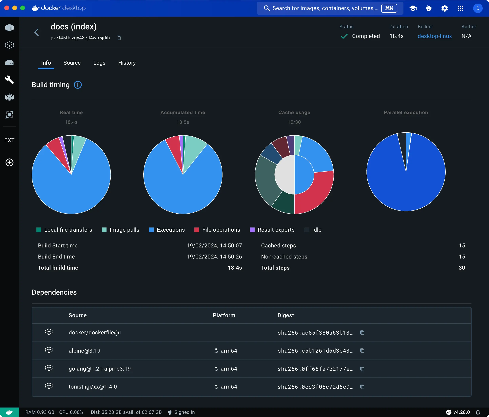
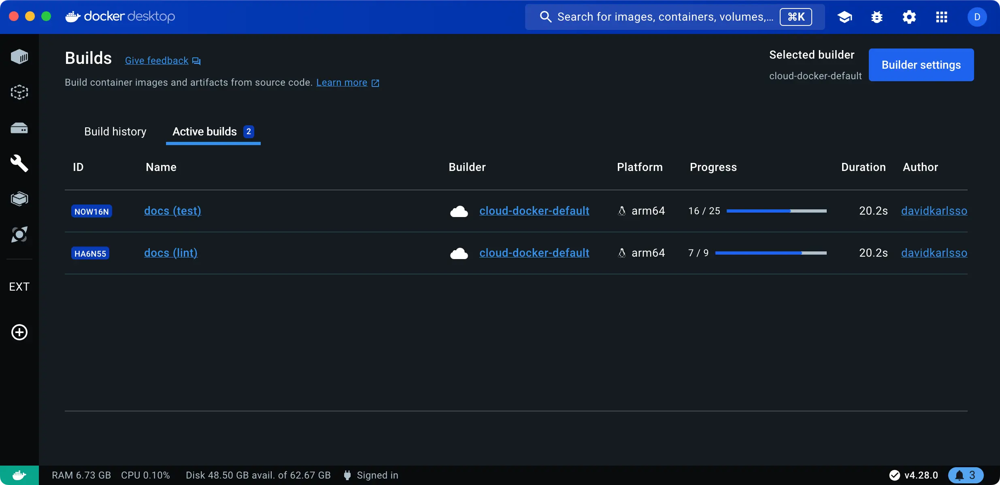
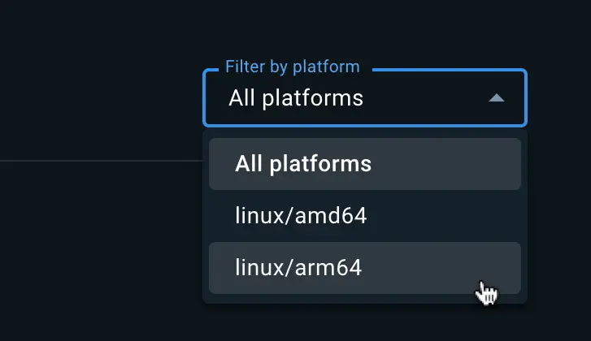
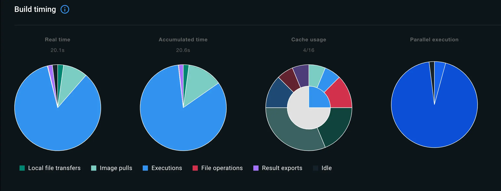
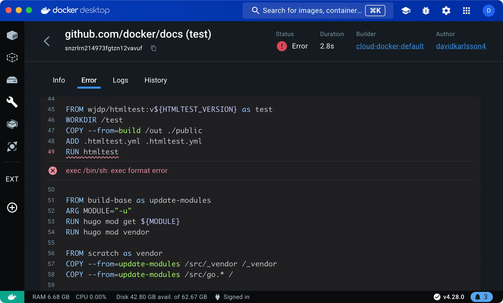
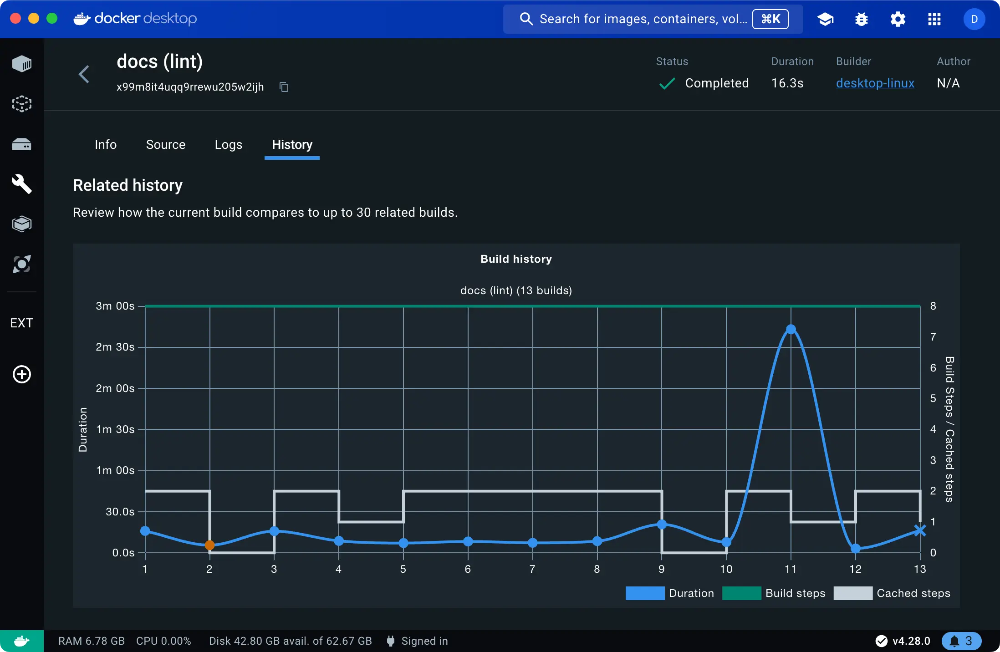
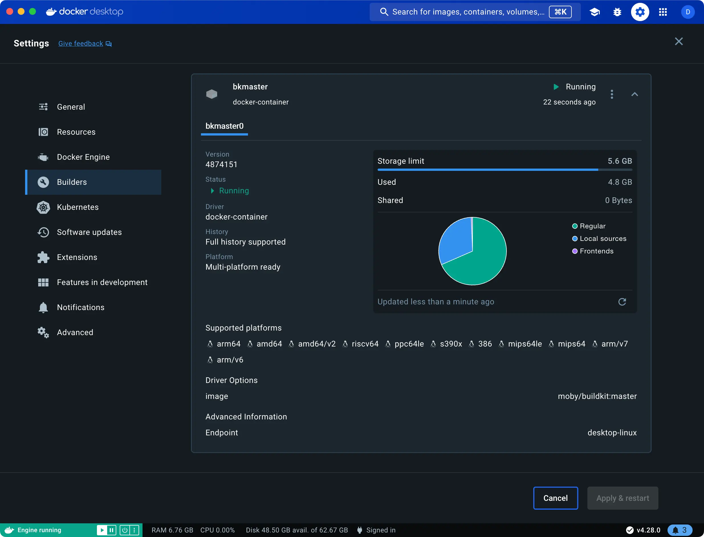

+++
title = "Builds"
date = 2024-10-23T14:54:40+08:00
weight = 30
type = "docs"
description = ""
isCJKLanguage = true
draft = false
+++

> 原文：[https://docs.docker.com/desktop/use-desktop/builds/](https://docs.docker.com/desktop/use-desktop/builds/)
>
> 收录该文档的时间：`2024-10-23T14:54:40+08:00`

# Explore the Builds view in Docker Desktop - 探索 Docker Desktop 中的 Builds 视图



The **Builds** view is a simple interface that lets you inspect your build history and manage builders using Docker Desktop.

​	**Builds** 视图是一个简单的界面，可以让您检查构建历史记录并使用 Docker Desktop 管理构建器。

Opening the **Builds** view in Docker Desktop displays a list of completed builds. By default, the list is sorted by date, showing the most recent builds at the top. You can switch to **Active builds** to view any ongoing builds.

​	打开 Docker Desktop 中的 **Builds** 视图会显示已完成的构建列表。默认情况下，列表按日期排序，最近的构建显示在顶部。您可以切换到 **Active builds** 以查看任何正在进行的构建。



If you're connected to a cloud builder through [Docker Build Cloud](), the Builds view also lists any active or completed cloud builds by other team members connected to the same cloud builder.

​	如果您已通过 [Docker Build Cloud]() 连接到云构建器，Builds 视图还会列出其他团队成员在同一云构建器上进行的任何活动或已完成的云构建。

## 显示构建列表 Show build list

Select the **Builds** view in the Docker Dashboard to open the build list.

​	选择 Docker Dashboard 中的 **Builds** 视图以打开构建列表。

The build list shows your completed and ongoing builds. The **Build history** tab shows completed historical builds, and from here you can inspect the build logs, dependencies, traces, and more. The **Active builds** tab shows builds that are currently running.

​	构建列表显示已完成和正在进行的构建。**Build history** 标签显示已完成的历史构建，您可以在此检查构建日志、依赖项、跟踪信息等。**Active builds** 标签显示当前正在运行的构建。

The list shows builds for your active, running builders. It doesn't list builds for inactive builders: builders that you've removed from your system, or builders that have been stopped.

​	该列表显示您当前活动的构建器的构建记录。它不会列出非活动构建器的构建记录：例如，您已从系统中删除的构建器或已停止的构建器。

### 构建器设置 Builder settings

The top-right corner shows the name of your currently selected builder, and the **Builder settings** button lets you [manage builders](https://docs.docker.com/desktop/use-desktop/builds/#manage-builders) in the Docker Desktop settings.

​	右上角显示当前选择的构建器名称，**Builder settings** 按钮允许您在 Docker Desktop 设置中[管理构建器](https://docs.docker.com/desktop/use-desktop/builds/#manage-builders)。

### 导入构建 Import builds

**Beta feature**

Import builds is currently in [Beta](https://docs.docker.com/release-lifecycle/#Beta).

​	导入构建目前处于[Beta 测试阶段](https://docs.docker.com/release-lifecycle/#Beta)。

The **Import builds** button lets you import build records for builds by other people, or builds in a CI environment. When you've imported a build record, it gives you full access to the logs, traces, and other data for that build, directly in Docker Desktop. The [build summary]() for the `docker/build-push-action` and `docker/bake-action` GitHub Actions includes a link to download the build records, for inspecting CI jobs with Docker Desktop.

​	**Import builds** 按钮允许您导入他人的构建记录或 CI 环境中的构建记录。导入构建记录后，您可以直接在 Docker Desktop 中完全访问该构建的日志、跟踪信息和其他数据。`docker/build-push-action` 和 `docker/bake-action` GitHub Actions 的[构建摘要]()包含一个下载构建记录的链接，便于在 Docker Desktop 中检查 CI 任务。

## 检查构建 Inspect builds

To inspect a build, select the build that you want to view in the list. The inspection view contains a number of tabs.

​	要检查构建，请在列表中选择您想要查看的构建。检查视图包含多个标签页。

The **Info** tab displays details about the build.

​	**Info** 标签显示有关构建的详细信息。

If you're inspecting a multi-platform build, the drop-down menu in the top-right of this tab lets you filter the information down to a specific platform:

​	如果您正在检查一个多平台构建，可以在此标签页的右上角的下拉菜单中按特定平台筛选信息：



The **Source details** section shows information about the frontend [frontend]() and, if available, the source code repository used for the build.

​	**Source details** 部分显示有关前端 [frontend]() 和（如果可用）构建使用的源代码库的信息。

### 构建时间 Build timing

The **Build timing** section of the Info tab contains charts showing a breakdown of the build execution from various angles.

​	**Info** 标签中的 **Build timing** 部分包含多个图表，显示构建执行的时间分布。

- **Real time** refers to the wall-clock time that it took to complete the build.
  - **Real time** 指完成构建所用的时钟时间。

- **Accumulated time** shows the total CPU time for all steps.
  - **Accumulated time** 显示所有步骤的总 CPU 时间。

- **Cache usage** shows the extent to which build operations were cached.
  - **Cache usage** 显示构建操作的缓存利用程度。

- **Parallel execution** shows how much of the build execution time was spent running steps in parallel.
  - **Parallel execution** 显示并行运行步骤所花费的构建执行时间。




The chart colors and legend keys describe the different build operations. Build operations are defined as follows:

​	图表中的颜色和图例描述了不同的构建操作，构建操作的定义如下：

| Build operation                   | Description                                                  |
| :-------------------------------- | :----------------------------------------------------------- |
| Local file transfers 本地文件传输 | 从客户端传输本地文件到构建器所花费的时间。 Time spent transferring local files from the client to the builder. |
| File operations 文件操作          | 涉及在构建过程中创建和复制文件的操作，例如 Dockerfile 前端中的 `COPY`、`WORKDIR`、`ADD` 指令。 Any operations that involve creating and copying files in the build. For example, the `COPY`, `WORKDIR`, `ADD` instructions in a Dockerfile frontend all incur file operations. |
| Image pulls 镜像拉取              | 拉取镜像所花费的时间。 Time spent pulling images.            |
| Executions 执行                   | 容器执行操作，例如 Dockerfile 前端中定义的 `RUN` 指令。Container executions, for example commands defined as `RUN` instructions in a Dockerfile frontend. |
| HTTP                              | 使用 `ADD` 下载远程工件的时间。 Remote artifact downloads using `ADD`. |
| Git                               | 与 **HTTP** 相同，但用于 Git URL。 Same as **HTTP** but for Git URLs. |
| Result exports 结果导出           | 导出构建结果所花费的时间。 Time spent exporting the build results. |
| SBOM                              | 生成 [SBOM 声明]() 所花费的时间。Time spent generating the [SBOM attestation](). |
| Idle                              | 构建工作器的空闲时间，当您配置了[最大并行限制](https://docs.docker.com/build/buildkit/configure/#max-parallelism)时可能发生。 Idle time for build workers, which can happen if you have configured a [max parallelism limit](https://docs.docker.com/build/buildkit/configure/#max-parallelism). |

### 构建依赖项 Build dependencies

The **Dependencies** section shows images and remote resources used during the build. Resources listed here include:

​	**Dependencies** 部分显示构建期间使用的镜像和远程资源。列出的资源包括：

- Container images used during the build
  - 构建期间使用的容器镜像

- Git repositories included using the `ADD` Dockerfile instruction
  - 使用 `ADD` Dockerfile 指令包含的 Git 仓库

- Remote HTTPS resources included using the `ADD` Dockerfile instruction
  - 使用 `ADD` Dockerfile 指令包含的远程 HTTPS 资源


### 参数、密钥和其他参数 Arguments, secrets, and other parameters

The **Configuration** section of the Info tab shows parameters passed to the build:

​	**Configuration** 标签中的 **Configuration** 部分显示传递给构建的参数：

- Build arguments, including the resolved value
  - 构建参数，包括解析的值

- Secrets, including their IDs (but not their values)
  - 密钥，包括其 ID（但不包括值）

- SSH sockets
  - SSH 套接字

- Labels
- [Additional contexts](https://docs.docker.com/reference/cli/docker/buildx/build/#build-context)

### 输出和工件 Outputs and artifacts

The **Build results** section shows a summary of the generated build artifacts, including image manifest details, attestations, and build traces.

​	**Build results** 部分显示生成的构建工件的摘要，包括镜像清单详细信息、声明和构建跟踪信息。

Attestations are metadata records attached to a container image. The metadata describes something about the image, for example how it was built or what packages it contains. For more information about attestations, see [Build attestations]().

​	声明是附加到容器镜像的元数据记录，描述了镜像的某些信息，例如如何构建或其中包含的包。有关声明的更多信息，请参阅[构建声明]()。

Build traces capture information about the build execution steps in Buildx and BuildKit. The traces are available in two formats: OTLP and Jaeger. You can download build traces from Docker Desktop by opening the actions menu and selecting the format you want to download.

​	构建跟踪捕获了 Buildx 和 BuildKit 中的构建执行步骤信息。跟踪信息有两种格式：OTLP 和 Jaeger。您可以通过打开操作菜单并选择要下载的格式，从 Docker Desktop 中下载构建跟踪。

#### 使用 Jaeger 检查构建跟踪 Inspect build traces with Jaeger

Using a Jaeger client, you can import and inspect build traces from Docker Desktop. The following steps show you how to export a trace from Docker Desktop and view it in [Jaeger](https://www.jaegertracing.io/):

​	使用 Jaeger 客户端，您可以从 Docker Desktop 中导入并检查构建跟踪。以下步骤显示如何从 Docker Desktop 导出跟踪并在 [Jaeger](https://www.jaegertracing.io/) 中查看：

1. Start Jaeger UI:

   启动 Jaeger UI：

   ```console
   $ docker run -d --name jaeger -p "16686:16686" jaegertracing/all-in-one
   ```

2. Open the Builds view in Docker Desktop, and select a completed build. 在 Docker Desktop 中打开 **Builds** 视图，选择一个已完成的构建。

3. Navigate to the **Build results** section, open the actions menu and select **Download as Jaeger format**. 导航到 **Build results** 部分，打开操作菜单并选择 **Download as Jaeger format**。

   <video controls="" style="--tw-border-spacing-x: 0; --tw-border-spacing-y: 0; --tw-translate-x: 0; --tw-translate-y: 0; --tw-rotate: 0; --tw-skew-x: 0; --tw-skew-y: 0; --tw-scale-x: 1; --tw-scale-y: 1; --tw-pan-x: ; --tw-pan-y: ; --tw-pinch-zoom: ; --tw-scroll-snap-strictness: proximity; --tw-gradient-from-position: ; --tw-gradient-via-position: ; --tw-gradient-to-position: ; --tw-ordinal: ; --tw-slashed-zero: ; --tw-numeric-figure: ; --tw-numeric-spacing: ; --tw-numeric-fraction: ; --tw-ring-inset: ; --tw-ring-offset-width: 0px; --tw-ring-offset-color: #fff; --tw-ring-color: rgb(59 130 246 / 0.5); --tw-ring-offset-shadow: 0 0 #0000; --tw-ring-shadow: 0 0 #0000; --tw-shadow: 0 0 #0000; --tw-shadow-colored: 0 0 #0000; --tw-blur: ; --tw-brightness: ; --tw-contrast: ; --tw-grayscale: ; --tw-hue-rotate: ; --tw-invert: ; --tw-saturate: ; --tw-sepia: ; --tw-drop-shadow: ; --tw-backdrop-blur: ; --tw-backdrop-brightness: ; --tw-backdrop-contrast: ; --tw-backdrop-grayscale: ; --tw-backdrop-hue-rotate: ; --tw-backdrop-invert: ; --tw-backdrop-opacity: ; --tw-backdrop-saturate: ; --tw-backdrop-sepia: ; --tw-contain-size: ; --tw-contain-layout: ; --tw-contain-paint: ; --tw-contain-style: ; box-sizing: border-box; border-width: 0px; border-style: solid; border-color: initial; display: block; vertical-align: middle; max-width: 100%; height: auto; margin: 0px;"></video>

4. Go to [http://localhost:16686](http://localhost:16686/) in your browser to open Jaeger UI. 在浏览器中访问 [http://localhost:16686](http://localhost:16686/) 打开 Jaeger UI。

5. Select the **Upload** tab and open the Jaeger build trace you just exported. 选择 **Upload** 选项卡并打开刚刚导出的 Jaeger 构建跟踪。

Now you can analyze the build trace using the Jaeger UI:

​	现在，您可以使用 Jaeger UI 分析构建跟踪：

Screenshot of a build trace in the Jaeger UI

### Dockerfile 源和错误 Dockerfile source and errors

When inspecting a successful completed build or an ongoing active build, the **Source** tab shows the [frontend]() used to create the build.

​	在检查成功完成的构建或正在进行的活动构建时，**Source** 标签显示用于创建构建的[前端]()。

If the build failed, an **Error** tab displays instead of the **Source** tab. The error message is inlined in the Dockerfile source, indicating where the failure happened and why.

​	如果构建失败，则显示 **Error** 标签而不是 **Source** 标签。错误消息会内联显示在 Dockerfile 源代码中，指示发生错误的地方和原因。



### 构建日志 Build logs

The **Logs** tab displays the build logs. For active builds, the logs are updated in real-time.

​	**Logs** 标签显示构建日志。对于活动构建，日志会实时更新。

You can toggle between a **List view** and a **Plain-text view** of a build log.

​	您可以在 **List view** 和 **Plain-text view** 之间切换查看构建日志：

- The **List view** presents all build steps in a collapsible format, with a timeline for navigating the log along a time axis.
  - **List view** 以可折叠格式显示所有构建步骤，并带有用于按时间轴导航日志的时间线。

- The **Plain-text view** displays the log as plain text.
  - **Plain-text view** 以纯文本格式显示日志。


The **Copy** button lets you copy the plain-text version of the log to your clipboard.

​	**Copy** 按钮允许您将纯文本版本的日志复制到剪贴板。

### 构建历史记录 Build history

The **History** tab displays statistics data about completed builds.

​	**History** 标签显示有关已完成构建的统计数据。

The time series chart illustrates trends in duration, build steps, and cache usage for related builds, helping you identify patterns and shifts in build operations over time. For instance, significant spikes in build duration or a high number of cache misses could signal opportunities for optimizing the Dockerfile.

​	时间序列图表展示了相关构建的持续时间、构建步骤和缓存使用情况的趋势，帮助您识别构建操作中的模式和变化。例如，构建持续时间的显著峰值或缓存未命中次数多可能暗示有优化 Dockerfile 的机会。



You can navigate to and inspect a related build by selecting it in the chart, or using the **Past builds** list below the chart.

​	您可以通过在图表中选择某个构建，或使用图表下方的 **Past builds** 列表，导航并检查相关的构建。

## 管理构建器 Manage builders

The **Builder settings** view in the Docker Desktop settings lets you:

​	Docker Desktop 设置中的 **Builder settings** 视图允许您：

- Inspect the state and configuration of active builders
  - 检查活动构建器的状态和配置

- Start and stop a builder
  - 启动和停止构建器

- Delete build history
  - 删除构建历史记录

- Add or remove builders (or connect and disconnect, in the case of cloud builders)
  - 添加或删除构建器（或在云构建器的情况下连接和断开连接）




For more information about managing builders, see [Change settings](https://docs.docker.com/desktop/settings/#builders)

​	有关管理构建器的更多信息，请参阅[更改设置](https://docs.docker.com/desktop/settings/#builders)
