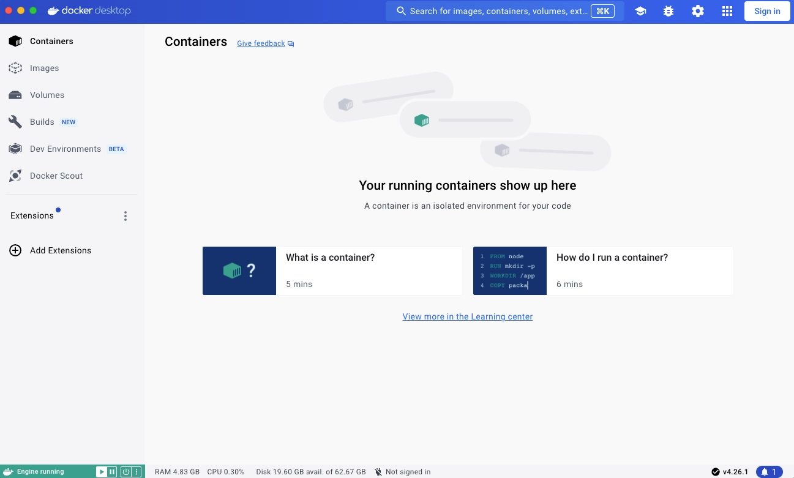

+++
title = "Explore Docker Desktop"
date = 2024-10-23T14:54:40+08:00
weight = 20
type = "docs"
description = ""
isCJKLanguage = true
draft = false
+++

> 原文: [https://docs.docker.com/desktop/use-desktop/](https://docs.docker.com/desktop/use-desktop/)
>
> 收录该文档的时间：`2024-10-23T14:54:40+08:00`

# Explore Docker Desktop

When you open Docker Desktop, the Docker Dashboard displays.

The **Containers** view provides a runtime view of all your containers and applications. It allows you to interact with containers and applications, and manage the lifecycle of your applications directly from your machine. This view also provides an intuitive interface to perform common actions to inspect, interact with, and manage your Docker objects including containers and Docker Compose-based applications. For more information, see [Explore running containers and applications](https://docs.docker.com/desktop/use-desktop/container/).

The **Images** view displays a list of your Docker images and allows you to run an image as a container, pull the latest version of an image from Docker Hub, and inspect images. It also displays a summary of image vulnerabilities. In addition, the **Images** view contains clean-up options to remove unwanted images from the disk to reclaim space. If you are logged in, you can also see the images you and your organization have shared on Docker Hub. For more information, see [Explore your images](https://docs.docker.com/desktop/use-desktop/images/).

The **Volumes** view displays a list of volumes and allows you to easily create and delete volumes and see which ones are being used. For more information, see [Explore volumes](https://docs.docker.com/desktop/use-desktop/volumes/).

The **Builds** view lets you inspect your build history and manage builders. By default, it displays a list of all your ongoing and completed builds. [Explore builds](https://docs.docker.com/desktop/use-desktop/builds/).

In addition, the Docker Dashboard allows you to:

- Navigate to the **Settings** menu to configure your Docker Desktop settings. Select the **Settings** icon in the Dashboard header.

- Access the **Troubleshoot** menu to debug and perform restart operations. Select the **Troubleshoot** icon in the Dashboard header.

- Be notified of new releases, installation progress updates, and more in the **Notifications center**. Select the bell icon in the bottom-right corner of the Docker Dashboard to access the notification center.

- Access the **Learning center** from the Dashboard header. It helps you get started with quick in-app walkthroughs and provides other resources for learning about Docker.

  For a more detailed guide about getting started, see [Get started](https://docs.docker.com/get-started/introduction/).

- Get to the [Docker Scout](https://docs.docker.com/scout/) dashboard.

- Check the status of Docker services.

## [Quick search](https://docs.docker.com/desktop/use-desktop/#quick-search)

From the Docker Dashboard you can use Quick Search, which is located in the Dashboard header, to search for:

- Any container or Compose application on your local system. You can see an overview of associated environment variables or perform quick actions, such as start, stop, or delete.
- Public Docker Hub images, local images, and images from remote repositories (private repositories from organizations you're a part of in Hub). Depending on the type of image you select, you can either pull the image by tag, view documentation, go to Docker Hub for more details, or run a new container using the image.
- Extensions. From here, you can learn more about the extension and install it with a single click. Or, if you already have an extension installed, you can open it straight from the search results.
- Any volume. From here you can view the associated container.
- Docs. Find help from Docker's official documentation straight from Docker Desktop.

## [The Docker menu](https://docs.docker.com/desktop/use-desktop/#the-docker-menu)

Docker Desktop also provides an easy-access tray icon that appears in the taskbar and is referred to as the Docker menu  .

To display the Docker menu, select the  icon. It displays the following options:

- **Dashboard**. This takes you to the Docker Dashboard.
- **Sign in/Sign up**
- **Settings**
- **Check for updates**
- **Troubleshoot**
- **Give feedback**
- **Switch to Windows containers** (if you're on Windows)
- **About Docker Desktop**. Contains information on the versions you are running, and links to the Subscription Service Agreement for example.
- **Docker Hub**
- **Documentation**
- **Extensions**
- **Kubernetes**
- **Restart**
- **Quit Docker Desktop**
