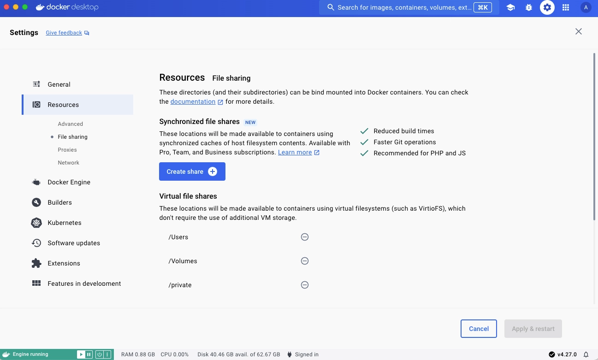

+++
title = "同步文件共享"
date = 2024-10-23T14:54:40+08:00
weight = 60
type = "docs"
description = ""
isCJKLanguage = true
draft = false

+++

> 原文：[https://docs.docker.com/desktop/synchronized-file-sharing/](https://docs.docker.com/desktop/synchronized-file-sharing/)
>
> 收录该文档的时间：`2024-10-23T14:54:40+08:00`

# Synchronized file shares - 同步文件共享

> **Note**
>
> 
>
> Synchronized file shares is available with Docker Desktop version 4.27 and later. It is available for customers with a Docker Pro, Team, or Business subscription.
>
> ​	同步文件共享适用于 Docker Desktop 版本 4.27 及更高版本。仅限 Docker Pro、Team 或 Business 订阅用户。

Synchronized file shares is an alternative file sharing mechanism that provides fast and flexible host-to-VM file sharing, enhancing bind mount performance through the use of synchronized filesystem caches.

​	同步文件共享是一种替代文件共享机制，提供快速灵活的主机到虚拟机文件共享，通过使用同步文件系统缓存提升绑定挂载性能。

## 适用人群 Who is it for?

Synchronized file shares is ideal for developers who:

​	同步文件共享非常适合以下开发者：

- Have large repositories or monorepos with 100 000 files or more totaling hundreds of megabytes or even gigabytes.
  - 拥有大型存储库或包含超过 100,000 个文件、总计数百 MB 或数 GB 的 monorepos。

- Are using virtual filesystems, such as VirtioFS, gRPC FUSE, and osxfs, which are no longer scaling well with their codebases.
  - 使用虚拟文件系统（如 VirtioFS、gRPC FUSE 和 osxfs），这些文件系统已无法很好地扩展其代码库。

- Regularly encounter performance limitations.
  - 经常遇到性能限制。

- Don't want to worry about file ownership or spend time resolving conflicting file-ownership information when modifying multiple containers.
  - 不希望处理文件所有权问题或在修改多个容器时花费时间解决冲突的文件所有权信息。

## 同步文件共享如何工作？ How does Synchronized file shares work?

A Synchronized file share behaves just like a virtual file share, but takes advantage of a high-performance, low-latency code synchronization engine to create a synchronized cache of the host files on an ext4 filesystem within the Docker Desktop VM. If you make filesystem changes on the host or in the VM’s containers, it propagates via bidirectional synchronization.

​	同步文件共享的表现与虚拟文件共享类似，但利用高性能、低延迟的代码同步引擎在 Docker Desktop VM 内的 ext4 文件系统上创建主机文件的同步缓存。如果在主机或 VM 的容器中进行文件系统更改，它会通过双向同步传播。

After creating a file share instance, any container using a bind mount that points to a location on the host filesystem matching the specified synchronized file share location, or a subdirectory within it, utilizes the Synchronized File Shares feature. Bind mounts that don't satisfy this condition are passed to the normal virtual filesystem [bind-mounting mechanism](), for example VirtioFS or gRPC-FUSE.

​	创建文件共享实例后，任何使用绑定挂载的容器都可以指向主机文件系统上指定的同步文件共享位置或其中的子目录，从而使用同步文件共享功能。不满足此条件的绑定挂载会传递到正常的虚拟文件系统[绑定挂载机制]()，例如 VirtioFS 或 gRPC-FUSE。

> **Note**
>
> 
>
> Synchronized file shares is not used by Kubernetes' `hostPath` volumes in Docker Desktop.
>
> ​	Kubernetes 的 `hostPath` 卷在 Docker Desktop 中不使用同步文件共享。

> **Important**
>
> 
>
> Synchronized file shares isn't available on WSL or when using Windows containers.
>
> ​	同步文件共享不适用于 WSL 或使用 Windows 容器时。

## 创建文件共享实例 Create a file share instance

To create a file share instance:

​	要创建文件共享实例：

1. Sign in to Docker Desktop. 登录 Docker Desktop。
2. In **Settings**, navigate to the **File sharing** tab within the **Resources** section. 在 **Settings** 中，导航到 **Resources** 部分的 **File sharing** 选项卡。
3. In the **Synchronized File Shares** section, select the **Create share** icon. 在 **Synchronized File Shares** 部分，选择 **Create share** 图标。
4. Select a host folder to share. The synchronized file share should initialize and be usable. 选择要共享的主机文件夹。同步文件共享应初始化并可用。

File shares take a few seconds to initialize as files are copied into the Docker Desktop VM. During this time, the status indicator displays **Preparing**. There is also a status icon in the footer of the Docker Dashboard that keeps you updated.

​	文件共享在文件复制到 Docker Desktop VM 时会花费几秒钟时间进行初始化。在此期间，状态指示器显示为 **Preparing**。Docker Dashboard 底部的状态图标会实时更新状态。

When the status indicator displays **Watching for filesystem changes**, your files are available to the VM through all the standard bind mount mechanisms, whether that's `-v` in the command line or specified in your `compose.yml` file.

​	当状态指示器显示 **Watching for filesystem changes** 时，您的文件可以通过所有标准绑定挂载机制（例如命令行中的 `-v` 或 `compose.yml` 文件中的指定）提供给 VM。

> **Note**
>
> When you create a new service, setting the [bind mount option consistency](https://docs.docker.com/reference/cli/docker/service/create/#options-for-bind-mounts) to `:consistent` bypasses Synchronized file shares.
>
> ​	创建新服务时，将绑定挂载选项的一致性设置为 `:consistent` 会绕过同步文件共享。

> **Tip**
>
> 
>
> Compose can now automatically create file shares for bind mounts. Ensure you're signed in to Docker with a paid subscription and have enabled both **Access experimental features** and **Manage Synchronized file shares with Compose** in Docker Desktop's settings.
>
> ​	使用 Compose 可以自动为绑定挂载创建文件共享。确保您使用付费订阅登录 Docker，并在 Docker Desktop 的设置中启用了 **Access experimental features** 和 **Manage Synchronized file shares with Compose**。

## 探索文件共享实例 Explore your file share instance

The **Synchronized file shares** section displays all your file share instances and provides useful information about each instance including:

​	**Synchronized file shares** 部分显示所有文件共享实例，并提供每个实例的有用信息，包括：

- The origin of the file share content
  - 文件共享内容的来源

- A status update
  - 状态更新

- How much space each file share is using
  - 每个文件共享使用的空间量

- The number of filesystem entry counts
  - 文件系统条目计数

- The number of symbolic links
  - 符号链接的数量

- Which container(s) is using the file share instance
  - 使用该文件共享实例的容器

Selecting a file share instance expands the dropdown and exposes this information.

​	选择文件共享实例可展开下拉列表并查看这些信息。

## Use `.syncignore`

You can use a `.syncignore` file at the root of each file share, to exclude local files from your file share instance. It supports the same syntax as `.dockerignore` files and excludes, and/or re-includes, paths from synchronization. `.syncignore` files are ignored at any location other than the root of the file share.

​	您可以在每个文件共享的根目录中使用 `.syncignore` 文件，以排除本地文件不在文件共享实例中。它支持与 `.dockerignore` 文件相同的语法，可以排除和/或重新包括同步的路径。`.syncignore` 文件仅在文件共享根目录处有效。

Some example of things you might want to add to your `.syncignore` file are:

​	您可能希望在 `.syncignore` 文件中添加以下内容：

- Large dependency directories, for example `node_modules` and `composer` directories (unless you rely on accessing them via a bind mount)
  - 大型依赖目录，例如 `node_modules` 和 `composer` 目录（除非您依赖通过绑定挂载访问它们）

- `.git` directories (again, unless you need them)
  - `.git` 目录（除非您需要它们）

In general, use your `.syncignore` file to exclude items that aren't critical to your workflow, especially those that would be slow to sync or use significant storage.

​	通常，可以使用 `.syncignore` 文件排除对工作流非关键的项目，特别是那些同步较慢或占用大量存储的项目。

## 已知问题 Known issues

- Changes made to `.syncignore` don't lead to immediate deletions unless the file share is recreated. In other words, files that are newly ignored due to modifications in the `.syncignore` file remain in their current location, but are no longer updated during synchronization.
  - 对 `.syncignore` 的更改不会立即导致删除，除非重新创建文件共享。换句话说，`.syncignore` 文件中的修改导致的新忽略文件将保留在当前位置，但不会在同步期间更新。

- File share instances are currently limited to approximately 2 million files per share. For best performance, if you have a file share instance of this size, try to decompose it into multiple shares corresponding to individual bind mount locations.
  - 文件共享实例当前限制为每个共享约 200 万个文件。为了获得最佳性能，如果您有如此大规模的文件共享实例，请尝试将其分解为多个与单个绑定挂载位置对应的共享。

- Case conflicts, due to Linux being case-sensitive and macOS/Windows only being case-preserving, display as **File exists** problems in the GUI. These can be ignored. However, if they persist, you can report the issue.
  - 由于 Linux 区分大小写，而 macOS/Windows 仅保留大小写，大小写冲突在 GUI 中显示为 **File exists** 问题。这些问题可以忽略，但如果持续存在，可以报告。

- Synchronized file shares proactively reports temporary issues, which can result in occasional **Conflict** and **Problem** indicators appearing in the GUI during synchronization. These can be ignored. However, if they persist, you can report the issue.
  - 同步文件共享主动报告临时问题，这可能导致 GUI 中同步期间偶尔出现 **Conflict** 和 **Problem** 指示器。这些问题可以忽略，但如果持续存在，可以报告。

- If you switch from WSL2 to Hyper-V on Windows, Docker Desktop needs to be fully restarted.
  - 从 WSL2 切换到 Windows 上的 Hyper-V 时，Docker Desktop 需要完全重启。

- POSIX-style Windows paths are not supported. Avoid setting the [`COMPOSE_CONVERT_WINDOWS_PATHS`](https://docs.docker.com/compose/how-tos/environment-variables/envvars/#compose_convert_windows_paths) environment variable in Docker Compose.
  - 不支持 POSIX 风格的 Windows 路径。请避免在 Docker Compose 中设置 [`COMPOSE_CONVERT_WINDOWS_PATHS`](https://docs.docker.com/compose/how-tos/environment-variables/envvars/#compose_convert_windows_paths) 环境变量。

## 反馈与支持 Feedback and support

To give feedback or report bugs, visit:

​	要提供反馈或报告错误，请访问：

- [Docker Desktop for Mac issues on GitHub](https://github.com/docker/for-mac/issues)
  - Docker Desktop for Mac 问题反馈 GitHub

- [Docker Desktop for Windows issues on GitHub](https://github.com/docker/for-win/issues)
  - Docker Desktop for Windows 问题反馈 GitHub
- [Docker Desktop for Linux issues on GitHub](https://github.com/docker/desktop-linux/issues)
  - Docker Desktop for Linux 问题反馈 GitHub
