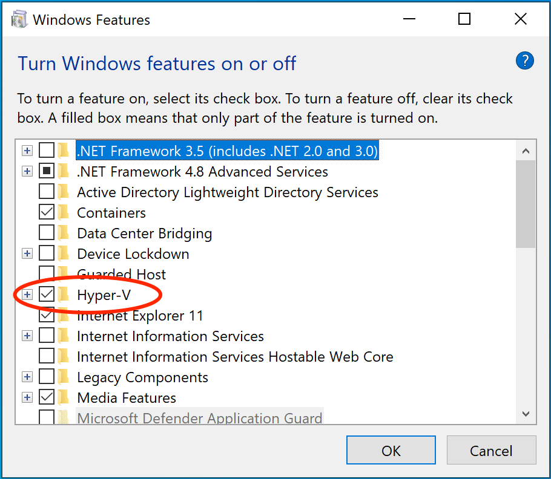

+++
title = "共同主题"
date = 2024-10-23T14:54:40+08:00
weight = 1
type = "docs"
description = ""
isCJKLanguage = true
draft = false

+++

> 原文：[https://docs.docker.com/desktop/troubleshoot/topics/](https://docs.docker.com/desktop/troubleshoot/topics/)
>
> 收录该文档的时间：`2024-10-23T14:54:40+08:00`

# Troubleshoot topics for Docker Desktop - Docker Desktop 故障排除主题

> **Tip**
>
> 
>
> If you do not find a solution in troubleshooting, browse the GitHub repositories or create a new issue:
>
> ​	如果在故障排除中找不到解决方案，可以浏览 GitHub 仓库或创建新问题：
>
> - [docker/for-mac](https://github.com/docker/for-mac/issues)
>
> - [docker/for-win](https://github.com/docker/for-win/issues)
> - [docker/for-linux](https://github.com/docker/for-linux/issues)

## 适用于所有平台的主题 Topics for all platforms

### 确保证书设置正确 Make sure certificates are set up correctly

Docker Desktop ignores certificates listed under insecure registries, and does not send client certificates to them. Commands like `docker run` that attempt to pull from the registry produces error messages on the command line, like this:

​	Docker Desktop 会忽略列在不安全注册表中的证书，不会向这些注册表发送客户端证书。尝试从注册表拉取的命令（例如 `docker run`）会在命令行上产生错误消息，如下所示：


```console
Error response from daemon: Get http://192.168.203.139:5858/v2/: malformed HTTP response "\x15\x03\x01\x00\x02\x02"
```

As well as on the registry. For example:

​	同时在注册表上也会出现类似错误。例如：


```console
2017/06/20 18:15:30 http: TLS handshake error from 192.168.203.139:52882: tls: client didn't provide a certificate
2017/06/20 18:15:30 http: TLS handshake error from 192.168.203.139:52883: tls: first record does not look like a TLS handshake
```

### Docker Desktop 界面显示为绿色、失真或出现视觉伪影 Docker Desktop's UI appears green, distorted, or has visual artifacts

Docker Desktop uses hardware-accelerated graphics by default, which may cause problems for some GPUs. In such cases, Docker Desktop will launch successfully, but some screens may appear green, distorted, or have some visual artifacts.

​	Docker Desktop 默认使用硬件加速图形，这可能会导致某些 GPU 出现问题。在这种情况下，Docker Desktop 会成功启动，但某些屏幕可能会显示为绿色、失真或带有视觉伪影。

To work around this issue, disable hardware acceleration by creating a `"disableHardwareAcceleration": true` entry in Docker Desktop's `settings.json` file. You can find this file at:

​	要解决此问题，请在 Docker Desktop 的 `settings.json` 文件中创建 `"disableHardwareAcceleration": true` 条目。文件路径如下：

- Mac: `~/Library/Group Containers/group.com.docker/settings.json`
- Windows: `C:\Users\[USERNAME]\AppData\Roaming\Docker\settings.json`
- Linux: `~/.docker/desktop/settings.json.`

After updating the `settings.json` file, close and restart Docker Desktop to apply the changes.

​	更新 `settings.json` 文件后，关闭并重启 Docker Desktop 以应用更改。

## 适用于 Linux 和 Mac 的主题 Topics for Linux and Mac

### 在 `$HOME` 目录以外的项目目录上挂载卷需要文件共享 Volume mounting requires file sharing for any project directories outside of `$HOME`

If you are using mounted volumes and get runtime errors indicating an application file is not found, access to a volume mount is denied, or a service cannot start, such as when using [Docker Compose](), you might need to turn on [file sharing](https://docs.docker.com/desktop/settings/#file-sharing).

​	如果您在使用挂载卷时遇到运行时错误，表明找不到应用文件、访问挂载卷被拒绝，或服务无法启动（例如使用 [Docker Compose]() 时），可能需要启用 [文件共享](https://docs.docker.com/desktop/settings/#file-sharing)。

Volume mounting requires shared drives for projects that live outside of the `/home/<user>` directory. From **Settings**, select **Resources** and then **File sharing**. Share the drive that contains the Dockerfile and volume.

​	挂载卷需要共享 `/home/<user>` 目录之外的驱动器。在 **设置** 中选择 **资源**，然后选择 **文件共享**，共享包含 Dockerfile 和卷的驱动器。

### Docker Desktop 无法在 MacOS 或 Linux 平台上启动 Docker Desktop fails to start on MacOS or Linux platforms

On MacOS and Linux, Docker Desktop creates Unix domain sockets used for inter-process communication.

​	在 MacOS 和 Linux 上，Docker Desktop 会创建用于进程间通信的 Unix 域套接字。

Docker fails to start if the absolute path length of any of these sockets exceeds the OS limitation which is 104 characters on MacOS and 108 characters on Linux. These sockets are created under the user's home directory. If the user ID length is such that the absolute path of the socket exceeds the OS path length limitation, then Docker Desktop is unable to create the socket and fails to start. The workaround for this is to shorten the user ID which we recommend has a maximum length of 33 characters on MacOS and 55 characters on Linux.

​	如果这些套接字的绝对路径长度超过 OS 限制（MacOS 为 104 个字符，Linux 为 108 个字符），Docker 启动将失败。这些套接字在用户的主目录下创建。如果用户 ID 长度使得套接字路径超过操作系统的路径长度限制，Docker Desktop 将无法创建套接字并导致启动失败。解决方法是缩短用户 ID，推荐在 MacOS 上最大为 33 个字符，在 Linux 上最大为 55 个字符。

Following are the examples of errors on MacOS which indicate that the startup failure was due to exceeding the above mentioned OS limitation:

​	以下是 MacOS 上由于超过上述操作系统限制而导致启动失败的错误示例：

```console
[vpnkit-bridge][F] listen unix HOME/Library/Containers/com.docker.docker/Data/http-proxy-control.sock: bind: invalid argument
```


```console
[com.docker.backend][E] listen(vsock:4099) failed: listen unix HOME/Library/Containers/com.docker.docker/Data/vms/0/00000002.00001003: bind: invalid argument
```

## Mac 相关主题 Topics for Mac

### 检测到不兼容的 CPU - Incompatible CPU detected

Docker Desktop requires a processor (CPU) that supports virtualization and, more specifically, the [Apple Hypervisor framework](https://developer.apple.com/library/mac/documentation/DriversKernelHardware/Reference/Hypervisor/). Docker Desktop is only compatible with Mac systems that have a CPU that supports the Hypervisor framework. Most Macs built in 2010 and later support it,as described in the Apple Hypervisor Framework documentation about supported hardware:

​	Docker Desktop 需要支持虚拟化的处理器 (CPU)，并且特别需要 [Apple Hypervisor 框架](https://developer.apple.com/library/mac/documentation/DriversKernelHardware/Reference/Hypervisor/)。Docker Desktop 仅兼容支持 Hypervisor 框架的 Mac 系统。大多数 2010 年及以后生产的 Mac 都支持该功能，如 Apple Hypervisor 框架关于支持硬件的文档所述：

*Generally, machines with an Intel VT-x feature set that includes Extended Page Tables (EPT) and Unrestricted Mode are supported.*

​	*通常，具有包括扩展页表 (EPT) 和非受限模式的 Intel VT-x 特性集的机器均受支持。*

To check if your Mac supports the Hypervisor framework, run the following command in a terminal window.

​	可以通过在终端窗口中运行以下命令来检查您的 Mac 是否支持 Hypervisor 框架：


```console
$ sysctl kern.hv_support
```

If your Mac supports the Hypervisor Framework, the command prints `kern.hv_support: 1`.

​	如果您的 Mac 支持 Hypervisor 框架，该命令会输出 `kern.hv_support: 1`；

If not, the command prints `kern.hv_support: 0`.

​	否则，输出 `kern.hv_support: 0`。

See also, [Hypervisor Framework Reference](https://developer.apple.com/library/mac/documentation/DriversKernelHardware/Reference/Hypervisor/) in the Apple documentation, and Docker Desktop [Mac system requirements](https://docs.docker.com/desktop/install/mac-install/#system-requirements).

​	另请参见 Apple 文档中的 [Hypervisor 框架参考](https://developer.apple.com/library/mac/documentation/DriversKernelHardware/Reference/Hypervisor/)和 Docker Desktop [Mac 系统要求](https://docs.docker.com/desktop/install/mac-install/#system-requirements)。

### VPNKit 持续出问题 VPNKit keeps breaking

In Docker Desktop version 4.19, gVisor replaced VPNKit to enhance the performance of VM networking when using the Virtualization framework on macOS 13 and above.

​	在 Docker Desktop 版本 4.19 中，gVisor 替代了 VPNKit，以提高在 macOS 13 及更高版本的虚拟化框架上使用 VM 网络的性能。

To continue using VPNKit, add `"networkType":"vpnkit"` to your `settings.json` file located at `~/Library/Group Containers/group.com.docker/settings.json`.

​	若要继续使用 VPNKit，请在位于 `~/Library/Group Containers/group.com.docker/settings.json` 的 `settings.json` 文件中添加 `"networkType":"vpnkit"`。

## Windows 相关主题 Topics for Windows

### 卷 Volumes

#### 共享卷数据目录上的权限错误 Permissions errors on data directories for shared volumes

When sharing files from Windows, Docker Desktop sets permissions on [shared volumes](https://docs.docker.com/desktop/settings/#file-sharing) to a default value of [0777](https://chmodcommand.com/chmod-0777/) (`read`, `write`, `execute` permissions for `user` and for `group`).

​	在 Windows 上共享文件时，Docker Desktop 会将 [共享卷](https://docs.docker.com/desktop/settings/#file-sharing) 的权限设置为默认值 [0777](https://chmodcommand.com/chmod-0777/)（`user` 和 `group` 均具有 `read`、`write`、`execute` 权限）。

The default permissions on shared volumes are not configurable. If you are working with applications that require permissions different from the shared volume defaults at container runtime, you need to either use non-host-mounted volumes or find a way to make the applications work with the default file permissions.

​	共享卷上的默认权限不可配置。如果您在使用需要与共享卷默认权限不同的应用程序，您需要使用非主机挂载卷或找到使应用程序适应默认文件权限的方法。

See also, [Can I change permissions on shared volumes for container-specific deployment requirements?](https://docs.docker.com/desktop/faqs/windowsfaqs/#can-i-change-permissions-on-shared-volumes-for-container-specific-deployment-requirements) in the FAQs.

​	另见常见问题解答中的 [是否可以更改共享卷上的权限以满足特定容器的部署需求？](https://docs.docker.com/desktop/faqs/windowsfaqs/#can-i-change-permissions-on-shared-volumes-for-container-specific-deployment-requirements)。

#### Linux 容器的卷挂载需要共享文件夹 Volume mounting requires shared folders for Linux containers

If you are using mounted volumes and get runtime errors indicating an application file is not found, access is denied to a volume mount, or a service cannot start, such as when using [Docker Compose](), you might need to turn on [shared folders](https://docs.docker.com/desktop/settings/#file-sharing).

​	如果您使用挂载卷并收到运行时错误，表示找不到应用程序文件、访问卷挂载被拒绝或服务无法启动，例如在使用 [Docker Compose]() 时，您可能需要启用 [共享文件夹](https://docs.docker.com/desktop/settings/#file-sharing)。

With the Hyper-V backend, mounting files from Windows requires shared folders for Linux containers. From **Settings**, select **Shared Folders** and share the folder that contains the Dockerfile and volume.

​	在 Hyper-V 后端上，从 Windows 挂载文件需要 Linux 容器的共享文件夹。进入 **设置**，选择 **共享文件夹** 并共享包含 Dockerfile 和卷的文件夹。

#### 符号链接支持 Support for symlinks

Symlinks work within and across containers. To learn more, see [How do symlinks work on Windows?](https://docs.docker.com/desktop/faqs/windowsfaqs/#how-do-symlinks-work-on-windows).

​	符号链接在容器内和容器之间都可以正常工作。更多信息请参见 [符号链接在 Windows 上如何工作？](https://docs.docker.com/desktop/faqs/windowsfaqs/#how-do-symlinks-work-on-windows)。

#### 避免意外的语法错误，为容器中的文件使用 Unix 风格的行尾 Avoid unexpected syntax errors, use Unix style line endings for files in containers

Any file destined to run inside a container must use Unix style `\n` line endings. This includes files referenced at the command line for builds and in RUN commands in Docker files.

​	所有将在容器中运行的文件都必须使用 Unix 风格的 `\n` 行尾。这包括命令行中构建和 Docker 文件中的 RUN 命令引用的文件。

Docker containers and `docker build` run in a Unix environment, so files in containers must use Unix style line endings: `\n`, *not* Windows style: `\r\n`. Keep this in mind when authoring files such as shell scripts using Windows tools, where the default is likely to be Windows style line endings. These commands ultimately get passed to Unix commands inside a Unix based container (for example, a shell script passed to `/bin/sh`). If Windows style line endings are used, `docker run` fails with syntax errors.

​	Docker 容器和 `docker build` 在 Unix 环境中运行，因此容器中的文件必须使用 Unix 风格的行尾：`n`，而非 Windows 风格的 `\r\n`。编写文件（例如使用 Windows 工具编写的 shell 脚本）时，请牢记这一点，因为默认可能是 Windows 风格的行尾。这些命令最终将传递到 Unix 容器中的 Unix 命令（例如传递给 `/bin/sh` 的 shell 脚本）。如果使用 Windows 风格的行尾，则 `docker run` 会因语法错误而失败。

For an example of this issue and the resolution, see this issue on GitHub: [Docker RUN fails to execute shell script](https://github.com/moby/moby/issues/24388).

​	有关该问题和解决方案的示例，请参见 GitHub 上的 [Docker RUN 无法执行 shell 脚本](https://github.com/moby/moby/issues/24388)。

#### Windows 上的路径转换 Path conversion on Windows

On Linux, the system takes care of mounting a path to another path. For example, when you run the following command on Linux:

​	在 Linux 上，系统会处理将一个路径挂载到另一个路径。例如，在 Linux 上运行以下命令时：


```console
$ docker run --rm -ti -v /home/user/work:/work alpine
```

It adds a `/work` directory to the target container to mirror the specified path.

​	它会将 `/work` 目录添加到目标容器中，以镜像指定的路径。

However, on Windows, you must update the source path. For example, if you are using the legacy Windows shell (`cmd.exe`), you can use the following command:

​	然而，在 Windows 上，您必须更新源路径。例如，如果您使用的是旧版 Windows shell (`cmd.exe`)，可以使用以下命令：


```console
$ docker run --rm -ti -v C:\Users\user\work:/work alpine
```

This starts the container and ensures the volume becomes usable. This is possible because Docker Desktop detects the Windows-style path and provides the appropriate conversion to mount the directory.

​	这将启动容器并确保卷可用。这是因为 Docker Desktop 检测到 Windows 风格的路径并提供适当的转换以挂载目录。

Docker Desktop also allows you to use Unix-style path to the appropriate format. For example:

​	Docker Desktop 还允许使用 Unix 风格路径来适应相应格式。例如：


```console
$ docker run --rm -ti -v /c/Users/user/work:/work alpine ls /work
```

#### 使用 Git Bash - Working with Git Bash

Git Bash (or MSYS) provides a Unix-like environment on Windows. These tools apply their own preprocessing on the command line. For example, if you run the following command in Git Bash, it gives an error:

​	Git Bash（或 MSYS）在 Windows 上提供了一个类似 Unix 的环境。这些工具在命令行上应用了自己的预处理。例如，如果在 Git Bash 中运行以下命令，会出现错误：


```console
$ docker run --rm -ti -v C:\Users\user\work:/work alpine
docker: Error response from daemon: mkdir C:UsersUserwork: Access is denied.
```

This is because the `\` character has a special meaning in Git Bash. If you are using Git Bash, you must neutralize it using `\\`:

​	这是因为 `\` 字符在 Git Bash 中具有特殊含义。如果使用 Git Bash，则必须使用 `\\` 进行转义：


```console
$ docker run --rm -ti -v C:\\Users\\user\\work:/work alpine
```

Also, in scripts, the `pwd` command is used to avoid hard-coding file system locations. Its output is a Unix-style path.

​	此外，在脚本中，`pwd` 命令用于避免硬编码文件系统位置。其输出为 Unix 风格路径。


```console
$ pwd
/c/Users/user/work
```

Combined with the `$()` syntax, the command below works on Linux, however, it fails on Git Bash.

​	结合 `$()` 语法，以下命令在 Linux 上有效，但在 Git Bash 上失败。


```console
$ docker run --rm -ti -v $(pwd):/work alpine
docker: Error response from daemon: OCI runtime create failed: invalid mount {Destination:\Program Files\Git\work Type:bind Source:/run/desktop/mnt/host/c/Users/user/work;C Options:[rbind rprivate]}: mount destination \Program Files\Git\work not absolute: unknown.
```

You can work around this issue by using an extra `/`

​	您可以通过添加额外的 `/` 来解决此问题：


```console
$ docker run --rm -ti -v /$(pwd):/work alpine
```

Portability of the scripts is not affected as Linux treats multiple `/` as a single entry. Each occurrence of paths on a single line must be neutralized.

​	在单行中路径的每次出现都必须进行转义，以确保跨平台的可移植性。


```console
$ docker run --rm -ti -v /$(pwd):/work alpine ls /work
ls: C:/Program Files/Git/work: No such file or directory
```

In this example, The `$(pwd)` is not converted because of the preceding '/'. However, the second '/work' is transformed by the POSIX layer before passing it to Docker Desktop. You can also work around this issue by using an extra `/`.

​	在此示例中，由于前导 `/`，`$(pwd)` 未转换。然而，POSIX 层在将路径传递给 Docker Desktop 之前会转换第二个 `/work`。您还可以通过使用额外的 `/` 来解决此问题。


```console
$ docker run --rm -ti -v /$(pwd):/work alpine ls //work
```

To verify whether the errors are generated from your script, or from another source, you can use an environment variable. For example:

​	如需验证错误是否由您的脚本生成，您可以使用环境变量。例如：

```console
$ MSYS_NO_PATHCONV=1 docker run --rm -ti -v $(pwd):/work alpine ls /work
```

It only expects the environment variable here. The value doesn't matter.

​	此处仅需要环境变量，值无关紧要。

In some cases, MSYS also transforms colons to semicolon. Similar conversions can also occur when using `~` because the POSIX layer translates it to a DOS path. `MSYS_NO_PATHCONV` also works in this case.

​	在某些情况下，MSYS 还会将冒号转换为分号。使用 `~` 时也可能发生类似的转换，因为 POSIX 层将其翻译为 DOS 路径。在这种情况下，`MSYS_NO_PATHCONV` 也适用。

### 虚拟化 Virtualization

Your machine must have the following features for Docker Desktop to function correctly:

​	为了使 Docker Desktop 正常运行，您的机器必须具备以下功能：

#### WSL 2 and Windows Home

1. Virtual Machine Platform 虚拟机平台
2. [Windows Subsystem for Linux](https://docs.microsoft.com/en-us/windows/wsl/install-win10)
3. [Virtualization enabled in the BIOS BIOS 中启用虚拟化](https://www.virtualmetric.com/blog/how-to-enable-hardware-virtualization)
4. Hypervisor enabled at Windows startup 在 Windows 启动时启用 Hypervisor


#### Hyper-V

On Windows 10 Pro or Enterprise, you can also use Hyper-V with the following features enabled:

​	在 Windows 10 专业版或企业版上，您也可以使用启用以下功能的 Hyper-V：

1. [Hyper-V](https://docs.microsoft.com/en-us/windows-server/virtualization/hyper-v/hyper-v-technology-overview) installed and working 安装并启用 [Hyper-V](https://docs.microsoft.com/en-us/windows-server/virtualization/hyper-v/hyper-v-technology-overview)
2. [Virtualization enabled in the BIOS -  BIOS 中启用虚拟化](https://www.virtualmetric.com/blog/how-to-enable-hardware-virtualization)
3. Hypervisor enabled at Windows startup 在 Windows 启动时启用 Hypervisor



Docker Desktop requires Hyper-V as well as the Hyper-V Module for Windows PowerShell to be installed and enabled. The Docker Desktop installer enables it for you.

​	Docker Desktop 需要 Hyper-V 和 Windows PowerShell 的 Hyper-V 模块，这些组件会在安装 Docker Desktop 时自动启用。

Docker Desktop also needs two CPU hardware features to use Hyper-V: Virtualization and Second Level Address Translation (SLAT), which is also called Rapid Virtualization Indexing (RVI). On some systems, Virtualization must be enabled in the BIOS. The steps required are vendor-specific, but typically the BIOS option is called `Virtualization Technology (VTx)` or something similar. Run the command `systeminfo` to check all required Hyper-V features. See [Pre-requisites for Hyper-V on Windows 10](https://docs.microsoft.com/en-us/virtualization/hyper-v-on-windows/reference/hyper-v-requirements) for more details.

​	Docker Desktop 还需要两个 CPU 硬件功能来使用 Hyper-V：虚拟化和二级地址转换 (SLAT)，也称为快速虚拟化索引 (RVI)。在某些系统上，虚拟化必须在 BIOS 中启用。具体步骤取决于供应商，但通常 BIOS 选项称为 `Virtualization Technology (VTx)` 或类似名称。运行 `systeminfo` 命令以检查所有必需的 Hyper-V 功能。更多详细信息请参见 [Windows 10 上的 Hyper-V 先决条件](https://docs.microsoft.com/en-us/virtualization/hyper-v-on-windows/reference/hyper-v-requirements)。

To install Hyper-V manually, see [Install Hyper-V on Windows 10](https://msdn.microsoft.com/en-us/virtualization/hyperv_on_windows/quick_start/walkthrough_install). A reboot is *required* after installation. If you install Hyper-V without rebooting, Docker Desktop does not work correctly.

​	如需手动安装 Hyper-V，请参阅 [在 Windows 10 上安装 Hyper-V](https://msdn.microsoft.com/en-us/virtualization/hyperv_on_windows/quick_start/walkthrough_install)。安装后*必须*重新启动。如果安装 Hyper-V 后不重新启动，Docker Desktop 将无法正常工作。

From the start menu, type **Turn Windows features on or off** and press enter. In the subsequent screen, verify that Hyper-V is enabled.

​	在开始菜单中键入 **打开或关闭 Windows 功能** 并按 Enter。在后续屏幕中，确认 Hyper-V 已启用。

#### 必须启用虚拟化 Virtualization must be turned on

In addition to [Hyper-V](https://docs.docker.com/desktop/troubleshoot/topics/#hyper-v) or [WSL 2](), virtualization must be turned on. Check the Performance tab on the Task Manager. Alternatively, you can type 'systeminfo' into your terminal. If you see 'Hyper-V Requirements: A hypervisor has been detected. Features required for Hyper-V will not be displayed', then virtualization is enabled.

​	除了 [Hyper-V](https://docs.docker.com/desktop/troubleshoot/topics/#hyper-v) 或 [WSL 2]()，还必须启用虚拟化。可在任务管理器的性能选项卡中查看，或者在终端中输入 `systeminfo`。如果看到 “Hyper-V 要求：已检测到 Hypervisor。不会显示 Hyper-V 所需的功能”，则表示虚拟化已启用。


If you manually uninstall Hyper-V, WSL 2 or turn off virtualization, Docker Desktop cannot start.

​	如果手动卸载 Hyper-V、WSL 2 或关闭虚拟化，Docker Desktop 将无法启动。

To turn on nested virtualisation, see [Run Docker Desktop for Windows in a VM or VDI environment](https://docs.docker.com/desktop/vm-vdi/#turn-on-nested-virtualization).

​	要启用嵌套虚拟化，请参见 [在虚拟机或 VDI 环境中运行 Docker Desktop for Windows](https://docs.docker.com/desktop/vm-vdi/#turn-on-nested-virtualization)。

#### 在 Windows 启动时启用 Hypervisor - Hypervisor enabled at Windows startup

If you have completed the steps described above and are still experiencing Docker Desktop startup issues, this could be because the Hypervisor is installed, but not launched during Windows startup. Some tools (such as older versions of Virtual Box) and video game installers turn off hypervisor on boot. To turn it back on:

​	如果您已完成上述步骤但仍遇到 Docker Desktop 启动问题，这可能是因为 Hypervisor 已安装，但未在 Windows 启动时启动。某些工具（例如旧版本的 Virtual Box）和视频游戏安装程序会在启动时关闭 Hypervisor。要重新启用它：

1. Open an administrative console prompt. 打开管理员控制台提示符。
2. Run `bcdedit /set hypervisorlaunchtype auto`.
3. Restart Windows. 重启 Windows。

You can also refer to the [Microsoft TechNet article](https://social.technet.microsoft.com/Forums/en-US/ee5b1d6b-09e2-49f3-a52c-820aafc316f9/hyperv-doesnt-work-after-upgrade-to-windows-10-1809?forum=win10itprovirt) on Code flow guard (CFG) settings.

​	您还可以参考 [Microsoft TechNet 文章](https://social.technet.microsoft.com/Forums/en-US/ee5b1d6b-09e2-49f3-a52c-820aafc316f9/hyperv-doesnt-work-after-upgrade-to-windows-10-1809?forum=win10itprovirt) 中的代码流守护 (CFG) 设置。

#### 启用嵌套虚拟化 Turn on nested virtualization

If you are using Hyper-V and you get the following error message when running Docker Desktop in a VDI environment:

​	如果您使用 Hyper-V，并且在 VDI 环境中运行 Docker Desktop 时收到以下错误消息：


```console
The Virtual Machine Management Service failed to start the virtual machine 'DockerDesktopVM' because one of the Hyper-V components is not running
```

Try [enabling nested virtualization](https://docs.docker.com/desktop/vm-vdi/#turn-on-nested-virtualization).

​	尝试 [启用嵌套虚拟化](https://docs.docker.com/desktop/vm-vdi/#turn-on-nested-virtualization)。

### Windows containers and Windows Server

Docker Desktop is not supported on Windows Server. If you have questions about how to run Windows containers on Windows 10, see [Switch between Windows and Linux containers](https://docs.docker.com/desktop/faqs/windowsfaqs/#how-do-i-switch-between-windows-and-linux-containers).

​	Docker Desktop 不支持 Windows Server。如果您有关于如何在 Windows 10 上运行 Windows 容器的问题，请参阅 [在 Windows 和 Linux 容器之间切换](https://docs.docker.com/desktop/faqs/windowsfaqs/#how-do-i-switch-between-windows-and-linux-containers)。

A full tutorial is available in [docker/labs](https://github.com/docker/labs) on [Getting Started with Windows Containers](https://github.com/docker/labs/blob/master/windows/windows-containers/README.md).

​	在 [docker/labs](https://github.com/docker/labs) 中提供了 [Windows 容器入门](https://github.com/docker/labs/blob/master/windows/windows-containers/README.md) 的完整教程。

You can install a native Windows binary which allows you to develop and run Windows containers without Docker Desktop. However, if you install Docker this way, you cannot develop or run Linux containers. If you try to run a Linux container on the native Docker daemon, an error occurs:

​	您可以安装一个原生 Windows 二进制文件，以允许您在没有 Docker Desktop 的情况下开发和运行 Windows 容器。然而，如果您以这种方式安装 Docker，则无法开发或运行 Linux 容器。如果尝试在本地 Docker 守护程序上运行 Linux 容器，会出现以下错误：


```none
C:\Program Files\Docker\docker.exe:
 image operating system "linux" cannot be used on this platform.
 See 'C:\Program Files\Docker\docker.exe run --help'.
```

### 启动 Docker Desktop 时显示 “Docker Desktop Access Denied” 错误消息 `Docker Desktop Access Denied` error message when starting Docker Desktop

Docker Desktop displays the **Docker Desktop - Access Denied** error if a Windows user is not part of the **docker-users** group.

​	如果 Windows 用户不属于 **docker-users** 组，Docker Desktop 会显示 **Docker Desktop - Access Denied** 错误。

If your admin account is different to your user account, add the **docker-users** group. Run **Computer Management** as an administrator and navigate to **Local Users and Groups** > **Groups** > **docker-users**.

​	如果管理员帐户与您的用户帐户不同，请将用户添加到 **docker-users** 组。以管理员身份运行 **计算机管理**，并导航到 **本地用户和组** > **组** > **docker-users**。

Right-click to add the user to the group. Sign out and sign back in for the changes to take effect.

​	右键单击并将用户添加到该组。注销并重新登录以使更改生效。
