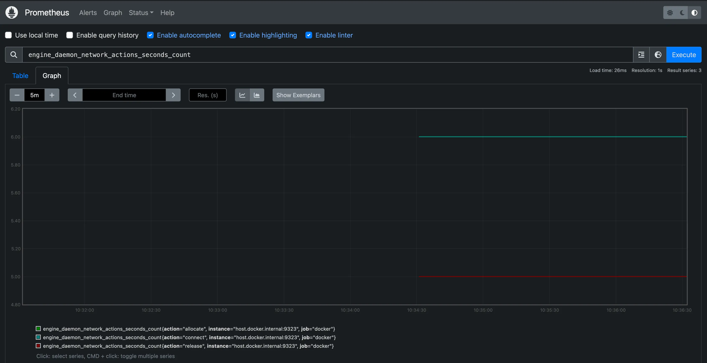
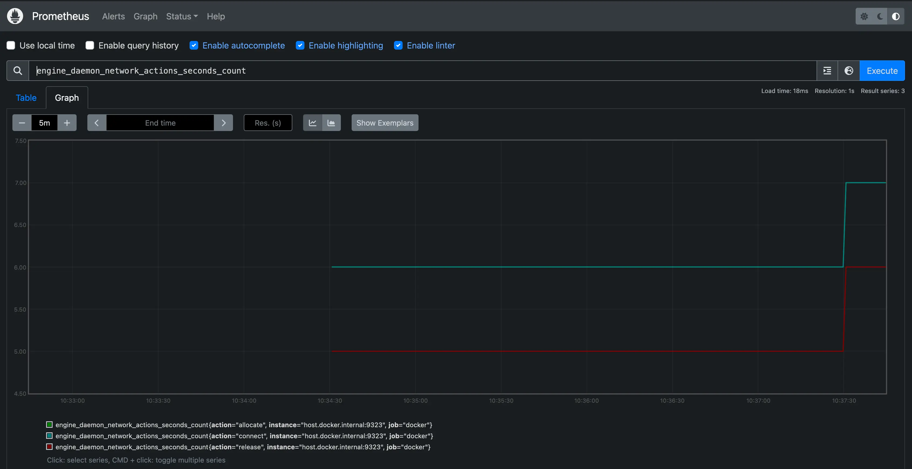

+++
title = "使用 Prometheus 收集 Docker 指标"
date = 2024-10-23T14:54:40+08:00
weight = 50
type = "docs"
description = ""
isCJKLanguage = true
draft = false

+++

> 原文：[https://docs.docker.com/engine/daemon/prometheus/](https://docs.docker.com/engine/daemon/prometheus/)
>
> 收录该文档的时间：`2024-10-23T14:54:40+08:00`

# Collect Docker metrics with Prometheus - 使用 Prometheus 收集 Docker 指标

[Prometheus](https://prometheus.io/) is an open-source systems monitoring and alerting toolkit. You can configure Docker as a Prometheus target.

​	[Prometheus](https://prometheus.io/) 是一个开源系统监控和告警工具包。可以将 Docker 配置为 Prometheus 的目标。

> **Warning**
>
> 
>
> The available metrics and the names of those metrics are in active development and may change at any time.
>
> ​	可用的指标和这些指标的名称正在积极开发中，可能随时更改。

Currently, you can only monitor Docker itself. You can't currently monitor your application using the Docker target.

​	目前，您只能监控 Docker 本身，尚不能通过 Docker 目标监控您的应用程序。

## Example

The following example shows you how to configure your Docker daemon, set up Prometheus to run as a container on your local machine, and monitor your Docker instance using Prometheus.

​	以下示例展示了如何配置 Docker 守护进程，设置 Prometheus 作为容器在本地运行，并使用 Prometheus 监控您的 Docker 实例。

### 配置守护进程 Configure the daemon

To configure the Docker daemon as a Prometheus target, you need to specify the `metrics-address` in the `daemon.json` configuration file. This daemon expects the file to be located at one of the following locations by default. If the file doesn't exist, create it.

​	要将 Docker 守护进程配置为 Prometheus 目标，您需要在 `daemon.json` 配置文件中指定 `metrics-address`。该文件默认位置如下。如果文件不存在，请创建它。

- **Linux**: `/etc/docker/daemon.json`
- **Windows Server**: `C:\ProgramData\docker\config\daemon.json`
- **Docker Desktop**: Open the Docker Desktop settings and select **Docker Engine** to edit the file.
  - **Docker Desktop**: 打开 Docker Desktop 设置，选择 **Docker Engine** 以编辑文件。


Add the following configuration:

​	添加以下配置：

```json
{
  "metrics-addr": "127.0.0.1:9323"
}
```

Save the file, or in the case of Docker Desktop for Mac or Docker Desktop for Windows, save the configuration. Restart Docker.

​	保存文件（对于 Docker Desktop for Mac 或 Docker Desktop for Windows，保存配置），然后重启 Docker。

Docker now exposes Prometheus-compatible metrics on port 9323 on the loopback interface.

​	Docker 现在会在回环接口上的端口 9323 上公开兼容 Prometheus 的指标。

### 创建 Prometheus 配置 Create a Prometheus configuration

Copy the following configuration file and save it to a location of your choice, for example `/tmp/prometheus.yml`. This is a stock Prometheus configuration file, except for the addition of the Docker job definition at the bottom of the file.

​	将以下配置文件复制并保存到指定位置，例如 `/tmp/prometheus.yml`。这是一个标准的 Prometheus 配置文件，除了在文件底部添加了 Docker 作业定义。


```yml
# my global config
# 我的全局配置
global:
  scrape_interval: 15s # Set the scrape interval to every 15 seconds. Default is every 1 minute. 将抓取间隔设置为每 15 秒。默认是每 1 分钟。
  evaluation_interval: 15s # Evaluate rules every 15 seconds. The default is every 1 minute. 每 15 秒评估一次规则。默认是每 1 分钟。
  # scrape_timeout is set to the global default (10s).
  # scrape_timeout 设置为全局默认值 (10s)。

  # Attach these labels to any time series or alerts when communicating with
  # external systems (federation, remote storage, Alertmanager).
  # 在与外部系统（例如联邦、远程存储、Alertmanager）通信时，将这些标签附加到任何时间序列或告警中。
  external_labels:
    monitor: "codelab-monitor"

# Load rules once and periodically evaluate them according to the global 'evaluation_interval'.
# 加载规则文件，并根据全局 'evaluation_interval' 定期评估它们。
rule_files:
  # - "first.rules"
  # - "second.rules"

# A scrape configuration containing exactly one endpoint to scrape:
# Here it's Prometheus itself.
# 包含一个抓取端点的抓取配置：
# 这里是 Prometheus 自身。
scrape_configs:
  # The job name is added as a label `job=<job_name>` to any timeseries scraped from this config.
  # 作业名称作为标签 `job=<job_name>` 附加到从此配置抓取的所有时间序列中。
  - job_name: prometheus

    # metrics_path defaults to '/metrics'
    # scheme defaults to 'http'.
    # metrics_path 默认为 '/metrics'
    # scheme 默认为 'http'。

    static_configs:
      - targets: ["localhost:9090"]

  - job_name: docker
      # metrics_path defaults to '/metrics'
      # scheme defaults to 'http'.
      # metrics_path 默认为 '/metrics'
      # scheme 默认为 'http'。

    static_configs:
      - targets: ["host.docker.internal:9323"]
```

### 在容器中运行 Prometheus - Run Prometheus in a container

Next, start a Prometheus container using this configuration.

​	接下来，使用此配置启动一个 Prometheus 容器。


```console
$ docker run --name my-prometheus \
    --mount type=bind,source=/tmp/prometheus.yml,destination=/etc/prometheus/prometheus.yml \
    -p 9090:9090 \
    --add-host host.docker.internal=host-gateway \
    prom/prometheus
```

If you're using Docker Desktop, the `--add-host` flag is optional. This flag makes sure that the host's internal IP gets exposed to the Prometheus container. Docker Desktop does this by default. The host IP is exposed as the `host.docker.internal` hostname. This matches the configuration defined in `prometheus.yml` in the previous step.

​	如果您使用的是 Docker Desktop，`--add-host` 标志是可选的。此标志确保主机的内部 IP 能够暴露给 Prometheus 容器。Docker Desktop 默认这样做，主机 IP 暴露为 `host.docker.internal` 主机名。这与上一步中 `prometheus.yml` 中的配置相匹配。

### 打开 Prometheus 仪表板 Open the Prometheus Dashboard

Verify that the Docker target is listed at `http://localhost:9090/targets/`.

​	在 `http://localhost:9090/targets/` 验证 Docker 目标是否已列出。


> **Note**
>
> 
>
> You can't access the endpoint URLs on this page directly if you use Docker Desktop.
>
> ​	如果使用 Docker Desktop，则无法直接访问此页面上的端点 URL。

### Use Prometheus

Create a graph. Select the **Graphs** link in the Prometheus UI. Choose a metric from the combo box to the right of the **Execute** button, and click **Execute**. The screenshot below shows the graph for `engine_daemon_network_actions_seconds_count`.

​	创建一个图表。在 Prometheus 界面中选择 **Graphs** 链接，从 **Execute** 按钮右侧的下拉框中选择一个指标，然后点击 **Execute**。下图展示了 `engine_daemon_network_actions_seconds_count` 指标的图表。



The graph shows a pretty idle Docker instance, unless you're already running active workloads on your system.

​	该图显示了一个相对空闲的 Docker 实例，除非您的系统上已经有活跃的负载运行。

To make the graph more interesting, run a container that uses some network actions by starting downloading some packages using a package manager:

​	为了让图表更有变化，运行一个使用网络操作的容器，启动并通过包管理器下载一些包

```console
$ docker run --rm alpine apk add git make musl-dev go
```

Wait a few seconds (the default scrape interval is 15 seconds) and reload your graph. You should see an uptick in the graph, showing the increased network traffic caused by the container you just ran.

​	等待几秒钟（默认抓取间隔是 15 秒），然后重新加载图表。您应该会看到图表上的上升趋势，显示出刚才运行的容器增加的网络流量。



## 接下来 Next steps

The example provided here shows how to run Prometheus as a container on your local system. In practice, you'll probably be running Prometheus on another system or as a cloud service somewhere. You can set up the Docker daemon as a Prometheus target in such contexts too. Configure the `metrics-addr` of the daemon and add the address of the daemon as a scrape endpoint in your Prometheus configuration.

​	这里提供的示例展示了如何在本地系统上作为容器运行 Prometheus。在实际操作中，您可能会在另一台系统或云服务中运行 Prometheus。在这些环境中，您也可以将 Docker 守护进程设置为 Prometheus 目标。配置守护进程的 `metrics-addr`，并在 Prometheus 配置中添加守护进程地址作为抓取端点。


```yaml
- job_name: docker
  static_configs:
    - targets: ["docker.daemon.example:PORT"]
```

For more information about Prometheus, refer to the [Prometheus documentation](https://prometheus.io/docs/introduction/overview/)

​	有关 Prometheus 的更多信息，请参阅 [Prometheus 文档](https://prometheus.io/docs/introduction/overview/)。
