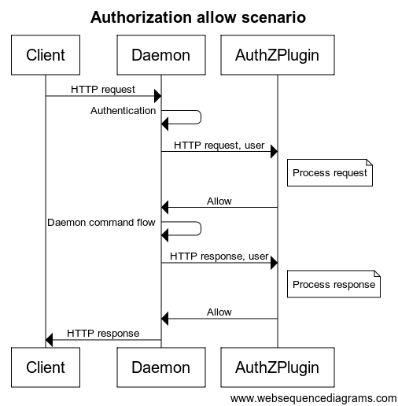

+++
title = "访问授权插件"
date = 2024-10-23T14:54:40+08:00
weight = 1
type = "docs"
description = ""
isCJKLanguage = true
draft = false

+++

> 原文：[https://docs.docker.com/engine/extend/plugins_authorization/](https://docs.docker.com/engine/extend/plugins_authorization/)
>
> 收录该文档的时间：`2024-10-23T14:54:40+08:00`

# Access authorization plugin - 访问授权插件

This document describes the Docker Engine plugins available in Docker Engine. To view information on plugins managed by Docker Engine, refer to [Docker Engine plugin system]().

​	本文档介绍了 Docker Engine 中可用的插件。有关 Docker Engine 管理的插件的信息，请参见 [Docker Engine 插件系统]()。

Docker's out-of-the-box authorization model is all or nothing. Any user with permission to access the Docker daemon can run any Docker client command. The same is true for callers using Docker's Engine API to contact the daemon. If you require greater access control, you can create authorization plugins and add them to your Docker daemon configuration. Using an authorization plugin, a Docker administrator can configure granular access policies for managing access to the Docker daemon.

​	Docker 自带的授权模型是全有或全无的。任何有权限访问 Docker 守护进程的用户都可以运行任何 Docker 客户端命令。使用 Docker 的 Engine API 与守护进程进行通信的调用者也是如此。如果需要更高的访问控制，可以创建授权插件并将其添加到 Docker 守护进程的配置中。通过使用授权插件，Docker 管理员可以配置精细的访问策略，以管理对 Docker 守护进程的访问。

Anyone with the appropriate skills can develop an authorization plugin. These skills, at their most basic, are knowledge of Docker, understanding of REST, and sound programming knowledge. This document describes the architecture, state, and methods information available to an authorization plugin developer.

​	任何具备适当技能的人都可以开发授权插件。基本技能包括 Docker 知识、对 REST 的理解和良好的编程知识。本文档描述了可供授权插件开发人员使用的架构、状态和方法信息。

## 基本原理 Basic principles

Docker's [plugin infrastructure]() enables extending Docker by loading, removing and communicating with third-party components using a generic API. The access authorization subsystem was built using this mechanism.

​	Docker 的 [插件基础设施]() 允许通过加载、移除和与第三方组件通信来扩展 Docker。访问授权子系统正是利用了这种机制构建的。

Using this subsystem, you don't need to rebuild the Docker daemon to add an authorization plugin. You can add a plugin to an installed Docker daemon. You do need to restart the Docker daemon to add a new plugin.

​	使用此子系统，无需重建 Docker 守护进程即可添加授权插件。可以向已安装的 Docker 守护进程添加插件，但需要重启 Docker 守护进程以添加新插件。

An authorization plugin approves or denies requests to the Docker daemon based on both the current authentication context and the command context. The authentication context contains all user details and the authentication method. The command context contains all the relevant request data.

​	授权插件基于当前的身份验证上下文和命令上下文批准或拒绝对 Docker 守护进程的请求。身份验证上下文包含所有用户详细信息和身份验证方法。命令上下文包含所有相关的请求数据。

Authorization plugins must follow the rules described in [Docker Plugin API](). Each plugin must reside within directories described under the [Plugin discovery](https://docs.docker.com/engine/extend/plugin_api/#plugin-discovery) section.

​	授权插件必须遵循 [Docker 插件 API]() 中描述的规则。每个插件必须位于 [插件发现](https://docs.docker.com/engine/extend/plugin_api/#plugin-discovery) 部分下描述的目录中。

> **Note**
>
> The abbreviations `AuthZ` and `AuthN` mean authorization and authentication respectively.
>
> ​	缩写 `AuthZ` 和 `AuthN` 分别表示授权和身份验证。

## 默认用户授权机制 Default user authorization mechanism

If TLS is enabled in the [Docker daemon](https://docs.docker.com/engine/security/https/), the default user authorization flow extracts the user details from the certificate subject name. That is, the `User` field is set to the client certificate subject common name, and the `AuthenticationMethod` field is set to `TLS`.

​	如果在 [Docker 守护进程](https://docs.docker.com/engine/security/https/) 中启用了 TLS，默认用户授权流程会从证书主题名称中提取用户详细信息。即 `User` 字段设置为客户端证书的主题公共名称，`AuthenticationMethod` 字段设置为 `TLS`。

## 基本架构 Basic architecture

You are responsible for registering your plugin as part of the Docker daemon startup. You can install multiple plugins and chain them together. This chain can be ordered. Each request to the daemon passes in order through the chain. Only when all the plugins grant access to the resource, is the access granted.

​	您需要在 Docker 守护进程启动时注册插件。可以安装多个插件并将其串联在一起。该链可以排序。对守护进程的每个请求都按顺序通过链，只有当所有插件都授予对资源的访问权限时，访问才被授予。

When an HTTP request is made to the Docker daemon through the CLI or via the Engine API, the authentication subsystem passes the request to the installed authentication plugin(s). The request contains the user (caller) and command context. The plugin is responsible for deciding whether to allow or deny the request.

​	当通过 CLI 或 Engine API 向 Docker 守护进程发出 HTTP 请求时，身份验证子系统会将请求传递给已安装的身份验证插件。请求包含用户（调用者）和命令上下文。插件负责决定是否允许或拒绝该请求。

The sequence diagrams below depict an allow and deny authorization flow:

​	以下序列图展示了允许和拒绝授权的流程：




Each request sent to the plugin includes the authenticated user, the HTTP headers, and the request/response body. Only the user name and the authentication method used are passed to the plugin. Most importantly, no user credentials or tokens are passed. Finally, not all request/response bodies are sent to the authorization plugin. Only those request/response bodies where the `Content-Type` is either `text/*` or `application/json` are sent.

​	发送到插件的每个请求都包括经过身份验证的用户、HTTP 头和请求/响应主体。只会向插件传递用户名和使用的身份验证方法。最重要的是，不会传递任何用户凭据或令牌。最后，只有 `Content-Type` 为 `text/*` 或 `application/json` 的请求/响应主体才会发送到授权插件。

For commands that can potentially hijack the HTTP connection (`HTTP Upgrade`), such as `exec`, the authorization plugin is only called for the initial HTTP requests. Once the plugin approves the command, authorization is not applied to the rest of the flow. Specifically, the streaming data is not passed to the authorization plugins. For commands that return chunked HTTP response, such as `logs` and `events`, only the HTTP request is sent to the authorization plugins.

​	对于可能劫持 HTTP 连接（`HTTP Upgrade`）的命令（如 `exec`），授权插件仅在初始 HTTP 请求时被调用。一旦插件批准了命令，授权将不再应用于流程的其余部分。特别地，流数据不会传递给授权插件。对于返回分块 HTTP 响应的命令（如 `logs` 和 `events`），仅 HTTP 请求会发送到授权插件。

During request/response processing, some authorization flows might need to do additional queries to the Docker daemon. To complete such flows, plugins can call the daemon API similar to a regular user. To enable these additional queries, the plugin must provide the means for an administrator to configure proper authentication and security policies.

​	在请求/响应处理过程中，某些授权流程可能需要对 Docker 守护进程执行额外查询。为了完成此类流程，插件可以类似普通用户那样调用守护进程 API。为启用这些额外查询，插件必须提供配置适当的身份验证和安全策略的方法。

## Docker 客户端流程 Docker client flows

To enable and configure the authorization plugin, the plugin developer must support the Docker client interactions detailed in this section.

​	要启用和配置授权插件，插件开发人员必须支持本节中详细介绍的 Docker 客户端交互。

### 设置 Docker 守护进程 Setting up Docker daemon

Enable the authorization plugin with a dedicated command line flag in the `--authorization-plugin=PLUGIN_ID` format. The flag supplies a `PLUGIN_ID` value. This value can be the plugin’s socket or a path to a specification file. Authorization plugins can be loaded without restarting the daemon. Refer to the [`dockerd` documentation](https://docs.docker.com/reference/cli/dockerd/#configuration-reload-behavior) for more information.

​	通过专用的命令行标志 `--authorization-plugin=PLUGIN_ID` 启用授权插件。该标志提供一个 `PLUGIN_ID` 值。该值可以是插件的 socket 或规范文件的路径。授权插件可以在不重新启动守护进程的情况下加载。更多信息请参阅 [`dockerd` 文档](https://docs.docker.com/reference/cli/dockerd/#configuration-reload-behavior)。


```console
$ dockerd --authorization-plugin=plugin1 --authorization-plugin=plugin2,...
```

Docker's authorization subsystem supports multiple `--authorization-plugin` parameters.

​	Docker 的授权子系统支持多个 `--authorization-plugin` 参数。

### 调用授权命令（允许） Calling authorized command (allow)


```console
$ docker pull centos
<...>
f1b10cd84249: Pull complete
<...>
```

### 调用未经授权的命令（拒绝） Calling unauthorized command (deny)


```console
$ docker pull centos
<...>
docker: Error response from daemon: authorization denied by plugin PLUGIN_NAME: volumes are not allowed.
```

### 插件错误 Error from plugins


```console
$ docker pull centos
<...>
docker: Error response from daemon: plugin PLUGIN_NAME failed with error: AuthZPlugin.AuthZReq: Cannot connect to the Docker daemon. Is the docker daemon running on this host?.
```

## API 架构和实现 API schema and implementation

In addition to Docker's standard plugin registration method, each plugin should implement the following two methods:

​	除了 Docker 的标准插件注册方法外，每个插件还应实现以下两个方法：

- `/AuthZPlugin.AuthZReq` This authorize request method is called before the Docker daemon processes the client request.
  - `/AuthZPlugin.AuthZReq` 该授权请求方法在 Docker 守护进程处理客户端请求之前调用。

- `/AuthZPlugin.AuthZRes` This authorize response method is called before the response is returned from Docker daemon to the client.
  - `/AuthZPlugin.AuthZRes` 该授权响应方法在 Docker 守护进程向客户端返回响应之前调用。


#### /AuthZPlugin.AuthZReq

Request

​	请求：

```json
{
    "User":              "The user identification",
    "UserAuthNMethod":   "The authentication method used",
    "RequestMethod":     "The HTTP method",
    "RequestURI":        "The HTTP request URI",
    "RequestBody":       "Byte array containing the raw HTTP request body",
    "RequestHeader":     "Byte array containing the raw HTTP request header as a map[string][]string "
}
```

Response

​	响应：

```json
{
    "Allow": "Determined whether the user is allowed or not",
    "Msg":   "The authorization message",
    "Err":   "The error message if things go wrong"
}
```

#### /AuthZPlugin.AuthZRes

Request:

​	请求：

```json
{
    "User":              "The user identification",
    "UserAuthNMethod":   "The authentication method used",
    "RequestMethod":     "The HTTP method",
    "RequestURI":        "The HTTP request URI",
    "RequestBody":       "Byte array containing the raw HTTP request body",
    "RequestHeader":     "Byte array containing the raw HTTP request header as a map[string][]string",
    "ResponseBody":      "Byte array containing the raw HTTP response body",
    "ResponseHeader":    "Byte array containing the raw HTTP response header as a map[string][]string",
    "ResponseStatusCode":"Response status code"
}
```

Response:

​	响应：

```json
{
   "Allow":              "Determined whether the user is allowed or not",
   "Msg":                "The authorization message",
   "Err":                "The error message if things go wrong"
}
```

### 请求授权 Request authorization

Each plugin must support two request authorization messages formats, one from the daemon to the plugin and then from the plugin to the daemon. The tables below detail the content expected in each message.

​	每个插件必须支持两种请求授权消息格式，一种从守护进程发送到插件，另一种从插件发送回守护进程。下表详细说明了每条消息中期望的内容。

#### Daemon -> Plugin

| Name                  | Type              | Description                                                  |
| --------------------- | ----------------- | ------------------------------------------------------------ |
| User                  | string            | 用户标识The user identification                              |
| Authentication method | string            | 使用的身份验证方法The authentication method used             |
| Request method        | enum              | HTTP 方法（GET/DELETE/POST） The HTTP method (GET/DELETE/POST) |
| Request URI           | string            | HTTP 请求 URI，包括 API 版本（例如 v.1.17/containers/json）The HTTP request URI including API version (e.g., v.1.17/containers/json) |
| Request headers       | map[string]string | 请求头作为键值对（不含授权头）Request headers as key value pairs (without the authorization header) |
| Request body          | []byte            | 原始请求体Raw request body                                   |

#### Plugin -> Daemon

| Name  | Type   | Description                                                  |
| ----- | ------ | ------------------------------------------------------------ |
| Allow | bool   | 布尔值，指示请求是否被允许Boolean value indicating whether the request is allowed or denied |
| Msg   | string | 授权消息（若访问被拒绝，将返回给客户端）Authorization message (will be returned to the client in case the access is denied) |
| Err   | string | 错误消息（若插件遇到错误，将返回给客户端。字符串值可能出现在日志中，故不应包含机密信息）Error message (will be returned to the client in case the plugin encounter an error. The string value supplied may appear in logs, so should not include confidential information) |

### 响应授权 Response authorization

The plugin must support two authorization messages formats, one from the daemon to the plugin and then from the plugin to the daemon. The tables below detail the content expected in each message.

​	插件必须支持两种响应授权消息格式，一种从守护进程发送到插件，另一种从插件发送回守护进程。下表详细说明了每条消息中期望的内容。

#### Daemon -> Plugin

| Name                  | Type              | Description                                                  |
| --------------------- | ----------------- | ------------------------------------------------------------ |
| User                  | string            | 用户标识 The user identification                             |
| Authentication method | string            | 使用的身份验证方法The authentication method used             |
| Request method        | string            | HTTP 方法（GET/DELETE/POST） The HTTP method (GET/DELETE/POST) |
| Request URI           | string            | HTTP 请求 URI，包括 API 版本（例如 v.1.17/containers/json）The HTTP request URI including API version (e.g., v.1.17/containers/json) |
| Request headers       | map[string]string | 请求头作为键值对（不含授权头）Request headers as key value pairs (without the authorization header) |
| Request body          | []byte            | 原始请求体 Raw request body                                  |
| Response status code  | int               | Docker 守护进程的状态码 Status code from the Docker daemon   |
| Response headers      | map[string]string | 响应头作为键值对 Response headers as key value pairs         |
| Response body         | []byte            | Docker 守护进程响应体的原始内容 Raw Docker daemon response body |

#### Plugin -> Daemon

| Name  | Type   | Description                                                  |
| ----- | ------ | ------------------------------------------------------------ |
| Allow | bool   | 布尔值，指示响应是否被允许Boolean value indicating whether the response is allowed or denied |
| Msg   | string | 授权消息（若访问被拒绝，将返回给客户端）Authorization message (will be returned to the client in case the access is denied) |
| Err   | string | 错误消息（若插件遇到错误，将返回给客户端。字符串值可能出现在日志中，故不应包含机密信息） Error message (will be returned to the client in case the plugin encounter an error. The string value supplied may appear in logs, so should not include confidential information) |

