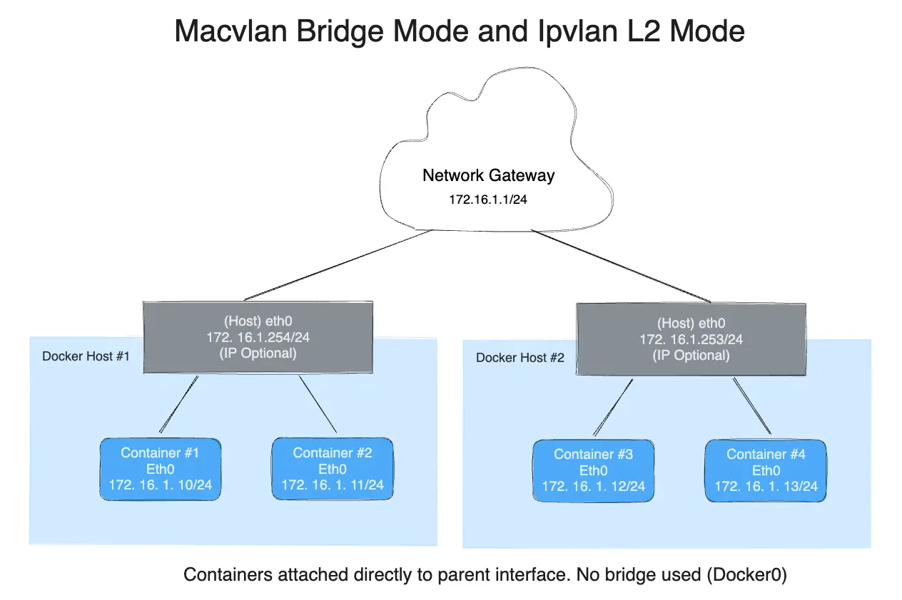
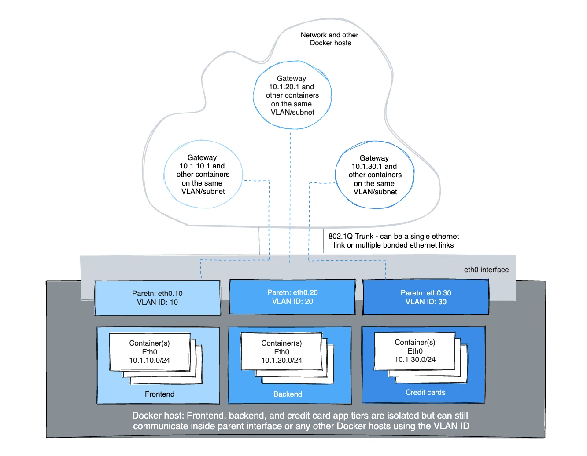
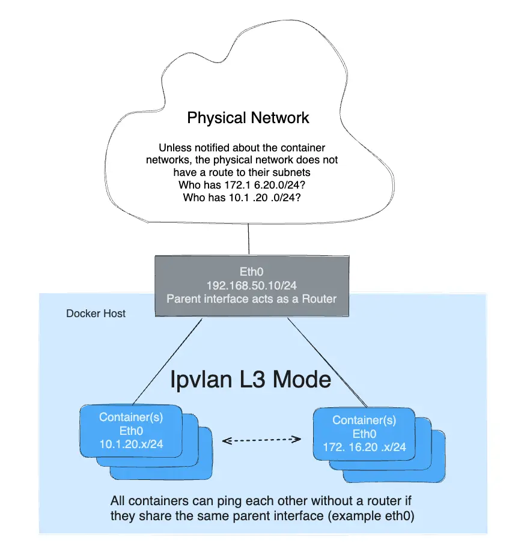

+++
title = "IPvlan 网络驱动"
date = 2024-10-23T14:54:40+08:00
weight = 20
type = "docs"
description = ""
isCJKLanguage = true
draft = false

+++

> 原文：[https://docs.docker.com/engine/network/drivers/ipvlan/](https://docs.docker.com/engine/network/drivers/ipvlan/)
>
> 收录该文档的时间：`2024-10-23T14:54:40+08:00`

# IPvlan network driver - IPvlan 网络驱动

The IPvlan driver gives users total control over both IPv4 and IPv6 addressing. The VLAN driver builds on top of that in giving operators complete control of layer 2 VLAN tagging and even IPvlan L3 routing for users interested in underlay network integration. For overlay deployments that abstract away physical constraints see the [multi-host overlay]() driver.

​	IPvlan 驱动允许用户完全控制 IPv4 和 IPv6 地址。VLAN 驱动在此基础上进一步提供了对第 2 层 VLAN 标记的控制，甚至支持 IPvlan L3 路由，适合希望与底层网络集成的用户。对于抽象物理限制的覆盖部署，请参考[多主机覆盖网络]()驱动。

IPvlan is a new twist on the tried and true network virtualization technique. The Linux implementations are extremely lightweight because rather than using the traditional Linux bridge for isolation, they are associated to a Linux Ethernet interface or sub-interface to enforce separation between networks and connectivity to the physical network.

​	IPvlan 是一种改进的网络虚拟化技术。Linux 实现非常轻量，因为它不使用传统的 Linux 桥接隔离，而是与 Linux 以太网接口或子接口关联，以确保网络之间的隔离并连接到物理网络。

IPvlan offers a number of unique features and plenty of room for further innovations with the various modes. Two high level advantages of these approaches are, the positive performance implications of bypassing the Linux bridge and the simplicity of having fewer moving parts. Removing the bridge that traditionally resides in between the Docker host NIC and container interface leaves a simple setup consisting of container interfaces, attached directly to the Docker host interface. This result is easy to access for external facing services as there is no need for port mappings in these scenarios.

​	IPvlan 提供了许多独特功能，并且可以通过各种模式实现创新。两大优势是：跳过 Linux 桥接的性能优化，以及更简化的配置。没有了位于 Docker 主机 NIC 和容器接口之间的桥接，整个配置更简洁，容器接口直接连接到 Docker 主机接口。这使得外部服务的访问变得简单，因为不需要端口映射。

## Options

The following table describes the driver-specific options that you can pass to `--option` when creating a network using the `ipvlan` driver.

​	以下表格描述了创建使用 `ipvlan` 驱动的网络时，可以传递给 `--option` 的驱动特定选项。

| Option 选项   | Default 默认值 | Description 描述                                             |
| ------------- | -------------- | ------------------------------------------------------------ |
| `ipvlan_mode` | `l2`           | 设置 IPvlan 操作模式。可选值：`l2`、`l3`、`l3s` Sets the IPvlan operating mode. Can be one of: `l2`, `l3`, `l3s` |
| `ipvlan_flag` | `bridge`       | 设置 IPvlan 模式标志。可选值：`bridge`、`private`、`vepa` Sets the IPvlan mode flag. Can be one of: `bridge`, `private`, `vepa` |
| `parent`      |                | 指定要使用的父接口。 Specifies the parent interface to use.  |

## Examples

### 前置条件 Prerequisites

- The examples on this page are all single host.
  - 本页面的示例均为单主机环境。

- All examples can be performed on a single host running Docker. Any example using a sub-interface like `eth0.10` can be replaced with `eth0` or any other valid parent interface on the Docker host. Sub-interfaces with a `.` are created on the fly. `-o parent` interfaces can also be left out of the `docker network create` all together and the driver will create a `dummy` interface that will enable local host connectivity to perform the examples.
  - 所有示例均可以在运行 Docker 的单个主机上执行。任何使用诸如 `eth0.10` 的子接口的示例可以替换为 `eth0` 或 Docker 主机上的其他有效父接口。带 `.` 的子接口是动态创建的。`docker network create` 中也可以省略 `-o parent` 接口，驱动程序会创建一个 `dummy` 接口来实现本地主机连接，以便执行这些示例。

- Kernel requirements: 内核要求：
  - IPvlan Linux kernel v4.2+ (support for earlier kernels exists but is buggy). To check your current kernel version, use `uname -r` - IPvlan Linux 内核版本 v4.2+（支持早期内核，但存在一些问题）。要检查当前内核版本，请使用 `uname -r`。

### IPvlan L2 模式示例用法 IPvlan L2 mode example usage

An example of the IPvlan `L2` mode topology is shown in the following image. The driver is specified with `-d driver_name` option. In this case `-d ipvlan`.

​	以下图片展示了 IPvlan `L2` 模式的拓扑示例。驱动通过 `-d driver_name` 选项指定。在此示例中为 `-d ipvlan`。


The parent interface in the next example `-o parent=eth0` is configured as follows:

​	接下来的示例中，父接口 `-o parent=eth0` 配置如下：


```console
$ ip addr show eth0
3: eth0: <BROADCAST,MULTICAST,UP,LOWER_UP> mtu 1500 qdisc pfifo_fast state UP group default qlen 1000
    inet 192.168.1.250/24 brd 192.168.1.255 scope global eth0
```

Use the network from the host's interface as the `--subnet` in the `docker network create`. The container will be attached to the same network as the host interface as set via the `-o parent=` option.

​	使用主机接口的网络作为 `docker network create` 中的 `--subnet`，容器将连接到与主机接口相同的网络，并通过 `-o parent=` 选项设置。

Create the IPvlan network and run a container attaching to it:

​	创建 IPvlan 网络并运行一个附加到该网络的容器：


```console
# IPvlan  (-o ipvlan_mode= Defaults to L2 mode if not specified)
$ docker network create -d ipvlan \
    --subnet=192.168.1.0/24 \
    --gateway=192.168.1.1 \
    -o ipvlan_mode=l2 \
    -o parent=eth0 db_net

# Start a container on the db_net network
$ docker run --net=db_net -it --rm alpine /bin/sh

# NOTE: the containers can NOT ping the underlying host interfaces as
# they are intentionally filtered by Linux for additional isolation.
```

The default mode for IPvlan is `l2`. If `-o ipvlan_mode=` is left unspecified, the default mode will be used. Similarly, if the `--gateway` is left empty, the first usable address on the network will be set as the gateway. For example, if the subnet provided in the network create is `--subnet=192.168.1.0/24` then the gateway the container receives is `192.168.1.1`.

​	IPvlan 的默认模式为 `l2`。如果未指定 `-o ipvlan_mode=`，将使用默认模式。同样，如果 `--gateway` 为空，网络中的第一个可用地址将设置为网关。例如，如果网络创建中提供的子网为 `--subnet=192.168.1.0/24`，则容器接收到的网关为 `192.168.1.1`。

To help understand how this mode interacts with other hosts, the following figure shows the same layer 2 segment between two Docker hosts that applies to and IPvlan L2 mode.

​	为帮助理解此模式如何与其他主机交互，下图显示了两个 Docker 主机之间在 IPvlan L2 模式下共享的同一第 2 层网络段。



The following will create the exact same network as the network `db_net` created earlier, with the driver defaults for `--gateway=192.168.1.1` and `-o ipvlan_mode=l2`.

​	以下命令将创建与之前创建的 `db_net` 网络完全相同的网络，使用默认的 `--gateway=192.168.1.1` 和 `-o ipvlan_mode=l2`。


```console
# IPvlan  (-o ipvlan_mode= Defaults to L2 mode if not specified)
$ docker network create -d ipvlan \
    --subnet=192.168.1.0/24 \
    -o parent=eth0 db_net_ipv

# Start a container with an explicit name in daemon mode
$ docker run --net=db_net_ipv --name=ipv1 -itd alpine /bin/sh

# Start a second container and ping using the container name
# to see the docker included name resolution functionality
$ docker run --net=db_net_ipv --name=ipv2 -it --rm alpine /bin/sh
$ ping -c 4 ipv1

# NOTE: the containers can NOT ping the underlying host interfaces as
# they are intentionally filtered by Linux for additional isolation.
```

The drivers also support the `--internal` flag that will completely isolate containers on a network from any communications external to that network. Since network isolation is tightly coupled to the network's parent interface the result of leaving the `-o parent=` option off of a `docker network create` is the exact same as the `--internal` option. If the parent interface is not specified or the `--internal` flag is used, a netlink type `dummy` parent interface is created for the user and used as the parent interface effectively isolating the network completely.

​	驱动程序还支持 `--internal` 标志，该标志将完全隔离网络上的容器，不允许它们与外部网络通信。由于网络隔离紧密耦合到网络的父接口，因此省略 `docker network create` 中的 `-o parent=` 选项与 `--internal` 选项的效果相同。如果未指定父接口或使用了 `--internal` 标志，将为用户创建一个 `dummy` 类型的父接口，从而完全隔离该网络。

The following two `docker network create` examples result in identical networks that you can attach container to:

​	以下两个 `docker network create` 示例将生成相同的网络，您可以将容器附加到其中：


```console
# Empty '-o parent=' creates an isolated network
# 空的 '-o parent=' 创建一个隔离的网络
$ docker network create -d ipvlan \
    --subnet=192.168.10.0/24 isolated1

# Explicit '--internal' flag is the same:
# 显式的 '--internal' 标志效果相同：
$ docker network create -d ipvlan \
    --subnet=192.168.11.0/24 --internal isolated2

# Even the '--subnet=' can be left empty and the default
# 即使未指定 '--subnet='，也将分配默认的 IPAM 子网 172.18.0.0/16
# IPAM subnet of 172.18.0.0/16 will be assigned
$ docker network create -d ipvlan isolated3

$ docker run --net=isolated1 --name=cid1 -it --rm alpine /bin/sh
$ docker run --net=isolated2 --name=cid2 -it --rm alpine /bin/sh
$ docker run --net=isolated3 --name=cid3 -it --rm alpine /bin/sh

# To attach to any use `docker exec` and start a shell
# 使用 `docker exec` 连接任意容器并启动 shell
$ docker exec -it cid1 /bin/sh
$ docker exec -it cid2 /bin/sh
$ docker exec -it cid3 /bin/sh
```

### IPvlan 802.1Q 干线 L2 模式示例用法 IPvlan 802.1Q trunk L2 mode example usage

Architecturally, IPvlan L2 mode trunking is the same as Macvlan with regard to gateways and L2 path isolation. There are nuances that can be advantageous for CAM table pressure in ToR switches, one MAC per port and MAC exhaustion on a host's parent NIC to name a few. The 802.1Q trunk scenario looks the same. Both modes adhere to tagging standards and have seamless integration with the physical network for underlay integration and hardware vendor plugin integrations.

​	在结构上，IPvlan L2 模式干线与 Macvlan 在网关和第 2 层路径隔离方面相同。对于 ToR 交换机中的 CAM 表压力、每个端口的 MAC 以及主机父 NIC 上的 MAC 耗尽等问题，802.1Q 干线场景也适用。两种模式都符合标签标准，并无缝集成到物理网络中，以支持底层集成和硬件厂商插件。

Hosts on the same VLAN are typically on the same subnet and almost always are grouped together based on their security policy. In most scenarios, a multi-tier application is tiered into different subnets because the security profile of each process requires some form of isolation. For example, hosting your credit card processing on the same virtual network as the frontend webserver would be a regulatory compliance issue, along with circumventing the long standing best practice of layered defense in depth architectures. VLANs or the equivocal VNI (Virtual Network Identifier) when using the Overlay driver, are the first step in isolating tenant traffic.

​	同一 VLAN 上的主机通常位于同一子网中，并且通常会基于其安全策略进行分组。在大多数情况下，多层应用程序分层到不同的子网中，因为每个进程的安全配置文件需要某种形式的隔离。例如，将信用卡处理系统托管在与前端 Web 服务器相同的虚拟网络上会违反合规规定，并违反长期以来的分层纵深防御架构最佳实践。使用 Overlay 驱动时，VLAN 或相当于 VNI（虚拟网络标识符）是隔离租户流量的第一步。



The Linux sub-interface tagged with a VLAN can either already exist or will be created when you call a `docker network create`. `docker network rm` will delete the sub-interface. Parent interfaces such as `eth0` are not deleted, only sub-interfaces with a netlink parent index > 0.

​	带有 VLAN 标签的 Linux 子接口可以是已经存在的，也可以在调用 `docker network create` 时创建。执行 `docker network rm` 将删除子接口，但不会删除父接口，如 `eth0`，只会删除 netlink 父索引大于 0 的子接口。

For the driver to add/delete the VLAN sub-interfaces the format needs to be `interface_name.vlan_tag`. Other sub-interface naming can be used as the specified parent, but the link will not be deleted automatically when `docker network rm` is invoked.

​	要让驱动程序添加或删除 VLAN 子接口，其格式需要是 `interface_name.vlan_tag`。其他子接口名称也可用于指定父接口，但在执行 `docker network rm` 时不会自动删除该链接。

The option to use either existing parent VLAN sub-interfaces or let Docker manage them enables the user to either completely manage the Linux interfaces and networking or let Docker create and delete the VLAN parent sub-interfaces (netlink `ip link`) with no effort from the user.

​	用户可以选择使用现有的父 VLAN 子接口，或让 Docker 管理它们。这使用户可以完全管理 Linux 接口和网络，或让 Docker 创建和删除 VLAN 父子接口（通过 netlink `ip link`），无需用户额外操作。

For example: use `eth0.10` to denote a sub-interface of `eth0` tagged with the VLAN id of `10`. The equivalent `ip link` command would be `ip link add link eth0 name eth0.10 type vlan id 10`.

​	例如：使用 `eth0.10` 表示 `eth0` 的一个子接口，带有 VLAN ID `10`。相应的 `ip link` 命令是 `ip link add link eth0 name eth0.10 type vlan id 10`。

The example creates the VLAN tagged networks and then starts two containers to test connectivity between containers. Different VLANs cannot ping one another without a router routing between the two networks. The default namespace is not reachable per IPvlan design in order to isolate container namespaces from the underlying host.

​	以下示例创建了带有 VLAN 标签的网络，然后启动两个容器以测试容器之间的连接。不同 VLAN 之间无法相互 ping，除非有路由器在两个网络之间进行路由。根据 IPvlan 的设计，默认命名空间不可达，从而隔离了容器命名空间和宿主机。

#### VLAN ID 20

In the first network tagged and isolated by the Docker host, `eth0.20` is the parent interface tagged with VLAN id `20` specified with `-o parent=eth0.20`. Other naming formats can be used, but the links need to be added and deleted manually using `ip link` or Linux configuration files. As long as the `-o parent` exists, anything can be used if it is compliant with Linux netlink.

​	在 Docker 主机上，`eth0.20` 是带有 VLAN ID `20` 的父接口，通过 `-o parent=eth0.20` 指定。可以使用其他命名格式，但需要使用 `ip link` 或 Linux 配置文件手动添加和删除这些链接。只要 `-o parent` 存在，符合 Linux netlink 的格式即可使用。


```console
# now add networks and hosts as you would normally by attaching to the master (sub)interface that is tagged
# 将网络和主机附加到带标签的主（子）接口
$ docker network create -d ipvlan \
    --subnet=192.168.20.0/24 \
    --gateway=192.168.20.1 \
    -o parent=eth0.20 ipvlan20

# in two separate terminals, start a Docker container and the containers can now ping one another.
# 在两个不同的终端中启动 Docker 容器，现在可以相互 ping
$ docker run --net=ipvlan20 -it --name ivlan_test1 --rm alpine /bin/sh
$ docker run --net=ipvlan20 -it --name ivlan_test2 --rm alpine /bin/sh
```

#### VLAN ID 30

In the second network, tagged and isolated by the Docker host, `eth0.30` is the parent interface tagged with VLAN id `30` specified with `-o parent=eth0.30`. The `ipvlan_mode=` defaults to l2 mode `ipvlan_mode=l2`. It can also be explicitly set with the same result as shown in the next example.

​	在第二个网络中，`eth0.30` 是带有 VLAN ID `30` 的父接口，通过 `-o parent=eth0.30` 指定。`ipvlan_mode=` 默认为 L2 模式，即 `ipvlan_mode=l2`。也可以显式设置，效果相同。


```console
# now add networks and hosts as you would normally by attaching to the master (sub)interface that is tagged.
# 将网络和主机附加到带标签的主（子）接口
$ docker network create -d ipvlan \
    --subnet=192.168.30.0/24 \
    --gateway=192.168.30.1 \
    -o parent=eth0.30 \
    -o ipvlan_mode=l2 ipvlan30

# in two separate terminals, start a Docker container and the containers can now ping one another.
# 在两个不同的终端中启动 Docker 容器，现在可以相互 ping
$ docker run --net=ipvlan30 -it --name ivlan_test3 --rm alpine /bin/sh
$ docker run --net=ipvlan30 -it --name ivlan_test4 --rm alpine /bin/sh
```

The gateway is set inside of the container as the default gateway. That gateway would typically be an external router on the network.

​	网关在容器内部设置为默认网关。通常，该网关是网络中的一个外部路由器。


```console
$$ ip route
  default via 192.168.30.1 dev eth0
  192.168.30.0/24 dev eth0  src 192.168.30.2
```

Example: Multi-Subnet IPvlan L2 Mode starting two containers on the same subnet and pinging one another. In order for the `192.168.114.0/24` to reach `192.168.116.0/24` it requires an external router in L2 mode. L3 mode can route between subnets that share a common `-o parent=`.

​	示例：多子网 IPvlan L2 模式在同一子网上启动两个容器并相互 ping。要实现 `192.168.114.0/24` 到 `192.168.116.0/24` 的连接，需要在 L2 模式下的外部路由器。L3 模式可以在共享公共 `-o parent=` 的子网之间进行路由。

Secondary addresses on network routers are common as an address space becomes exhausted to add another secondary to an L3 VLAN interface or commonly referred to as a "switched virtual interface" (SVI).

​	在网络路由器上，随着地址空间的耗尽，可以在 L3 VLAN 接口上添加额外的次要地址，通常称为“交换虚拟接口”（SVI）。

```console
$ docker network create -d ipvlan \
    --subnet=192.168.114.0/24 --subnet=192.168.116.0/24 \
    --gateway=192.168.114.254 --gateway=192.168.116.254 \
    -o parent=eth0.114 \
    -o ipvlan_mode=l2 ipvlan114

$ docker run --net=ipvlan114 --ip=192.168.114.10 -it --rm alpine /bin/sh
$ docker run --net=ipvlan114 --ip=192.168.114.11 -it --rm alpine /bin/sh
```

A key takeaway is, operators have the ability to map their physical network into their virtual network for integrating containers into their environment with no operational overhauls required. NetOps drops an 802.1Q trunk into the Docker host. That virtual link would be the `-o parent=` passed in the network creation. For untagged (non-VLAN) links, it is as simple as `-o parent=eth0` or for 802.1Q trunks with VLAN IDs each network gets mapped to the corresponding VLAN/Subnet from the network.

​	一个关键的结论是，操作员可以将其物理网络映射到虚拟网络中，以将容器无缝集成到环境中，且无需进行重大操作调整。NetOps 在 Docker 主机上放置一个 802.1Q 干线，该虚拟链接即在网络创建时传入的 `-o parent=`。对于未标记的（非 VLAN）链接，可以简单地使用 `-o parent=eth0`；对于具有 VLAN ID 的 802.1Q 干线，每个网络都映射到网络中的相应 VLAN/子网。

An example being, NetOps provides VLAN ID and the associated subnets for VLANs being passed on the Ethernet link to the Docker host server. Those values are plugged into the `docker network create` commands when provisioning the Docker networks. These are persistent configurations that are applied every time the Docker engine starts which alleviates having to manage often complex configuration files. The network interfaces can also be managed manually by being pre-created and Docker networking will never modify them, and use them as parent interfaces. Example mappings from NetOps to Docker network commands are as follows:

​	一个示例是，NetOps 提供 VLAN ID 和通过以太网链接传递到 Docker 主机服务器的关联子网。这些值在配置 Docker 网络时通过 `docker network create` 命令输入。这些是持久配置，每次 Docker 引擎启动时都会应用，从而减少了管理复杂配置文件的工作量。网络接口也可以手动管理，Docker 网络将不会修改它们，并将它们作为父接口使用。以下是从 NetOps 到 Docker 网络命令的示例映射：

- VLAN: 10, Subnet: 172.16.80.0/24, Gateway: 172.16.80.1 - VLAN: 10, 子网: 172.16.80.0/24, 网关: 172.16.80.1
  - `--subnet=172.16.80.0/24 --gateway=172.16.80.1 -o parent=eth0.10`
- VLAN: 20, IP subnet: 172.16.50.0/22, Gateway: 172.16.50.1 - VLAN: 20, IP 子网: 172.16.50.0/22, 网关: 172.16.50.1
  - `--subnet=172.16.50.0/22 --gateway=172.16.50.1 -o parent=eth0.20`
- VLAN: 30, Subnet: 10.1.100.0/16, Gateway: 10.1.100.1 - VLAN: 30, 子网: 10.1.100.0/16, 网关: 10.1.100.1
  - `--subnet=10.1.100.0/16 --gateway=10.1.100.1 -o parent=eth0.30`

### IPvlan L3 模式示例 IPvlan L3 mode example

IPvlan will require routes to be distributed to each endpoint. The driver only builds the IPvlan L3 mode port and attaches the container to the interface. Route distribution throughout a cluster is beyond the initial implementation of this single host scoped driver. In L3 mode, the Docker host is very similar to a router starting new networks in the container. They are on networks that the upstream network will not know about without route distribution. For those curious how IPvlan L3 will fit into container networking, see the following examples.

​	IPvlan 需要将路由分发到每个端点。驱动程序仅构建 IPvlan L3 模式端口并将容器连接到接口。整个集群的路由分发超出单主机范围的初始实现。在 L3 模式下，Docker 主机非常类似于一个路由器，在容器中启动新网络。这些网络不会被上游网络识别，除非进行路由分发。对于想了解 IPvlan L3 如何适应容器网络的用户，请参阅以下示例。



IPvlan L3 mode drops all broadcast and multicast traffic. This reason alone makes IPvlan L3 mode a prime candidate for those looking for massive scale and predictable network integrations. It is predictable and in turn will lead to greater uptimes because there is no bridging involved. Bridging loops have been responsible for high profile outages that can be hard to pinpoint depending on the size of the failure domain. This is due to the cascading nature of BPDUs (Bridge Port Data Units) that are flooded throughout a broadcast domain (VLAN) to find and block topology loops. Eliminating bridging domains, or at the least, keeping them isolated to a pair of ToRs (top of rack switches) will reduce hard to troubleshoot bridging instabilities. IPvlan L2 modes is well suited for isolated VLANs only trunked into a pair of ToRs that can provide a loop-free non-blocking fabric. The next step further is to route at the edge via IPvlan L3 mode that reduces a failure domain to a local host only.

​	IPvlan L3 模式屏蔽了所有广播和多播流量。这一特性使 IPvlan L3 模式成为那些需要大规模且可预测的网络集成的首选。由于没有桥接，L3 模式更加稳定，可显著提升正常运行时间。桥接循环通常会导致难以排查的高风险故障，这种故障会级联到整个广播域（VLAN）以查找并阻止拓扑循环。IPvlan L2 模式非常适合那些仅连接到一对 ToR（机架顶部交换机）的隔离 VLAN，可提供无环路的非阻塞结构。而进一步的步骤是在边缘通过 IPvlan L3 模式进行路由，从而将故障域减少到仅限本地主机。

- L3 mode needs to be on a separate subnet as the default namespace since it requires a netlink route in the default namespace pointing to the IPvlan parent interface.
  - L3 模式需要在默认命名空间之外的子网中，因为它需要一个 netlink 路由指向 IPvlan 父接口。

- The parent interface used in this example is `eth0` and it is on the subnet `192.168.1.0/24`. Notice the `docker network` is not on the same subnet as `eth0`.
  - 此示例使用的父接口是 `eth0`，其子网为 `192.168.1.0/24`。请注意，`docker network` 不与 `eth0` 位于同一子网。

- Unlike IPvlan l2 modes, different subnets/networks can ping one another as long as they share the same parent interface `-o parent=`.
  - 与 IPvlan L2 模式不同，只要共享相同的父接口 `-o parent=`，不同的子网/网络也可以相互 ping。


```console
$$ ip a show eth0
3: eth0: <BROADCAST,MULTICAST,UP,LOWER_UP> mtu 1500 qdisc pfifo_fast state UP group default qlen 1000
    link/ether 00:50:56:39:45:2e brd ff:ff:ff:ff:ff:ff
    inet 192.168.1.250/24 brd 192.168.1.255 scope global eth0
```

- A traditional gateway doesn't mean much to an L3 mode IPvlan interface since there is no broadcast traffic allowed. Because of that, the container default gateway points to the containers `eth0` device. See below for CLI output of `ip route` or `ip -6 route` from inside an L3 container for details.
  - 对于 L3 模式的 IPvlan 接口来说，传统网关没有太多意义，因为不允许广播流量。因此，容器的默认网关指向其 `eth0` 设备。在 L3 容器内部可以通过 CLI 命令 `ip route` 或 `ip -6 route` 查看具体路由输出。


The mode `-o ipvlan_mode=l3` must be explicitly specified since the default IPvlan mode is `l2`.

​	模式 `-o ipvlan_mode=l3` 必须明确指定，因为 IPvlan 的默认模式是 `l2`。

The following example does not specify a parent interface. The network drivers will create a dummy type link for the user rather than rejecting the network creation and isolating containers from only communicating with one another.

​	以下示例未指定父接口。网络驱动程序将为用户创建一个 `dummy` 类型的链接，而不是拒绝网络创建，从而仅允许容器之间的通信。


```console
# Create the IPvlan L3 network
# 创建 IPvlan L3 网络
$ docker network create -d ipvlan \
    --subnet=192.168.214.0/24 \
    --subnet=10.1.214.0/24 \
    -o ipvlan_mode=l3 ipnet210

# Test 192.168.214.0/24 connectivity
# 测试 192.168.214.0/24 的连接
$ docker run --net=ipnet210 --ip=192.168.214.10 -itd alpine /bin/sh
$ docker run --net=ipnet210 --ip=10.1.214.10 -itd alpine /bin/sh

# Test L3 connectivity from 10.1.214.0/24 to 192.168.214.0/24
# 从 10.1.214.0/24 测试到 192.168.214.0/24 的 L3 连接
$ docker run --net=ipnet210 --ip=192.168.214.9 -it --rm alpine ping -c 2 10.1.214.10

# Test L3 connectivity from 192.168.214.0/24 to 10.1.214.0/24
# 从 192.168.214.0/24 测试到 10.1.214.0/24 的 L3 连接
$ docker run --net=ipnet210 --ip=10.1.214.9 -it --rm alpine ping -c 2 192.168.214.10
```

> **Note**
>
> 
>
> Notice that there is no `--gateway=` option in the network create. The field is ignored if one is specified `l3` mode. Take a look at the container routing table from inside of the container:
>
> ​	请注意，网络创建中没有 `--gateway=` 选项。若指定 `l3` 模式，则该字段将被忽略。查看容器内的路由表：
>
> ```console
> # Inside an L3 mode container
> # 在 L3 模式的容器内
> $$ ip route
> default dev eth0
> 192.168.214.0/24 dev eth0  src 192.168.214.10
> ```

In order to ping the containers from a remote Docker host or the container be able to ping a remote host, the remote host or the physical network in between need to have a route pointing to the host IP address of the container's Docker host eth interface.

​	若要从远程 Docker 主机 ping 容器或让容器能够 ping 远程主机，远程主机或中间的物理网络需要有一条路由指向容器所在的 Docker 主机的 eth 接口 IP 地址。

### 双栈 IPv4/IPv6 的 IPvlan L2 模式 Dual stack IPv4 IPv6 IPvlan L2 mode

- Not only does Libnetwork give you complete control over IPv4 addressing, but it also gives you total control over IPv6 addressing as well as feature parity between the two address families.
  - Libnetwork 不仅提供对 IPv4 地址的完全控制，还提供对 IPv6 地址的完全控制，且在两个地址族之间具有功能一致性。

- The next example will start with IPv6 only. Start two containers on the same VLAN `139` and ping one another. Since the IPv4 subnet is not specified, the default IPAM will provision a default IPv4 subnet. That subnet is isolated unless the upstream network is explicitly routing it on VLAN `139`.
  - 接下来将以仅 IPv6 开始，在相同的 VLAN `139` 上启动两个容器并相互 ping。由于未指定 IPv4 子网，默认 IPAM 将分配默认 IPv4 子网。除非上游网络显式地在 VLAN `139` 上路由它，否则该子网将被隔离。


```console
# Create a v6 network
# 创建 IPv6 网络
$ docker network create -d ipvlan \
    --ipv6 --subnet=2001:db8:abc2::/64 --gateway=2001:db8:abc2::22 \
    -o parent=eth0.139 v6ipvlan139

# Start a container on the network
# 在网络上启动容器
$ docker run --net=v6ipvlan139 -it --rm alpine /bin/sh
```

View the container eth0 interface and v6 routing table:

​	查看容器 eth0 接口和 IPv6 路由表：

```console
# Inside the IPv6 container
# 在 IPv6 容器内部
$$ ip a show eth0
75: eth0@if55: <BROADCAST,MULTICAST,UP,LOWER_UP> mtu 1500 qdisc noqueue state UNKNOWN group default
    link/ether 00:50:56:2b:29:40 brd ff:ff:ff:ff:ff:ff
    inet 172.18.0.2/16 scope global eth0
       valid_lft forever preferred_lft forever
    inet6 2001:db8:abc4::250:56ff:fe2b:2940/64 scope link
       valid_lft forever preferred_lft forever
    inet6 2001:db8:abc2::1/64 scope link nodad
       valid_lft forever preferred_lft forever

$$ ip -6 route
2001:db8:abc4::/64 dev eth0  proto kernel  metric 256
2001:db8:abc2::/64 dev eth0  proto kernel  metric 256
default via 2001:db8:abc2::22 dev eth0  metric 1024
```

Start a second container and ping the first container's v6 address.

​	启动第二个容器并 ping 第一个容器的 IPv6 地址。


```console
# Test L2 connectivity over IPv6
	# 通过 IPv6 测试 L2 连接
$ docker run --net=v6ipvlan139 -it --rm alpine /bin/sh

# Inside the second IPv6 container
	# 在第二个 IPv6 容器内部
$$ ip a show eth0
75: eth0@if55: <BROADCAST,MULTICAST,UP,LOWER_UP> mtu 1500 qdisc noqueue state UNKNOWN group default
    link/ether 00:50:56:2b:29:40 brd ff:ff:ff:ff:ff:ff
    inet 172.18.0.3/16 scope global eth0
       valid_lft forever preferred_lft forever
    inet6 2001:db8:abc4::250:56ff:fe2b:2940/64 scope link tentative dadfailed
       valid_lft forever preferred_lft forever
    inet6 2001:db8:abc2::2/64 scope link nodad
       valid_lft forever preferred_lft forever

$$ ping6 2001:db8:abc2::1
PING 2001:db8:abc2::1 (2001:db8:abc2::1): 56 data bytes
64 bytes from 2001:db8:abc2::1%eth0: icmp_seq=0 ttl=64 time=0.044 ms
64 bytes from 2001:db8:abc2::1%eth0: icmp_seq=1 ttl=64 time=0.058 ms

2 packets transmitted, 2 packets received, 0% packet loss
round-trip min/avg/max/stddev = 0.044/0.051/0.058/0.000 ms
```

The next example with setup a dual stack IPv4/IPv6 network with an example VLAN ID of `140`.

​	下一个示例将设置一个双栈 IPv4/IPv6 网络，VLAN ID 为 `140`。

Next create a network with two IPv4 subnets and one IPv6 subnets, all of which have explicit gateways:

​	创建包含两个 IPv4 子网和一个 IPv6 子网的网络，并为每个子网设置网关：


```console
$ docker network create -d ipvlan \
    --subnet=192.168.140.0/24 --subnet=192.168.142.0/24 \
    --gateway=192.168.140.1 --gateway=192.168.142.1 \
    --subnet=2001:db8:abc9::/64 --gateway=2001:db8:abc9::22 \
    -o parent=eth0.140 \
    -o ipvlan_mode=l2 ipvlan140
```

Start a container and view eth0 and both v4 & v6 routing tables:

​	启动容器并查看 eth0 和 IPv4 与 IPv6 的路由表：

```console
$ docker run --net=ipvlan140 --ip6=2001:db8:abc2::51 -it --rm alpine /bin/sh

$ ip a show eth0
78: eth0@if77: <BROADCAST,MULTICAST,UP,LOWER_UP> mtu 1500 qdisc noqueue state UNKNOWN group default
    link/ether 00:50:56:2b:29:40 brd ff:ff:ff:ff:ff:ff
    inet 192.168.140.2/24 scope global eth0
       valid_lft forever preferred_lft forever
    inet6 2001:db8:abc4::250:56ff:fe2b:2940/64 scope link
       valid_lft forever preferred_lft forever
    inet6 2001:db8:abc9::1/64 scope link nodad
       valid_lft forever preferred_lft forever

$$ ip route
default via 192.168.140.1 dev eth0
192.168.140.0/24 dev eth0  proto kernel  scope link  src 192.168.140.2

$$ ip -6 route
2001:db8:abc4::/64 dev eth0  proto kernel  metric 256
2001:db8:abc9::/64 dev eth0  proto kernel  metric 256
default via 2001:db8:abc9::22 dev eth0  metric 1024
```

Start a second container with a specific `--ip4` address and ping the first host using IPv4 packets:

​	启动第二个容器并指定 IPv4 地址，用 IPv4 包 ping 第一个主机：


```console
$ docker run --net=ipvlan140 --ip=192.168.140.10 -it --rm alpine /bin/sh
```

> **Note**
>
> 
>
> Different subnets on the same parent interface in IPvlan `L2` mode cannot ping one another. That requires a router to proxy-arp the requests with a secondary subnet. However, IPvlan `L3` will route the unicast traffic between disparate subnets as long as they share the same `-o parent` parent link.
>
> ​	在 IPvlan `L2` 模式下，同一父接口上的不同子网无法相互 ping。这需要通过路由器代理 arp 请求带有次要子网。然而，只要共享相同的 `-o parent` 父链接，IPvlan `L3` 模式将路由单播流量到不同的子网。

### 双栈 IPv4 IPv6 的 IPvlan L3 模式 Dual stack IPv4 IPv6 IPvlan L3 mode

Example: IPvlan L3 Mode Dual Stack IPv4/IPv6, Multi-Subnet w/ 802.1Q VLAN Tag:118

​	示例：IPvlan L3 模式的双栈 IPv4/IPv6，多子网并使用 802.1Q VLAN 标签：118

As in all of the examples, a tagged VLAN interface does not have to be used. The sub-interfaces can be swapped with `eth0`, `eth1`, `bond0` or any other valid interface on the host other then the `lo` loopback.

​	在所有示例中，使用的标记 VLAN 接口可以不是 `eth0`，可以换成 `eth1`、`bond0` 或主机上除 `lo` 之外的任何有效接口。

The primary difference you will see is that L3 mode does not create a default route with a next-hop but rather sets a default route pointing to `dev eth` only since ARP/Broadcasts/Multicast are all filtered by Linux as per the design. Since the parent interface is essentially acting as a router, the parent interface IP and subnet needs to be different from the container networks. That is the opposite of bridge and L2 modes, which need to be on the same subnet (broadcast domain) in order to forward broadcast and multicast packets.

​	主要的区别在于，L3 模式不会创建带有下一跳的默认路由，而是将默认路由仅指向 `dev eth`，因为 ARP/广播/多播在设计上都被 Linux 过滤。由于父接口本质上充当路由器，因此父接口的 IP 和子网需要不同于容器网络。这与桥接模式和 L2 模式相反，后者需要位于相同的子网（广播域）中以便转发广播和多播数据包。

```console
# Create an IPv6+IPv4 Dual Stack IPvlan L3 network
# Gateways for both v4 and v6 are set to a dev e.g. 'default dev eth0'
# 创建一个 IPv6+IPv4 双栈的 IPvlan L3 网络
# 为 v4 和 v6 设置网关为设备，例如 'default dev eth0'
$ docker network create -d ipvlan \
    --subnet=192.168.110.0/24 \
    --subnet=192.168.112.0/24 \
    --subnet=2001:db8:abc6::/64 \
    -o parent=eth0 \
    -o ipvlan_mode=l3 ipnet110


# Start a few of containers on the network (ipnet110)
# in separate terminals and check connectivity
# 在网络 (ipnet110) 上启动几个容器
# 在不同的终端中检查连接
$ docker run --net=ipnet110 -it --rm alpine /bin/sh
# Start a second container specifying the v6 address
# 启动第二个容器并指定 v6 地址
$ docker run --net=ipnet110 --ip6=2001:db8:abc6::10 -it --rm alpine /bin/sh
# Start a third specifying the IPv4 address
# 启动第三个容器并指定 IPv4 地址
$ docker run --net=ipnet110 --ip=192.168.112.30 -it --rm alpine /bin/sh
# Start a 4th specifying both the IPv4 and IPv6 addresses
# 启动第四个容器并指定 IPv4 和 IPv6 地址
$ docker run --net=ipnet110 --ip6=2001:db8:abc6::50 --ip=192.168.112.50 -it --rm alpine /bin/sh
```

Interface and routing table outputs are as follows:

​	接口和路由表输出如下：

```console
$$ ip a show eth0
63: eth0@if59: <BROADCAST,MULTICAST,NOARP,UP,LOWER_UP> mtu 1500 qdisc noqueue state UNKNOWN group default
    link/ether 00:50:56:2b:29:40 brd ff:ff:ff:ff:ff:ff
    inet 192.168.112.2/24 scope global eth0
       valid_lft forever preferred_lft forever
    inet6 2001:db8:abc4::250:56ff:fe2b:2940/64 scope link
       valid_lft forever preferred_lft forever
    inet6 2001:db8:abc6::10/64 scope link nodad
       valid_lft forever preferred_lft forever

# Note the default route is the eth device because ARPs are filtered.
# 注意默认路由是 eth 设备，因为过滤了 ARP。
$$ ip route
  default dev eth0  scope link
  192.168.112.0/24 dev eth0  proto kernel  scope link  src 192.168.112.2

$$ ip -6 route
2001:db8:abc4::/64 dev eth0  proto kernel  metric 256
2001:db8:abc6::/64 dev eth0  proto kernel  metric 256
default dev eth0  metric 1024
```

> **Note**
>
> 
>
> There may be a bug when specifying `--ip6=` addresses when you delete a container with a specified v6 address and then start a new container with the same v6 address it throws the following like the address isn't properly being released to the v6 pool. It will fail to unmount the container and be left dead.
>
> ​	当删除带有指定 v6 地址的容器后，可能会存在一个问题，如果用相同的 v6 地址启动新容器，可能会提示地址未从 v6 池中正确释放，从而导致无法卸载该容器并导致其保持 “dead” 状态。


```console
docker: Error response from daemon: Address already in use.
```

### 手动创建 802.1Q 链接 Manually create 802.1Q links

#### VLAN ID 40

If a user does not want the driver to create the VLAN sub-interface, it needs to exist before running `docker network create`. If you have sub-interface naming that is not `interface.vlan_id` it is honored in the `-o parent=` option again as long as the interface exists and is up.

​	如果用户不希望驱动程序创建 VLAN 子接口，那么在运行 `docker network create` 之前需要手动创建子接口。如果子接口名称不是 `interface.vlan_id` 格式，仍可以在 `-o parent=` 选项中指定，只要接口存在且已启动。

Links, when manually created, can be named anything as long as they exist when the network is created. Manually created links do not get deleted regardless of the name when the network is deleted with `docker network rm`.

​	手动创建的链接可以命名为任意名称，只要在创建网络时存在即可。手动创建的链接不会在使用 `docker network rm` 删除网络时被删除。

```console
# create a new sub-interface tied to dot1qlan 40
# 创建一个新的子接口，并关联到 dot1q VLAN 40
$ ip link add link eth0 name eth0.40 type vlan id 40

# enable the new sub-interface
# 启用新创建的子接口
$ ip link set eth0.40 up

# now add networks and hosts as you would normally by attaching to the master (sub)interface that is tagged
# 现在像往常一样通过添加网络和主（子）接口，进行网络连接
$ docker network create -d ipvlan \
    --subnet=192.168.40.0/24 \
    --gateway=192.168.40.1 \
    -o parent=eth0.40 ipvlan40

# in two separate terminals, start a Docker container and the containers can now ping one another.
# 在两个独立的终端中启动 Docker 容器，现在容器可以相互 ping。
$ docker run --net=ipvlan40 -it --name ivlan_test5 --rm alpine /bin/sh
$ docker run --net=ipvlan40 -it --name ivlan_test6 --rm alpine /bin/sh
```

Example: VLAN sub-interface manually created with any name:

​	示例：手动创建带有任意名称的 VLAN 子接口：

```console
# create a new sub interface tied to dot1q vlan 40
# 创建一个新的子接口并关联到 dot1q VLAN 40
$ ip link add link eth0 name foo type vlan id 40

# enable the new sub-interface
# 启用新创建的子接口
$ ip link set foo up

# now add networks and hosts as you would normally by attaching to the master (sub)interface that is tagged
# 像往常一样通过添加网络和主（子）接口，进行网络连接
$ docker network create -d ipvlan \
    --subnet=192.168.40.0/24 --gateway=192.168.40.1 \
    -o parent=foo ipvlan40

# in two separate terminals, start a Docker container and the containers can now ping one another.
# 在两个独立的终端中启动 Docker 容器，现在容器可以相互 ping。
$ docker run --net=ipvlan40 -it --name ivlan_test5 --rm alpine /bin/sh
$ docker run --net=ipvlan40 -it --name ivlan_test6 --rm alpine /bin/sh
```

Manually created links can be cleaned up with:

​	手动创建的链接可以使用以下命令清除：

```console
$ ip link del foo
```

As with all of the Libnetwork drivers, they can be mixed and matched, even as far as running 3rd party ecosystem drivers in parallel for maximum flexibility to the Docker user.

​	与所有 Libnetwork 驱动一样，它们可以混合使用，甚至可以并行运行第三方生态系统驱动，以便为 Docker 用户提供最大的灵活性。
