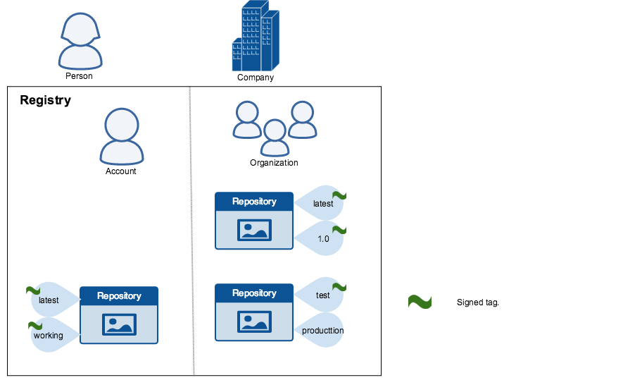
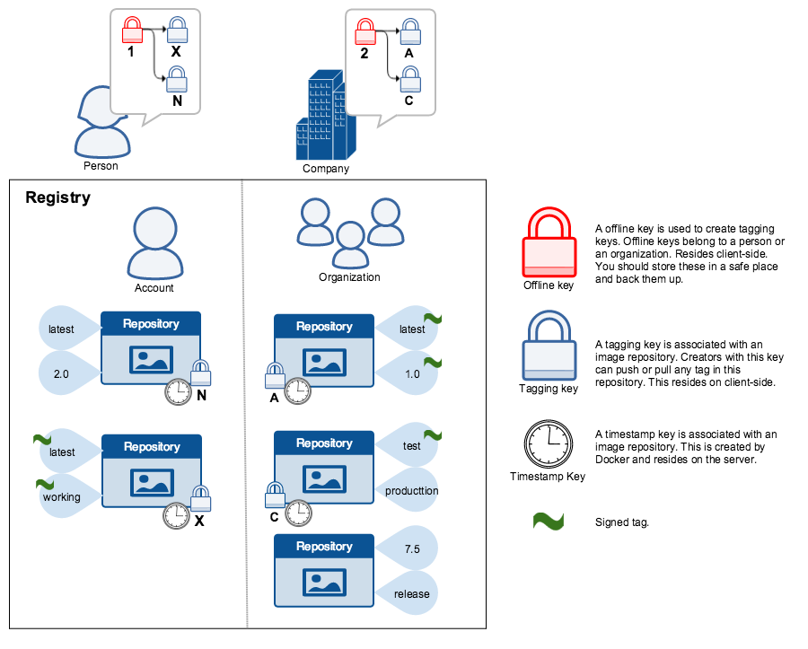

+++
title = "Docker 中的内容信任"
date = 2024-10-23T14:54:40+08:00
weight = 30
type = "docs"
description = ""
isCJKLanguage = true
draft = false

+++

> 原文：[https://docs.docker.com/engine/security/trust/](https://docs.docker.com/engine/security/trust/)
>
> 收录该文档的时间：`2024-10-23T14:54:40+08:00`

# Content trust in Docker - Docker 中的内容信任

When transferring data among networked systems, trust is a central concern. In particular, when communicating over an untrusted medium such as the internet, it is critical to ensure the integrity and the publisher of all the data a system operates on. You use Docker Engine to push and pull images (data) to a public or private registry. Content trust gives you the ability to verify both the integrity and the publisher of all the data received from a registry over any channel.

​	在联网系统之间传输数据时，信任是一个核心问题。特别是在通过互联网等不受信任的媒介通信时，确保系统操作数据的完整性和发布者身份至关重要。使用 Docker 引擎可以将镜像（数据）推送和拉取至公共或私有注册表。内容信任使您能够验证从任何通道接收的数据的完整性和发布者。

## 关于 Docker 内容信任（DCT）- About Docker Content Trust (DCT)

Docker Content Trust (DCT) provides the ability to use digital signatures for data sent to and received from remote Docker registries. These signatures allow client-side or runtime verification of the integrity and publisher of specific image tags.

​	Docker 内容信任（DCT）提供了对从远程 Docker 注册表发送和接收的数据使用数字签名的功能。这些签名允许在客户端或运行时验证特定镜像标签的完整性和发布者身份。

Through DCT, image publishers can sign their images and image consumers can ensure that the images they pull are signed. Publishers could be individuals or organizations manually signing their content or automated software supply chains signing content as part of their release process.

​	通过 DCT，镜像发布者可以对其镜像进行签名，镜像消费者可以确保拉取的镜像已被签名。发布者可以是手动签署内容的个人或组织，也可以是将签名作为发布流程一部分的自动化软件供应链。

### 镜像标签和 DCT - Image tags and DCT

An individual image record has the following identifier:

​	单个镜像记录具有以下标识符：


```text
[REGISTRY_HOST[:REGISTRY_PORT]/]REPOSITORY[:TAG]
```

A particular image `REPOSITORY` can have multiple tags. For example, `latest` and `3.1.2` are both tags on the `mongo` image. An image publisher can build an image and tag combination many times changing the image with each build.

​	一个特定的镜像 `REPOSITORY` 可以有多个标签。例如，`mongo` 镜像同时有 `latest` 和 `3.1.2` 标签。镜像发布者可以多次构建镜像和标签组合，每次构建都改变镜像。

DCT is associated with the `TAG` portion of an image. Each image repository has a set of keys that image publishers use to sign an image tag. Image publishers have discretion on which tags they sign.

​	DCT 与镜像的 `TAG` 部分相关联。每个镜像仓库有一组密钥，镜像发布者使用这些密钥签署镜像标签。镜像发布者可以自行决定签署哪些标签。

An image repository can contain an image with one tag that is signed and another tag that is not. For example, consider [the Mongo image repository](https://hub.docker.com/r/library/mongo/tags/). The `latest` tag could be unsigned while the `3.1.6` tag could be signed. It is the responsibility of the image publisher to decide if an image tag is signed or not. In this representation, some image tags are signed, others are not:

​	一个镜像仓库可能包含一个已签名标签的镜像和一个未签名标签的镜像。例如，[Mongo 镜像仓库](https://hub.docker.com/r/library/mongo/tags/)的 `latest` 标签可能是未签名的，而 `3.1.6` 标签可能是签名的。是否签署镜像标签由镜像发布者决定。如下图所示，有些镜像标签是签名的，而另一些不是：


Publishers can choose to sign a specific tag or not. As a result, the content of an unsigned tag and that of a signed tag with the same name may not match. For example, a publisher can push a tagged image `someimage:latest` and sign it. Later, the same publisher can push an unsigned `someimage:latest` image. This second push replaces the last unsigned tag `latest` but does not affect the signed `latest` version. The ability to choose which tags they can sign, allows publishers to iterate over the unsigned version of an image before officially signing it.

​	发布者可以选择是否签署特定标签。因此，未签名标签的内容与相同名称的已签名标签的内容可能不一致。例如，发布者可以推送一个带标签的 `someimage:latest` 镜像并对其进行签名。之后，同一发布者可以推送一个未签名的 `someimage:latest` 镜像。第二次推送将替换未签名的 `latest` 标签，但不会影响已签名的 `latest` 版本。发布者可以选择签署哪些标签，这使他们可以在正式签署前迭代镜像的未签名版本。

Image consumers can enable DCT to ensure that images they use were signed. If a consumer enables DCT, they can only pull, run, or build with trusted images. Enabling DCT is a bit like applying a "filter" to your registry. Consumers "see" only signed image tags and the less desirable, unsigned image tags are "invisible" to them.

​	镜像消费者可以启用 DCT 以确保他们使用的镜像已签名。启用 DCT 类似于在注册表上应用了一个“过滤器”。消费者只“看到”已签名的镜像标签，未签名的镜像标签对他们而言“不可见”。



To the consumer who has not enabled DCT, nothing about how they work with Docker images changes. Every image is visible regardless of whether it is signed or not.

​	对于未启用 DCT 的消费者，使用 Docker 镜像的方式不会发生任何变化，无论镜像是否已签名，所有镜像都是可见的。

### Docker 内容信任密钥 Docker Content Trust Keys

Trust for an image tag is managed through the use of signing keys. A key set is created when an operation using DCT is first invoked. A key set consists of the following classes of keys:

​	通过使用签名密钥来管理镜像标签的信任。首次使用 DCT 操作时会创建一组密钥，包括以下类型的密钥：

- An offline key that is the root of DCT for an image tag
  - 用作镜像标签 DCT 根的离线密钥

- Repository or tagging keys that sign tags
  - 用于签署标签的仓库或标签密钥

- Server-managed keys such as the timestamp key, which provides freshness security guarantees for your repository
  - 服务器管理的密钥，例如时间戳密钥，为仓库提供新鲜度安全保证


The following image depicts the various signing keys and their relationships:

​	下图展示了各种签名密钥及其关系：



> **Warning**
>
> 
>
> The root key once lost is not recoverable. If you lose any other key, send an email to [Docker Hub Support](). This loss also requires manual intervention from every consumer that used a signed tag from this repository prior to the loss.
>
> ​	一旦丢失根密钥，将无法恢复。如果丢失了其他密钥，请发送电子邮件至 [Docker Hub 支持]()。此损失还要求每个使用该仓库中签名标签的消费者手动进行干预。

You should back up the root key somewhere safe. Given that it is only required to create new repositories, it is a good idea to store it offline in hardware. For details on securing, and backing up your keys, make sure you read how to [manage keys for DCT]().

​	您应将根密钥备份到安全位置。由于仅在创建新仓库时需要它，因此最好将其离线存储在硬件中。有关安全和备份密钥的详细信息，请确保阅读[管理 DCT 密钥]()。

## 使用 Docker 内容信任签署镜像 Signing images with Docker Content Trust

Within the Docker CLI we can sign and push a container image with the `$ docker trust` command syntax. This is built on top of the Notary feature set. For more information, see the [Notary GitHub repository](https://github.com/theupdateframework/notary).

​	在 Docker CLI 中，我们可以使用 `$ docker trust` 命令语法签署并推送容器镜像。这是基于 Notary 功能集构建的。更多信息请参见 [Notary GitHub 仓库](https://github.com/theupdateframework/notary)。

A prerequisite for signing an image is a Docker Registry with a Notary server attached (Such as the Docker Hub ). Instructions for standing up a self-hosted environment can be found [here]().

​	签署镜像的前提条件是带有 Notary 服务器的 Docker Registry（如 Docker Hub）。关于自托管环境的搭建指南可在[此处]()找到。

To sign a Docker Image you will need a delegation key pair. These keys can be generated locally using `$ docker trust key generate` or generated by a certificate authority.

​	要签署 Docker 镜像，您需要委托密钥对。这些密钥可以使用 `$ docker trust key generate` 命令在本地生成，或者由证书颁发机构生成。

First we will add the delegation private key to the local Docker trust repository. (By default this is stored in `~/.docker/trust/`). If you are generating delegation keys with `$ docker trust key generate`, the private key is automatically added to the local trust store. If you are importing a separate key, you will need to use the `$ docker trust key load` command.

​	首先，我们将委托私钥添加到本地 Docker 信任仓库中（默认存储在 `~/.docker/trust/` 中）。如果使用 `$ docker trust key generate` 生成委托密钥，私钥会自动添加到本地信任存储中。如果导入单独的密钥，则需要使用 `$ docker trust key load` 命令。


```console
$ docker trust key generate jeff
Generating key for jeff...
Enter passphrase for new jeff key with ID 9deed25:
Repeat passphrase for new jeff key with ID 9deed25:
Successfully generated and loaded private key. Corresponding public key available: /home/ubuntu/Documents/mytrustdir/jeff.pub
```

Or if you have an existing key:

​	或如果已有现有密钥：

```console
$ docker trust key load key.pem --name jeff
Loading key from "key.pem"...
Enter passphrase for new jeff key with ID 8ae710e:
Repeat passphrase for new jeff key with ID 8ae710e:
Successfully imported key from key.pem
```

Next we will need to add the delegation public key to the Notary server; this is specific to a particular image repository in Notary known as a Global Unique Name (GUN). If this is the first time you are adding a delegation to that repository, this command will also initiate the repository, using a local Notary canonical root key. To understand more about initiating a repository, and the role of delegations, head to [delegations for content trust]().

​	接下来，需要将委托公钥添加到 Notary 服务器；这是针对 Notary 中称为全局唯一名称（GUN）的特定镜像仓库。如果这是首次向该仓库添加委托，此命令还会使用本地 Notary 标准根密钥初始化仓库。有关初始化仓库和委托角色的更多信息，请参见[内容信任委托]()。


```console
$ docker trust signer add --key cert.pem jeff registry.example.com/admin/demo
Adding signer "jeff" to registry.example.com/admin/demo...
Enter passphrase for new repository key with ID 10b5e94:
```

Finally, we will use the delegation private key to sign a particular tag and push it up to the registry.

​	最后，我们将使用委托私钥签署特定标签并将其推送到注册表。

```console
$ docker trust sign registry.example.com/admin/demo:1
Signing and pushing trust data for local image registry.example.com/admin/demo:1, may overwrite remote trust data
The push refers to repository [registry.example.com/admin/demo]
7bff100f35cb: Pushed
1: digest: sha256:3d2e482b82608d153a374df3357c0291589a61cc194ec4a9ca2381073a17f58e size: 528
Signing and pushing trust metadata
Enter passphrase for signer key with ID 8ae710e:
Successfully signed registry.example.com/admin/demo:1
```

Alternatively, once the keys have been imported an image can be pushed with the `$ docker push` command, by exporting the DCT environmental variable.

​	或者，导入密钥后，您可以通过导出 DCT 环境变量使用 `$ docker push` 命令推送镜像。

```console
$ export DOCKER_CONTENT_TRUST=1

$ docker push registry.example.com/admin/demo:1
The push refers to repository [registry.example.com/admin/demo:1]
7bff100f35cb: Pushed
1: digest: sha256:3d2e482b82608d153a374df3357c0291589a61cc194ec4a9ca2381073a17f58e size: 528
Signing and pushing trust metadata
Enter passphrase for signer key with ID 8ae710e:
Successfully signed registry.example.com/admin/demo:1
```

Remote trust data for a tag or a repository can be viewed by the `$ docker trust inspect` command:

​	使用 `$ docker trust inspect` 命令可以查看标签或仓库的远程信任数据：

```console
$ docker trust inspect --pretty registry.example.com/admin/demo:1

Signatures for registry.example.com/admin/demo:1

SIGNED TAG          DIGEST                                                             SIGNERS
1                   3d2e482b82608d153a374df3357c0291589a61cc194ec4a9ca2381073a17f58e   jeff

List of signers and their keys for registry.example.com/admin/demo:1

SIGNER              KEYS
jeff                8ae710e3ba82

Administrative keys for registry.example.com/admin/demo:1

  Repository Key:	10b5e94c916a0977471cc08fa56c1a5679819b2005ba6a257aa78ce76d3a1e27
  Root Key:	84ca6e4416416d78c4597e754f38517bea95ab427e5f95871f90d460573071fc
```

Remote Trust data for a tag can be removed by the `$ docker trust revoke` command:

​	可以使用 `$ docker trust revoke` 命令删除标签的远程信任数据：

```console
$ docker trust revoke registry.example.com/admin/demo:1
Enter passphrase for signer key with ID 8ae710e:
Successfully deleted signature for registry.example.com/admin/demo:1
```

## Docker 内容信任的客户端强制 Client enforcement with Docker Content Trust

Content trust is disabled by default in the Docker Client. To enable it, set the `DOCKER_CONTENT_TRUST` environment variable to `1`. This prevents users from working with tagged images unless they contain a signature.

​	默认情况下，Docker 客户端未启用内容信任。要启用内容信任，请将 `DOCKER_CONTENT_TRUST` 环境变量设置为 `1`。启用后，用户无法使用未包含签名的标签镜像。

When DCT is enabled in the Docker client, `docker` CLI commands that operate on tagged images must either have content signatures or explicit content hashes. The commands that operate with DCT are:

​	在 Docker 客户端中启用 DCT 后，操作标记镜像的 `docker` CLI 命令必须具有内容签名或显式内容哈希。支持 DCT 的命令包括：`push`

- `build`
- `create`
- `pull`
- `run`

For example, with DCT enabled a `docker pull someimage:latest` only succeeds if `someimage:latest` is signed. However, an operation with an explicit content hash always succeeds as long as the hash exists:

​	例如，启用 DCT 时，`docker pull someimage:latest` 仅在 `someimage:latest` 已签名时才成功。但如果操作具有显式内容哈希，只要存在该哈希则操作总能成功：

```console
$ docker pull registry.example.com/user/image:1
Error: remote trust data does not exist for registry.example.com/user/image: registry.example.com does not have trust data for registry.example.com/user/image

$ docker pull registry.example.com/user/image@sha256:d149ab53f8718e987c3a3024bb8aa0e2caadf6c0328f1d9d850b2a2a67f2819a
sha256:ee7491c9c31db1ffb7673d91e9fac5d6354a89d0e97408567e09df069a1687c1: Pulling from user/image
ff3a5c916c92: Pull complete
a59a168caba3: Pull complete
Digest: sha256:ee7491c9c31db1ffb7673d91e9fac5d6354a89d0e97408567e09df069a1687c1
Status: Downloaded newer image for registry.example.com/user/image@sha256:ee7491c9c31db1ffb7673d91e9fac5d6354a89d0e97408567e09df069a1687c1
```

## 相关信息 Related information

- [Delegations for content trust 内容信任的委托]()
- [Automation with content trust 内容信任的自动化]()
- [Manage keys for content trust 管理内容信任的密钥]()
- [Play in a content trust sandbox 在内容信任沙箱中体验]()
