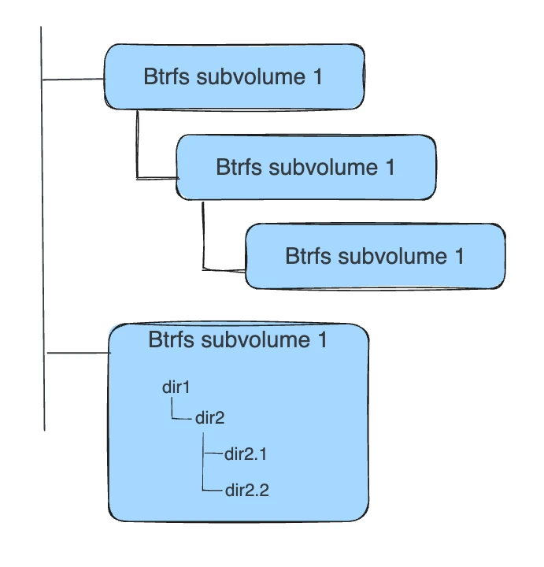
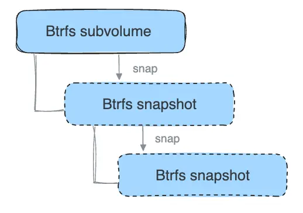
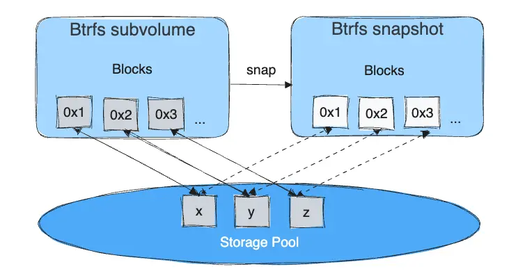
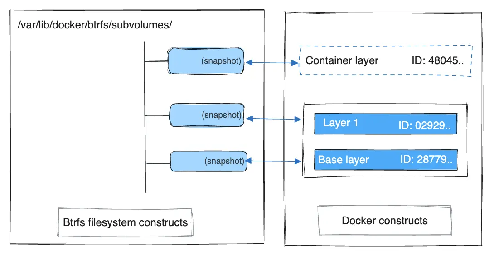

+++
title = "BTRFS 存储驱动"
date = 2024-10-23T14:54:40+08:00
weight = 10
type = "docs"
description = ""
isCJKLanguage = true
draft = false

+++

> 原文：[https://docs.docker.com/engine/storage/drivers/btrfs-driver/](https://docs.docker.com/engine/storage/drivers/btrfs-driver/)
>
> 收录该文档的时间：`2024-10-23T14:54:40+08:00`

# BTRFS storage driver - BTRFS 存储驱动

Btrfs is a copy-on-write filesystem that supports many advanced storage technologies, making it a good fit for Docker. Btrfs is included in the mainline Linux kernel.

​	Btrfs 是一种支持许多高级存储技术的写时复制文件系统，非常适合 Docker。Btrfs 已集成在主线 Linux 内核中。

Docker's `btrfs` storage driver leverages many Btrfs features for image and container management. Among these features are block-level operations, thin provisioning, copy-on-write snapshots, and ease of administration. You can combine multiple physical block devices into a single Btrfs filesystem.

​	Docker 的 `btrfs` 存储驱动利用 Btrfs 的许多功能来管理镜像和容器。这些功能包括块级操作、精简配置、写时复制快照和易于管理。可以将多个物理块设备组合成一个 Btrfs 文件系统。

This page refers to Docker's Btrfs storage driver as `btrfs` and the overall Btrfs Filesystem as Btrfs.

​	本文将 Docker 的 Btrfs 存储驱动称为 `btrfs`，整体 Btrfs 文件系统称为 Btrfs。

> **Note**
>
> 
>
> The `btrfs` storage driver is only supported with Docker Engine CE on SLES, Ubuntu, and Debian systems.
>
> ​	仅在 SLES、Ubuntu 和 Debian 系统上的 Docker CE 支持 `btrfs` 存储驱动。

## 前置条件 Prerequisites

`btrfs` is supported if you meet the following prerequisites:

​	满足以下条件时，支持 `btrfs`：

- `btrfs` is only recommended with Docker CE on Ubuntu or Debian systems.

  - 仅建议在 Ubuntu 或 Debian 系统上使用 Docker CE 的 `btrfs`。

- Changing the storage driver makes any containers you have already created inaccessible on the local system. Use `docker save` to save containers, and push existing images to Docker Hub or a private repository, so that you do not need to re-create them later.

  - 更改存储驱动会导致本地系统上已创建的容器无法访问。使用 `docker save` 保存容器，将现有镜像推送到 Docker Hub 或私有仓库，以便日后无需重新创建。

- `btrfs` requires a dedicated block storage device such as a physical disk. This block device must be formatted for Btrfs and mounted into `/var/lib/docker/`. The configuration instructions below walk you through this procedure. By default, the SLES `/` filesystem is formatted with Btrfs, so for SLES, you do not need to use a separate block device, but you can choose to do so for performance reasons.

  - `btrfs` 需要专用块存储设备（如物理磁盘）。该块设备必须为 Btrfs 格式并挂载到 `/var/lib/docker/`。下面的配置说明会指导您完成此过程。默认情况下，SLES 的 `/` 文件系统格式为 Btrfs，因此对于 SLES，无需使用单独的块设备，但可以选择出于性能原因这么做。

- `btrfs` support must exist in your kernel. To check this, run the following command:

  - 内核必须支持 `btrfs`。可以运行以下命令检查：


  

  ```console
  $ grep btrfs /proc/filesystems
  
  btrfs
  ```

- To manage Btrfs filesystems at the level of the operating system, you need the `btrfs` command. If you don't have this command, install the `btrfsprogs` package (SLES) or `btrfs-tools` package (Ubuntu).

  - 要在操作系统级别管理 Btrfs 文件系统，需要 `btrfs` 命令。如果没有该命令，请安装 `btrfsprogs`（SLES）或 `btrfs-tools`（Ubuntu）包。

  


## 配置 Docker 使用 btrfs 存储驱动 Configure Docker to use the btrfs storage driver

This procedure is essentially identical on SLES and Ubuntu.

​	此过程在 SLES 和 Ubuntu 上基本相同。

1. Stop Docker. 停止 Docker。

2. Copy the contents of `/var/lib/docker/` to a backup location, then empty the contents of `/var/lib/docker/`: 将 `/var/lib/docker/` 的内容复制到备份位置，然后清空 `/var/lib/docker/` 的内容：

   

   ```console
   $ sudo cp -au /var/lib/docker /var/lib/docker.bk
   $ sudo rm -rf /var/lib/docker/*
   ```

3. Format your dedicated block device or devices as a Btrfs filesystem. This example assumes that you are using two block devices called `/dev/xvdf` and `/dev/xvdg`. Double-check the block device names because this is a destructive operation. 将专用块设备格式化为 Btrfs 文件系统。此示例假设使用两个块设备 `/dev/xvdf` 和 `/dev/xvdg`。请仔细检查块设备名称，因为这是破坏性操作。

   

   ```console
   $ sudo mkfs.btrfs -f /dev/xvdf /dev/xvdg
   ```

   There are many more options for Btrfs, including striping and RAID. See the [Btrfs documentation](https://btrfs.wiki.kernel.org/index.php/Using_Btrfs_with_Multiple_Devices).

   ​	Btrfs 有更多选项，包括条带化和 RAID。请参阅 [Btrfs 文档](https://btrfs.wiki.kernel.org/index.php/Using_Btrfs_with_Multiple_Devices)。

4. Mount the new Btrfs filesystem on the `/var/lib/docker/` mount point. You can specify any of the block devices used to create the Btrfs filesystem.

   将新 Btrfs 文件系统挂载到 `/var/lib/docker/`。可以指定用于创建 Btrfs 文件系统的任何块设备。

   ```console
   $ sudo mount -t btrfs /dev/xvdf /var/lib/docker
   ```

   > **Note**
   >
   > 
   >
   > Make the change permanent across reboots by adding an entry to `/etc/fstab`.
   >
   > ​	通过在 `/etc/fstab` 中添加条目使更改在重启后保持有效。

5. Copy the contents of `/var/lib/docker.bk` to `/var/lib/docker/`.

   将 `/var/lib/docker.bk` 的内容复制到 `/var/lib/docker/`。

   ```console
   $ sudo cp -au /var/lib/docker.bk/* /var/lib/docker/
   ```

6. Configure Docker to use the `btrfs` storage driver. This is required even though `/var/lib/docker/` is now using a Btrfs filesystem. Edit or create the file `/etc/docker/daemon.json`. If it is a new file, add the following contents. If it is an existing file, add the key and value only, being careful to end the line with a comma if it isn't the final line before an ending curly bracket (`}`).

   配置 Docker 使用 `btrfs` 存储驱动。尽管 `/var/lib/docker/` 现在已使用 Btrfs 文件系统，仍需配置驱动。在 `/etc/docker/daemon.json` 文件中添加以下内容（若文件已存在，只需添加键值对，如果不是最后一行请加逗号）。

   ```json
   {
     "storage-driver": "btrfs"
   }
   ```

   See all storage options for each storage driver in the [daemon reference documentation](https://docs.docker.com/reference/cli/dockerd/#options-per-storage-driver)

   ​	各存储驱动的所有存储选项见 [守护程序参考文档](https://docs.docker.com/reference/cli/dockerd/#options-per-storage-driver)。

7. Start Docker. When it's running, verify that `btrfs` is being used as the storage driver.

   启动 Docker。运行后，验证 `btrfs` 是否用作存储驱动。

   ```console
   $ docker info
   
   Containers: 0
    Running: 0
    Paused: 0
    Stopped: 0
   Images: 0
   Server Version: 17.03.1-ce
   Storage Driver: btrfs
    Build Version: Btrfs v4.4
    Library Version: 101
   <...>
   ```

8. When you are ready, remove the `/var/lib/docker.bk` directory. 准备好后，删除 `/var/lib/docker.bk` 目录。

## 管理 Btrfs 卷 Manage a Btrfs volume

One of the benefits of Btrfs is the ease of managing Btrfs filesystems without the need to unmount the filesystem or restart Docker.

​	Btrfs 的一个优势是无需卸载文件系统或重启 Docker 即可管理文件系统。

When space gets low, Btrfs automatically expands the volume in chunks of roughly 1 GB.

​	空间不足时，Btrfs 自动以约 1 GB 为单位扩展卷。

To add a block device to a Btrfs volume, use the `btrfs device add` and `btrfs filesystem balance` commands.

​	要向 Btrfs 卷添加块设备，使用 `btrfs device add` 和 `btrfs filesystem balance` 命令。

```console
$ sudo btrfs device add /dev/svdh /var/lib/docker

$ sudo btrfs filesystem balance /var/lib/docker
```

> **Note**
>
> 
>
> While you can do these operations with Docker running, performance suffers. It might be best to plan an outage window to balance the Btrfs filesystem.
>
> ​	虽然可以在 Docker 运行时执行这些操作，但性能会下降。最好在非高峰时间安排停机维护来平衡 Btrfs 文件系统。

## `btrfs` 存储驱动的工作原理 How the `btrfs` storage driver works

The `btrfs` storage driver works differently from other storage drivers in that your entire `/var/lib/docker/` directory is stored on a Btrfs volume.

​	与其他存储驱动不同，`btrfs` 存储驱动在整个 `/var/lib/docker/` 目录中使用 Btrfs 卷。

### 镜像和容器层的磁盘存储 Image and container layers on-disk

Information about image layers and writable container layers is stored in `/var/lib/docker/btrfs/subvolumes/`. This subdirectory contains one directory per image or container layer, with the unified filesystem built from a layer plus all its parent layers. Subvolumes are natively copy-on-write and have space allocated to them on-demand from an underlying storage pool. They can also be nested and snapshotted. The diagram below shows 4 subvolumes. 'Subvolume 2' and 'Subvolume 3' are nested, whereas 'Subvolume 4' shows its own internal directory tree.

​	镜像层和可写容器层的信息存储在 `/var/lib/docker/btrfs/subvolumes/` 中。此子目录包含每个镜像或容器层的一个目录，并构建了统一文件系统。子卷本质上是写时复制的，按需从底层存储池中分配空间。它们可以嵌套并创建快照。下图展示了 4 个子卷的示例。



Only the base layer of an image is stored as a true subvolume. All the other layers are stored as snapshots, which only contain the differences introduced in that layer. You can create snapshots of snapshots as shown in the diagram below.

​	镜像的基层存储为真正的子卷，其他层则存为仅包含差异的快照。以下图显示了快照的创建方式。



On disk, snapshots look and feel just like subvolumes, but in reality they are much smaller and more space-efficient. Copy-on-write is used to maximize storage efficiency and minimize layer size, and writes in the container's writable layer are managed at the block level. The following image shows a subvolume and its snapshot sharing data.

​	磁盘上的快照看起来和子卷类似，但更小且更节省空间。写时复制用于最大化存储效率并最小化层大小，容器的可写层在块级别管理写操作。以下示例展示了一个子卷和快照共享数据。



For maximum efficiency, when a container needs more space, it is allocated in chunks of roughly 1 GB in size.

​	为了实现最高效率，当容器需要更多空间时，它会以约 1 GB 为单位分配。

Docker's `btrfs` storage driver stores every image layer and container in its own Btrfs subvolume or snapshot. The base layer of an image is stored as a subvolume whereas child image layers and containers are stored as snapshots. This is shown in the diagram below.

​	Docker 的 `btrfs` 存储驱动为每个镜像层和容器创建一个 Btrfs 子卷或快照。镜像的基层存为子卷，而子镜像层和容器存为快照，如下图所示。



The high level process for creating images and containers on Docker hosts running the `btrfs` driver is as follows:

​	在运行 `btrfs` 驱动的 Docker 主机上创建镜像和容器的主要过程如下：

1. The image's base layer is stored in a Btrfs *subvolume* under `/var/lib/docker/btrfs/subvolumes`. 镜像的基层存储为 `/var/lib/docker/btrfs/subvolumes` 下的 Btrfs *子卷*。
2. Subsequent image layers are stored as a Btrfs *snapshot* of the parent layer's subvolume or snapshot, but with the changes introduced by this layer. These differences are stored at the block level. 随后的镜像层存储为父层子卷或快照的 Btrfs *快照*，包含该层引入的更改。这些差异存储在块级别。
3. The container's writable layer is a Btrfs snapshot of the final image layer, with the differences introduced by the running container. These differences are stored at the block level. 
4. 容器的可写层是最终镜像层的 Btrfs 快照，包含运行容器引入的更改。差异存储在块级别。

## 容器的读取和写入在 `btrfs` 下的工作方式 How container reads and writes work with `btrfs`

### 读取文件 Reading files

A container is a space-efficient snapshot of an image. Metadata in the snapshot points to the actual data blocks in the storage pool. This is the same as with a subvolume. Therefore, reads performed against a snapshot are essentially the same as reads performed against a subvolume.

​	容器是镜像的空间高效快照。快照中的元数据指向存储池中的实际数据块，这与子卷的方式相同。因此，对快照进行的读取与对子卷的读取基本相同。

### 写入文件 Writing files

As a general caution, writing and updating a large number of small files with Btrfs can result in slow performance.

​	一般来说，在 Btrfs 中写入和更新大量小文件可能会导致性能变慢。

Consider three scenarios where a container opens a file for write access with Btrfs.

​	以下是容器在 Btrfs 中打开文件进行写入的三种情境：

#### 写入新文件 Writing new files

Writing a new file to a container invokes an allocate-on-demand operation to allocate new data block to the container's snapshot. The file is then written to this new space. The allocate-on-demand operation is native to all writes with Btrfs and is the same as writing new data to a subvolume. As a result, writing new files to a container's snapshot operates at native Btrfs speeds.

​	向容器写入新文件会触发按需分配操作，将新的数据块分配到容器的快照中，文件随即写入此空间。Btrfs 的按需分配是所有写入的本地操作，与向子卷写入新数据的操作相同。因此，向容器快照写入新文件的速度与 Btrfs 的本地速度一致。

#### 修改现有文件 Modifying existing files

Updating an existing file in a container is a copy-on-write operation (redirect-on-write is the Btrfs terminology). The original data is read from the layer where the file currently exists, and only the modified blocks are written into the container's writable layer. Next, the Btrfs driver updates the filesystem metadata in the snapshot to point to this new data. This behavior incurs minor overhead.

​	更新容器中的现有文件是写时复制操作（在 Btrfs 中称为重定向写入）。原数据从文件所在的层读取，仅修改的块写入到容器的可写层。接着，Btrfs 驱动更新快照中的文件系统元数据指向新数据，此操作仅带来轻微的开销。

#### 删除文件或目录 Deleting files or directories

If a container deletes a file or directory that exists in a lower layer, Btrfs masks the existence of the file or directory in the lower layer. If a container creates a file and then deletes it, this operation is performed in the Btrfs filesystem itself and the space is reclaimed.

​	如果容器删除了存在于较低层的文件或目录，Btrfs 会遮盖该文件或目录在较低层的存在。如果容器创建了一个文件并随后删除，此操作在 Btrfs 文件系统内执行，空间会被回收。

## Btrfs 和 Docker 性能 Btrfs and Docker performance

There are several factors that influence Docker's performance under the `btrfs` storage driver.

​	有几个因素会影响 `btrfs` 存储驱动下 Docker 的性能。

> **Note**
>
> 
>
> Many of these factors are mitigated by using Docker volumes for write-heavy workloads, rather than relying on storing data in the container's writable layer. However, in the case of Btrfs, Docker volumes still suffer from these draw-backs unless `/var/lib/docker/volumes/` isn't backed by Btrfs.
>
> ​	使用 Docker 卷替代依赖容器的可写层来存储数据，可缓解这些影响。但在 Btrfs 的情况下，除非 `/var/lib/docker/volumes/` 不由 Btrfs 支持，否则 Docker 卷仍会受到影响。

### 页面缓存 Page caching

Btrfs doesn't support page cache sharing. This means that each process accessing the same file copies the file into the Docker host's memory. As a result, the `btrfs` driver may not be the best choice for high-density use cases such as PaaS.

​	Btrfs 不支持页面缓存共享。这意味着每个进程访问同一文件时，文件会被复制到 Docker 主机的内存中。因此，`btrfs` 驱动可能不适合 PaaS 等高密度使用场景。

### 小型写入 Small writes

Containers performing lots of small writes (this usage pattern matches what happens when you start and stop many containers in a short period of time, as well) can lead to poor use of Btrfs chunks. This can prematurely fill the Btrfs filesystem and lead to out-of-space conditions on your Docker host. Use `btrfs filesys show` to closely monitor the amount of free space on your Btrfs device.

​	容器执行大量小写入操作（例如在短时间内启动和停止许多容器）可能导致 Btrfs 块的利用率低。这会提前填满 Btrfs 文件系统，并导致 Docker 主机空间不足。使用 `btrfs filesys show` 密切监控 Btrfs 设备上的可用空间。

### 顺序写入 Sequential writes

Btrfs uses a journaling technique when writing to disk. This can impact the performance of sequential writes, reducing performance by up to 50%.

​	Btrfs 在写入磁盘时使用日志记录技术。这可能影响顺序写入的性能，性能可能降低多达 50%。

### 碎片化 Fragmentation

Fragmentation is a natural byproduct of copy-on-write filesystems like Btrfs. Many small random writes can compound this issue. Fragmentation can manifest as CPU spikes when using SSDs or head thrashing when using spinning disks. Either of these issues can harm performance.

​	碎片化是 Btrfs 等写时复制文件系统的自然副产品。许多小的随机写入会加剧此问题。碎片化可能表现为使用 SSD 时的 CPU 峰值或使用旋转磁盘时的磁头频繁移动，都会对性能产生不良影响。

If your Linux kernel version is 3.9 or higher, you can enable the `autodefrag` feature when mounting a Btrfs volume. Test this feature on your own workloads before deploying it into production, as some tests have shown a negative impact on performance.

​	如果 Linux 内核版本为 3.9 或更高，可以在挂载 Btrfs 卷时启用 `autodefrag` 功能。请在实际工作负载上测试此功能，因为某些测试显示性能可能受到负面影响。

### SSD 性能 SSD performance

Btrfs includes native optimizations for SSD media. To enable these features, mount the Btrfs filesystem with the `-o ssd` mount option. These optimizations include enhanced SSD write performance by avoiding optimization such as seek optimizations that don't apply to solid-state media.

​	Btrfs 包含针对 SSD 媒体的本地优化。要启用这些功能，请使用 `-o ssd` 挂载选项挂载 Btrfs 文件系统。这些优化包括通过避免不适用于固态介质的寻道优化来增强 SSD 的写入性能。

### 经常平衡 Btrfs 文件系统 Balance Btrfs filesystems often

Use operating system utilities such as a `cron` job to balance the Btrfs filesystem regularly, during non-peak hours. This reclaims unallocated blocks and helps to prevent the filesystem from filling up unnecessarily. You can't rebalance a totally full Btrfs filesystem unless you add additional physical block devices to the filesystem.

​	使用操作系统工具（如 `cron` 作业）在非高峰时间定期平衡 Btrfs 文件系统，这可以回收未分配的块，防止文件系统不必要地填满。如果 Btrfs 文件系统已满，除非添加额外的物理块设备，否则无法重新平衡。

See the [Btrfs Wiki](https://btrfs.wiki.kernel.org/index.php/Balance_Filters#Balancing_to_fix_filesystem_full_errors).

​	请参阅 [Btrfs Wiki](https://btrfs.wiki.kernel.org/index.php/Balance_Filters#Balancing_to_fix_filesystem_full_errors)。

### 使用快速存储 Use fast storage

Solid-state drives (SSDs) provide faster reads and writes than spinning disks.

​	固态硬盘（SSD）比旋转磁盘提供更快的读写速度。

### 为写入密集型工作负载使用卷 Use volumes for write-heavy workloads

Volumes provide the best and most predictable performance for write-heavy workloads. This is because they bypass the storage driver and don't incur any of the potential overheads introduced by thin provisioning and copy-on-write. Volumes have other benefits, such as allowing you to share data among containers and persisting even when no running container is using them.

​	卷为写入密集型工作负载提供最佳和最可预测的性能。因为它们绕过存储驱动，没有精简配置和写时复制引入的潜在开销。卷的其他好处包括允许在容器间共享数据，并在没有运行容器使用时仍然持久存在。

## 相关信息 Related Information

- [Volumes]()
  - [卷]()
- [Understand images, containers, and storage drivers]()
  - [了解镜像、容器和存储驱动]()
- [Select a storage driver]()
  - [选择存储驱动]()

