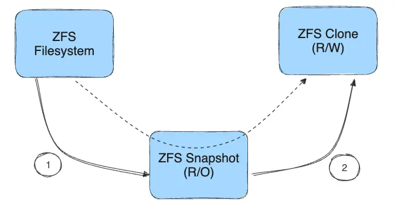
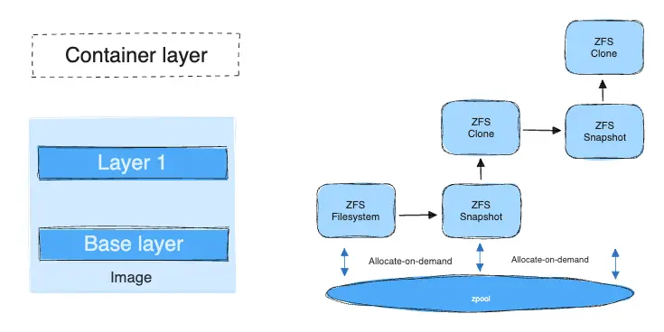
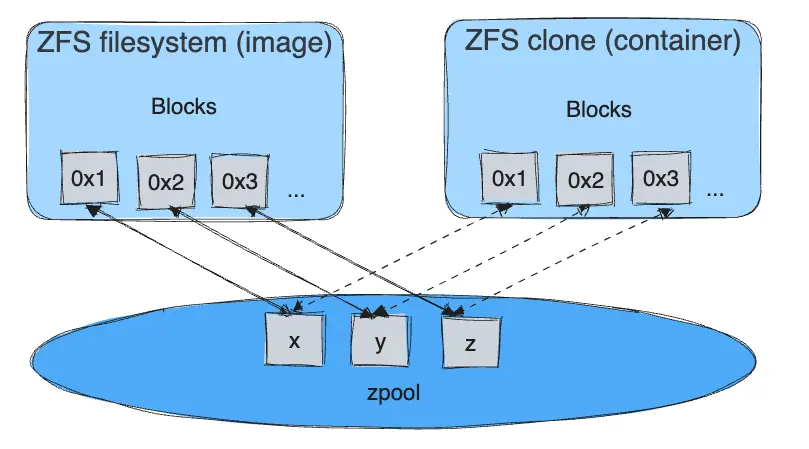

+++
title = "ZFS 存储驱动程序"
date = 2024-10-23T14:54:40+08:00
weight = 50
type = "docs"
description = ""
isCJKLanguage = true
draft = false

+++

> 原文：[https://docs.docker.com/engine/storage/drivers/zfs-driver/](https://docs.docker.com/engine/storage/drivers/zfs-driver/)
>
> 收录该文档的时间：`2024-10-23T14:54:40+08:00`

# ZFS storage driver - ZFS 存储驱动程序

ZFS is a next generation filesystem that supports many advanced storage technologies such as volume management, snapshots, checksumming, compression and deduplication, replication and more.

​	ZFS 是一种新一代文件系统，支持许多高级存储技术，如卷管理、快照、校验和、压缩、重复数据删除、复制等。

It was created by Sun Microsystems (now Oracle Corporation) and is open sourced under the CDDL license. Due to licensing incompatibilities between the CDDL and GPL, ZFS cannot be shipped as part of the mainline Linux kernel. However, the ZFS On Linux (ZoL) project provides an out-of-tree kernel module and userspace tools which can be installed separately.

​	ZFS 由 Sun Microsystems（现为 Oracle 公司）创建，并以 CDDL 许可证开源。由于 CDDL 和 GPL 许可证不兼容，ZFS 不能作为主线 Linux 内核的一部分发布。不过，ZFS On Linux (ZoL) 项目提供了一个独立的内核模块和用户空间工具，可以单独安装。

The ZFS on Linux (ZoL) port is healthy and maturing. However, at this point in time it is not recommended to use the `zfs` Docker storage driver for production use unless you have substantial experience with ZFS on Linux.

​	虽然 ZFS 在 Linux 上的发展稳健且日益成熟，但除非具备丰富的 ZFS on Linux 经验，否则不建议在生产环境中使用 `zfs` Docker 存储驱动。

> ***Note***: There is also a FUSE implementation of ZFS on the Linux platform. This is not recommended. The native ZFS driver (ZoL) is more tested, more performant, and is more widely used. The remainder of this document refers to the native ZoL port.
>
> ​	Linux 平台上还有一个基于 FUSE 的 ZFS 实现，但不推荐使用。ZoL 驱动更广泛使用、性能更佳且经过更多测试。本文档余下部分指代的 ZFS 实现均为 ZoL 驱动。

## 前置条件 Prerequisites

- ZFS requires one or more dedicated block devices, preferably solid-state drives (SSDs).
  - ZFS 需要一个或多个专用块设备，最好是固态硬盘 (SSD)。

- The `/var/lib/docker/` directory must be mounted on a ZFS-formatted filesystem.
  - `/var/lib/docker/` 目录必须挂载在 ZFS 格式的文件系统上。

- Changing the storage driver makes any containers you have already created inaccessible on the local system. Use `docker save` to save containers, and push existing images to Docker Hub or a private repository, so that you do not need to re-create them later.
  - 更改存储驱动会导致现有的容器和镜像在本地系统上不可访问。使用 `docker save` 保存容器，并将现有镜像推送到 Docker Hub 或私有仓库，以避免重新创建它们。


> **Note**
>
> 
>
> There is no need to use `MountFlags=slave` because `dockerd` and `containerd` are in different mount namespaces.
>
> ​	不需要使用 `MountFlags=slave`，因为 `dockerd` 和 `containerd` 处于不同的挂载命名空间中。

## 使用 `zfs` 存储驱动配置 Docker - Configure Docker with the `zfs` storage driver

1. Stop Docker. 停止 Docker。

2. Copy the contents of `/var/lib/docker/` to `/var/lib/docker.bk` and remove the contents of `/var/lib/docker/`.

   复制 `/var/lib/docker/` 的内容到 `/var/lib/docker.bk`，并删除 `/var/lib/docker/` 里的内容。

   ```console
   $ sudo cp -au /var/lib/docker /var/lib/docker.bk
   
   $ sudo rm -rf /var/lib/docker/*
   ```

3. Create a new `zpool` on your dedicated block device or devices, and mount it into `/var/lib/docker/`. Be sure you have specified the correct devices, because this is a destructive operation. This example adds two devices to the pool.

   在专用块设备上创建一个新的 `zpool` 并挂载到 `/var/lib/docker/`。确保指定的设备正确，因为这是一个破坏性操作。以下示例将两个设备添加到池中：

   ```console
   $ sudo zpool create -f zpool-docker -m /var/lib/docker /dev/xvdf /dev/xvdg
   ```

   The command creates the `zpool` and names it `zpool-docker`. The name is for display purposes only, and you can use a different name. Check that the pool was created and mounted correctly using `zfs list`.

   ​	该命令创建了 `zpool`，命名为 `zpool-docker`。此名称仅用于显示，可以使用其他名称。使用 `zfs list` 检查池是否创建和挂载正确。

   ```console
   $ sudo zfs list
   
   NAME           USED  AVAIL  REFER  MOUNTPOINT
   zpool-docker    55K  96.4G    19K  /var/lib/docker
   ```

4. Configure Docker to use `zfs`. Edit `/etc/docker/daemon.json` and set the `storage-driver` to `zfs`. If the file was empty before, it should now look like this:

   配置 Docker 使用 `zfs`。编辑 `/etc/docker/daemon.json`，将 `storage-driver` 设置为 `zfs`。如果文件之前为空，它现在应如下所示：

   ```json
   {
     "storage-driver": "zfs"
   }
   ```

   Save and close the file.

5. Start Docker. Use `docker info` to verify that the storage driver is `zfs`.

   启动 Docker。使用 `docker info` 验证存储驱动是否为 `zfs`。

   ```console
   $ sudo docker info
     Containers: 0
      Running: 0
      Paused: 0
      Stopped: 0
     Images: 0
     Server Version: 17.03.1-ce
     Storage Driver: zfs
      Zpool: zpool-docker
      Zpool Health: ONLINE
      Parent Dataset: zpool-docker
      Space Used By Parent: 249856
      Space Available: 103498395648
      Parent Quota: no
      Compression: off
   <...>
   ```

## 管理 `zfs` - Manage `zfs`

### 在运行设备上增加容量 Increase capacity on a running device

To increase the size of the `zpool`, you need to add a dedicated block device to the Docker host, and then add it to the `zpool` using the `zpool add` command:

​	要增加 `zpool` 的大小，需要在 Docker 主机上添加一个块设备，然后使用 `zpool add` 命令将其添加到 `zpool`：

```console
$ sudo zpool add zpool-docker /dev/xvdh
```

### 限制容器的可写存储配额 Limit a container's writable storage quota

If you want to implement a quota on a per-image/dataset basis, you can set the `size` storage option to limit the amount of space a single container can use for its writable layer.

​	若想对单个镜像/数据集实施配额限制，可以设置 `size` 存储选项来限制单个容器用于其可写层的空间量。

Edit `/etc/docker/daemon.json` and add the following:

​	编辑 `/etc/docker/daemon.json` 并添加以下内容：

```json
{
  "storage-driver": "zfs",
  "storage-opts": ["size=256M"]
}
```

See all storage options for each storage driver in the [daemon reference documentation](https://docs.docker.com/reference/cli/dockerd/#daemon-storage-driver)

​	查看每种存储驱动的所有存储选项，请参阅 [守护进程参考文档](https://docs.docker.com/reference/cli/dockerd/#daemon-storage-driver)。

Save and close the file, and restart Docker.

​	保存并关闭文件，然后重启 Docker。

## `zfs` 存储驱动的工作原理 How the `zfs` storage driver works

ZFS uses the following objects:

​	ZFS 使用以下对象：

- **filesystems**: thinly provisioned, with space allocated from the `zpool` on demand.
  - **文件系统**：精简配置，按需从 `zpool` 分配空间。

- **snapshots**: read-only space-efficient point-in-time copies of filesystems.
  - **快照**：只读、空间高效的文件系统时间点副本。

- **clones**: Read-write copies of snapshots. Used for storing the differences from the previous layer.
  - **克隆**：快照的可读写副本，用于存储与上一层的差异。


The process of creating a clone:

​	创建克隆的过程如下图所示：



1. A read-only snapshot is created from the filesystem. 从文件系统创建一个只读快照。
2. A writable clone is created from the snapshot. This contains any differences from the parent layer. 从该快照创建一个可写克隆，包含与父层的任何差异。

Filesystems, snapshots, and clones all allocate space from the underlying `zpool`.

​	文件系统、快照和克隆都从底层的 `zpool` 分配空间。

### 磁盘上的镜像和容器层 Image and container layers on-disk

Each running container's unified filesystem is mounted on a mount point in `/var/lib/docker/zfs/graph/`. Continue reading for an explanation of how the unified filesystem is composed.

​	每个运行的容器的统一文件系统挂载在 `/var/lib/docker/zfs/graph/` 下的挂载点。继续阅读以了解统一文件系统的构成。

### 镜像分层和共享 Image layering and sharing

The base layer of an image is a ZFS filesystem. Each child layer is a ZFS clone based on a ZFS snapshot of the layer below it. A container is a ZFS clone based on a ZFS Snapshot of the top layer of the image it's created from.

​	镜像的基本层是一个 ZFS 文件系统。每个子层是基于下层快照的 ZFS 克隆。容器是基于镜像顶层快照的 ZFS 克隆。

The diagram below shows how this is put together with a running container based on a two-layer image.

​	下图展示了基于两层镜像的运行容器的结构：



When you start a container, the following steps happen in order:

​	当启动容器时，以下步骤按顺序发生：

1. The base layer of the image exists on the Docker host as a ZFS filesystem. 镜像的基本层在 Docker 主机上作为 ZFS 文件系统存在。

2. Additional image layers are clones of the dataset hosting the image layer directly below it. 额外的镜像层是下层数据集的克隆。

   In the diagram, "Layer 1" is added by taking a ZFS snapshot of the base layer and then creating a clone from that snapshot. The clone is writable and consumes space on-demand from the zpool. The snapshot is read-only, maintaining the base layer as an immutable object.

   ​	在图中，通过对基本层进行 ZFS 快照，然后从该快照创建一个可写克隆，添加 "层 1"。克隆按需从 `zpool` 消耗空间。快照是只读的，保持基本层为不可变对象。

3. When the container is launched, a writable layer is added above the image. 启动容器时，在镜像之上添加一个可写层。

   In the diagram, the container's read-write layer is created by making a snapshot of the top layer of the image (Layer 1) and creating a clone from that snapshot.

   ​	在图中，容器的读写层通过对镜像的顶层 (层 1) 进行快照并创建一个克隆生成。

4. As the container modifies the contents of its writable layer, space is allocated for the blocks that are changed. By default, these blocks are 128k. 当容器修改其可写层的内容时，为更改的块分配空间。默认块大小为 128k。

   


## 使用 `zfs` 的容器读写工作原理 How container reads and writes work with `zfs`

### 读取文件 Reading files

Each container's writable layer is a ZFS clone which shares all its data with the dataset it was created from (the snapshots of its parent layers). Read operations are fast, even if the data being read is from a deep layer. This diagram illustrates how block sharing works:

​	每个容器的可写层是一个 ZFS 克隆，与其父层快照共享所有数据。即使数据来自较深层，读操作也非常快。下图展示了块共享的工作方式：



### 写入文件 Writing files

**Writing a new file**: space is allocated on demand from the underlying `zpool` and the blocks are written directly into the container's writable layer.

​	**写入新文件**：从底层 `zpool` 按需分配空间，块直接写入容器的可写层。

**Modifying an existing file**: space is allocated only for the changed blocks, and those blocks are written into the container's writable layer using a copy-on-write (CoW) strategy. This minimizes the size of the layer and increases write performance.

​	**修改现有文件**：仅为更改的块分配空间，并通过写时复制 (CoW) 策略将这些块写入容器的可写层。这最小化了层的大小并提高了写入性能。

**Deleting a file or directory**: **删除文件或目录**：

- When you delete a file or directory that exists in a lower layer, the ZFS driver masks the existence of the file or directory in the container's writable layer, even though the file or directory still exists in the lower read-only layers.

  - 当删除在较低层存在的文件或目录时，ZFS 驱动会在容器的可写层中掩盖该文件或目录的存在，尽管它仍存在于较低的只读层。

- If you create and then delete a file or directory within the container's writable layer, the blocks are reclaimed by the `zpool`.

  - 如果在容器可写层中创建并删除文件或目录，则这些块会被 `zpool` 回收。

  

## ZFS 和 Docker 性能 ZFS and Docker performance

There are several factors that influence the performance of Docker using the `zfs` storage driver.

​	使用 `zfs` 存储驱动的 Docker 性能受多种因素影响：

- **Memory**: Memory has a major impact on ZFS performance. ZFS was originally designed for large enterprise-grade servers with a large amount of memory.
  - **内存**：内存对 ZFS 性能有重要影响。ZFS 最初设计用于具有大量内存的大型企业级服务器。

- **ZFS Features**: ZFS includes a de-duplication feature. Using this feature may save disk space, but uses a large amount of memory. It is recommended that you disable this feature for the `zpool` you are using with Docker, unless you are using SAN, NAS, or other hardware RAID technologies.

  - **ZFS 特性**：ZFS 包含重复数据删除功能，启用此功能可能节省磁盘空间，但会消耗大量内存。除非使用 SAN、NAS 或其他硬件 RAID 技术，建议禁用此功能。

- **ZFS Caching**: ZFS caches disk blocks in a memory structure called the adaptive replacement cache (ARC). The *Single Copy ARC* feature of ZFS allows a single cached copy of a block to be shared by multiple clones of a With this feature, multiple running containers can share a single copy of a cached block. This feature makes ZFS a good option for PaaS and other high-density use cases.

  - **ZFS 缓存**：ZFS 将磁盘块缓存到自适应替换缓存（ARC）结构中。ZFS 的 *单副本 ARC* 特性允许多个克隆共享一个缓存块副本，使 ZFS 成为 PaaS 和其他高密度场景的良好选择。

- **Fragmentation**: Fragmentation is a natural byproduct of copy-on-write filesystems like ZFS. ZFS mitigates this by using a small block size of 128k. The ZFS intent log (ZIL) and the coalescing of writes (delayed writes) also help to reduce fragmentation. You can monitor fragmentation using `zpool status`. However, there is no way to defragment ZFS without reformatting and restoring the filesystem.

  - **碎片化**：碎片化是写时复制文件系统的自然产物。ZFS 通过使用 128k 小块大小、ZFS 意图日志（ZIL）和写入合并（延迟写入）来缓解此问题。可以使用 `zpool status` 监控碎片化，但 ZFS 无法在不重新格式化和恢复文件系统的情况下进行碎片整理。

- **Use the native ZFS driver for Linux**: The ZFS FUSE implementation is not recommended, due to poor performance.

  - **使用 Linux 原生 ZFS 驱动**：由于性能较差，不推荐使用 ZFS FUSE 实现。

  

### 性能最佳实践 Performance best practices

- **Use fast storage**: Solid-state drives (SSDs) provide faster reads and writes than spinning disks.
  - **使用快速存储**：固态硬盘（SSD）提供比机械硬盘更快的读写速度。
- **Use volumes for write-heavy workloads**: Volumes provide the best and most predictable performance for write-heavy workloads. This is because they bypass the storage driver and do not incur any of the potential overheads introduced by thin provisioning and copy-on-write. Volumes have other benefits, such as allowing you to share data among containers and persisting even when no running container is using them.
  - **为写密集型工作负载使用卷**：卷为写密集型工作负载提供最佳、最可预测的性能，因为它们绕过存储驱动程序，不会引入精简配置和写时复制带来的潜在开销。卷还允许您在容器间共享数据，即使没有运行的容器在使用时也可持久存储数据。
