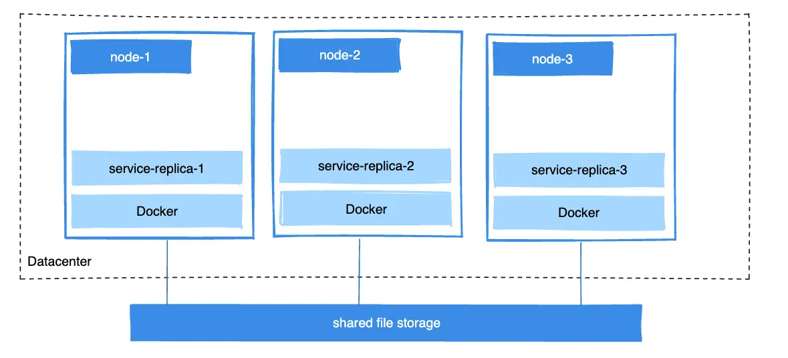

+++
title = "Volumes"
date = 2024-10-23T14:54:40+08:00
weight = 1
type = "docs"
description = ""
isCJKLanguage = true
draft = false
+++

> 原文：[https://docs.docker.com/engine/storage/volumes/](https://docs.docker.com/engine/storage/volumes/)
>
> 收录该文档的时间：`2024-10-23T14:54:40+08:00`

# Volumes - 卷

Volumes are the preferred mechanism for persisting data generated by and used by Docker containers. While [bind mounts]() are dependent on the directory structure and OS of the host machine, volumes are completely managed by Docker. Volumes have several advantages over bind mounts:

​	卷是 Docker 容器生成和使用的数据持久化的首选机制。虽然[绑定挂载]()依赖于主机机器的目录结构和操作系统，卷则完全由 Docker 管理。与绑定挂载相比，卷具有多个优点：

- Volumes are easier to back up or migrate than bind mounts.
  - 卷比绑定挂载更容易备份或迁移。

- You can manage volumes using Docker CLI commands or the Docker API.
  - 可以使用 Docker CLI 命令或 Docker API 来管理卷。

- Volumes work on both Linux and Windows containers.
  - 卷在 Linux 和 Windows 容器上都可以使用。

- Volumes can be more safely shared among multiple containers.
  - 卷更安全地在多个容器之间共享。

- Volume drivers let you store volumes on remote hosts or cloud providers, encrypt the contents of volumes, or add other functionality.
  - 卷驱动程序可以将卷存储在远程主机或云提供商上，对卷的内容加密，或增加其他功能。

- New volumes can have their content pre-populated by a container.
  - 新卷可以由容器预填充内容。

- Volumes on Docker Desktop have much higher performance than bind mounts from Mac and Windows hosts.
  - 在 Docker Desktop 上，卷的性能远高于 Mac 和 Windows 主机的绑定挂载。


In addition, volumes are often a better choice than persisting data in a container's writable layer, because a volume doesn't increase the size of the containers using it, and the volume's contents exist outside the lifecycle of a given container.

​	此外，卷通常比将数据持久化在容器的可写层中更优，因为卷不会增加使用它的容器的大小，且卷的内容存在于特定容器生命周期之外。


If your container generates non-persistent state data, consider using a [tmpfs mount]() to avoid storing the data anywhere permanently, and to increase the container's performance by avoiding writing into the container's writable layer.

​	如果容器生成非持久化状态数据，考虑使用 [tmpfs 挂载]()以避免数据被永久存储，并通过避免写入容器的可写层来提升容器性能。

Volumes use `rprivate` bind propagation, and bind propagation isn't configurable for volumes.

​	卷使用 `rprivate` 绑定传播，且无法配置传播类型。

## Choose the `-v` or `--mount` flag

In general, `--mount` is more explicit and verbose. The biggest difference is that the `-v` syntax combines all the options together in one field, while the `--mount` syntax separates them. Here is a comparison of the syntax for each flag.

​	通常，`--mount` 更明确且详细。最大的区别在于 `-v` 语法将所有选项组合在一个字段中，而 `--mount` 语法将它们分开。以下是两种标志语法的对比。

If you need to specify volume driver options, you must use `--mount`.

​	如果需要指定卷驱动程序选项，则必须使用 `--mount`。

- `-v` or `--volume`: Consists of three fields, separated by colon characters (`:`). The fields must be in the correct order, and the meaning of each field isn't immediately obvious.  `-v` 或 `--volume`：包含三个字段，以冒号（`:`）分隔。字段顺序必须正确，且每个字段的含义不直观。
  - In the case of named volumes, the first field is the name of the volume, and is unique on a given host machine. For anonymous volumes, the first field is omitted. 
    - 在命名卷的情况下，第一个字段是卷的名称，在特定主机上是唯一的。对于匿名卷，第一个字段省略。
  - The second field is the path where the file or directory is mounted in the container. 
    - 第二个字段是文件或目录在容器中的挂载路径。
  - The third field is optional, and is a comma-separated list of options, such as `ro`. These options are discussed below.
    - 第三个字段是可选的，为逗号分隔的选项列表，例如 `ro`。这些选项会在下文中讨论。

- `--mount`: Consists of multiple key-value pairs, separated by commas and each consisting of a `<key>=<value>` tuple. The `--mount` syntax is more verbose than `-v` or `--volume`, but the order of the keys isn't significant, and the value of the flag is easier to understand. `--mount`：包含多个键值对，以逗号分隔，每个由 `<key>=<value>` 元组组成。`--mount` 语法比 `-v` 或 `--volume` 更冗长，但键的顺序无关紧要，标志的值更易理解。
  - The `type` of the mount, which can be [`bind`](), `volume`, or [`tmpfs`](). This topic discusses volumes, so the type is always `volume`.
    - 挂载的 `type`，可以是 [`bind`]()、`volume` 或 [`tmpfs`]()。本文讨论卷，因此类型始终为 `volume`。
  - The `source` of the mount. For named volumes, this is the name of the volume. For anonymous volumes, this field is omitted. Can be specified as `source` or `src`.
    - 挂载的 `source`。对于命名卷，这是卷的名称。对于匿名卷，此字段省略。可以指定为 `source` 或 `src`。
  - The `destination` takes as its value the path where the file or directory is mounted in the container. Can be specified as `destination`, `dst`, or `target`.
    - `destination` 的值为文件或目录在容器中的挂载路径。可以指定为 `destination`、`dst` 或 `target`。
  - The `volume-subpath` option takes a path to a subdirectory within the volume to mount into the container. The subdirectory must exist in the volume before the volume is mounted to a container. See [Mount a volume subdirectory](#挂载卷子目录-mount-a-volume-subdirectory).
    - `volume-subpath` 选项接受一个子目录路径，用于将该卷中的特定子目录挂载到容器中。挂载卷前，子目录必须存在于卷中。参见[挂载卷的子目录](#挂载卷子目录-mount-a-volume-subdirectory)。
  - The `readonly` option, if present, causes the bind mount to be [mounted into the container as read-only](#使用只读卷-use-a-read-only-volume). Can be specified as `readonly` or `ro`.
    - `readonly` 选项（如果存在）将绑定挂载[只读方式挂载到容器中](#使用只读卷-use-a-read-only-volume)。可以指定为 `readonly` 或 `ro`。
  - The `volume-opt` option, which can be specified more than once, takes a key-value pair consisting of the option name and its value.
    - `volume-opt` 选项可以指定多次，包含一个键值对，由选项名称和其值组成。

> **Warning**
>
> 
>
> If your volume driver accepts a comma-separated list as an option, you must escape the value from the outer CSV parser. To escape a `volume-opt`, surround it with double quotes (`"`) and surround the entire mount parameter with single quotes (`'`).
>
> ​	如果卷驱动程序接受逗号分隔的列表作为选项，必须将该值从外部 CSV 解析器中转义。转义 `volume-opt` 时，将其用双引号（`"`）包裹，并用单引号（`'`）包裹整个挂载参数。
>
> For example, the `local` driver accepts mount options as a comma-separated list in the `o` parameter. This example shows the correct way to escape the list.
>
> ​	例如，本地驱动程序接受在 `o` 参数中作为逗号分隔列表的挂载选项。以下示例展示了正确的转义方法：
>
> ```console
> $ docker service create \
> --mount 'type=volume,src=<VOLUME-NAME>,dst=<CONTAINER-PATH>,volume-driver=local,volume-opt=type=nfs,volume-opt=device=<nfs-server>:<nfs-path>,"volume-opt=o=addr=<nfs-address>,vers=4,soft,timeo=180,bg,tcp,rw"'
> --name myservice \
> IMAGE
> ```

The examples below show both the `--mount` and `-v` syntax where possible, with `--mount` first.

​	以下示例展示了 `--mount` 和 `-v` 语法的用法，以 `--mount` 为先。

### Differences between `-v` and `--mount` behavior

As opposed to bind mounts, all options for volumes are available for both `--mount` and `-v` flags.

​	不同于绑定挂载，卷的所有选项对 `--mount` 和 `-v` 标志均可用。

Volumes used with services, only support `--mount`.

​	服务中使用的卷仅支持 `--mount`。

## 创建和管理卷 Create and manage volumes

Unlike a bind mount, you can create and manage volumes outside the scope of any container.

​	与绑定挂载不同，您可以在容器范围之外创建和管理卷。

Create a volume: 

​	创建卷：


```console
$ docker volume create my-vol
```

List volumes:

​	列出卷：

```console
$ docker volume ls

local               my-vol
```

Inspect a volume:

​	查看卷：

```console
$ docker volume inspect my-vol
[
    {
        "Driver": "local",
        "Labels": {},
        "Mountpoint": "/var/lib/docker/volumes/my-vol/_data",
        "Name": "my-vol",
        "Options": {},
        "Scope": "local"
    }
]
```

Remove a volume:

​	移除卷：

```console
$ docker volume rm my-vol
```

## 启动带卷的容器 Start a container with a volume

If you start a container with a volume that doesn't yet exist, Docker creates the volume for you. The following example mounts the volume `myvol2` into `/app/` in the container.

​	如果使用尚不存在的卷启动容器，Docker 会为您创建该卷。以下示例将 `myvol2` 卷挂载到容器中的 `/app/`。

The `-v` and `--mount` examples below produce the same result. You can't run them both unless you remove the `devtest` container and the `myvol2` volume after running the first one.

​	以下 `-v` 和 `--mount` 示例的结果相同。第一次运行后，除非删除 `devtest` 容器和 `myvol2` 卷，否则不能同时运行这两个命令。



{}

```console
 docker run -d \
  --name devtest \
  --mount source=myvol2,target=/app \
  nginx:latest
```

{}

{}

```console
 docker run -d \
  --name devtest \
  -v myvol2:/app \
  nginx:latest
```

{}




------

Use `docker inspect devtest` to verify that Docker created the volume and it mounted correctly. Look for the `Mounts` section:

​	使用 `docker inspect devtest` 验证 Docker 创建的卷并正确挂载。查找 `Mounts` 部分：

```json
"Mounts": [
    {
        "Type": "volume",
        "Name": "myvol2",
        "Source": "/var/lib/docker/volumes/myvol2/_data",
        "Destination": "/app",
        "Driver": "local",
        "Mode": "",
        "RW": true,
        "Propagation": ""
    }
],
```

This shows that the mount is a volume, it shows the correct source and destination, and that the mount is read-write.

​	这表明挂载的是一个卷，显示了正确的源和目标，且挂载为读写模式。

Stop the container and remove the volume. Note volume removal is a separate step.

​	停止容器并删除卷。卷删除是一个独立的步骤：


```console
$ docker container stop devtest

$ docker container rm devtest

$ docker volume rm myvol2
```

## 在 Docker Compose 中使用卷 Use a volume with Docker Compose

The example below shows a single Docker Compose service with a volume:

​	以下示例展示了一个包含卷的单个 Docker Compose 服务：

```yaml
services:
  frontend:
    image: node:lts
    volumes:
      - myapp:/home/node/app
volumes:
  myapp:
```

Running `docker compose up` for the first time creates a volume. Docker reuses the same volume when you run the command subsequently.

​	首次运行 `docker compose up` 时会创建一个卷。之后再次运行该命令时，Docker 会重用相同的卷。

You can create a volume directly outside of Compose using `docker volume create` and then reference it inside `compose.yaml` as follows:

​	可以在 Compose 之外使用 `docker volume create` 创建卷，然后在 `compose.yaml` 中引用：


```yaml
services:
  frontend:
    image: node:lts
    volumes:
      - myapp:/home/node/app
volumes:
  myapp:
    external: true
```

For more information about using volumes with Compose, refer to the [Volumes]() section in the Compose specification.

​	有关在 Compose 中使用卷的更多信息，请参阅 Compose 规范中的卷部分。

### 启动带卷的服务 Start a service with volumes

When you start a service and define a volume, each service container uses its own local volume. None of the containers can share this data if you use the `local` volume driver. However, some volume drivers do support shared storage.

​	启动服务并定义卷时，每个服务容器使用自己的本地卷。如果使用 `local` 卷驱动程序，则容器之间无法共享数据，但某些卷驱动程序支持共享存储。

The following example starts an `nginx` service with four replicas, each of which uses a local volume called `myvol2`.

​	以下示例启动一个带有四个副本的 `nginx` 服务，每个副本使用一个本地卷 `myvol2`。

```console
$ docker service create -d \
  --replicas=4 \
  --name devtest-service \
  --mount source=myvol2,target=/app \
  nginx:latest
```

Use `docker service ps devtest-service` to verify that the service is running:

​	使用 `docker service ps devtest-service` 验证服务正在运行：


```console
$ docker service ps devtest-service

ID                  NAME                IMAGE               NODE                DESIRED STATE       CURRENT STATE            ERROR               PORTS
4d7oz1j85wwn        devtest-service.1   nginx:latest        moby                Running             Running 14 seconds ago
```

You can remove the service to stop the running tasks:

​	可以删除服务以停止运行的任务：


```console
$ docker service rm devtest-service
```

Removing the service doesn't remove any volumes created by the service. Volume removal is a separate step.

​	删除服务不会删除服务创建的任何卷。卷删除是一个独立的步骤。

#### 服务的语法差异 Syntax differences for services

The `docker service create` command doesn't support the `-v` or `--volume` flag. When mounting a volume into a service's containers, you must use the `--mount` flag.

​	`docker service create` 命令不支持 `-v` 或 `--volume` 标志。将卷挂载到服务的容器时，必须使用 `--mount` 标志。

### 使用容器预填充卷 Populate a volume using a container

If you start a container which creates a new volume, and the container has files or directories in the directory to be mounted such as `/app/`, Docker copies the directory's contents into the volume. The container then mounts and uses the volume, and other containers which use the volume also have access to the pre-populated content.

​	如果启动一个创建新卷的容器，而容器在待挂载的目录中有文件或目录（例如 `/app/`），Docker 会将目录的内容复制到卷中。容器随后挂载并使用该卷，其他使用该卷的容器也可以访问预填充的内容。

To show this, the following example starts an `nginx` container and populates the new volume `nginx-vol` with the contents of the container's `/usr/share/nginx/html` directory. This is where Nginx stores its default HTML content.

​	以下示例启动一个 `nginx` 容器，并将新卷 `nginx-vol` 预填充为容器的 `/usr/share/nginx/html` 目录的内容，这是 Nginx 存储默认 HTML 内容的位置。

The `--mount` and `-v` examples have the same end result.

​	`--mount` 和 `-v` 示例的结果相同。



{}

```console
 docker run -d \
  --name=nginxtest \
  --mount source=nginx-vol,destination=/usr/share/nginx/html \
  nginx:latest
```

{}

{}

```console
 docker run -d \
  --name=nginxtest \
  -v nginx-vol:/usr/share/nginx/html \
  nginx:latest
```

{}




------

After running either of these examples, run the following commands to clean up the containers and volumes. Note volume removal is a separate step.

​	在运行任意一个示例后，运行以下命令清理容器和卷。注意卷删除是一个独立的步骤。

```console
$ docker container stop nginxtest

$ docker container rm nginxtest

$ docker volume rm nginx-vol
```

## 使用只读卷 Use a read-only volume

For some development applications, the container needs to write into the bind mount so that changes are propagated back to the Docker host. At other times, the container only needs read access to the data. Multiple containers can mount the same volume. You can simultaneously mount a single volume as `read-write` for some containers and as `read-only` for others.

​	在某些开发应用程序中，容器需要写入绑定挂载以便更改回传到 Docker 主机。其他时候，容器仅需数据的读访问权限。多个容器可以挂载同一个卷。您可以同时将单个卷以 `读写` 模式挂载到某些容器中，并以 `只读` 模式挂载到其他容器中。

The following example changes the one above. It mounts the directory as a read-only volume, by adding `ro` to the (empty by default) list of options, after the mount point within the container. Where multiple options are present, you can separate them using commas.

​	以下示例修改上一个示例，通过在容器内的挂载点后添加 `ro`（默认为空）将目录挂载为只读卷。存在多个选项时，可以用逗号分隔。

The `--mount` and `-v` examples have the same result.

​	`--mount` 和 `-v` 示例的结果相同。



{}

```console
 docker run -d \
  --name=nginxtest \
  --mount source=nginx-vol,destination=/usr/share/nginx/html,readonly \
  nginx:latest
```

{}

{}

```console
 docker run -d \
  --name=nginxtest \
  -v nginx-vol:/usr/share/nginx/html:ro \
  nginx:latest
```

{}




------

Use `docker inspect nginxtest` to verify that Docker created the read-only mount correctly. Look for the `Mounts` section:

​	使用 `docker inspect nginxtest` 验证 Docker 正确创建了只读挂载。查找 `Mounts` 部分：


```json
"Mounts": [
    {
        "Type": "volume",
        "Name": "nginx-vol",
        "Source": "/var/lib/docker/volumes/nginx-vol/_data",
        "Destination": "/usr/share/nginx/html",
        "Driver": "local",
        "Mode": "",
        "RW": false,
        "Propagation": ""
    }
],
```

Stop and remove the container, and remove the volume. Volume removal is a separate step.

​	停止并移除容器，并移除卷。卷删除是一个独立的步骤：

```console
$ docker container stop nginxtest

$ docker container rm nginxtest

$ docker volume rm nginx-vol
```

## 挂载卷子目录 Mount a volume subdirectory

When you mount a volume to a container, you can specify a subdirectory of the volume to use, with the `volume-subpath` parameter for the `--mount` flag. The subdirectory that you specify must exist in the volume before you attempt to mount it into a container; if it doesn't exist, the mount fails.

​	当您将卷挂载到容器时，可以使用 `--mount` 标志的 `volume-subpath` 参数指定卷的子目录。指定的子目录必须在挂载到容器前存在于卷中，否则挂载失败。

Specifying `volume-subpath` is useful if you only want to share a specific portion of a volume with a container. Say for example that you have multiple containers running and you want to store logs from each container in a shared volume. You can create a subdirectory for each container in the shared volume, and mount the subdirectory to the container.

​	指定 `volume-subpath` 在您只想与容器共享卷的特定部分时非常有用。例如，您有多个容器运行，希望将每个容器的日志存储在共享卷中。可以在共享卷中为每个容器创建一个子目录，并将该子目录挂载到容器中。

The following example creates a `logs` volume and initiates the subdirectories `app1` and `app2` in the volume. It then starts two containers and mounts one of the subdirectories of the `logs` volume to each container. This example assumes that the processes in the containers write their logs to `/var/log/app1` and `/var/log/app2`.

​	以下示例创建一个 `logs` 卷，并在该卷中初始化子目录 `app1` 和 `app2`，然后启动两个容器，并将 `logs` 卷的一个子目录挂载到每个容器中。此示例假设容器中的进程将日志写入 `/var/log/app1` 和 `/var/log/app2`。

```console
$ docker volume create logs
$ docker run --rm \
  --mount src=logs,dst=/logs \
  alpine mkdir -p /logs/app1 /logs/app2
$ docker run -d \
  --name=app1 \
  --mount src=logs,dst=/var/log/app1/,volume-subpath=app1 \
  app1:latest
$ docker run -d \
  --name=app2 \
  --mount src=logs,dst=/var/log/app2,volume-subpath=app2 \
  app2:latest
```

With this setup, the containers write their logs to separate subdirectories of the `logs` volume. The containers can't access the other container's logs.

​	通过此设置，容器将日志写入 `logs` 卷的不同子目录。容器无法访问其他容器的日志。

## 在机器间共享数据 Share data between machines

When building fault-tolerant applications, you may need to configure multiple replicas of the same service to have access to the same files.

​	构建容错应用程序时，您可能需要配置同一服务的多个副本以访问相同的文件。



There are several ways to achieve this when developing your applications. One is to add logic to your application to store files on a cloud object storage system like Amazon S3. Another is to create volumes with a driver that supports writing files to an external storage system like NFS or Amazon S3.

​	开发应用程序时，有多种方法可以实现这一点。可以为应用程序添加逻辑，将文件存储在云对象存储系统中，如 Amazon S3。另一种方法是使用支持将文件写入外部存储系统（如 NFS 或 Amazon S3）的驱动程序创建卷。

Volume drivers allow you to abstract the underlying storage system from the application logic. For example, if your services use a volume with an NFS driver, you can update the services to use a different driver. For example, to store data in the cloud, without changing the application logic.

​	卷驱动程序允许您将基础存储系统从应用程序逻辑中抽象出来。例如，如果服务使用具有 NFS 驱动程序的卷，可以将服务更新为使用其他驱动程序（如将数据存储在云端），而无需更改应用程序逻辑。

## 使用卷驱动程序 Use a volume driver

When you create a volume using `docker volume create`, or when you start a container which uses a not-yet-created volume, you can specify a volume driver. The following examples use the `vieux/sshfs` volume driver, first when creating a standalone volume, and then when starting a container which creates a new volume.

​	使用 `docker volume create` 创建卷时，或启动使用尚未创建的卷的容器时，可以指定卷驱动程序。以下示例首先在创建独立卷时使用 `vieux/sshfs` 卷驱动程序，然后在启动创建新卷的容器时使用。

### 初始设置 Initial setup

The following example assumes that you have two nodes, the first of which is a Docker host and can connect to the second node using SSH.

​	以下示例假设您有两个节点，第一个是 Docker 主机，可以通过 SSH 连接到第二个节点。

On the Docker host, install the `vieux/sshfs` plugin:

​	在 Docker 主机上，安装 `vieux/sshfs` 插件：

```console
$ docker plugin install --grant-all-permissions vieux/sshfs
```

### 使用卷驱动程序创建卷 Create a volume using a volume driver

This example specifies an SSH password, but if the two hosts have shared keys configured, you can exclude the password. Each volume driver may have zero or more configurable options, you specify each of them using an `-o` flag.

​	此示例指定了 SSH 密码，但如果两个主机已配置共享密钥，则可以省略密码。每个卷驱动程序可能有零个或多个可配置选项，您可以使用 `-o` 标志指定每个选项。

```console
$ docker volume create --driver vieux/sshfs \
  -o sshcmd=test@node2:/home/test \
  -o password=testpassword \
  sshvolume
```

### 使用卷驱动程序创建卷的容器 Start a container which creates a volume using a volume driver

The following example specifies an SSH password. However, if the two hosts have shared keys configured, you can exclude the password. Each volume driver may have zero or more configurable options.

​	以下示例指定了 SSH 密码。不过，如果两个主机已配置共享密钥，可以省略密码。每个卷驱动程序可能有零个或多个可配置选项。

> **Note**
>
> 
>
> If the volume driver requires you to pass any options, you must use the `--mount` flag to mount the volume, and not `-v`.
>
> ​	如果卷驱动程序需要传递任何选项，必须使用 `--mount` 标志挂载卷，而不是 `-v`。


```console
$ docker run -d \
  --name sshfs-container \
  --mount type=volume,volume-driver=vieux/sshfs,src=sshvolume,target=/app,volume-opt=sshcmd=test@node2:/home/test,volume-opt=password=testpassword \
  nginx:latest
```

### 创建一个 NFS 卷的服务 Create a service which creates an NFS volume

The following example shows how you can create an NFS volume when creating a service. It uses `10.0.0.10` as the NFS server and `/var/docker-nfs` as the exported directory on the NFS server. Note that the volume driver specified is `local`.

​	以下示例展示了如何在创建服务时创建 NFS 卷。它使用 `10.0.0.10` 作为 NFS 服务器，使用 NFS 服务器上的导出目录 `/var/docker-nfs`。注意，指定的卷驱动程序为 `local`。

#### NFSv3


```console
$ docker service create -d \
  --name nfs-service \
  --mount 'type=volume,source=nfsvolume,target=/app,volume-driver=local,volume-opt=type=nfs,volume-opt=device=:/var/docker-nfs,volume-opt=o=addr=10.0.0.10' \
  nginx:latest
```

#### NFSv4


```console
$ docker service create -d \
    --name nfs-service \
    --mount 'type=volume,source=nfsvolume,target=/app,volume-driver=local,volume-opt=type=nfs,volume-opt=device=:/var/docker-nfs,"volume-opt=o=addr=10.0.0.10,rw,nfsvers=4,async"' \
    nginx:latest
```

### 创建 CIFS/Samba 卷 Create CIFS/Samba volumes

You can mount a Samba share directly in Docker without configuring a mount point on your host.

​	可以直接在 Docker 中挂载 Samba 共享，而无需在主机上配置挂载点。

```console
$ docker volume create \
	--driver local \
	--opt type=cifs \
	--opt device=//uxxxxx.your-server.de/backup \
	--opt o=addr=uxxxxx.your-server.de,username=uxxxxxxx,password=*****,file_mode=0777,dir_mode=0777 \
	--name cif-volume
```

The `addr` option is required if you specify a hostname instead of an IP. This lets Docker perform the hostname lookup.

​	如果指定主机名而非 IP，则 `addr` 选项是必需的。这让 Docker 可以执行主机名解析。

### 块存储设备 Block storage devices

You can mount a block storage device, such as an external drive or a drive partition, to a container. The following example shows how to create and use a file as a block storage device, and how to mount the block device as a container volume.

​	可以将块存储设备（例如外接硬盘或驱动器分区）挂载到容器中。以下示例展示了如何创建并使用一个文件作为块存储设备，并将该块设备作为容器卷挂载。

> **Important**
>
> 
>
> The following procedure is only an example. The solution illustrated here isn't recommended as a general practice. Don't attempt this approach unless you're confident about what you're doing.
>
> ​	以下步骤仅为示例。此方法不推荐用于常规实践。除非您对所执行的操作有充分把握，否则请勿尝试此方法。

#### 块设备挂载的工作原理 How mounting block devices works

Under the hood, the `--mount` flag using the `local` storage driver invokes the Linux `mount` syscall and forwards the options you pass to it unaltered. Docker doesn't implement any additional functionality on top of the native mount features supported by the Linux kernel.

​	底层使用 `local` 存储驱动程序的 `--mount` 标志调用 Linux 的 `mount` 系统调用，并将您传递的选项未加修改地转发。Docker 未在 Linux 内核支持的原生挂载功能上添加其他功能。

If you're familiar with the [Linux `mount` command](https://man7.org/linux/man-pages/man8/mount.8.html), you can think of the `--mount` options as forwarded to the `mount` command in the following manner:

​	若熟悉 [Linux `mount` 命令](https://man7.org/linux/man-pages/man8/mount.8.html)，可以将 `--mount` 选项视为转发到以下方式的 `mount` 命令：

```console
$ mount -t <mount.volume-opt.type> <mount.volume-opt.device> <mount.dst> -o <mount.volume-opts.o>
```

To explain this further, consider the following `mount` command example. This command mounts the `/dev/loop5` device to the path `/external-drive` on the system.

​	进一步解释，以下 `mount` 命令示例将 `/dev/loop5` 设备挂载到系统上的路径 `/external-drive`。

```console
$ mount -t ext4 /dev/loop5 /external-drive
```

The following `docker run` command achieves a similar result, from the point of view of the container being run. Running a container with this `--mount` option sets up the mount in the same way as if you had executed the `mount` command from the previous example.

​	以下 `docker run` 命令在容器视角下实现类似的结果。运行带有此 `--mount` 选项的容器设置挂载，与前面示例的 `mount` 命令效果相同。


```console
$ docker run \
  --mount='type=volume,dst=/external-drive,volume-driver=local,volume-opt=device=/dev/loop5,volume-opt=type=ext4'
```

You can't run the `mount` command inside the container directly, because the container is unable to access the `/dev/loop5` device. That's why the `docker run` command uses the `--mount` option.

​	无法直接在容器内部运行 `mount` 命令，因为容器无法访问 `/dev/loop5` 设备。这就是为什么 `docker run` 命令使用 `--mount` 选项。

#### 

#### 示例：在容器中挂载块设备 Example: Mounting a block device in a container

The following steps create an `ext4` filesystem and mounts it into a container. The filesystem support of your system depends on the version of the Linux kernel you are using.

​	以下步骤创建 `ext4` 文件系统并将其挂载到容器中。您的系统支持的文件系统取决于 Linux 内核版本。

1. Create a file and allocate some space to it: 创建一个文件并分配空间：

   

   ```console
   $ fallocate -l 1G disk.raw
   ```

2. Build a filesystem onto the `disk.raw` file: 将文件系统构建到 `disk.raw` 文件中：

   

   ```console
   $ mkfs.ext4 disk.raw
   ```

3. Create a loop device: 创建一个回环设备：

   

   ```console
   $ losetup -f --show disk.raw
   /dev/loop5
   ```

   > **Note**
   >
   > 
   >
   > `losetup` creates an ephemeral loop device that's removed after system reboot, or manually removed with `losetup -d`.
   >
   > ​	`losetup` 创建一个临时回环设备，在系统重启后会被移除，或可使用 `losetup -d` 手动移除。

4. Run a container that mounts the loop device as a volume: 运行挂载回环设备为卷的容器：

   

   ```console
   $ docker run -it --rm \
     --mount='type=volume,dst=/external-drive,volume-driver=local,volume-opt=device=/dev/loop5,volume-opt=type=ext4' \
     ubuntu bash
   ```

   When the container starts, the path `/external-drive` mounts the `disk.raw` file from the host filesystem as a block device.

   ​	启动容器时，路径 `/external-drive` 将主机文件系统上的 `disk.raw` 文件作为块设备挂载。

5. When you're done, and the device is unmounted from the container, detach the loop device to remove the device from the host system: 完成后，在从容器卸载设备后，分离回环设备以从主机系统中移除该设备：

   

   ```console
   $ losetup -d /dev/loop5
   ```

## 备份、还原或迁移数据卷 Back up, restore, or migrate data volumes

Volumes are useful for backups, restores, and migrations. Use the `--volumes-from` flag to create a new container that mounts that volume.

​	卷可用于备份、还原和迁移。使用 `--volumes-from` 标志创建一个新容器，并将该卷挂载到该容器上。

### 备份卷 Back up a volume

For example, create a new container named `dbstore`:

​	例如，创建一个名为 `dbstore` 的新容器：


```console
$ docker run -v /dbdata --name dbstore ubuntu /bin/bash
```

In the next command:

​	在接下来的命令中：

- Launch a new container and mount the volume from the `dbstore` container
  - 启动新容器，并从 `dbstore` 容器中挂载卷。

- Mount a local host directory as `/backup`
  - 将本地主机目录挂载为 `/backup`。

- Pass a command that tars the contents of the `dbdata` volume to a `backup.tar` file inside our `/backup` directory.
  - 传递一个命令，将 `dbdata` 卷的内容压缩到 `/backup` 目录中的 `backup.tar` 文件中。


```console
$ docker run --rm --volumes-from dbstore -v $(pwd):/backup ubuntu tar cvf /backup/backup.tar /dbdata
```

When the command completes and the container stops, it creates a backup of the `dbdata` volume.

​	当命令完成且容器停止时，它会创建 `dbdata` 卷的备份。

### 从备份还原卷 Restore volume from a backup

With the backup just created, you can restore it to the same container, or to another container that you created elsewhere.

​	通过刚创建的备份，可以将其还原到相同容器或创建于其他位置的容器。

For example, create a new container named `dbstore2`:

​	例如，创建一个名为 `dbstore2` 的新容器：

```console
$ docker run -v /dbdata --name dbstore2 ubuntu /bin/bash
```

Then, un-tar the backup file in the new container’s data volume:

​	然后在新容器的数据卷中解压备份文件：

```console
$ docker run --rm --volumes-from dbstore2 -v $(pwd):/backup ubuntu bash -c "cd /dbdata && tar xvf /backup/backup.tar --strip 1"
```

You can use the techniques above to automate backup, migration, and restore testing using your preferred tools.

​	您可以使用上述技术通过您首选的工具自动化备份、迁移和还原测试。

## 删除卷 Remove volumes

A Docker data volume persists after you delete a container. There are two types of volumes to consider:

​	Docker 数据卷在删除容器后仍然保留。需要考虑两种类型的卷：

- Named volumes have a specific source from outside the container, for example, `awesome:/bar`.
  - 命名卷有来自容器外部的特定源，例如 `awesome:/bar`。

- Anonymous volumes have no specific source. Therefore, when the container is deleted, you can instruct the Docker Engine daemon to remove them.

  - 匿名卷没有特定的源。因此，当删除容器时，可以指示 Docker 引擎守护进程删除它们。

  

### 删除匿名卷 Remove anonymous volumes

To automatically remove anonymous volumes, use the `--rm` option. For example, this command creates an anonymous `/foo` volume. When you remove the container, the Docker Engine removes the `/foo` volume but not the `awesome` volume.

​	要自动删除匿名卷，请使用 `--rm` 选项。例如，此命令创建了一个匿名的 `/foo` 卷。当删除容器时，Docker 引擎会删除 `/foo` 卷，但不会删除 `awesome` 卷。

```console
$ docker run --rm -v /foo -v awesome:/bar busybox top
```

> **Note**
>
> 
>
> If another container binds the volumes with `--volumes-from`, the volume definitions are *copied* and the anonymous volume also stays after the first container is removed.
>
> ​	如果另一个容器使用 `--volumes-from` 绑定卷，卷定义会被*复制*，且匿名卷在第一个容器被移除后仍然保留。

### 删除所有卷 Remove all volumes

To remove all unused volumes and free up space:

​	要删除所有未使用的卷并释放空间：


```console
$ docker volume prune
```

## Next steps

- Learn about [bind mounts]().
  - 了解有关[绑定挂载]()的信息。
- Learn about [tmpfs mounts]().
  - 了解有关[`tmpfs` 挂载]()的信息。
- Learn about [storage drivers]().
  - 了解有关[存储驱动]()的信息。
- Learn about [third-party volume driver plugins]().
  - 了解有关[第三方卷驱动插件]()的信息。
