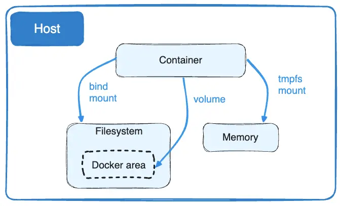

+++
title = "Storage"
date = 2024-10-23T14:54:40+08:00
weight = 10
type = "docs"
description = ""
isCJKLanguage = true
draft = false
+++

> 原文：[https://docs.docker.com/engine/storage/](https://docs.docker.com/engine/storage/)
>
> 收录该文档的时间：`2024-10-23T14:54:40+08:00`

# Storage

By default all files created inside a container are stored on a writable container layer. This means that:

​	默认情况下，在容器内创建的所有文件都存储在一个可写的容器层中。这意味着：

- The data doesn't persist when that container no longer exists, and it can be difficult to get the data out of the container if another process needs it.
  - 当容器不存在时，数据不会持久化，其他进程若需要数据时提取可能会很困难。

- A container's writable layer is tightly coupled to the host machine where the container is running. You can't easily move the data somewhere else.
  - 容器的可写层与运行该容器的主机机器紧密耦合，数据无法轻易移动到其他地方。

- Writing into a container's writable layer requires a [storage driver]() to manage the filesystem. The storage driver provides a union filesystem, using the Linux kernel. This extra abstraction reduces performance as compared to using *data volumes*, which write directly to the host filesystem.
  - 写入容器的可写层需要一个[存储驱动]()来管理文件系统。存储驱动使用 Linux 内核提供联合文件系统。与直接写入主机文件系统的*数据卷*相比，这种额外的抽象层会降低性能。

Docker has two options for containers to store files on the host machine, so that the files are persisted even after the container stops: volumes, and bind mounts.

​	Docker 为容器提供了两种在主机上存储文件的方法，使得即使容器停止后文件依然持久：卷和绑定挂载。

Docker also supports containers storing files in-memory on the host machine. Such files are not persisted. If you're running Docker on Linux, `tmpfs` mount is used to store files in the host's system memory. If you're running Docker on Windows, named pipe is used to store files in the host's system memory.

​	Docker 还支持在主机上使用内存存储文件。此类文件不会持久化。如果在 Linux 上运行 Docker，则会使用 `tmpfs` 挂载将文件存储在主机的系统内存中；如果在 Windows 上运行 Docker，则使用命名管道将文件存储在主机的系统内存中。

## 选择正确的挂载类型 Choose the right type of mount

No matter which type of mount you choose to use, the data looks the same from within the container. It is exposed as either a directory or an individual file in the container's filesystem.

​	无论选择哪种挂载类型，从容器内部来看，数据都是以目录或单个文件的形式暴露在容器的文件系统中。

An easy way to visualize the difference among volumes, bind mounts, and `tmpfs` mounts is to think about where the data lives on the Docker host.

​	通过挂载类型可以可视化数据在 Docker 主机上的位置差异。

- Volumes are stored in a part of the host filesystem which is *managed by Docker* (`/var/lib/docker/volumes/` on Linux). Non-Docker processes should not modify this part of the filesystem. Volumes are the best way to persist data in Docker.
  - 卷存储在 Docker 管理的主机文件系统的某个部分（在 Linux 上是 `/var/lib/docker/volumes/`）。非 Docker 进程不应修改该文件系统部分。卷是 Docker 中持久化数据的最佳方式。

- Bind mounts may be stored anywhere on the host system. They may even be important system files or directories. Non-Docker processes on the Docker host or a Docker container can modify them at any time.
  - 绑定挂载可以存储在主机系统的任何位置，甚至可能是重要的系统文件或目录。主机上的非 Docker 进程或 Docker 容器中的进程可随时修改它们。

- `tmpfs` mounts are stored in the host system's memory only, and are never written to the host system's filesystem.
  - `tmpfs` 挂载仅存储在主机系统的内存中，且不会写入主机系统的文件系统。

Bind mounts and volumes can both be mounted into containers using the `-v` or `--volume` flag, but the syntax for each is slightly different. For `tmpfs` mounts, you can use the `--tmpfs` flag. We recommend using the `--mount` flag for both containers and services, for bind mounts, volumes, or `tmpfs` mounts, as the syntax is more clear.

​	绑定挂载和卷可以使用 `-v` 或 `--volume` 标志挂载到容器中，但语法略有不同。对于 `tmpfs` 挂载，您可以使用 `--tmpfs` 标志。建议对绑定挂载、卷或 `tmpfs` 挂载均使用 `--mount` 标志，因为语法更清晰。

### Volumes

Volumes are created and managed by Docker. You can create a volume explicitly using the `docker volume create` command, or Docker can create a volume during container or service creation.

​	卷由 Docker 创建和管理。您可以使用 `docker volume create` 命令显式创建卷，或者在创建容器或服务时让 Docker 自动创建卷。

When you create a volume, it's stored within a directory on the Docker host. When you mount the volume into a container, this directory is what's mounted into the container. This is similar to the way that bind mounts work, except that volumes are managed by Docker and are isolated from the core functionality of the host machine.

​	创建卷时，卷存储在 Docker 主机的一个目录中。当将该卷挂载到容器中时，此目录将挂载到容器中。这与绑定挂载的工作方式类似，不同之处在于卷由 Docker 管理，并与主机机器的核心功能隔离。

A given volume can be mounted into multiple containers simultaneously. When no running container is using a volume, the volume is still available to Docker and isn't removed automatically. You can remove unused volumes using `docker volume prune`.

​	一个给定的卷可以同时挂载到多个容器中。当没有运行的容器使用卷时，该卷仍可用于 Docker 并不会自动移除。您可以使用 `docker volume prune` 移除未使用的卷。

When you mount a volume, it may be named or anonymous. Anonymous volumes are given a random name that's guaranteed to be unique within a given Docker host. Just like named volumes, anonymous volumes persist even if you remove the container that uses them, except if you use the `--rm` flag when creating the container, in which case the anonymous volume is destroyed. See [Remove anonymous volumes](https://docs.docker.com/engine/storage/volumes/#remove-anonymous-volumes). If you create multiple containers after each other that use anonymous volumes, each container creates its own volume. Anonymous volumes aren't reused or shared between containers automatically. To share an anonymous volume between two or more containers, you must mount the anonymous volume using the random volume ID.

​	挂载卷时，卷可以是命名的或匿名的。匿名卷被赋予一个随机名称，在给定的 Docker 主机内唯一。与命名卷一样，即使删除使用它们的容器，匿名卷也会持久存在，除非在创建容器时使用 `--rm` 标志，此情况下匿名卷将被销毁。参见[移除匿名卷](https://docs.docker.com/engine/storage/volumes/#remove-anonymous-volumes)。如果连续创建多个使用匿名卷的容器，则每个容器都会创建自己的卷，匿名卷不会自动复用或在容器之间共享。若要在多个容器之间共享匿名卷，必须使用随机卷 ID 挂载该匿名卷。

Volumes also support the use of volume drivers, which allow you to store your data on remote hosts or cloud providers, among other possibilities.

​	卷还支持使用卷驱动程序，这允许您将数据存储在远程主机或云提供商上。

### 绑定挂载 Bind mounts

Bind mounts have limited functionality compared to volumes. When you use a bind mount, a file or directory on the host machine is mounted into a container. The file or directory is referenced by its full path on the host machine. The file or directory doesn't need to exist on the Docker host already. It is created on demand if it doesn't yet exist. Bind mounts are fast, but they rely on the host machine's filesystem having a specific directory structure available. If you are developing new Docker applications, consider using named volumes instead. You can't use Docker CLI commands to directly manage bind mounts.

​	绑定挂载功能比卷有限。当使用绑定挂载时，主机机器上的文件或目录会被挂载到容器中。该文件或目录通过主机机器上的完整路径引用。文件或目录不需要在 Docker 主机上预先存在；如果尚未存在，则会按需创建。绑定挂载速度快，但依赖于主机机器的文件系统具有特定的目录结构。如果在开发新 Docker 应用程序，考虑使用命名卷。您不能使用 Docker CLI 命令直接管理绑定挂载。

> **Important**
>
> 
>
> Bind mounts allow write access to files on the host by default.
>
> ​	绑定挂载默认允许对主机文件进行写入。
>
> One side effect of using bind mounts is that you can change the host filesystem via processes running in a container, including creating, modifying, or deleting important system files or directories. This is a powerful ability which can have security implications, including impacting non-Docker processes on the host system.
>
> ​	使用绑定挂载的一个副作用是，您可以通过容器中运行的进程更改主机文件系统，包括创建、修改或删除重要的系统文件或目录。这是一种强大功能，但可能影响主机系统的安全性，包括影响非 Docker 进程。

> **Tip**
>
> 
>
> Working with large repositories or monorepos, or with virtual file systems that are no longer scaling with your codebase? Check out [Synchronized file shares](). It provides fast and flexible host-to-VM file sharing by enhancing bind mount performance through the use of synchronized filesystem caches.
>
> ​	在处理大型代码库或虚拟文件系统性能不佳时，参考[同步文件共享]()，它通过同步文件系统缓存提升绑定挂载性能，实现快速灵活的主机与虚拟机文件共享。

### tmpfs

A `tmpfs` mount isn't persisted on disk, either on the Docker host or within a container. It can be used by a container during the lifetime of the container, to store non-persistent state or sensitive information. For instance, internally, Swarm services use `tmpfs` mounts to mount [secrets]() into a service's containers.

​	`tmpfs` 挂载不会在磁盘上持久化，既不会写入 Docker 主机，也不会写入容器。容器可在其生命周期内使用它来存储非持久状态或敏感信息。例如，在 Swarm 服务内部，`tmpfs` 挂载用于将[秘密信息]()挂载到服务的容器中。

### 命名管道 Named pipes

[Named pipes](https://docs.microsoft.com/en-us/windows/desktop/ipc/named-pipes) can be used for communication between the Docker host and a container. Common use case is to run a third-party tool inside of a container and connect to the Docker Engine API using a named pipe.

​	[命名管道](https://docs.microsoft.com/en-us/windows/desktop/ipc/named-pipes)可用于 Docker 主机和容器之间的通信。常见的使用场景是在容器中运行第三方工具并通过命名管道连接到 Docker 引擎 API。

## 卷的良好使用场景 Good use cases for volumes

Volumes are the preferred way to persist data in Docker containers and services. Some use cases for volumes include:

​	卷是 Docker 容器和服务中持久化数据的首选方式。卷的适用场景包括：

- Sharing data among multiple running containers. If you don't explicitly create it, a volume is created the first time it is mounted into a container. When that container stops or is removed, the volume still exists. Multiple containers can mount the same volume simultaneously, either read-write or read-only. Volumes are only removed when you explicitly remove them.

  - 在多个运行中的容器之间共享数据。如果未显式创建，首次将卷挂载到容器时会创建卷。即使容器停止或删除，卷仍然存在。多个容器可以同时挂载同一个卷，支持读写或只读模式。只有在显式删除时，卷才会被移除。

- When the Docker host is not guaranteed to have a given directory or file structure. Volumes help you decouple the configuration of the Docker host from the container runtime.

  - 当 Docker 主机没有特定目录或文件结构时，卷可以帮助将 Docker 主机的配置与容器运行时解耦。

- When you want to store your container's data on a remote host or a cloud provider, rather than locally.

  - 当您希望将容器的数据存储在远程主机或云提供商上而非本地时。

- When you need to back up, restore, or migrate data from one Docker host to another, volumes are a better choice. You can stop containers using the volume, then back up the volume's directory (such as `/var/lib/docker/volumes/<volume-name>`).

  - 当您需要备份、恢复或从一个 Docker 主机迁移数据到另一个主机时，卷是更好的选择。可以停止使用该卷的容器，然后备份卷的目录（如 `/var/lib/docker/volumes/<volume-name>`）。

- When your application requires high-performance I/O on Docker Desktop. Volumes are stored in the Linux VM rather than the host, which means that the reads and writes have much lower latency and higher throughput.

  - 当应用程序在 Docker Desktop 上需要高性能 I/O 时。卷存储在 Linux 虚拟机中而不是主机中，这意味着读写延迟较低且吞吐量较高。

- When your application requires fully native file system behavior on Docker Desktop. For example, a database engine requires precise control over disk flushing to guarantee transaction durability. Volumes are stored in the Linux VM and can make these guarantees, whereas bind mounts are remoted to macOS or Windows, where the file systems behave slightly differently.

  - 当应用程序在 Docker Desktop 上需要完全的本地文件系统行为时。例如，数据库引擎需要对磁盘刷新进行精确控制以保证事务的持久性。卷存储在 Linux 虚拟机中，可以提供这些保证，而绑定挂载则是通过 macOS 或 Windows 远程连接，文件系统行为略有不同。

  

## 绑定挂载的良好使用场景 Good use cases for bind mounts

In general, you should use volumes where possible. Bind mounts are appropriate for the following types of use case:

​	通常应尽可能使用卷。绑定挂载适用于以下场景：

- Sharing configuration files from the host machine to containers. This is how Docker provides DNS resolution to containers by default, by mounting `/etc/resolv.conf` from the host machine into each container.
  - 将主机机器的配置文件共享到容器中。例如，Docker 默认通过将主机机器的 `/etc/resolv.conf` 挂载到每个容器来提供 DNS 解析。

- Sharing source code or build artifacts between a development environment on the Docker host and a container. For instance, you may mount a Maven `target/` directory into a container, and each time you build the Maven project on the Docker host, the container gets access to the rebuilt artifacts.

  - 在 Docker 主机上的开发环境和容器之间共享源代码或构建产物。例如，您可以将 Maven `target/` 目录挂载到容器中，每次在 Docker 主机上构建 Maven 项目时，容器都可以访问重新构建的产物。

  If you use Docker for development this way, your production Dockerfile would copy the production-ready artifacts directly into the image, rather than relying on a bind mount.

  如果以这种方式使用 Docker 进行开发，生产环境的 Dockerfile 应将生产就绪的产物直接复制到镜像中，而不是依赖绑定挂载。

- When the file or directory structure of the Docker host is guaranteed to be consistent with the bind mounts the containers require.

  - 当 Docker 主机的文件或目录结构与容器所需的绑定挂载一致时。

  

## tmpfs 挂载的良好使用场景 Good use cases for tmpfs mounts

`tmpfs` mounts are best used for cases when you do not want the data to persist either on the host machine or within the container. This may be for security reasons or to protect the performance of the container when your application needs to write a large volume of non-persistent state data.

​	`tmpfs` 挂载适用于您不希望数据在主机机器或容器内持久保存的场景。这可能是出于安全考虑，或是为了保护容器性能，当应用程序需要写入大量非持久状态数据时。

## 使用绑定挂载或卷的提示 Tips for using bind mounts or volumes

If you use either bind mounts or volumes, keep the following in mind:

​	如果您使用绑定挂载或卷，请记住以下内容：

- If you mount an **empty volume** into a directory in the container in which files or directories exist, these files or directories are propagated (copied) into the volume. Similarly, if you start a container and specify a volume which does not already exist, an empty volume is created for you. This is a good way to pre-populate data that another container needs.
  - 如果将**空卷**挂载到容器中已存在文件或目录的目录中，这些文件或目录会被复制到卷中。同样，如果启动容器时指定了一个不存在的卷，会为您创建一个空卷。这是为其他容器预填充数据的好方法。

- If you mount a **bind mount or non-empty volume** into a directory in the container in which some files or directories exist, these files or directories are obscured by the mount, just as if you saved files into `/mnt` on a Linux host and then mounted a USB drive into `/mnt`. The contents of `/mnt` would be obscured by the contents of the USB drive until the USB drive was unmounted. The obscured files are not removed or altered, but are not accessible while the bind mount or volume is mounted.

  - 如果将**绑定挂载或非空卷**挂载到容器中已存在文件或目录的目录中，这些文件或目录会被挂载遮盖，就像在 Linux 主机上保存文件到 `/mnt` 并将 USB 驱动器挂载到 `/mnt` 一样。`/mnt` 的内容会被 USB 驱动器的内容遮盖，直到 USB 驱动器被卸载。被遮盖的文件不会被移除或更改，但在挂载绑定挂载或卷时不可访问。

  

## 接下来 Next steps

- Learn more about [volumes]().
  - 了解更多关于[卷]()的信息。
- Learn more about [bind mounts]().
  - 了解更多关于[绑定挂载]()的信息。
- Learn more about [tmpfs mounts]().
  - 了解更多关于[`tmpfs` 挂载]()的信息。
- Learn more about [storage drivers](), which are not related to bind mounts or volumes, but allow you to store data in a container's writable layer.
  - 了解更多关于[存储驱动]()的信息，这些驱动不涉及绑定挂载或卷，但允许您将数据存储在容器的可写层中。
