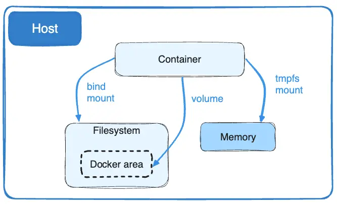

+++
title = "tmpfs mounts"
date = 2024-10-23T14:54:40+08:00
weight = 20
type = "docs"
description = ""
isCJKLanguage = true
draft = false
+++

> 原文：[https://docs.docker.com/engine/storage/tmpfs/](https://docs.docker.com/engine/storage/tmpfs/)
>
> 收录该文档的时间：`2024-10-23T14:54:40+08:00`

# tmpfs mounts - tmpfs 挂载

[Volumes]() and [bind mounts]() let you share files between the host machine and container so that you can persist data even after the container is stopped.

​	[卷]()和[绑定挂载]()允许在主机和容器之间共享文件，因此即使容器停止后也可以持久化数据。

If you're running Docker on Linux, you have a third option: `tmpfs` mounts. When you create a container with a `tmpfs` mount, the container can create files outside the container's writable layer.

​	如果在 Linux 上运行 Docker，你可以选择第三种选项：`tmpfs` 挂载。当你创建带有 `tmpfs` 挂载的容器时，容器可以在其可写层之外创建文件。

As opposed to volumes and bind mounts, a `tmpfs` mount is temporary, and only persisted in the host memory. When the container stops, the `tmpfs` mount is removed, and files written there won't be persisted.

​	与卷和绑定挂载不同，`tmpfs` 挂载是临时的，仅在主机内存中保留。当容器停止时，`tmpfs` 挂载被移除，写入其中的文件不会持久化。



This is useful to temporarily store sensitive files that you don't want to persist in either the host or the container writable layer.

​	这对于临时存储敏感文件很有用，因为你可能不希望这些文件在主机或容器的可写层中持久保存。

## tmpfs 挂载的限制 Limitations of tmpfs mounts

- Unlike volumes and bind mounts, you can't share `tmpfs` mounts between containers.
  - 与卷和绑定挂载不同，`tmpfs` 挂载无法在多个容器之间共享。

- This functionality is only available if you're running Docker on Linux.
  - 此功能仅在 Linux 上运行的 Docker 可用。

- Setting permissions on tmpfs may cause them to [reset after container restart](https://github.com/docker/for-linux/issues/138). In some cases [setting the uid/gid](https://github.com/docker/compose/issues/3425#issuecomment-423091370) can serve as a workaround.
  - 设置 tmpfs 权限可能会导致[在容器重启后重置](https://github.com/docker/for-linux/issues/138)。在某些情况下，可以[设置 uid/gid](https://github.com/docker/compose/issues/3425#issuecomment-423091370)来解决。

## Choose the `--tmpfs` or `--mount` flag

In general, `--mount` is more explicit and verbose. The biggest difference is that the `--tmpfs` flag does not support any configurable options.

​	一般来说，`--mount` 更加明确和详尽。两者的主要区别在于 `--tmpfs` 标志不支持任何可配置选项。

- `--tmpfs`: Mounts a `tmpfs` mount without allowing you to specify any configurable options, and can only be used with standalone containers.
  - `--tmpfs`：挂载 `tmpfs`，但不允许指定任何可配置选项，仅用于独立容器。

- `--mount`: Consists of multiple key-value pairs, separated by commas and each consisting of a `<key>=<value>` tuple. The `--mount` syntax is more verbose than `--tmpfs`: `--mount`：包含多个键值对，用逗号分隔，每个由 `<key>=<value>` 组成。`--mount` 语法比 `--tmpfs` 更详细：
  - The `type` of the mount, which can be [`bind`](), `volume`, or [`tmpfs`](). This topic discusses `tmpfs`, so the type is always `tmpfs`.
    - `type`：挂载类型，可为[`bind`]()、`volume` 或 [`tmpfs`]()。此处使用 `tmpfs`。
  - The `destination` takes as its value the path where the `tmpfs` mount is mounted in the container. May be specified as `destination`, `dst`, or `target`.
    - `destination`：tmpfs 挂载在容器中的路径，可使用 `destination`、`dst` 或 `target`。
  - The `tmpfs-size` and `tmpfs-mode` options. See [tmpfs options](#指定-tmpfs-选项-specify-tmpfs-options).
    - `tmpfs-size` 和 `tmpfs-mode` 选项。详见 [tmpfs 选项](#指定-tmpfs-选项-specify-tmpfs-options)。

The examples below show both the `--mount` and `--tmpfs` syntax where possible, and `--mount` is presented first.

​	以下示例展示了 `--mount` 和 `--tmpfs` 语法的用法，首选 `--mount`。

### Differences between `--tmpfs` and `--mount` behavior

- The `--tmpfs` flag does not allow you to specify any configurable options.
  - `--tmpfs` 标志不允许指定任何可配置选项。

- The `--tmpfs` flag cannot be used with swarm services. You must use `--mount`.
  - `--tmpfs` 标志不能与 swarm 服务一起使用。必须使用 `--mount`。

## 在容器中使用 tmpfs 挂载 Use a tmpfs mount in a container

To use a `tmpfs` mount in a container, use the `--tmpfs` flag, or use the `--mount` flag with `type=tmpfs` and `destination` options. There is no `source` for `tmpfs` mounts. The following example creates a `tmpfs` mount at `/app` in a Nginx container. The first example uses the `--mount` flag and the second uses the `--tmpfs` flag.

​	在容器中使用 `tmpfs` 挂载，可以使用 `--tmpfs` 标志，或使用 `--mount` 标志并设置 `type=tmpfs` 和 `destination` 选项。`tmpfs` 挂载没有 `source`。以下示例在 Nginx 容器中创建了一个挂载在 `/app` 的 `tmpfs`。第一个示例使用 `--mount` 标志，第二个使用 `--tmpfs`。



{}

```console
 docker run -d \
  -it \
  --name tmptest \
  --mount type=tmpfs,destination=/app \
  nginx:latest
```

{}

{}

```console
 docker run -d \
  -it \
  --name tmptest \
  --tmpfs /app \
  nginx:latest
```

{}



------

Verify that the mount is a `tmpfs` mount by looking in the `Mounts` section of the `docker inspect` output:

​	通过查看 `docker inspect` 输出中的 `Mounts` 部分，验证挂载是否为 `tmpfs` 类型：

```console
$ docker inspect tmptest --format '{{ json .Mounts }}'
[{"Type":"tmpfs","Source":"","Destination":"/app","Mode":"","RW":true,"Propagation":""}]
```

Stop and remove the container:

​	停止并删除容器：

```console
$ docker stop tmptest
$ docker rm tmptest
```

### 指定 tmpfs 选项 Specify tmpfs options

`tmpfs` mounts allow for two configuration options, neither of which is required. If you need to specify these options, you must use the `--mount` flag, as the `--tmpfs` flag does not support them.

​	`tmpfs` 挂载支持两个配置选项，均为可选。如果需要指定这些选项，必须使用 `--mount` 标志，因为 `--tmpfs` 不支持它们。

| Option       | Description                                                  |
| :----------- | :----------------------------------------------------------- |
| `tmpfs-size` | Size of the tmpfs mount in bytes. If unset, the default maximum size of a tmpfs volume is 50% of the host's total RAM. tmpfs 挂载的大小（以字节为单位）。默认最大大小为主机总 RAM 的 50%。 |
| `tmpfs-mode` | File mode of the tmpfs in octal. For instance, `700` or `0770`. Defaults to `1777` or world-writable. tmpfs 的文件模式，采用八进制格式。例如 `700` 或 `0770`。默认为 `1777`。 |

The following example sets the `tmpfs-mode` to `1770`, so that it is not world-readable within the container.

​	以下示例将 `tmpfs-mode` 设置为 `1770`，使其在容器中不可被全局读取。


```console
docker run -d \
  -it \
  --name tmptest \
  --mount type=tmpfs,destination=/app,tmpfs-mode=1770 \
  nginx:latest
```

> 个人注释
>
> ​	在 Docker 的 `tmpfs` 挂载中，权限（file mode）采用**八进制（octal）表示法**。权限模式如 `0700` 和 `1777` 用来控制谁可以读取、写入或执行目录中的文件。这些数字表示不同的用户角色权限，通过位（bit）来控制权限。
>
> ### 权限模式的结构
>
> ​	权限模式由四个数字组成，格式是：`_ _ _ _`，每个数字代表三位二进制数，用于控制不同用户组的权限。具体格式如下：
>
> - **第一个数字**（特殊权限位）：表示特殊权限（如粘滞位、SUID 和 SGID）。
>
> - **后三个数字**（用户权限）：依次表示所有者、所属组和其他用户的权限。
>
>   每个位的含义：
>
> | 位         | 含义                                      |
> | ---------- | ----------------------------------------- |
> | 1          | 执行（execute）权限                       |
> | 2          | 写入（write）权限                         |
> | 4          | 读取（read）权限                          |
> | 特殊权限位 | 控制粘滞位（sticky bit）、SUID、SGID 权限 |
>
> ### 解析权限模式的位
>
> - **前三位（特殊权限位）**：用于控制 SUID、SGID 和粘滞位。
>   - **1** 表示设置粘滞位（sticky bit），通常用于共享目录。
>   - **2** 表示设置 SGID（Set Group ID）。
>   - **4** 表示设置 SUID（Set User ID）。
> - **后三位**：分别为所有者、组用户和其他用户的权限。
>   - 每个位组合成一个八进制数，用来表示读、写、执行的组合权限。
>
> ### 示例解释：`0700` 和 `1777`
>
> #### 1. `0700`
>
> - **第一个数字 `0`**：没有特殊权限位。
>
> - 后面的三个数字 `700`：表示所有者、组用户、其他用户的权限。
>
>   - `7`（即 `111`）：所有者有读（4）、写（2）、执行（1）权限，总和为 `4+2+1=7`。
>   - `0`（即 `000`）：组用户没有任何权限。
>   - `0`（即 `000`）：其他用户没有任何权限。
>
>   **总结**：`0700` 表示只有所有者可以读、写、执行，组用户和其他用户没有权限。
>
> #### 2. `1777`
>
> - **第一个数字 `1`**：设置粘滞位（sticky bit）。
>
> - 后面的三个数字 `777`：表示所有者、组用户、其他用户的权限。
>
>   - `7`（即 `111`）：所有者有读、写、执行权限。
>   - `7`（即 `111`）：组用户有读、写、执行权限。
>   - `7`（即 `111`）：其他用户有读、写、执行权限。
>
>   **总结**：`1777` 表示目录对所有人可读、写、执行，但由于启用了粘滞位，只有文件的所有者或目录的所有者可以删除文件或目录内的文件。
>
> ### 总结
>
> - **0700**：仅所有者可以访问，组用户和其他用户没有权限。
> - **1777**：所有用户都有读、写、执行权限，且启用了粘滞位，通常用于共享目录，防止用户互相删除文件。

> 个人注释
>
> ​	**请进一步解释下特殊权限位**
>
> ​	在 Unix 和 Linux 文件权限系统中，**特殊权限位（Special Permissions）**是权限模式的第一个数字（如 `1777` 中的 `1`），用于设置特定的行为，包括**粘滞位（Sticky Bit）**、**SUID（Set User ID）**和**SGID（Set Group ID）**。这些特殊权限位为文件和目录提供了额外的控制机制，具体含义如下：
>
> ### 1. 粘滞位（Sticky Bit）
>
> - **符号**：`1`，表示在权限模式的第一个数字位置，如 `1777`。
>
> - **作用**：主要用于**目录**，可以防止非所有者删除目录中的文件或子目录。
>
> - **适用场景**：当目录对多个用户开放读写权限时（如 `/tmp`），粘滞位确保只有文件的所有者或目录的所有者可以删除文件。
>
>   **示例**：
>
>   ```ah
>   chmod 1777 /path/to/directory
>   ```
>
>   在 `1777` 中，`1` 表示启用粘滞位，`777` 表示该目录对所有用户可读、写、执行。
>
> - **实际效果**：对于一个设置了粘滞位的目录（如 `/tmp`），所有用户可以在该目录中创建文件，但只有文件的所有者或目录的所有者可以删除文件。
>
> ### 2. SUID（Set User ID）
>
> - **符号**：`4`，表示在权限模式的第一个数字位置，如 `4755`。
>
> - **作用**：用于**可执行文件**，设置了 SUID 的可执行文件在运行时会以**文件所有者的权限**来运行，而不是执行该文件的用户权限。
>
> - **适用场景**：SUID 常用于系统命令和应用程序，例如 `passwd` 命令，确保即使普通用户运行该命令，也能以 `root` 用户权限访问系统文件。
>
>   **示例**：
>
>   ```sh
>   chmod 4755 /path/to/file
>   ```
>
>   在 `4755` 中，`4` 表示启用 SUID，`755` 表示所有者可以读、写、执行，而组用户和其他用户可以读、执行。
>
> - **实际效果**：当普通用户执行 SUID 文件时，操作系统会以文件所有者的身份执行文件操作，而不是执行用户的身份。这种权限非常强大，因此设置 SUID 需要小心，以防权限滥用。
>
> ### 3. SGID（Set Group ID）
>
> - **符号**：`2`，表示在权限模式的第一个数字位置，如 `2755`。
>
> - **作用**：可以用于**目录**和**可执行文件**，在不同对象中行为不同：
>
>   - **目录**：新创建的文件或目录会自动继承该目录的组权限，而不是创建者的组权限。这对于共享目录非常有用，确保目录内文件的组归属一致。
>   - **可执行文件**：当文件设置了 SGID 权限时，用户在执行该文件时会临时获得文件组的权限。
>
> - **适用场景**：在共享目录中确保组一致性，或在特定应用中临时提升权限。
>
>   **示例**：
>
>   ```sh
>   chmod 2755 /path/to/directory_or_file
>   ```
>
>   在 `2755` 中，`2` 表示启用 SGID，`755` 表示所有者可以读、写、执行，而组用户和其他用户可以读、执行。
>
> - **实际效果**：
>
>   - **目录**：在一个设置了 SGID 的目录中创建文件时，文件会自动继承该目录的组，而不是创建者的默认组。
>   - **可执行文件**：文件会在执行时以文件组的权限执行。
>
> ### 特殊权限的组合使用
>
> 特殊权限位的数值可以组合，比如 `7` 代表 SUID + SGID + 粘滞位，可以将这些权限组合起来：
>
> - **`1777`**：粘滞位 + 目录对所有用户可读、写、执行。
> - **`4755`**：SUID + 所有者可读、写、执行，组用户和其他用户可读、执行。
> - **`2755`**：SGID + 所有者可读、写、执行，组用户和其他用户可读、执行。
> - **`6755`**：SUID + SGID + 所有者可读、写、执行，组用户和其他用户可读、执行。
>
> ### 总结
>
> - **粘滞位**：常用于共享目录，防止用户间的文件删除冲突。
> - **SUID**：用于文件执行时以文件所有者身份执行的权限提升。
> - **SGID**：在目录中用于文件组继承，在文件中用于执行时获得文件组权限。
>
> 每个特殊权限位提供了针对特定情境的控制功能，因此，在需要更高的权限管理时可以合理使用这些特殊权限，但同时也要注意安全风险，避免权限滥用。

## 接下来 Next steps

- Learn about [volumes]()
  - 了解更多关于[卷]()的信息。
- Learn about [bind mounts]()
  - 了解更多关于[绑定挂载]()的信息。
- Learn about [storage drivers]()
  - 了解更多关于[存储驱动]()的信息。
