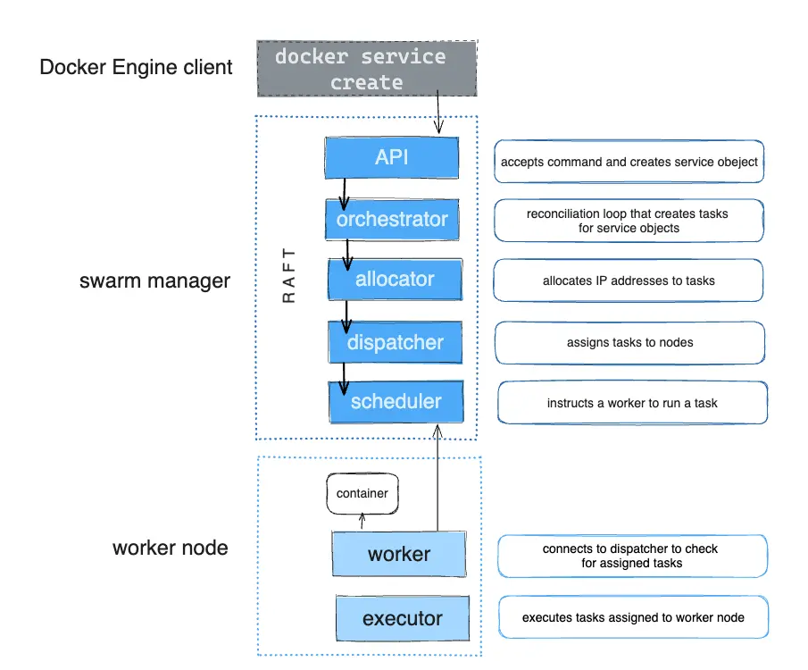
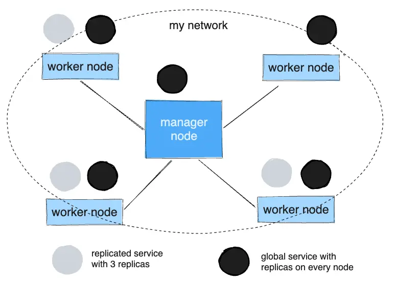

+++
title = "服务的工作原理"
date = 2024-10-23T14:54:40+08:00
weight = 10
type = "docs"
description = ""
isCJKLanguage = true
draft = false

+++

> 原文：[https://docs.docker.com/engine/swarm/how-swarm-mode-works/services/](https://docs.docker.com/engine/swarm/how-swarm-mode-works/services/)
>
> 收录该文档的时间：`2024-10-23T14:54:40+08:00`

# How services work - 服务的工作原理

To deploy an application image when Docker Engine is in Swarm mode, you create a service. Frequently a service is the image for a microservice within the context of some larger application. Examples of services might include an HTTP server, a database, or any other type of executable program that you wish to run in a distributed environment.

​	当 Docker 引擎处于 Swarm 模式时，要部署应用镜像，你需要创建一个服务。通常，服务是一个更大应用中的微服务镜像。例如，服务可以是 HTTP 服务器、数据库或其他希望在分布式环境中运行的可执行程序。

When you create a service, you specify which container image to use and which commands to execute inside running containers. You also define options for the service including:

​	在创建服务时，需要指定使用的容器镜像和在运行容器内执行的命令。此外，你还可以为服务定义选项，包括：

- The port where the swarm makes the service available outside the swarm
  - Swarm 在 Swarm 外部提供该服务的端口

- An overlay network for the service to connect to other services in the swarm
  - 服务用于连接 Swarm 内其他服务的覆盖网络

- CPU and memory limits and reservations
  - CPU 和内存限制及保留

- A rolling update policy
  - 滚动更新策略

- The number of replicas of the image to run in the swarm
  - 滚动更新策略

## 服务、任务和容器 Services, tasks, and containers

When you deploy the service to the swarm, the swarm manager accepts your service definition as the desired state for the service. Then it schedules the service on nodes in the swarm as one or more replica tasks. The tasks run independently of each other on nodes in the swarm.

​	当你将服务部署到 Swarm 时，Swarm 管理器会将你的服务定义视为该服务的期望状态。然后，它会在 Swarm 中的节点上调度该服务为一个或多个副本任务。任务在 Swarm 中的节点上独立运行。

For example, imagine you want to load balance between three instances of an HTTP listener. The diagram below shows an HTTP listener service with three replicas. Each of the three instances of the listener is a task in the swarm.

​	例如，假设你希望在三个 HTTP 监听实例之间进行负载均衡。下图显示了一个包含三个副本的 HTTP 监听服务。监听器的每个实例都是 Swarm 中的一个任务。

A container is an isolated process. In the Swarm mode model, each task invokes exactly one container. A task is analogous to a “slot” where the scheduler places a container. Once the container is live, the scheduler recognizes that the task is in a running state. If the container fails health checks or terminates, the task terminates.

​	容器是一个隔离的进程。在 Swarm 模式模型中，每个任务都启动一个容器。任务类似于调度器放置容器的“槽位”。容器启动后，调度器识别该任务处于运行状态。如果容器未通过健康检查或终止，则任务也会终止。

## 任务和调度 Tasks and scheduling

A task is the atomic unit of scheduling within a swarm. When you declare a desired service state by creating or updating a service, the orchestrator realizes the desired state by scheduling tasks. For instance, you define a service that instructs the orchestrator to keep three instances of an HTTP listener running at all times. The orchestrator responds by creating three tasks. Each task is a slot that the scheduler fills by spawning a container. The container is the instantiation of the task. If an HTTP listener task subsequently fails its health check or crashes, the orchestrator creates a new replica task that spawns a new container.

​	任务是 Swarm 内部调度的最小单位。当你通过创建或更新服务来声明期望的服务状态时，编排器通过调度任务来实现期望的状态。例如，你定义了一个服务，指示编排器始终保持三个 HTTP 监听实例处于运行状态。编排器会响应地创建三个任务。每个任务是一个“槽位”，调度器通过启动一个容器来填充这个槽位。容器是任务的具体实现。如果某个 HTTP 监听任务随后未通过健康检查或崩溃，编排器会创建一个新的副本任务以启动新的容器。

A task is a one-directional mechanism. It progresses monotonically through a series of states: assigned, prepared, running, etc. If the task fails, the orchestrator removes the task and its container and then creates a new task to replace it according to the desired state specified by the service.

​	任务是一个单向机制，它会按顺序经过一系列状态：分配、准备、运行等。如果任务失败，编排器会移除任务及其容器，然后根据服务的期望状态创建一个新任务来替换它。

The underlying logic of Docker's Swarm mode is a general purpose scheduler and orchestrator. The service and task abstractions themselves are unaware of the containers they implement. Hypothetically, you could implement other types of tasks such as virtual machine tasks or non-containerized process tasks. The scheduler and orchestrator are agnostic about the type of the task. However, the current version of Docker only supports container tasks.

​	Docker Swarm 模式的底层逻辑是通用调度器和编排器。服务和任务的抽象本身与它们实现的容器无关。理论上，你可以实现其他类型的任务，如虚拟机任务或非容器化的进程任务。调度器和编排器对任务的类型保持中立。然而，目前的 Docker 版本仅支持容器任务。

The diagram below shows how Swarm mode accepts service create requests and schedules tasks to worker nodes.

​	下图展示了 Swarm 模式如何接受服务创建请求并将任务调度到工作节点。

### 挂起的服务 Pending services

A service may be configured in such a way that no node currently in the swarm can run its tasks. In this case, the service remains in state `pending`. Here are a few examples of when a service might remain in state `pending`.

​	某些情况下，服务的配置可能使当前 Swarm 中的节点无法运行其任务。在这种情况下，服务会保持 `pending`（挂起）状态。以下是服务可能保持 `pending` 状态的一些示例：

> **Tip**
>
> If your only intention is to prevent a service from being deployed, scale the service to 0 instead of trying to configure it in such a way that it remains in `pending`.
>
> ​	如果你的目的是防止服务被部署，可以将服务扩容至 0，而不是试图通过配置使其保持在 `pending` 状态。

- If all nodes are paused or drained, and you create a service, it is pending until a node becomes available. In reality, the first node to become available gets all of the tasks, so this is not a good thing to do in a production environment.
  - 如果所有节点都处于暂停或撤空状态，创建的服务会保持挂起状态，直到有节点可用。在实际中，第一个可用的节点会获得所有任务，这在生产环境中并不合适。

- You can reserve a specific amount of memory for a service. If no node in the swarm has the required amount of memory, the service remains in a pending state until a node is available which can run its tasks. If you specify a very large value, such as 500 GB, the task stays pending forever, unless you really have a node which can satisfy it.
  - 你可以为服务预留特定的内存量。如果 Swarm 中的节点没有所需的内存，服务将保持挂起状态，直到有节点能够运行其任务。如果指定了一个非常大的值，例如 500 GB，任务会永远保持挂起，除非你确实有节点可以满足该需求。

- You can impose placement constraints on the service, and the constraints may not be able to be honored at a given time.
  - 你可以对服务设置放置约束，但这些约束在特定时间可能无法实现。

This behavior illustrates that the requirements and configuration of your tasks are not tightly tied to the current state of the swarm. As the administrator of a swarm, you declare the desired state of your swarm, and the manager works with the nodes in the swarm to create that state. You do not need to micro-manage the tasks on the swarm.

​	这种行为说明任务的需求和配置与 Swarm 的当前状态并没有紧密耦合。作为 Swarm 的管理员，你只需声明 Swarm 的期望状态，管理器会与 Swarm 中的节点协作来实现这一状态。无需对 Swarm 上的任务进行微管理。

## 副本服务和全局服务 Replicated and global services

There are two types of service deployments, replicated and global.

​	服务部署分为两种类型：副本服务和全局服务。

For a replicated service, you specify the number of identical tasks you want to run. For example, you decide to deploy an HTTP service with three replicas, each serving the same content.

​	对于副本服务，你可以指定希望运行的相同任务数量。例如，你可以决定部署一个具有三个副本的 HTTP 服务，每个副本提供相同的内容。

A global service is a service that runs one task on every node. There is no pre-specified number of tasks. Each time you add a node to the swarm, the orchestrator creates a task and the scheduler assigns the task to the new node. Good candidates for global services are monitoring agents, anti-virus scanners or other types of containers that you want to run on every node in the swarm.

​	全局服务则是在每个节点上运行一个任务的服务。无需预先指定任务数量。每当向 Swarm 添加节点时，编排器会创建一个任务，调度器会将任务分配给新节点。适合用作全局服务的包括监控代理、病毒扫描器或希望在 Swarm 中每个节点上运行的其他类型容器。

The diagram below shows a three-service replica in gray and a global service in black.

​	下图中，灰色表示三服务副本，黑色表示全局服务。

## Learn more

- Read about how Swarm mode [nodes]() work.
  - 阅读 Swarm 模式中 [节点]() 的工作原理。
- Learn how [PKI]() works in Swarm mode.
  - 了解 Swarm 模式中的 [PKI]() 的工作方式。
