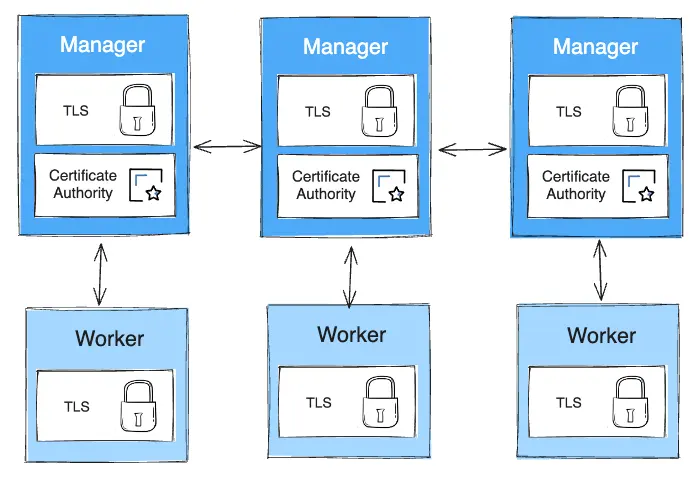

+++
title = "使用公钥基础设施 (PKI) 管理 Swarm 安全性"
date = 2024-10-23T14:54:40+08:00
weight = 20
type = "docs"
description = ""
isCJKLanguage = true
draft = false

+++

> 原文：[https://docs.docker.com/engine/swarm/how-swarm-mode-works/pki/](https://docs.docker.com/engine/swarm/how-swarm-mode-works/pki/)
>
> 收录该文档的时间：`2024-10-23T14:54:40+08:00`

# Manage swarm security with public key infrastructure (PKI) - 使用公钥基础设施 (PKI) 管理 Swarm 安全性

The Swarm mode public key infrastructure (PKI) system built into Docker makes it simple to securely deploy a container orchestration system. The nodes in a swarm use mutual Transport Layer Security (TLS) to authenticate, authorize, and encrypt the communications with other nodes in the swarm.

​	Docker 内置的 Swarm 模式公钥基础设施 (PKI) 系统使得部署容器编排系统变得更加简单安全。Swarm 中的节点使用双向传输层安全 (TLS) 来对 Swarm 内的其他节点进行身份验证、授权和通信加密。

When you create a swarm by running `docker swarm init`, Docker designates itself as a manager node. By default, the manager node generates a new root Certificate Authority (CA) along with a key pair, which are used to secure communications with other nodes that join the swarm. If you prefer, you can specify your own externally-generated root CA, using the `--external-ca` flag of the [docker swarm init]() command.

​	当你运行 `docker swarm init` 来创建 Swarm 时，Docker 将自身指定为管理节点。默认情况下，管理节点会生成一个新的根证书颁发机构 (CA) 以及一个密钥对，用于与其他加入 Swarm 的节点进行安全通信。如果你愿意，可以使用 [docker swarm init]() 命令的 `--external-ca` 参数指定你自己的外部生成的根 CA。

The manager node also generates two tokens to use when you join additional nodes to the swarm: one worker token and one manager token. Each token includes the digest of the root CA's certificate and a randomly generated secret. When a node joins the swarm, the joining node uses the digest to validate the root CA certificate from the remote manager. The remote manager uses the secret to ensure the joining node is an approved node.

​	管理节点还会生成两个用于加入 Swarm 的节点令牌：一个工作节点令牌和一个管理节点令牌。每个令牌都包含根 CA 证书的摘要和一个随机生成的密钥。当节点加入 Swarm 时，加入的节点会使用摘要来验证来自远程管理节点的根 CA 证书，远程管理节点使用密钥来确保加入节点是经过批准的。

Each time a new node joins the swarm, the manager issues a certificate to the node. The certificate contains a randomly generated node ID to identify the node under the certificate common name (CN) and the role under the organizational unit (OU). The node ID serves as the cryptographically secure node identity for the lifetime of the node in the current swarm.

​	每当新节点加入 Swarm，管理节点会为该节点颁发证书。该证书包含一个随机生成的节点 ID，以证书的通用名称 (CN) 标识节点，并以组织单位 (OU) 标识节点的角色。节点 ID 作为当前 Swarm 中节点的加密安全身份，在整个节点生命周期内有效。

The diagram below illustrates how manager nodes and worker nodes encrypt communications using a minimum of TLS 1.2.

​	下图展示了管理节点和工作节点如何使用至少 TLS 1.2 来加密通信。



The example below shows the information from a certificate from a worker node:

​	以下示例显示了来自工作节点的证书信息：

```none
Certificate:
    Data:
        Version: 3 (0x2)
        Serial Number:
            3b:1c:06:91:73:fb:16:ff:69:c3:f7:a2:fe:96:c1:73:e2:80:97:3b
        Signature Algorithm: ecdsa-with-SHA256
        Issuer: CN=swarm-ca
        Validity
            Not Before: Aug 30 02:39:00 2016 GMT
            Not After : Nov 28 03:39:00 2016 GMT
        Subject: O=ec2adilxf4ngv7ev8fwsi61i7, OU=swarm-worker, CN=dw02poa4vqvzxi5c10gm4pq2g
...snip...
```

By default, each node in the swarm renews its certificate every three months. You can configure this interval by running the `docker swarm update --cert-expiry <TIME PERIOD>` command. The minimum rotation value is 1 hour. Refer to the [docker swarm update]() CLI reference for details.

​	默认情况下，Swarm 中的每个节点每三个月更新一次其证书。可以通过运行 `docker swarm update --cert-expiry <时间周期>` 命令来配置此间隔，最小旋转值为 1 小时。详情请参阅 [docker swarm update]() CLI 参考。

## 轮换 CA 证书 Rotating the CA certificate

> **Note**
>
> 
>
> Mirantis Kubernetes Engine (MKE), formerly known as Docker UCP, provides an external certificate manager service for the swarm. If you run swarm on MKE, you shouldn't rotate the CA certificates manually. Instead, contact Mirantis support if you need to rotate a certificate.
>
> ​	Mirantis Kubernetes Engine (MKE)，前称 Docker UCP，为 Swarm 提供了外部证书管理服务。如果你在 MKE 上运行 Swarm，请勿手动轮换 CA 证书。如需轮换证书，请联系 Mirantis 支持。

In the event that a cluster CA key or a manager node is compromised, you can rotate the swarm root CA so that none of the nodes trust certificates signed by the old root CA anymore.

​	在集群 CA 密钥或管理节点被入侵的情况下，可以轮换 Swarm 根 CA，使节点不再信任旧根 CA 签署的证书。

Run `docker swarm ca --rotate` to generate a new CA certificate and key. If you prefer, you can pass the `--ca-cert` and `--external-ca` flags to specify the root certificate and to use a root CA external to the swarm. Alternately, you can pass the `--ca-cert` and `--ca-key` flags to specify the exact certificate and key you would like the swarm to use.

​	运行 `docker swarm ca --rotate` 生成新的 CA 证书和密钥。也可以使用 `--ca-cert` 和 `--external-ca` 参数指定根证书，并使用 Swarm 之外的根 CA。或者，也可以通过 `--ca-cert` 和 `--ca-key` 参数来指定 Swarm 使用的确切证书和密钥。

When you issue the `docker swarm ca --rotate` command, the following things happen in sequence:

​	当你执行 `docker swarm ca --rotate` 命令时，按以下顺序发生：

1. Docker generates a cross-signed certificate. This means that a version of the new root CA certificate is signed with the old root CA certificate. This cross-signed certificate is used as an intermediate certificate for all new node certificates. This ensures that nodes that still trust the old root CA can still validate a certificate signed by the new CA. Docker 生成一个交叉签名证书。这意味着新根 CA 证书的一个版本由旧根 CA 签署。此交叉签名证书作为所有新节点证书的中间证书。这样做确保了仍信任旧根 CA 的节点可以继续验证新 CA 签署的证书。

2. Docker also tells all nodes to immediately renew their TLS certificates. This process may take several minutes, depending on the number of nodes in the swarm. Docker 告诉所有节点立即更新其 TLS 证书。此过程可能需要几分钟，具体取决于 Swarm 中节点的数量。

3. After every node in the swarm has a new TLS certificate signed by the new CA, Docker forgets about the old CA certificate and key material, and tells all the nodes to trust the new CA certificate only. 在 Swarm 中的每个节点都拥有由新 CA 签署的新 TLS 证书后，Docker 会删除旧 CA 证书和密钥材料，并指示所有节点仅信任新 CA 证书。

   This also causes a change in the swarm's join tokens. The previous join tokens are no longer valid.
   
   ​	这也导致 Swarm 的加入令牌发生更改。之前的加入令牌不再有效。

From this point on, all new node certificates issued are signed with the new root CA, and do not contain any intermediates.

​	从此时起，所有新颁发的节点证书都由新根 CA 签署，并且不包含任何中间证书。

## Learn More

- Read about how [nodes]() work.
  - 阅读 Swarm 模式中 [节点]() 的工作原理。
- Learn how Swarm mode [services]() work.
  - 了解 Swarm 模式中 [服务]() 的工作原理。
