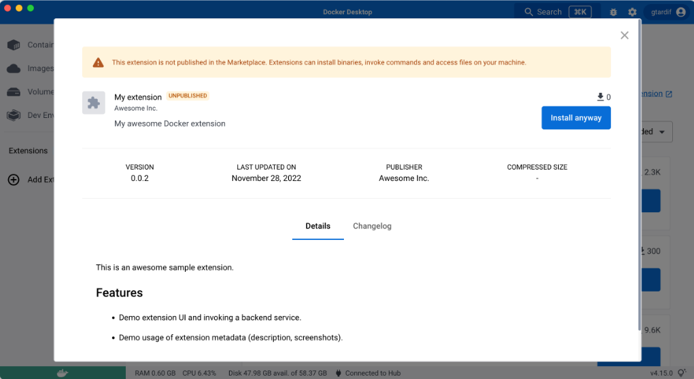
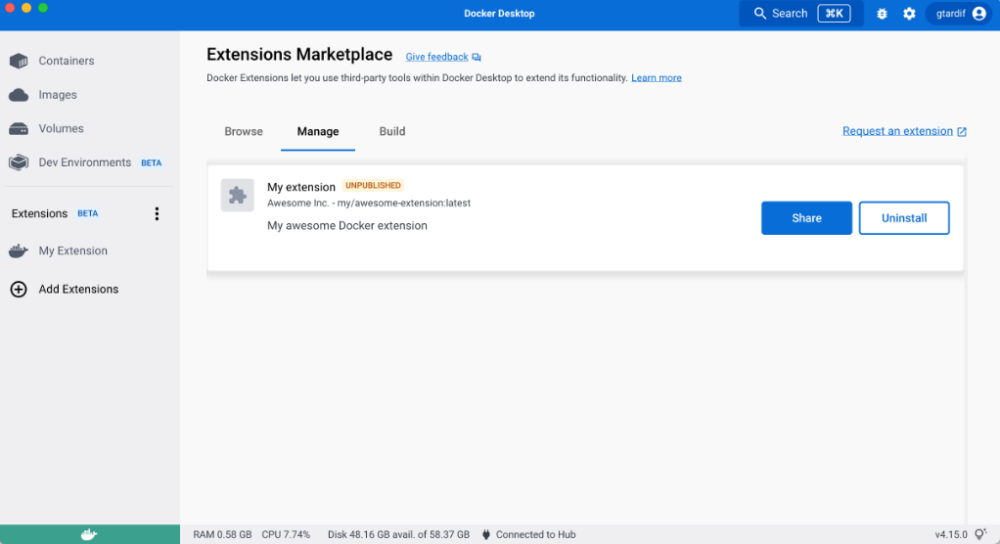

+++
title = "Share your extension"
date = 2024-10-23T14:54:40+08:00
weight = 30
type = "docs"
description = ""
isCJKLanguage = true
draft = false
+++

> 原文：[https://docs.docker.com/extensions/extensions-sdk/extensions/share/](https://docs.docker.com/extensions/extensions-sdk/extensions/share/)
>
> 收录该文档的时间：`2024-10-23T14:54:40+08:00`

# Share your extension

Once your extension image is accessible on Docker Hub, anyone with access to the image can install the extension.

People can install your extension by typing `docker extension install my/awesome-extension:latest` in to the terminal.

However, this option doesn't provide a preview of the extension before it's installed.

## Createa a share URL

Docker lets you share your extensions using a URL.

When people navigate to this URL, it opens Docker Desktop and displays a preview of your extension in the same way as an extension in the Marketplace. From the preview, users can then select **Install**.



To generate this link you can either:

- Run the following command:

  

  ```console
  $ docker extension share my/awesome-extension:0.0.1
  ```

- Once you have installed your extension locally, navigate to the **Manage** tab and select **Share**.

  

> **Note**
>
> 
>
> Previews of the extension description or screenshots, for example, are created using [extension labels]().
