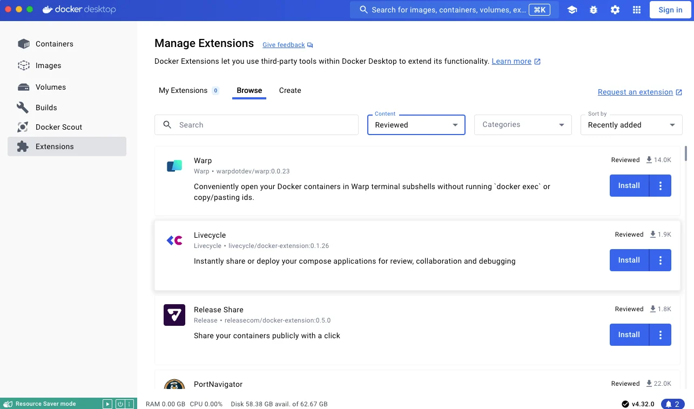

+++
title = "Docker Extensions"
date = 2024-10-23T14:54:40+08:00
weight = 50
type = "docs"
description = ""
isCJKLanguage = true
draft = false
+++

> 原文：[https://docs.docker.com/extensions/](https://docs.docker.com/extensions/)
>
> 收录该文档的时间：`2024-10-23T14:54:40+08:00`

# Overview of Docker Extensions

Docker Extensions let you use third-party tools within Docker Desktop to extend its functionality.

You can seamlessly connect your favorite development tools to your application development and deployment workflows. Augment Docker Desktop with debugging, testing, security, and networking functionalities, and create custom add-ons using the Extensions [SDK]().

Anyone can use Docker Extensions and there is no limit to the number of extensions you can install.

## What extensions are available?

There is a mix of partner and community-built extensions and Docker-built extensions. You can explore the list of available extensions in [Docker Hub](https://hub.docker.com/search?q=&type=extension) or in the Extensions Marketplace within Docker Desktop.

To find out more about Docker Extensions, we recommend the video walkthrough from DockerCon 2022:

<iframe width="750" height="315" src="https://www.youtube.com/embed/3rAGXS8pszQ" title="YouTube video player" frameborder="0" allow="accelerometer; autoplay; clipboard-write; encrypted-media; gyroscope; picture-in-picture" allowfullscreen="" style="--tw-border-spacing-x: 0; --tw-border-spacing-y: 0; --tw-translate-x: 0; --tw-translate-y: 0; --tw-rotate: 0; --tw-skew-x: 0; --tw-skew-y: 0; --tw-scale-x: 1; --tw-scale-y: 1; --tw-pan-x: ; --tw-pan-y: ; --tw-pinch-zoom: ; --tw-scroll-snap-strictness: proximity; --tw-gradient-from-position: ; --tw-gradient-via-position: ; --tw-gradient-to-position: ; --tw-ordinal: ; --tw-slashed-zero: ; --tw-numeric-figure: ; --tw-numeric-spacing: ; --tw-numeric-fraction: ; --tw-ring-inset: ; --tw-ring-offset-width: 0px; --tw-ring-offset-color: #fff; --tw-ring-color: rgb(59 130 246 / 0.5); --tw-ring-offset-shadow: 0 0 #0000; --tw-ring-shadow: 0 0 #0000; --tw-shadow: 0 0 #0000; --tw-shadow-colored: 0 0 #0000; --tw-blur: ; --tw-brightness: ; --tw-contrast: ; --tw-grayscale: ; --tw-hue-rotate: ; --tw-invert: ; --tw-saturate: ; --tw-sepia: ; --tw-drop-shadow: ; --tw-backdrop-blur: ; --tw-backdrop-brightness: ; --tw-backdrop-contrast: ; --tw-backdrop-grayscale: ; --tw-backdrop-hue-rotate: ; --tw-backdrop-invert: ; --tw-backdrop-opacity: ; --tw-backdrop-saturate: ; --tw-backdrop-sepia: ; --tw-contain-size: ; --tw-contain-layout: ; --tw-contain-paint: ; --tw-contain-style: ; box-sizing: border-box; border-width: 0px; border-style: solid; border-color: initial; display: block; vertical-align: middle; margin-bottom: 0px;"></iframe>

