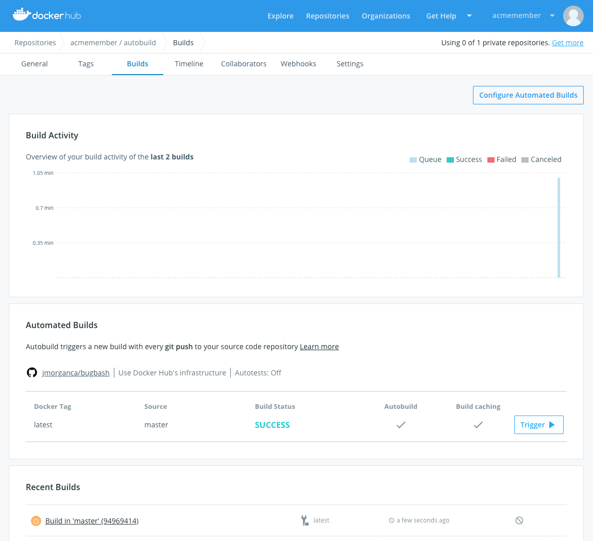

+++
title = "How Automated builds work"
date = 2024-10-23T14:54:40+08:00
weight = 30
type = "docs"
description = ""
isCJKLanguage = true
draft = false
+++

> 原文: [https://docs.docker.com/docker-hub/builds/how-builds-work/](https://docs.docker.com/docker-hub/builds/how-builds-work/)
>
> 收录该文档的时间：`2024-10-23T14:54:40+08:00`

# How Automated builds work

> **Note**
>
> 
>
> Automated builds require a [Docker Pro, Team, or Business subscription](https://docs.docker.com/subscription/).

Docker Hub can automatically build images from source code in an external repository and automatically push the built image to your Docker repositories.

When you set up Automated builds, also called autobuilds, you create a list of branches and tags that you want to build into Docker images. When you push code to a source-code branch, for example in GitHub, for one of those listed image tags, the push uses a webhook to trigger a new build, which produces a Docker image. The built image is then pushed to Docker Hub.

> **Note**
>
> 
>
> You can still use `docker push` to push pre-built images to repositories with Automated builds configured.

If you have automated tests configured, these run after building but before pushing to the registry. You can use these tests to create a continuous integration workflow where a build that fails its tests doesn't push the built image. Automated tests don't push images to the registry on their own. [Learn about automated image testing](https://docs.docker.com/docker-hub/builds/automated-testing/).

Depending on your [subscription](https://www.docker.com/pricing), you may get concurrent builds, which means that `N` autobuilds can be run at the same time. `N` is configured according to your subscription. Once `N+1` builds are running, any additional builds go into a queue to be run later.

The maximum number of pending builds in the queue is 30 and Docker Hub discards further requests. The number of concurrent builds for Pro is 5 and for Team and Business is 15. Automated builds can handle images of up to 10 GB in size.
