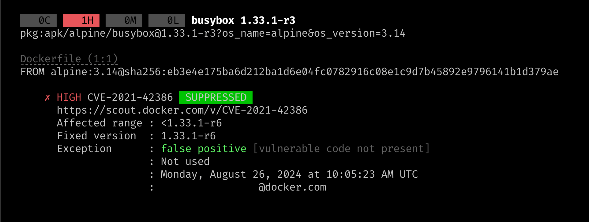

+++
title = "Manage vulnerability exceptions"
date = 2024-10-23T14:54:40+08:00
weight = 40
type = "docs"
description = ""
isCJKLanguage = true
draft = false
+++

> 原文: [https://docs.docker.com/scout/explore/exceptions/](https://docs.docker.com/scout/explore/exceptions/)
>
> 收录该文档的时间：`2024-10-23T14:54:40+08:00`

# Manage vulnerability exceptions

Vulnerabilities found in container images sometimes need additional context. Just because an image contains a vulnerable package, it doesn't mean that the vulnerability is exploitable. **Exceptions** in Docker Scout lets you acknowledge accepted risks or address false positives in image analysis.

By negating non-applicable vulnerabilities, you can make it easier for yourself and downstream consumers of your images to understand the security implications of a vulnerability in the context of an image.

In Docker Scout, exceptions are automatically factored into the results. If an image contains an exception that flags a CVE as non-applicable, then that CVE is excluded from analysis results.

## [Create exceptions](https://docs.docker.com/scout/explore/exceptions/#create-exceptions)

To create an exception for an image, you can:

- Create an exception in the [GUI](https://docs.docker.com/scout/how-tos/create-exceptions-gui/) of Docker Scout Dashboard.
- Create a [VEX](https://docs.docker.com/scout/how-tos/create-exceptions-vex/) document and attach it to the image.

The recommended way to create exceptions is to use Docker Scout Dashboard. The GUI provides a user-friendly interface for creating exceptions. It also lets you create exceptions for multiple images, or your entire organization, all at once.

## [View exceptions](https://docs.docker.com/scout/explore/exceptions/#view-exceptions)

To view exceptions for images, you need to have the appropriate permissions.

- Exceptions created [using the GUI](https://docs.docker.com/scout/how-tos/create-exceptions-gui/) are visible to members of your Docker organization. Unauthenticated users or users who aren't members of your organization cannot see these exceptions.
- Exceptions created [using VEX documents](https://docs.docker.com/scout/how-tos/create-exceptions-vex/) are visible to anyone who can pull the image, since the VEX document is stored in the image manifest or on filesystem of the image.

### [View exceptions in Docker Scout Dashboard](https://docs.docker.com/scout/explore/exceptions/#view-exceptions-in-docker-scout-dashboard)

The [**Exceptions** tab](https://scout.docker.com/reports/vulnerabilities/exceptions) of the Vulnerabilities page in Docker Scout Dashboard lists all exceptions for for all images in your organization. From here, you can see more details about each exception, the CVEs being suppressed, the images that exceptions apply to, the type of exception and how it was created, and more.

For exceptions created using the [GUI](https://docs.docker.com/scout/how-tos/create-exceptions-gui/), selecting the action menu lets you edit or remove the exception.

To view all exceptions for a specific image tag:

1. Go to the [Images page](https://scout.docker.com/reports/images).
2. Select the tag that you want to inspect.
3. Open the **Exceptions** tab.

### [View exceptions in the CLI](https://docs.docker.com/scout/explore/exceptions/#view-exceptions-in-the-cli)

**Experimental**

Viewing exceptions in the CLI is an experimental feature. It requires the latest version of the Docker Scout CLI plugin. Some exceptions may not appear correctly in the CLI.

Vulnerability exceptions are highlighted in the CLI when you run `docker scout cves <image>`. If a CVE is suppressed by an exception, a `SUPPRESSED` label appears next to the CVE ID. Details about the exception are also displayed.



> **Important**
>
> In order to view exceptions in the CLI, you must configure the CLI to use the same Docker organization that you used to create the exceptions.
>
> To configure an organization for the CLI, run:
>
> 
>
> ```console
> $ docker scout configure organization <organization>
> ```
>
> Replace `<organization>` with the name of your Docker organization.
>
> You can also set the organization on a per-command basis by using the `--org` flag:
>
> 
>
> ```console
> $ docker scout cves --org <organization> <image>
> ```

To exclude suppressed CVEs from the output, use the `--ignore-suppressed` flag:


```console
$ docker scout cves --ignore-suppressed <image>
```
