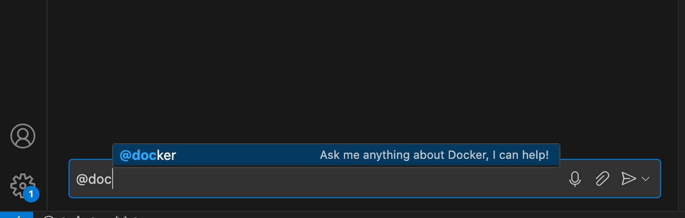
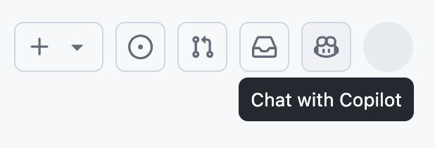
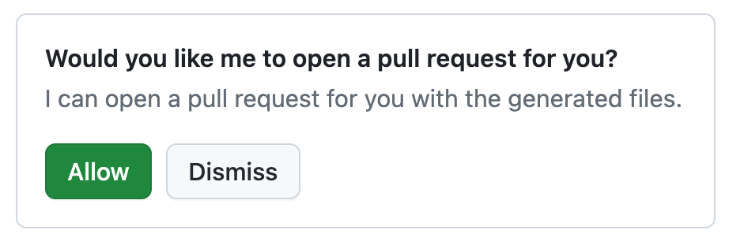

+++
title = "Docker for GitHub Copilot Early Access"
date = 2024-10-23T14:54:40+08:00
weight = 60
type = "docs"
description = ""
isCJKLanguage = true
draft = false
+++

> 原文: [https://docs.docker.com/copilot/](https://docs.docker.com/copilot/)
>
> 收录该文档的时间：`2024-10-23T14:54:40+08:00`

# Docker for GitHub Copilot

**Early access**

The Docker Extension for GitHub Copilot is a part of the [Limited Public Beta](https://github.blog/changelog/2024-05-21-copilot-extensions-now-in-limited-public-beta/) for GitHub Copilot Extensions.

To get access, [sign up for the Copilot Extensions waitlist](https://github.com/github-copilot/copilot_extensions_waitlist_signup).

The Docker Extension for GitHub Copilot integrates Docker's capabilities with GitHub Copilot, providing assistance with containerizing applications and generating Docker assets. This extension helps you streamline Docker-related tasks wherever GitHub Copilot Chat is available.

The key features are:

- Ask questions and receive responses about containerization in any context when GitHub Copilot Chat is available, such as on GitHub.com and in Visual Studio Code.
- Automatically generate Dockerfiles, Docker Compose files, and .dockerignore files for a project.
- Open pull requests with generated Docker assets directly from the chat interface.
- Get summaries of project vulnerabilities from Docker Scout and receive next steps via CLI.

## [Data Privacy](https://docs.docker.com/copilot/#data-privacy)

The Docker agent is trained exclusively on Docker's documentation and tools to assist with containerization and related tasks. It does not have access to your project's data outside the context of the questions you ask.

When using the Docker Extension for GitHub Copilot, GitHub Copilot may include a reference to the currently open file in its request if authorized by the user. The Docker agent can read the file to provide context-aware responses.

If the agent is requested to check for vulnerabilities or generate Docker-related assets, it will clone the referenced repository into in-memory storage to perform the necessary actions.

Source code, questions, and responses are not persistently stored. The Docker agent processes data only to provide responses and discards it immediately afterward.

## [Supported languages](https://docs.docker.com/copilot/#supported-languages)

The Docker Extension for GitHub Copilot supports the following programming languages:

- Dockerfile
- Go
- Java
- JavaScript
- Python
- Rust
- TypeScript

## [Get Started](https://docs.docker.com/copilot/#get-started)

Here's how to get started with the Docker Extension for GitHub Copilot.

### [Prerequisites](https://docs.docker.com/copilot/#prerequisites)

Before you start, ensure that:

- You have been granted access to GitHub's [limited public beta program](https://github.blog/changelog/2024-05-21-copilot-extensions-now-in-limited-public-beta/).
- You're signed in to your GitHub account on GitHub.com.

### [Install the extension for your organization](https://docs.docker.com/copilot/#install-the-extension-for-your-organization)

1. Go to the [Docker for GitHub Copilot](https://github.com/marketplace/docker-for-github-copilot) app in the GitHub Marketplace.
2. Select the **Add** button at the top of the page.
3. Under **Pricing and setup**, select the organization that you want to install the extension for and select **Install it for free**.
4. Select the **Complete order and begin installation** button.
5. Select the repositories where you want to use the Docker Extension for GitHub Copilot and finish with **Install**.

> **Note**
>
> Before you can use Copilot Extensions in your organization, you need to enable the Copilot Extensions policy. For more information, see [Setting a policy for GitHub Copilot Extensions in your organization](https://docs.github.com/en/copilot/managing-copilot/managing-github-copilot-in-your-organization/setting-policies-for-copilot-in-your-organization/managing-policies-for-copilot-in-your-organization#setting-a-policy-for-github-copilot-extensions-in-your-organization).

### [Set up Copilot Chat](https://docs.docker.com/copilot/#set-up-copilot-chat)

Once you've installed the Docker Extension for GitHub Copilot and enabled the Copilot Extensions policy, you can use the extension in your editor or IDE, or on GitHub.com.

Editor or IDE GitHub.com

------

For instructions on how to use the Docker Extension for GitHub Copilot in your editor, see:

- [Visual Studio Code](https://docs.github.com/en/copilot/github-copilot-chat/copilot-chat-in-ides/using-github-copilot-chat-in-your-ide?tool=vscode)
- [Visual Studio](https://docs.github.com/en/copilot/github-copilot-chat/copilot-chat-in-ides/using-github-copilot-chat-in-your-ide?tool=visualstudio)
- [Codespaces](https://docs.github.com/en/codespaces/reference/using-github-copilot-in-github-codespaces)

------

You can verify that the extension has been properly installed by typing `@docker` in the Copilot Chat window. As you type, you should see the Docker agent appear in the chat interface.

## [Using the extension](https://docs.docker.com/copilot/#using-the-extension)

The Docker Extension for GitHub Copilot provides a chat interface that you can use to interact with the Docker agent. You can ask questions and get help Dockerizing your project.

The Docker agent is trained to understand Docker-related questions, and provide guidance on Dockerfiles, Docker Compose files, and other Docker assets.

### [Editor](https://docs.docker.com/copilot/#editor)

To use the extension in your editor or IDE:

1. Open your project in your editor.
2. Open the Copilot chat interface.
3. Interact with the Docker agent using the `/docker` or `@docker`, followed by your question.

### [GitHub.com](https://docs.docker.com/copilot/#githubcom)

To use the extension in the GitHub web interface:

1. Go to [github.com](https://github.com/) and sign in to your account.

2. Go to any repository.

3. Select the Copilot logo in the site menu to open the chat interface.

   

4. Interact with the Docker agent by tagging `@docker`.

## [Example prompts](https://docs.docker.com/copilot/#example-prompts)

Here are some examples of the types of questions you can ask the Docker agent:

### [Ask general Docker questions](https://docs.docker.com/copilot/#ask-general-docker-questions)

You can ask general question about Docker. For example:

- `@docker what is a Dockerfile`
- `@docker how do I build a Docker image`
- `@docker how do I run a Docker container`

### [Ask questions about your project](https://docs.docker.com/copilot/#ask-questions-about-your-project)

You can ask questions about your project, such as:

- `@docker what is the best way to Dockerize this project`
- `@docker can you help me find vulnerabilities in my project?`

The Docker agent will analyze your project, generate the necessary files, and, if applicable, offer to raise a pull request with the necessary Docker assets.

## [Performing actions on your behalf](https://docs.docker.com/copilot/#performing-actions-on-your-behalf)

Before the agent performs any actions on your behalf, such as opening a pull request for you, you're prompted to provide your consent to allow the operation. You can always roll back or back out of the changes.

In the event that the agent encounters an error, for example during PR creation, it handles timeouts and lack of responses gracefully.

## [Feedback](https://docs.docker.com/copilot/#feedback)

For issues or feedback, visit the [GitHub feedback repository](https://github.com/docker/copilot-issues).
