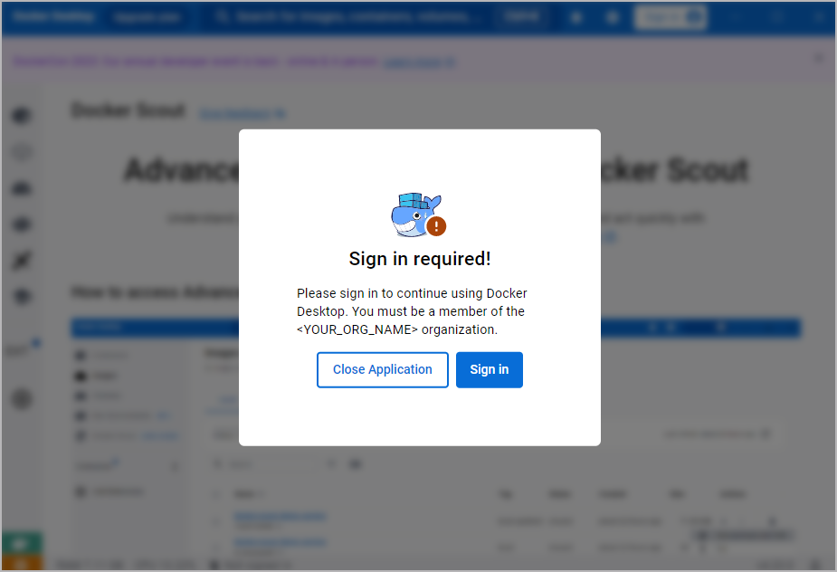

+++
title = "Enforce sign-in"
date = 2024-10-23T14:54:40+08:00
weight = 20
type = "docs"
description = ""
isCJKLanguage = true
draft = false
+++

> 原文: [https://docs.docker.com/security/for-admins/enforce-sign-in/](https://docs.docker.com/security/for-admins/enforce-sign-in/)
>
> 收录该文档的时间：`2024-10-23T14:54:40+08:00`

# Enforce sign-in for Docker Desktop

By default, members of your organization can use Docker Desktop without signing in. When users don’t sign in as a member of your organization, they don’t receive the [benefits of your organization’s subscription](https://docs.docker.com/subscription/core-subscription/details/) and they can circumvent [Docker’s security features](https://docs.docker.com/security/for-admins/hardened-desktop/) for your organization.

There are multiple ways you can enforce sign-in, depending on your companies' set up and preferences:

- [Registry key method (Windows only)](https://docs.docker.com/security/for-admins/enforce-sign-in/methods/#registry-key-method-windows-only) New
- [`.plist` method (Mac only)](https://docs.docker.com/security/for-admins/enforce-sign-in/methods/#plist-method-mac-only) New
- [`registry.json` method (All)](https://docs.docker.com/security/for-admins/enforce-sign-in/methods/#registryjson-method-all)

## [How is sign-in enforced?](https://docs.docker.com/security/for-admins/enforce-sign-in/#how-is-sign-in-enforced)

When Docker Desktop starts and it detects a registry key, a `.plist` file or `registry.json` file, the following occurs:

- A Sign in required! prompt appears requiring the user to sign in as a member of your organization to use Docker Desktop.

  

- When a user signs in to an account that isn’t a member of your organization, they are automatically signed out and can’t use Docker Desktop. The user can select **Sign in** and try again.

- When a user signs in to an account that is a member of your organization, they can use Docker Desktop.

- When a user signs out, the **Sign in required!** prompt appears and they can no longer use Docker Desktop.

## [Enforcing sign-in versus enforcing single sign-on (SSO)](https://docs.docker.com/security/for-admins/enforce-sign-in/#enforcing-sign-in-versus-enforcing-single-sign-on-sso)

[Enforcing SSO](https://docs.docker.com/security/for-admins/single-sign-on/connect#optional-enforce-sso) and enforcing sign-in are different features. The following table provides a description and benefits when using each feature.

| Enforcement                       | Description                                                  | Benefits                                                     |
| :-------------------------------- | :----------------------------------------------------------- | :----------------------------------------------------------- |
| Enforce sign-in only              | Users must sign in before using Docker Desktop.              | Ensures users receive the benefits of your subscription and ensures security features are applied. In addition, you gain insights into users’ activity. |
| Enforce single sign-on (SSO) only | If users sign in, they must sign in using SSO.               | Centralizes authentication and enforces unified policies set by the identity provider. |
| Enforce both                      | Users must sign in using SSO before using Docker Desktop.    | Ensures users receive the benefits of your subscription and ensures security features are applied. In addition, you gain insights into users’ activity. Finally, it centralizes authentication and enforces unified policies set by the identity provider. |
| Enforce neither                   | If users sign in, they can use SSO or their Docker credentials. | Allows users to access Docker Desktop without barriers, but at the cost of reduced security and insights. |
