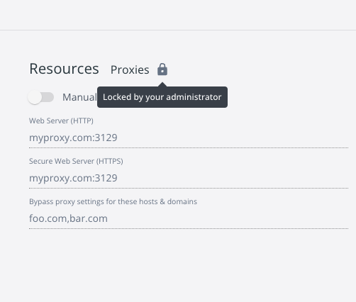

+++
title = "Settings Management"
date = 2024-10-23T14:54:40+08:00
weight = 1
type = "docs"
description = ""
isCJKLanguage = true
draft = false
+++

> 原文：[https://docs.docker.com/security/for-admins/hardened-desktop/settings-management/](https://docs.docker.com/security/for-admins/hardened-desktop/settings-management/)
>
> 收录该文档的时间：`2024-10-23T14:54:40+08:00`

# What is Settings Management?

> **Note**
>
> Settings Management is available to Docker Business customers only.

Settings Management is a feature that helps admins to control certain Docker Desktop settings on client machines within their organization.

With a few lines of JSON, admins can configure controls for Docker Desktop settings such as proxies and network settings. For an extra layer of security, admins can also use Settings Management to enable and lock in [Enhanced Container Isolation]() which ensures that any configurations set with Settings Management cannot be modified by containers.

It is available with [Docker Desktop 4.13.0 and later]().

### Who is it for?

- For organizations that want to configure Docker Desktop to be within their organization's centralized control.
- For organizations that want to create a standardized Docker Desktop environment at scale.
- For Docker Business customers who want to confidently manage their use of Docker Desktop within tightly regulated environments.

### How does it work?

Administrators can configure several Docker Desktop settings using an `admin-settings.json` file. This file is located on the Docker Desktop host and can only be accessed by developers with root or admin privileges.

Values that are set to `locked: true` within the `admin-settings.json` override any previous values set by developers and ensure that these cannot be modified. For more information, see [Configure Settings Management](https://docs.docker.com/security/for-admins/hardened-desktop/settings-management/configure/#step-two-configure-the-settings-you-want-to-lock-in).

### What features can I configure with Settings Management?

Using the `admin-settings.json` file, admins can:

- Turn on and lock in [Enhanced Container Isolation]()
- Configure HTTP proxies
- Configure network settings
- Configure Kubernetes settings
- Enforce the use of WSL 2 based engine or Hyper-V
- Enforce the use of Rosetta for x86_64/amd64 emulation on Apple Silicon
- Configure Docker Engine
- Turn off Docker Desktop's ability to checks for updates
- Turn off Docker Extensions
- Turn off Docker Scout SBOM indexing
- Turn off beta and experimental features
- Turn off Docker Desktop's onboarding survey
- Control whether developers can use the Docker terminal
- Control the file sharing implementation for your developers on macOS
- Specify which paths your developers can add file shares to
- Configure Air-Gapped Containers

For more details on the syntax and options admins can set, see [Configure Settings Management]().

### How do I set up and enforce Settings Management?

As an administrator, you first need to [enforce sign-in](). This is because the Settings Management feature requires a Docker Business subscription and therefore your Docker Desktop developers must authenticate to your organization. Enforcing sign-in ensures that your Docker Desktop developers always authenticate to your organization, even though they can authenticate without it and the feature will take effect. Enforcing sign-in guarantees the feature always takes effect.

Next, you must either manually [create and configure the admin-settings.json file](), or use the `--admin-settings` installer flag on [macOS](https://docs.docker.com/desktop/install/mac-install/#install-from-the-command-line) or [Windows](https://docs.docker.com/desktop/install/windows-install/#install-from-the-command-line) to automatically create the `admin-settings.json` and save it in the correct location.

Once this is done, Docker Desktop developers receive the changed settings when they either:

- Quit, re-launch, and sign in to Docker Desktop
- Launch and sign in to Docker Desktop for the first time

Docker doesn't automatically mandate that developers re-launch and re-authenticate once a change has been made, so as not to disrupt your developers' workflow.

### What do developers see when the settings are enforced?

Any settings that are enforced, are grayed out in Docker Desktop and the user is unable to edit them, either via the Docker Desktop UI, CLI, or the `settings.json` file. In addition, if Enhanced Container Isolation is enforced, developers can't use privileged containers or similar techniques to modify enforced settings within the Docker Desktop Linux VM, for example, reconfigure proxy and networking of reconfigure Docker Engine.

## More resources

- [Video: Settings Management](https://www.youtube.com/watch?v=I9oJOJ1P9PQ)
