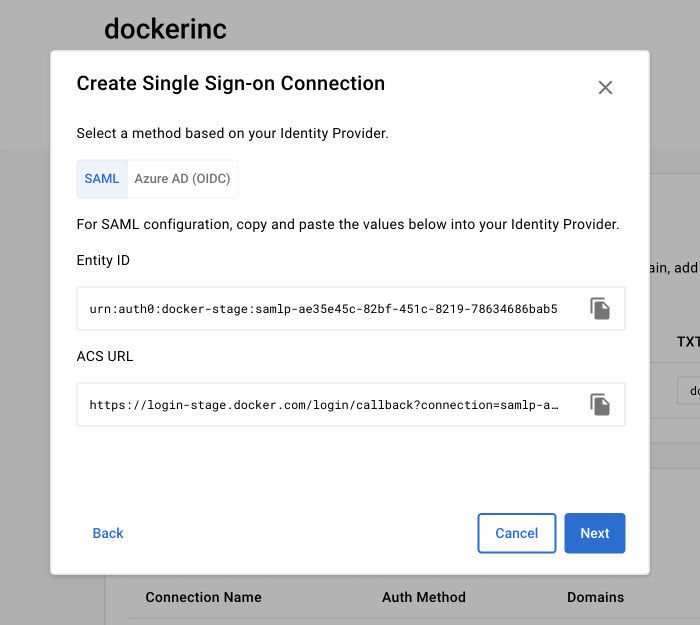
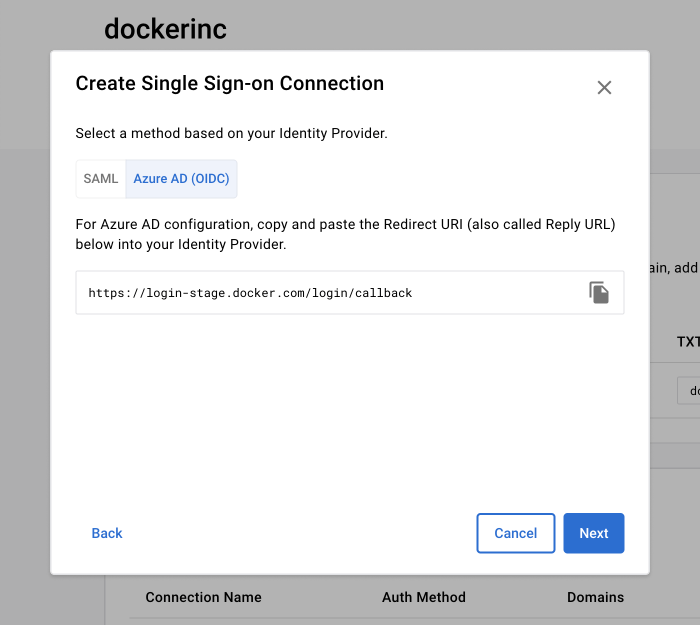

+++
title = "Configure"
date = 2024-10-23T14:54:40+08:00
weight = 1
type = "docs"
description = ""
isCJKLanguage = true
draft = false
+++

> 原文: [https://docs.docker.com/security/for-admins/single-sign-on/configure/](https://docs.docker.com/security/for-admins/single-sign-on/configure/)
>
> 收录该文档的时间：`2024-10-23T14:54:40+08:00`

# Configure single sign-on

Get started creating a single sign-on (SSO) connection for your organization or company.

The steps to set up your SSO configuration are:

1. [Add and verify the domain or domains](https://docs.docker.com/security/for-admins/single-sign-on/configure/#step-one-add-and-verify-your-domain) that your members use to sign in to Docker.
2. [Create your SSO connection](https://docs.docker.com/security/for-admins/single-sign-on/configure/#step-two-create-an-sso-connection-in-docker) in Docker.
3. [Configure your IdP](https://docs.docker.com/security/for-admins/single-sign-on/configure/configure-idp/) to work with Docker.
4. [Complete your SSO connection](https://docs.docker.com/security/for-admins/single-sign-on/connect/) in Docker.

This page walks through steps 1 and 2 using Docker Hub or the Admin Console. To configure SSO for a company, use the Admin Console.

## [Step one: Add and verify your domain](https://docs.docker.com/security/for-admins/single-sign-on/configure/#step-one-add-and-verify-your-domain)

Admin Console Docker Hub

------

**Early Access**

The Docker Admin Console is an [early access](https://docs.docker.com/release-lifecycle#early-access-ea) product.

It's available to all company owners and organization owners. You can still manage organizations in Docker Hub, but the Admin Console includes company-level management and enhanced features for organization management.

1. Sign in to the [Admin Console](https://admin.docker.com/).

2. Select your organization or company in the left navigation drop-down menu, and then select **Domain management**. Note that when an organization is part of a company, you must select the company and configure the domain for that organization at the company level. Each organization in a company can have its own domain, but it must be configured at the company level.

3. Select **Add a domain**.

4. Continue with the on-screen instructions to get a verification code for your domain as a **TXT Record Value**.

   > **Note**
   >
   > 
   >
   > Format your domains without protocol or www information, for example, `yourcompany.example`. This should include all email domains and subdomains users will use to access Docker, for example `yourcompany.example` and `us.yourcompany.example`. Public domains such as `gmail.com`, `outlook.com`, etc. aren’t permitted.

   > **Tip**
   >
   > 
   >
   > Make sure that the TXT record name that you create on your DNS matches the domain you registered on Docker in Step 4. For example, if you registered the subdomain `us.yourcompany.example`, you need to create a TXT record within the same name/zone `us`. A root domain such as `yourcompany.example` needs a TXT record on the root zone, which is typically denoted with the `@` name for the record.

5. Once you have waited 72 hours for the TXT record verification, you can then select **Verify** next to the domain you've added, and follow the on-screen instructions.

------

## [Step two: Create an SSO connection in Docker](https://docs.docker.com/security/for-admins/single-sign-on/configure/#step-two-create-an-sso-connection-in-docker)

Admin Console Docker Hub

------

**Early Access**

The Docker Admin Console is an [early access](https://docs.docker.com/release-lifecycle#early-access-ea) product.

It's available to all company owners and organization owners. You can still manage organizations in Docker Hub, but the Admin Console includes company-level management and enhanced features for organization management.

> **Important**
>
> 
>
> If your IdP setup requires an Entity ID and the ACS URL, you must select the **SAML** tab in the **Authentication Method** section. For example, if your Entra ID (formerly Azure AD) Open ID Connect (OIDC) setup uses SAML configuration within Azure AD, you must select **SAML**. If you are [configuring Open ID Connect with Entra ID (formerly Azure AD)](https://docs.microsoft.com/en-us/powerapps/maker/portals/configure/configure-openid-settings) select **Azure AD (OIDC)** as the authentication method. Also, IdP initiated connections aren't supported at this time.

After your domain is verified, create an SSO connection.

1. Sign in to the [Admin Console](https://admin.docker.com/).

2. Select your organization or company in the left navigation drop-down menu, and then select **SSO and SCIM**. Note that when an organization is part of a company, you must select the company and configure SSO for that organization at the company level. Each organization can have its own SSO configuration and domain, but it must be configured at the company level.

3. In the SSO connections table select **Create Connection**, and create a name for the connection.

   > **Note**
   >
   > 
   >
   > You have to verify at least one domain before creating the connections.

4. Select an authentication method, **SAML** or **Azure AD (OIDC)**.

5. Copy the following fields to add to your IdP:

   - SAML: **Entity ID**, **ACS URL**
   - Azure AD (OIDC): **Redirect URL**

   

   

------

## [More resources](https://docs.docker.com/security/for-admins/single-sign-on/configure/#more-resources)

The following videos walk through verifying your domain to create your SSO connection in Docker.

- [Video: Verify your domain for SSO with Okta](https://youtu.be/c56YECO4YP4?feature=shared&t=529)
- [Video: Verify your domain for SSO with Azure AD (OIDC)](https://youtu.be/bGquA8qR9jU?feature=shared&t=496)

## [What's next?](https://docs.docker.com/security/for-admins/single-sign-on/configure/#whats-next)

[Continue configuration in your IdP](https://docs.docker.com/security/for-admins/single-sign-on/configure/configure-idp/).
